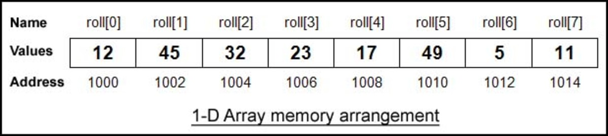

## About Array

When memory is allocated for an array, its individual elements are adjacent, so we can access it by index.


```text
let nums = [10, 11, 12, 13, 14, 15];

Array:   10  11  12  13  14  15
index:    0   1   2   3   4   5

assert_eq(nums[0], 10);
assert_eq(nums[5], 15);
assert_eq(nums[6], xx); // ERROR，index out of bounds
```

## Exercise

### Binary Search

[704: Binary Search](704_binary_search.md)
[35: Search Insert Position](35_search_insert_position.md)
[34: Find First and Last Position of Element in Sorted Array](34_find_first_and_last_position_of_element_in_sorted_array.md)
[69: Sqrt(x)](69_sqrt_x.md)
[367: Valid Perfect Square](367_valid_perfect_square.md)

### Remove Element

[27: Remove Element](27_remove_element.md)
[26: Remove Duplicates from Sorted Array](26_remove_duplicates_from_sorted_array.md)
[283: Move Zeroes](283_move_zeroes.md)
[844: Backspace String Compare](844_backspace_string_compare.md)

### Square of Ordered Arrays

[977: Squares of a Sorted Array](977_squares_of_a_sorted_array.md)

### Minimum Size Subarray Sum

[209: Minimum Size Subarray Sum](209_minimum_size_subarray_sum.md)
[904: Fruit Into Baskets](904_fruit_into_baskets.md)
[76: Minimum Window Substring](76_minimum_window_substring.md)

### Spiral Matrix

[54: Spiral Matrix](54_spiral_matrix.md)
[59: Spiral Matrix II](59_spiral_matrix_ii.md)

## Summary
