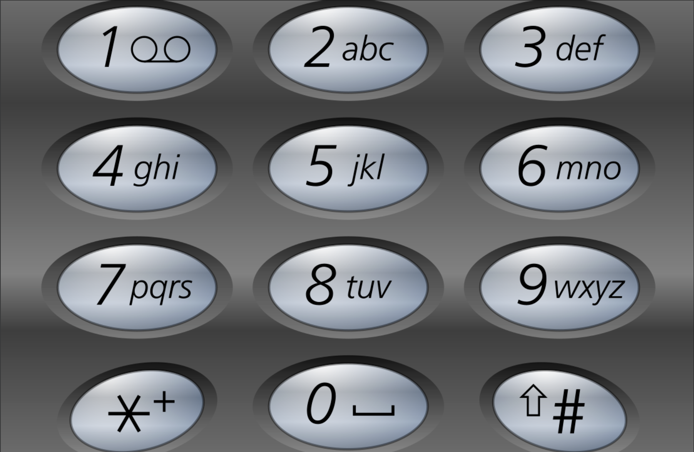

## I Problem
Given a string containing digits from `2-9` inclusive, return all possible letter combinations that the number could represent. Return the answer **in any order**.

A mapping of digits to letters (just like on the telephone buttons) is given below. Note that 1 does not map to any letters.



**Example 1**
Input: digits = "23"
Output: ["ad", "ae", "af", "bd", "be", "bf", "cd", "ce", "cf"]

**Example 2**
Input: digits = ""
Output: []

**Example 3**
Input: digits = "2"
Output: ["a", "b", "c"]

**Constraints**
- `0 <= digits.length <= 4`
- `digits[i]` is a digit in the range `['2', '9']`.

**Related Topics**
- Hash Table
- String
- Backtracking


## II Solution
### Approach 1: Backtracking
::: code-tabs
@tab Rust
```rust
pub fn letter_combinations(digits: String) -> Vec<String> {
    let mut res = vec![];
    if digits.is_empty() {
        return res;
    }

    let map = HashMap::from([
        ("2", "abc"),
        ("3", "def"),
        ("4", "ghi"),
        ("5", "jkl"),
        ("6", "mno"),
        ("7", "pqrs"),
        ("8", "tuv"),
        ("9", "wxyz"),
    ]);

    const BACKTRACKING: fn(usize, &str, &mut String, &mut Vec<String>, &HashMap<&str, &str>) =
        |idx, digits, path, res, map| {
            if path.len() == digits.len() {
                res.push(path.clone());
                return;
            }
            let digit = &digits[idx..idx + 1];
            for ch in map[digit].chars() {
                path.push(ch);
                BACKTRACKING(idx + 1, digits, path, res, map);
                path.pop();
            }
        };

    BACKTRACKING(0, &digits, &mut String::new(), &mut res, &map);

    res
}
```

@tab Java
```java
@FunctionalInterface
interface QuintConsumer<A, B, C, D, E> {
    void accept(A a, B b, C c, D d, E e);
}

QuintConsumer<Integer, String, StringBuilder, List<String>, Map<Character, String>> recur =
        (idx, digits, path, res, map) -> {
            if (path.length() == digits.length()) {
                res.add(path.toString());
                return;
            }

            String s = map.get(digits.charAt(idx));
            
            for (int i = 0, len = s.length(); i < len; i++) {
                path.append(s.charAt(i));
                this.recur.accept(idx + 1, digits, path, res, map);
                path.deleteCharAt(path.length() - 1);
            }
        };

public List<String> letterCombinations(String digits) {
    List<String> res = new ArrayList<>();
    if (digits.isEmpty()) {
        return res;
    }

    Map<Character, String> map = new HashMap<>() {{
        this.put('2', "abc");
        this.put('3', "def");
        this.put('4', "ghi");
        this.put('5', "jkl");
        this.put('6', "mno");
        this.put('7', "pqrs");
        this.put('8', "tuv");
        this.put('9', "wxyz");
    }};

    this.recur.accept(0, digits, new StringBuilder(), res, map);

    return res;
}
```
:::
