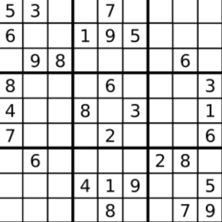

## I Problem
Write a program to solve a Sudoku puzzle by filling the empty cells.

A sudoku solution must satisfy **all of the following rules**:
1. Each of the digits `1-9` must occur exactly once in each row.
2. Each of the digits `1-9` must occur exactly once in each column.
3. Each of the digits `1-9` must occur exactly once in each of the 9 `3x3` sub-boxes of the grid.

The `'.'` character indicates empty cells.

**Example 1**

Input: board = 
```text
[["5","3",".",".","7",".",".",".","."]
,["6",".",".","1","9","5",".",".","."]
,[".","9","8",".",".",".",".","6","."]
,["8",".",".",".","6",".",".",".","3"]
,["4",".",".","8",".","3",".",".","1"]
,["7",".",".",".","2",".",".",".","6"]
,[".","6",".",".",".",".","2","8","."]
,[".",".",".","4","1","9",".",".","5"]
,[".",".",".",".","8",".",".","7","9"]]
```

Output:
```text
[["5","3","4","6","7","8","9","1","2"]
,["6","7","2","1","9","5","3","4","8"]
,["1","9","8","3","4","2","5","6","7"]
,["8","5","9","7","6","1","4","2","3"]
,["4","2","6","8","5","3","7","9","1"]
,["7","1","3","9","2","4","8","5","6"]
,["9","6","1","5","3","7","2","8","4"]
,["2","8","7","4","1","9","6","3","5"]
,["3","4","5","2","8","6","1","7","9"]]
```
Explanation: The input board is shown above and the only valid solution is shown below:


**Constraints**
- `board.length == 9`
- `board[i].length == 9`
- `board[i][j]` is a digit or `'.'`.
- It is **guaranteed** that the input board has only one solution.

**Related Topics**
- Array
- Hash Table
- Backtracking
- Matrix


## II Solution
### Approach 1: Backtracking
::: code-tabs
@tab Rust
```rust
pub fn solve_sudoku(board: &mut Vec<Vec<char>>) {
    let mut row = vec![vec![false; 9]; 9];
    let mut col = vec![vec![false; 9]; 9];
    let mut sub_boxes = vec![vec![vec![false; 3]; 3]; 9];
    let mut spaces = vec![];
    let mut valid = false;

    for i in 0..9 {
        for j in 0..9 {
            if board[i][j] == '.' {
                spaces.push((i, j));
            } else {
                let idx = (board[i][j] as u8 - b'1') as usize;
                (row[i][idx], col[j][idx], sub_boxes[idx][i / 3][j / 3]) = (true, true, true);
            }
        }
    }

    const DFS: fn(
        &mut Vec<Vec<char>>,
        usize,
        &Vec<(usize, usize)>,
        &mut Vec<Vec<bool>>,
        &mut Vec<Vec<bool>>,
        &mut Vec<Vec<Vec<bool>>>,
        &mut bool,
    ) = |board, pos, spaces, row, col, sub_boxes, valid| {
        if pos == spaces.len() {
            *valid = true;
            return;
        }

        let (i, j) = spaces[pos];
        for idx in 0..9 {
            if *valid {
                break;
            }
            if !row[i][idx] && !col[j][idx] && !sub_boxes[idx][i / 3][j / 3] {
                (row[i][idx], col[j][idx], sub_boxes[idx][i / 3][j / 3]) = (true, true, true);
                board[i][j] = (b'1' + (idx as u8)) as char;

                DFS(board, pos + 1, spaces, row, col, sub_boxes, valid);

                (row[i][idx], col[j][idx], sub_boxes[idx][i / 3][j / 3]) = (false, false, false);
            }
        }
    };

    DFS(board, 0, &spaces, &mut row, &mut col, &mut sub_boxes, &mut valid);
}
```

@tab Java
```java
public class Solution {
    List<int[]> spaces;
    boolean valid;

    @FunctionalInterface
    interface QuintConsumer<A, B, C, D, E> {
        void accept(A a, B b, C c, D d, E e);
    }

    @FunctionalInterface
    interface SeptConsumer<A, B, C, D, E, F, G> {
        void accept(A a, B b, C c, D d, E e, F f, G g);
    }

    QuintConsumer<char[][], Integer, boolean[][], boolean[][], boolean[][][]> dfs1 =
            (board, pos, row, col, subBoxes) -> {
                if (pos == this.spaces.size()) {
                    this.valid = true;
                    return;
                }

                int i = spaces.get(pos)[0];
                int j = spaces.get(pos)[1];
                for (int idx = 0; idx < 9 && !this.valid; idx++) {
                    if (!row[i][idx] && !col[j][idx] && !subBoxes[i / 3][j / 3][idx]) {
                        board[i][j] = (char) (idx + '1');
                        this.flip1.accept(row, col, subBoxes, i, j, idx, true);

                        this.dfs1.accept(board, pos + 1, row, col, subBoxes);

                        this.flip1.accept(row, col, subBoxes, i, j, idx, false);
                    }
                }
            };

    SeptConsumer<boolean[][], boolean[][], boolean[][][], Integer, Integer, Integer, Boolean> flip1 =
            (row, col, subBoxes, i, j, idx, val) -> {
                row[i][idx] = val;
                col[j][idx] = val;
                subBoxes[i / 3][j / 3][idx] = val;
            };

    public void solveSudoku(char[][] board) {
        boolean[][] row = new boolean[9][9];
        boolean[][] col = new boolean[9][9];
        boolean[][][] subBoxes = new boolean[3][3][9];
        this.spaces = new ArrayList<>();

        for (int i = 0; i < 9; i++) {
            for (int j = 0; j < 9; j++) {
                if (board[i][j] == '.') {
                    this.spaces.add(new int[]{i, j});
                } else {
                    int idx = board[i][j] - '1';
                    this.flip1.accept(row, col, subBoxes, i, j, idx, true);
                }
            }
        }

        this.dfs1.accept(board, 0, row, col, subBoxes);
    }
}
```
:::

### Approach 2: Bit Operation Optimization
::: code-tabs
@tab Rust
```rust
pub fn solve_sudoku(board: &mut Vec<Vec<char>>) {
    let mut row = vec![0; 9];
    let mut col = vec![0; 9];
    let mut sub_boxes = vec![vec![0; 3]; 3];
    let mut spaces = vec![];
    let mut valid = false;

    for i in 0..9 {
        for j in 0..9 {
            if board[i][j] == '.' {
                spaces.push((i, j));
            } else {
                let digit = (board[i][j] as u8 - b'1') as usize;
                row[i] ^= 1 << digit;
                col[j] ^= 1 << digit;
                sub_boxes[i / 3][j / 3] ^= 1 << digit;
            }
        }
    }

    const DFS: fn(
        &mut Vec<Vec<char>>,
        usize,
        &Vec<(usize, usize)>,
        &mut Vec<i32>,
        &mut Vec<i32>,
        &mut Vec<Vec<i32>>,
        &mut bool,
    ) = |board, pos, spaces, row, col, sub_boxes, valid| {
        if pos == spaces.len() {
            *valid = true;
            return;
        }

        let (i, j) = spaces[pos];
        let mut mask = !(row[i] | col[j] | sub_boxes[i / 3][j / 3]) & 0x1ff;
        while mask != 0 && !*valid {
            let digit = (mask & (-mask)).trailing_zeros();
            row[i] ^= 1 << digit;
            col[j] ^= 1 << digit;
            sub_boxes[i / 3][j / 3] ^= 1 << digit;
            board[i][j] = (digit as u8 + b'1') as char;

            DFS(board, pos + 1, spaces, row, col, sub_boxes, valid);

            row[i] ^= 1 << digit;
            col[j] ^= 1 << digit;
            sub_boxes[i / 3][j / 3] ^= 1 << digit;

            mask &= mask - 1;
        }
    };

    DFS(board, 0, &spaces, &mut row, &mut col, &mut sub_boxes, &mut valid);
}
```

@tab Java
```java
public class Solution {
    List<int[]> spaces;
    boolean valid;

    @FunctionalInterface
    interface QuintConsumer<A, B, C, D, E> {
        void accept(A a, B b, C c, D d, E e);
    }

    @FunctionalInterface
    interface SexConsumer<A, B, C, D, E, F> {
        void accept(A a, B b, C c, D d, E e, F f);
    }

    QuintConsumer<char[][], Integer, int[], int[], int[][]> dfs2 =
            (board, pos, row, col, subBoxes) -> {
                if (pos == this.spaces.size()) {
                    this.valid = true;
                    return;
                }

                int i = this.spaces.get(pos)[0];
                int j = this.spaces.get(pos)[1];
                int mask = ~(row[i] | col[j] | subBoxes[i / 3][j / 3]) & 0x1ff;
                for (; mask != 0 && !this.valid; mask &= mask - 1) {
                    int digit = Integer.bitCount((mask & (-mask)) - 1);
                    board[i][j] = (char) (digit + '1');
                    this.flip2.accept(row, col, subBoxes, i, j, digit);

                    this.dfs2.accept(board, pos + 1, row, col, subBoxes);

                    this.flip2.accept(row, col, subBoxes, i, j, digit);
                }
            };

    SexConsumer<int[], int[], int[][], Integer, Integer, Integer> flip2 =
            (row, col, subBoxes, i, j, digit) -> {
                row[i] ^= 1 << digit;
                col[j] ^= 1 << digit;
                subBoxes[i / 3][j / 3] ^= 1 << digit;
            };

    public void solveSudoku(char[][] board) {
        int[] row = new int[9];
        int[] col = new int[9];
        int[][] subBoxes = new int[3][3];
        this.spaces = new ArrayList<>();

        for (int i = 0; i < 9; i++) {
            for (int j = 0; j < 9; j++) {
                if (board[i][j] == '.') {
                    this.spaces.add(new int[]{i, j});
                } else {
                    int digit = board[i][j] - '1';
                    this.flip2.accept(row, col, subBoxes, i, j, digit);
                }
            }
        }

        this.dfs2.accept(board, 0, row, col, subBoxes);
    }
}
```
:::