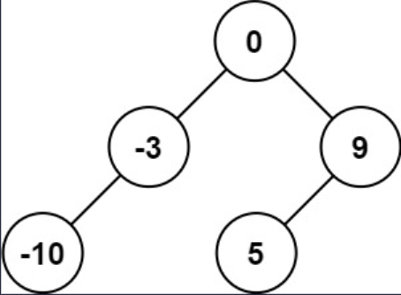
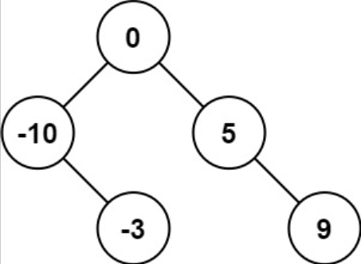

## I Problem
Given an integer array `nums` where the elements are sorted in **ascending order**, convert *it to a **height-balanced** binary search tree*.

**Example 1**

Input: nums = [-10, -3, 0, 5, 9]
Output: [0, -3, 9, -10, null, 5]
Explanation: [0, -10, 5, null, -3, null, 9] is also accepted:


**Example 2**
Input: nums = [1, 3]
Output: [3, 1]
Explanation: [1, null, 3] and [3, 1] are both height-balanced BSTs.

**Constraints**
- `1 <= nums.length <= 10⁴`
- `-10⁴ <= nums[i] <= 10⁴`
- `nums` is sorted in a **strictly increasing** order.

**Related Topics**
- Array
- Divide and Conquer
- Tree
- Binary Search Tree
- Binary Tree


## II Solution
::: code-tabs
@tab Rust Node Definition
```rust
#[derive(Debug, PartialEq, Eq)]
pub struct TreeNode {
    pub val: i32,
    pub left: Option<Rc<RefCell<TreeNode>>>,
    pub right: Option<Rc<RefCell<TreeNode>>>,
}

impl TreeNode {
    #[inline]
    pub fn new(val: i32) -> Self {
        TreeNode {
            val,
            left: None,
            right: None,
        }
    }
}
```

@tab Java Node Definition
```java
public class TreeNode {
    int val;
    TreeNode left;
    TreeNode right;

    TreeNode() {}
    TreeNode(int val) { this.val = val; }
    TreeNode(int val, TreeNode left, TreeNode right) {
        this.val = val;
        this.left = left;
        this.right = right;
    }
}
```
:::

### Approach 1: Recursion
::: code-tabs
@tab Rust
```rust
pub fn sorted_array_to_bst(nums: Vec<i32>) -> Option<Rc<RefCell<TreeNode>>> {
    //Self::recur_helper_1(nums)
    Self::recur_helper_2(nums)
}

fn recur_helper_1(nums: Vec<i32>) -> Option<Rc<RefCell<TreeNode>>> {
    const CONVERT: fn(&[i32]) -> Option<Rc<RefCell<TreeNode>>> = |nums| {
        let len = nums.len();
        if len == 0 {
            return None;
        }

        let mid = len / 2;
        let root = Rc::new(RefCell::new(TreeNode::new(nums[mid])));
        if len == 1 {
            return Some(root);
        }

        root.borrow_mut().left = CONVERT(&nums[..mid]);
        root.borrow_mut().right = CONVERT(&nums[mid + 1..]);

        Some(root)
    };

    CONVERT(&nums)
}

fn recur_helper_2(nums: Vec<i32>) -> Option<Rc<RefCell<TreeNode>>> {
    const CONVERT: fn(&[i32], usize, usize) -> Option<Rc<RefCell<TreeNode>>> =
        |nums, left, right| {
            if left == right {
                return None;
            }

            let mid = (left + right) / 2;
            let root = Rc::new(RefCell::new(TreeNode::new(nums[mid])));
            if right - left == 1 {
                return Some(root);
            }

            root.borrow_mut().left = CONVERT(&nums, left, mid);
            root.borrow_mut().right = CONVERT(&nums, mid + 1, right);

            Some(root)
        };

    CONVERT(&nums, 0, nums.len())
}
```

@tab Java
```java
public TreeNode sortedArrayToBST(int[] nums) {
    //return this.recurHelper1(nums);
    return this.recurHelper2(nums);
}

Function<List<Integer>, TreeNode> convert1 = (nums) -> {
    int size = nums.size();
    if (size == 0) {
        return null;
    }

    int mid = size / 2;
    TreeNode root = new TreeNode(nums.get(mid));
    if (size == 1) {
        return root;
    }

    root.left = this.convert1.apply(nums.subList(0, mid));
    root.right = this.convert1.apply(nums.subList(mid + 1, size));

    return root;
};

TreeNode recurHelper1(int[] _nums) {
    List<Integer> nums = Arrays.stream(_nums).boxed().collect(Collectors.toList());
    return this.convert1.apply(nums);
}


@FunctionalInterface
interface TriFunction<A, B, C, D> {
    D apply(A a, B b, C c);
}

TriFunction<int[], Integer, Integer, TreeNode> convert2 = (nums, left, right) -> {
    if (Objects.equals(left, right)) {
        return null;
    }

    int mid = (left + right) / 2;
    TreeNode root = new TreeNode(nums[mid]);
    if (right - left == 1) {
        return root;
    }

    root.left = this.convert2.apply(nums, left, mid);
    root.right = this.convert2.apply(nums, mid + 1, right);

    return root;
};

TreeNode recurHelper2(int[] nums) {
    return this.convert2.apply(nums, 0, nums.length);
}
```
:::

### Approach 2: Iteration
::: code-tabs
@tab Rust
```rust
pub fn sorted_array_to_bst(nums: Vec<i32>) -> Option<Rc<RefCell<TreeNode>>> {
    //Self::iter_helper_1(nums)
    Self::iter_helper_2(nums)
}

fn iter_helper_1(nums: Vec<i32>) -> Option<Rc<RefCell<TreeNode>>> {
    if nums.is_empty() {
        return None;
    }

    let root = Rc::new(RefCell::new(TreeNode::new(nums[0])));
    let mut queue = VecDeque::from([(root.clone(), 0, nums.len())]);

    while let Some((curr, l_idx, r_idx)) = queue.pop_front() {
        let mid = (l_idx + r_idx) / 2;

        curr.borrow_mut().val = nums[mid];

        if l_idx < mid {
            let l_node = Rc::new(RefCell::new(TreeNode::new(nums[0])));
            curr.borrow_mut().left = Some(l_node.clone());
            queue.push_back((l_node, l_idx, mid));
        }

        if mid + 1 < r_idx {
            let r_node = Rc::new(RefCell::new(TreeNode::new(nums[0])));
            curr.borrow_mut().right = Some(r_node.clone());
            queue.push_back((r_node, mid + 1, r_idx));
        }
    }

    Some(root)
}

fn iter_helper_2(nums: Vec<i32>) -> Option<Rc<RefCell<TreeNode>>> {
    if nums.is_empty() {
        return None;
    }

    let root = Rc::new(RefCell::new(TreeNode::new(nums[0])));
    let mut stack = vec![(root.clone(), 0, nums.len())];

    while let Some((curr, l_idx, r_idx)) = stack.pop() {
        let mid = (l_idx + r_idx) / 2;

        curr.borrow_mut().val = nums[mid];

        if l_idx < mid {
            let l_node = Rc::new(RefCell::new(TreeNode::new(nums[0])));
            curr.borrow_mut().left = Some(l_node.clone());
            stack.push((l_node, l_idx, mid));
        }

        if mid + 1 < r_idx {
            let r_node = Rc::new(RefCell::new(TreeNode::new(nums[0])));
            curr.borrow_mut().right = Some(r_node.clone());
            stack.push((r_node, mid + 1, r_idx));
        }
    }

    Some(root)
}
```

@tab Java
```java
public TreeNode sortedArrayToBST(int[] nums) {
    //return this.iterHelper1(nums);
    return this.iterHelper2(nums);
}

TreeNode iterHelper1(int[] nums) {
    if (nums.length == 0) {
        return null;
    }

    TreeNode root = new TreeNode(nums[0]);
    Deque<Object[]> queue = new ArrayDeque<>() {{
        this.addLast(new Object[]{root, 0, nums.length});
    }};

    while (!queue.isEmpty()) {
        Object[] objs = queue.removeFirst();
        TreeNode curr = (TreeNode) objs[0];
        int lIdx = (int) objs[1];
        int rIdx = (int) objs[2];

        int mid = (lIdx + rIdx) / 2;
        curr.val = nums[mid];

        if (lIdx < mid) {
            TreeNode lNode = new TreeNode(nums[0]);
            curr.left = lNode;
            queue.addLast(new Object[]{lNode, lIdx, mid});
        }

        if (mid + 1 < rIdx) {
            TreeNode rNode = new TreeNode(nums[0]);
            curr.right = rNode;
            queue.addLast(new Object[]{rNode, mid + 1, rIdx});
        }
    }

    return root;
}

TreeNode iterHelper2(int[] nums) {
    if (nums.length == 0) {
        return null;
    }

    TreeNode root = new TreeNode(nums[0]);
    Deque<Object[]> stack = new ArrayDeque<>() {{
        this.push(new Object[]{root, 0, nums.length});
    }};

    while (!stack.isEmpty()) {
        Object[] objs = stack.pop();
        TreeNode curr = (TreeNode) objs[0];
        int lIdx = (int) objs[1];
        int rIdx = (int) objs[2];

        int mid = (lIdx + rIdx) / 2;
        curr.val = nums[mid];

        if (lIdx < mid) {
            TreeNode lNode = new TreeNode(nums[0]);
            curr.left = lNode;
            stack.push(new Object[]{lNode, lIdx, mid});
        }
        
        if (mid + 1 < rIdx) {
            TreeNode rNode = new TreeNode(nums[0]);
            curr.right = rNode;
            stack.push(new Object[]{rNode, mid + 1, rIdx});
        }
    }

    return root;
}
```
:::