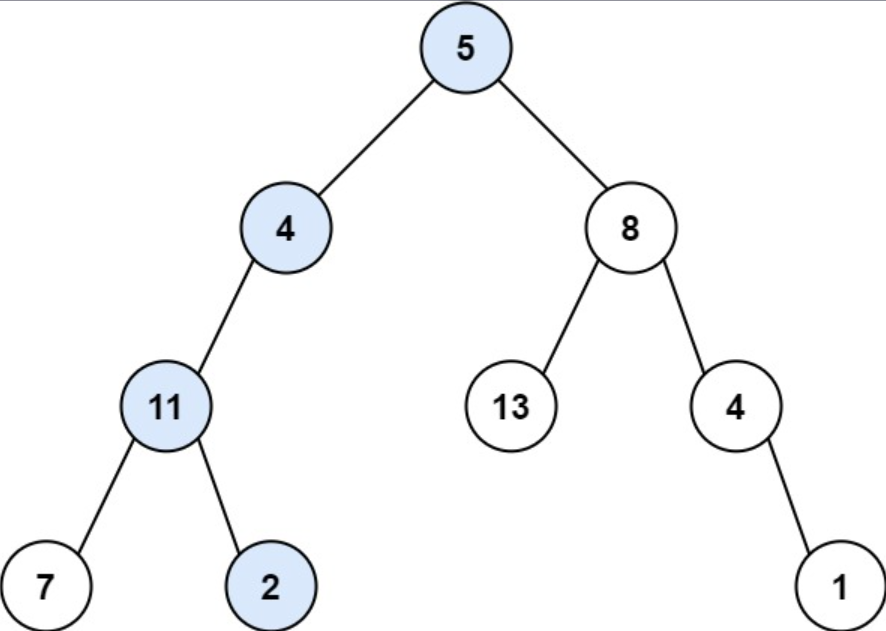

## I Problem
Given the `root` of a binary tree and an integer `target_sum`, return `true` if the tree has a root-to-leaf path such that adding up all the values along the path equals `target_sum`.

A **leaf** is a node with no children.

**Example 1**

Input: root = [5, 4, 8, 11, null, 13, 4, 7, 2, null, null, null, 1], targetSum = 22
Output: true
Explanation: The root-to-leaf path with the target sum is shown.

**Example 2**

Input: root = [1, 2, 3], targetSum = 5
Output: false
Explanation: There two root-to-leaf paths in the tree:
(1 --> 2): The sum is 3.
(1 --> 3): The sum is 4.
There is no root-to-leaf path with sum = 5.

**Example 3**
Input: root = [], targetSum = 0
Output: false
Explanation: Since the tree is empty, there are no root-to-leaf paths.

**Constraints**
- The number of nodes in the tree is in the range `[0, 5000]`.
- `-1000 <= Node.val <= 1000`
- `-1000 <= targetSum <= 1000`

**Related Topics**
- Tree
- Depth-First Search
- Breadth-First Search
- Binary Tree


## II Solution
::: code-tabs
@tab Rust Node Definition
```rust
#[derive(Debug, PartialEq, Eq)]
pub struct TreeNode {
    pub val: i32,
    pub left: Option<Rc<RefCell<TreeNode>>>,
    pub right: Option<Rc<RefCell<TreeNode>>>,
}

impl TreeNode {
    #[inline]
    pub fn new(val: i32) -> Self {
        TreeNode {
            val,
            left: None,
            right: None,
        }
    }
}
```

@tab Java Node Definition
```java
public class TreeNode {
    int val;
    TreeNode left;
    TreeNode right;

    TreeNode() {}
    TreeNode(int val) { this.val = val; }
    TreeNode(int val, TreeNode left, TreeNode right) {
        this.val = val;
        this.left = left;
        this.right = right;
    }
}
```
:::

### Approach 1: Depth-First Search
::: code-tabs
@tab Rust
```rust
pub fn has_path_sum(root: Option<Rc<RefCell<TreeNode>>>, target_sum: i32) -> bool {
    //Self::dfs_recur_1(root, target_sum)
    //Self::dfs_iter_1(root, target_sum)
    //Self::dfs_recur_2(root, target_sum)
    Self::dfs_iter_2(root, target_sum)
}

///
/// 1. Find all the paths
/// 2. Compare the sum of one path with target_sum
///
fn dfs_recur_1(root: Option<Rc<RefCell<TreeNode>>>, target_sum: i32) -> bool {
    let mut paths = vec![];
    const RECUR: fn(root: Option<Rc<RefCell<TreeNode>>>, Vec<i32>, &mut Vec<Vec<i32>>) =
        |root, mut path, paths| {
            if let Some(curr) = root {
                path.push(curr.borrow().val);
                let left = curr.borrow_mut().left.take();
                let right = curr.borrow_mut().right.take();
                if left.is_none() && right.is_none() {
                    paths.push(path);
                } else {
                    if left.is_some() {
                        RECUR(left, path.clone(), paths);
                    }
                    if right.is_some() {
                        RECUR(right, path, paths);
                    }
                }
            }
        };

    RECUR(root, vec![], &mut paths);

    paths
        .into_iter()
        .any(|p| p.into_iter().sum::<i32>() == target_sum)
}

fn dfs_iter_1(root: Option<Rc<RefCell<TreeNode>>>, target_sum: i32) -> bool {
    let mut paths = vec![];

    if let Some(root) = root {
        let mut stack = vec![(root, vec![])];

        while let Some((curr, mut path)) = stack.pop() {
            path.push(curr.borrow().val);
            let left = curr.borrow_mut().left.take();
            let right = curr.borrow_mut().right.take();

            if left.is_none() && right.is_none() {
                paths.push(path);
            } else {
                if let Some(right) = right {
                    stack.push((right, path.clone()));
                }
                if let Some(left) = left {
                    stack.push((left, path));
                }
            }
        }
    }

    paths
        .into_iter()
        .any(|p| p.into_iter().sum::<i32>() == target_sum)
}

///
/// Accumulate val on each path and compare when reaching the leaf node
///
fn dfs_recur_2(root: Option<Rc<RefCell<TreeNode>>>, target_sum: i32) -> bool {
    const RECUR: fn(Option<Rc<RefCell<TreeNode>>>, i32, i32) -> bool =
        |root, sum, target_sum| match root {
            None => false,
            Some(curr) => {
                let curr_sum = curr.borrow().val + sum;
                let left = curr.borrow_mut().left.take();
                let right = curr.borrow_mut().right.take();

                match (left, right) {
                    (None, None) => curr_sum == target_sum,
                    (None, right) => RECUR(right, curr_sum, target_sum),
                    (left, None) => RECUR(left, curr_sum, target_sum),
                    (left, right) => {
                        RECUR(left, curr_sum, target_sum) || RECUR(right, curr_sum, target_sum)
                    }
                }
            }
        };

    RECUR(root, 0, target_sum)
}

fn dfs_iter_2(root: Option<Rc<RefCell<TreeNode>>>, target_sum: i32) -> bool {
    if let Some(root) = root {
        let mut stack = vec![(root, 0)];

        while let Some((curr, sum)) = stack.pop() {
            let curr_sum = curr.borrow().val + sum;
            let left = curr.borrow_mut().left.take();
            let right = curr.borrow_mut().right.take();

            if left.is_none() && right.is_none() && curr_sum == target_sum {
                return true;
            }
            if let Some(right) = right {
                stack.push((right, curr_sum));
            }
            if let Some(left) = left {
                stack.push((left, curr_sum));
            }
        }
    }

    false
}
```

@tab Java
```java
public boolean hasPathSum(TreeNode root, int targetSum) {
    //return this.dfsRecur1(root, targetSum);
    //return this.dfsIter1(root, targetSum);
    //return this.dfsRecur2(root, targetSum);
    return this.dfsIter2(root, targetSum);
}

@FunctionalInterface
interface TriConsumer<A, B, C> {
    void accept(A a, B b, C c);
}
TriConsumer<TreeNode, List<Integer>, List<List<Integer>>> recur1 = (root, path, paths) -> {
    if (root == null) {
        return;
    }

    path.add(root.val);

    if (root.left == null && root.right == null) {
        paths.add(path);
    } else {
        if (root.left != null) {
            this.recur1.accept(root.left, new ArrayList<>(path), paths);
        }
        if (root.right != null) {
            this.recur1.accept(root.right, path, paths);
        }
    }
};
/**
 * 1. Find all the paths
 * 2. Compare the sum of one path with target_sum
 */
boolean dfsRecur1(TreeNode root, int targetSum) {
    List<List<Integer>> paths = new ArrayList<>();

    this.recur1.accept(root, new ArrayList<>(), paths);
    
    return paths.stream().anyMatch(p ->
            p.stream().mapToInt(Integer::intValue).sum() == targetSum
    );
}

boolean dfsIter1(TreeNode root, int targetSum) {
    List<List<Integer>> paths = new ArrayList<>();

    if (root != null) {
        Deque<Object[]> stack = new ArrayDeque<>() {{
            this.push(new Object[]{root, new ArrayList<>()});
        }};

        while (!stack.isEmpty()) {
            Object[] objs = stack.pop();
            TreeNode curr = (TreeNode) objs[0];
            List<Integer> path = (List<Integer>) objs[1];

            path.add(curr.val);
            if (curr.left == null && curr.right == null) {
                paths.add(path);
            } else {
                if (curr.right != null) {
                    stack.push(new Object[]{curr.right, new ArrayList<>(path)});
                }
                if (curr.left != null) {
                    stack.push(new Object[]{curr.left, path});
                }
            }
        }
    }

    return paths.stream().anyMatch(p ->
            p.stream().mapToInt(Integer::intValue).sum() == targetSum
    );
}

@FunctionalInterface
interface TriPredicate<A, B, C> {
    boolean test(A a, B b, C c);
}
TriPredicate<TreeNode, Integer, Integer> recur2 = (root, sum, targetSum) -> {
    if (root == null) {
        return false;
    }

    int currSum = sum + root.val;

    if (root.left == null && root.right == null) {
        return currSum == targetSum;
    } else if (root.left != null && root.right != null) {
        return this.recur2.test(root.left, currSum, targetSum) || this.recur2.test(root.right, currSum, targetSum);
    } else if (root.left != null) {
        return this.recur2.test(root.left, currSum, targetSum);
    } else {
        return this.recur2.test(root.right, currSum, targetSum);
    }
};
/**
 * Accumulate val on each path and compare when reaching the leaf node
 */
boolean dfsRecur2(TreeNode root, int targetSum) {
    return this.recur2.test(root, 0, targetSum);
}

boolean dfsIter2(TreeNode root, int targetSum) {
    if (root != null) {
        Deque<Object[]> stack = new ArrayDeque<>() {{
            this.push(new Object[]{root, 0});
        }};

        while (!stack.isEmpty()) {
            Object[] objs = stack.pop();
            TreeNode curr = (TreeNode) objs[0];
            int sum = (int) objs[1];
            int currSum = sum + curr.val;

            if (curr.left == null && curr.right == null && currSum == targetSum) {
                return true;
            }
            if (curr.right != null) {
                stack.push(new Object[]{curr.right, currSum});
            }
            if (curr.left != null) {
                stack.push(new Object[]{curr.left, currSum});
            }
        }
    }

    return false;
}
```
:::

### Approach 2: Breadth-First Search
::: code-tabs
@tab Rust
```rust
pub fn has_path_sum(root: Option<Rc<RefCell<TreeNode>>>, target_sum: i32) -> bool {
    //Self::bfs_iter_1(root, target_sum
    Self::bfs_iter_2(root, target_sum)
}

///
/// 1. Find all the paths
/// 2. Compare the sum of one path with target_sum
///
fn bfs_iter_1(root: Option<Rc<RefCell<TreeNode>>>, target_sum: i32) -> bool {
    let mut paths = vec![];

    if let Some(root) = root {
        let mut queue = VecDeque::from([(root, vec![])]);

        while let Some((curr, mut path)) = queue.pop_front() {
            path.push(curr.borrow().val);
            let left = curr.borrow_mut().left.take();
            let right = curr.borrow_mut().right.take();

            match (left, right) {
                (None, None) => paths.push(path),
                (left, right) => {
                    if let Some(left) = left {
                        queue.push_back((left, path.clone()));
                    }
                    if let Some(right) = right {
                        queue.push_back((right, path));
                    }
                }
            }
        }
    }

    paths
        .into_iter()
        .any(|p| p.into_iter().sum::<i32>() == target_sum)
}

///
/// Accumulate val on each path and compare when reaching the leaf node
///
fn bfs_iter_2(root: Option<Rc<RefCell<TreeNode>>>, target_sum: i32) -> bool {
    if let Some(root) = root {
        let mut queue = VecDeque::from([(root, 0)]);

        while let Some((curr, sum)) = queue.pop_front() {
            let curr_sum = curr.borrow().val + sum;
            let left = curr.borrow_mut().left.take();
            let right = curr.borrow_mut().right.take();

            match (left, right) {
                (None, None) => {
                    if curr_sum == target_sum {
                        return true;
                    }
                }
                (left, right) => {
                    if let Some(left) = left {
                        queue.push_back((left, curr_sum));
                    }
                    if let Some(right) = right {
                        queue.push_back((right, curr_sum));
                    }
                }
            }
        }
    }

    false
}
```

@tab Java
```java
public boolean hasPathSum(TreeNode root, int targetSum) {
    //return bfsIter1(root, targetSum);
    return this.bfsIter2(root, targetSum);
}

/**
 * 1. Find all the paths
 * 2. Compare the sum of one path with target_sum
 */
boolean bfsIter1(TreeNode root, int targetSum) {
    List<List<Integer>> paths = new ArrayList<>();

    if (root != null) {
        Deque<Object[]> queue = new ArrayDeque<>() {{
            this.addLast(new Object[]{root, new ArrayList<Integer>()});
        }};

        while (!queue.isEmpty()) {
            Object[] objs = queue.removeFirst();
            TreeNode curr = (TreeNode) objs[0];
            List<Integer> path = (List<Integer>) objs[1];

            path.add(curr.val);

            if (curr.left == null && curr.right == null) {
                paths.add(path);
            } else {
                if (curr.left != null) {
                    queue.addLast(new Object[]{curr.left, new ArrayList<>(path)});
                }
                if (curr.right != null) {
                    queue.addLast(new Object[]{curr.right, path});
                }
            }
        }
    }

    return paths.stream().anyMatch(p ->
            p.stream().mapToInt(Integer::intValue).sum() == targetSum
    );
}

/**
 * Accumulate val on each path and compare when reaching the leaf node
 */
boolean bfsIter2(TreeNode root, int targetSum) {
    if (root != null) {
        Deque<Object[]> queue = new ArrayDeque<>() {{
            this.addLast(new Object[]{root, 0});
        }};

        while (!queue.isEmpty()) {
            Object[] objs = queue.removeFirst();
            TreeNode curr = (TreeNode) objs[0];
            int sum = (int) objs[1];

            int currSum = sum + curr.val;

            if (curr.left == null && curr.right == null && currSum == targetSum) {
                return true;
            }
            if (curr.left != null) {
                queue.addLast(new Object[]{curr.left, currSum});
            }
            if (curr.right != null) {
                queue.addLast(new Object[]{curr.right, currSum});
            }
        }
    }

    return false;
}
```
:::