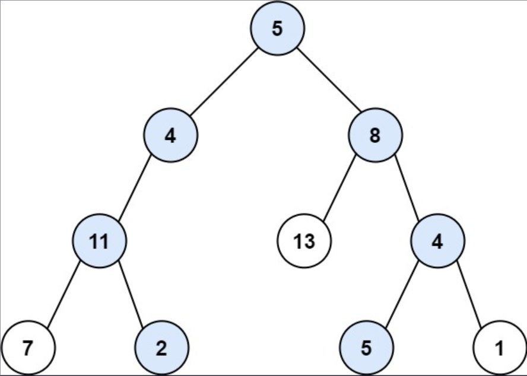

## I Problem
Given the `root` of a binary tree and an integer `target_sum`, return *all **root-to-leaf** paths where the sum of the node values in the path equals* `target_sum`. *Each path should be returned as a list of the node **values**, not node references*.

A **root-to-leaf** path is a path starting from the root and ending at any leaf node. A **leaf** is a node with no children.

**Example 1**

Input: root = [5, 4, 8, 11, null, 13, 4, 7, 2, null, null, 5, 1], target_sum = 22
Output: [[5, 4, 11, 2], [5, 8, 4, 5]]
Explanation: There are two paths whose sum equals targetSum:
5 + 4 + 11 + 2 = 22
5 + 8 + 4 + 5 = 22

**Example 2**

Input: root = [1, 2, 3], target_sum = 5
Output: []

**Example 3**
Input: root = [1, 2], target_sum = 0
Output: []

**Constraints**
- The number of nodes in the tree is in the range `[0, 5000]`.
- `-1000 <= Node.val <= 1000`
- `-1000 <= targetSum <= 1000`

**Related Topics**
- Backtracking
- Tree
- Depth-First Search
- Binary Tree


## II Solution
::: code-tabs
@tab Rust Node Definition
```rust
#[derive(Debug, PartialEq, Eq)]
pub struct TreeNode {
    pub val: i32,
    pub left: Option<Rc<RefCell<TreeNode>>>,
    pub right: Option<Rc<RefCell<TreeNode>>>,
}

impl TreeNode {
    #[inline]
    pub fn new(val: i32) -> Self {
        TreeNode {
            val,
            left: None,
            right: None,
        }
    }
}
```

@tab Java Node Definition
```java
public class TreeNode {
    int val;
    TreeNode left;
    TreeNode right;

    TreeNode() {}
    TreeNode(int val) { this.val = val; }
    TreeNode(int val, TreeNode left, TreeNode right) {
        this.val = val;
        this.left = left;
        this.right = right;
    }
}
```
:::

### Approach 1: Depth-First Search
::: code-tabs
@tab Rust
```rust
pub fn path_sum(root: Option<Rc<RefCell<TreeNode>>>, target_sum: i32) -> Vec<Vec<i32>> {
    //Self::dfs_recur_1(root, target_sum
    //Self::dfs_iter_1(root, target_sum)
    Self::dfs_recur_2(root, target_sum)
}

fn dfs_recur_1(root: Option<Rc<RefCell<TreeNode>>>, target_sum: i32) -> Vec<Vec<i32>> {
    let mut paths = vec![];
    const RECUR: fn(Option<Rc<RefCell<TreeNode>>>, i32, i32, Vec<i32>, &mut Vec<Vec<i32>>) =
        |root, target_sum, sum, mut path, paths| {
            if let Some(curr) = root {
                let curr_val = curr.borrow().val;
                let curr_sum = sum + curr_val;
                path.push(curr_val);

                let left = curr.borrow_mut().left.take();
                let right = curr.borrow_mut().right.take();

                if left.is_none() && right.is_none() && curr_sum == target_sum {
                    paths.push(path);
                } else {
                    if left.is_some() {
                        RECUR(left, target_sum, curr_sum, path.clone(), paths);
                    }
                    if right.is_some() {
                        RECUR(right, target_sum, curr_sum, path, paths);
                    }
                }
            }
        };

    RECUR(root, target_sum, 0, vec![], &mut paths);

    paths
}

fn dfs_iter_1(root: Option<Rc<RefCell<TreeNode>>>, target_sum: i32) -> Vec<Vec<i32>> {
    let mut paths = vec![];

    if let Some(root) = root {
        let mut stack = vec![(root, 0, vec![])];

        while let Some((curr, sum, mut path)) = stack.pop() {
            let curr_val = curr.borrow().val;
            let curr_sum = sum + curr_val;
            path.push(curr_val);

            let left = curr.borrow_mut().left.take();
            let right = curr.borrow_mut().right.take();

            if left.is_none() && right.is_none() && curr_sum == target_sum {
                paths.push(path);
            } else {
                if let Some(right) = right {
                    stack.push((right, curr_sum, path.clone()));
                }
                if let Some(left) = left {
                    stack.push((left, curr_sum, path));
                }
            }
        }
    }

    paths
}

fn dfs_recur_2(root: Option<Rc<RefCell<TreeNode>>>, target_sum: i32) -> Vec<Vec<i32>> {
    const RECUR: fn(Option<Rc<RefCell<TreeNode>>>, i32, i32) -> Vec<Vec<i32>> =
        |root, target_sum, sum| match root {
            None => vec![],
            Some(curr) => {
                let curr_val = curr.borrow().val;
                let curr_sum = curr_val + sum;

                let left = curr.borrow_mut().left.take();
                let right = curr.borrow_mut().right.take();

                if left.is_none() && right.is_none() {
                    let mut paths = vec![];

                    if curr_sum == target_sum {
                        paths.push(vec![curr_val]);
                    }

                    paths
                } else {
                    let mut l_paths = RECUR(left, target_sum, curr_sum);
                    let mut r_paths = RECUR(right, target_sum, curr_sum);

                    l_paths.iter_mut().for_each(|p| p.insert(0, curr_val));
                    r_paths.iter_mut().for_each(|p| p.insert(0, curr_val));
                    l_paths.append(&mut r_paths);

                    l_paths
                }
            }
        };

    RECUR(root, target_sum, 0)
}
```

@tab Java
```java
public List<List<Integer>> pathSum(TreeNode root, int targetSum) {
    //return this.dfsRecur1(root, targetSum);
    //return this.dfsIter1(root, targetSum);
    return this.dfsRecur2(root, targetSum);
}

@FunctionalInterface
interface QuintConsumer<A, B, C, D, E> {
    void accept(A a, B b, C c, D d, E e);
}
QuintConsumer<TreeNode, Integer, Integer, List<Integer>, List<List<Integer>>> recur1 = (root, targetSum, sum, path, paths) -> {
    if (root == null) {
        return;
    }

    int currSum = sum + root.val;
    path.add(root.val);

    if (root.left == null && root.right == null && currSum == targetSum) {
        paths.add(path);
    } else {
        if (root.left != null) {
            this.recur1.accept(root.left, targetSum, currSum, new ArrayList<>(path), paths);
        }
        if (root.right != null) {
            this.recur1.accept(root.right, targetSum, currSum, path, paths);
        }
    }
};
List<List<Integer>> dfsRecur1(TreeNode root, int targetSum) {
    List<List<Integer>> paths = new ArrayList<>();

    this.recur1.accept(root, targetSum, 0, new ArrayList<>(), paths);
    
    return paths;
}

List<List<Integer>> dfsIter1(TreeNode root, int targetSum) {
    List<List<Integer>> paths = new ArrayList<>();

    if (root != null) {
        Deque<Object[]> stack = new ArrayDeque<>() {{
            this.push(new Object[]{root, 0, new ArrayList<>()});
        }};

        while (!stack.isEmpty()) {
            Object[] objs = stack.pop();
            TreeNode curr = (TreeNode) objs[0];
            int sum = (int) objs[1];
            List<Integer> path = (List<Integer>) objs[2];

            int currSum = sum + curr.val;
            path.add(curr.val);

            if (curr.left == null && curr.right == null && currSum == targetSum) {
                paths.add(path);
            } else {
                if (curr.right != null) {
                    stack.push(new Object[]{curr.right, currSum, new ArrayList<>(path)});
                }
                if (curr.left != null) {
                    stack.push(new Object[]{curr.left, currSum, path});
                }
            }
        }
    }

    return paths;
}

@FunctionalInterface
interface TriFunction<A, B, C, D> {
    D apply(A a, B b, C c);
}
TriFunction<TreeNode, Integer, Integer, List<List<Integer>>> recur2 = (root, targetSum, sum) -> {
    if (root == null) {
        return new ArrayList<>();
    }

    int currVal = root.val;
    int currSum = sum + currVal;

    if (root.left == null && root.right == null) {
        List<List<Integer>> paths = new ArrayList<>();

        if (currSum == targetSum) {
            paths.add(new ArrayList<>() {{
                this.add(currVal);
            }});
        }

        return paths;
    } else {
        List<List<Integer>> l_paths = this.recur2.apply(root.left, targetSum, currSum);
        List<List<Integer>> r_paths = this.recur2.apply(root.right, targetSum, currSum);

        l_paths.forEach(p -> p.addFirst(currVal));
        r_paths.forEach(p -> p.addFirst(currVal));
        l_paths.addAll(r_paths);

        return l_paths;
    }
};
List<List<Integer>> dfsRecur2(TreeNode root, int targetSum) {
    return this.recur2.apply(root, targetSum, 0);
}
```
:::

### Approach 2: Breadth-First Search
::: code-tabs
@tab Rust
```rust
pub fn path_sum(root: Option<Rc<RefCell<TreeNode>>>, target_sum: i32) -> Vec<Vec<i32>> {
    Self::bfs_iter(root, target_sum)
}

fn bfs_iter(root: Option<Rc<RefCell<TreeNode>>>, target_sum: i32) -> Vec<Vec<i32>> {
    let mut paths = vec![];

    if let Some(root) = root {
        let mut queue = VecDeque::from([(root, 0, vec![])]);

        while let Some((curr, sum, mut path)) = queue.pop_front() {
            let curr_val = curr.borrow().val;
            let curr_sum = curr_val + sum;
            path.push(curr_val);

            let left = curr.borrow_mut().left.take();
            let right = curr.borrow_mut().right.take();

            if left.is_none() && right.is_none() && curr_sum == target_sum {
                paths.push(path);
            } else {
                if let Some(left) = left {
                    queue.push_back((left, curr_sum, path.clone()));
                }
                if let Some(right) = right {
                    queue.push_back((right, curr_sum, path));
                }
            }
        }
    }

    paths
}
```

@tab Java
```java
public List<List<Integer>> pathSum(TreeNode root, int targetSum) {
    return this.bfsIter(root, targetSum);
}

List<List<Integer>> bfsIter(TreeNode root, int targetSum) {
    List<List<Integer>> paths = new ArrayList<>();

    if (root != null) {
        Deque<Object[]> queue = new ArrayDeque<>() {{
            this.addLast(new Object[]{root, 0, new ArrayList<>()});
        }};

        while (!queue.isEmpty()) {
            Object[] objs = queue.removeFirst();
            TreeNode curr = (TreeNode) objs[0];
            int sum = (int) objs[1];
            List<Integer> path = (List<Integer>) objs[2];

            int currSum = sum + curr.val;
            path.add(curr.val);

            if (curr.left == null && curr.right == null && currSum == targetSum) {
                paths.add(path);
            } else {
                if (curr.left != null) {
                    queue.addLast(new Object[]{curr.left, currSum, new ArrayList<>(path)});
                }
                if (curr.right != null) {
                    queue.addLast(new Object[]{curr.right, currSum, path});
                }
            }
        }
    }

    return paths;
}
```
:::