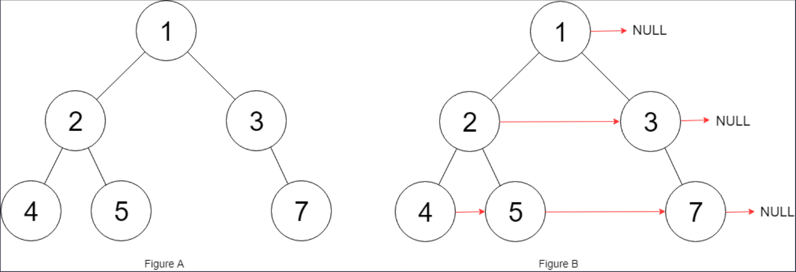

## I Problem
Given a binary tree
```c
struct Node {
    int val;
    Node *left;
    Node *right;
    Node *next;
}
```
Populate each next pointer to point to its next right node. If there is no next right node, the next pointer should be set to `NULL`.

Initially, all next pointers are set to `NULL`.

**Example 1**

Input: root = [1, 2, 3, 4, 5, null, 7]
Output: [1, #, 2, 3, #, 4, 5, 7, #]
Explanation: Given the above binary tree (Figure A), your function should populate each next pointer to point to its next right node, just like in Figure B. The serialized output is in level order as connected by the next pointers, with '#' signifying the end of each level.

**Example 2**
Input: root = []
Output: []

**Constraints**
- The number of nodes in the tree is in the range `[0, 6000]`.
- `-100 <= Node.val <= 100`

**Follow up**
- You may only use constant extra space.
- The recursive approach is fine. You may assume implicit stack space does not count as extra space for this problem.

**Related Topics**
- Linked List
- Tree
- Depth-First Search
- Breadth-First Search
- Binary Tree


## II Solution
::: code-tabs
@tab Rust Node Definition(SmartPointer)
```rust
#[derive(Debug, PartialEq, Eq)]
pub struct Node {
    pub val: i32,
    pub left: Option<Rc<RefCell<Node>>>,
    pub right: Option<Rc<RefCell<Node>>>,
    pub next: Option<Rc<RefCell<Node>>>,
}

impl Node {
    pub fn new(val: i32) -> Option<Rc<RefCell<Node>>> {
        Some(Rc::new(RefCell::new(Node {
            val,
            left: None,
            right: None,
            next: None,
        })))
    }
    pub fn new_with_children(
        val: i32,
        left: Option<Rc<RefCell<Node>>>,
        right: Option<Rc<RefCell<Node>>>,
    ) -> Option<Rc<RefCell<Node>>> {
        Some(Rc::new(RefCell::new(Node {
            val,
            left,
            right,
            next: None,
        })))
    }
}
```

@tab Rust Node Definition(RawPointer)
```rust
#[derive(Debug, PartialEq, Eq)]
pub struct Node {
    pub val: i32,
    pub left: *mut Node,
    pub right: *mut Node,
    pub next: *mut Node,
}

impl Node {
    pub fn new(val: i32) -> *mut Node {
        Box::into_raw(Box::new(Node {
            val,
            left: null_mut(),
            right: null_mut(),
            next: null_mut(),
        }))
    }
    pub fn new_with_children(
        val: i32, 
        left: *mut Node, 
        right: *mut Node
    ) -> *mut Node {
        Box::into_raw(Box::new(Node {
            val,
            left,
            right,
            next: null_mut(),
        }))
    }
}
```

@tab Rust Node Definition(NonNull)
```rust
#[derive(Debug, PartialEq, Eq)]
pub struct Node {
    pub val: i32,
    pub left: Option<NonNull<Node>>,
    pub right: Option<NonNull<Node>>,
    pub next: Option<NonNull<Node>>,
}

impl Node {
    pub fn new(val: i32) -> Option<NonNull<Node>> {
        NonNull::new(Box::into_raw(Box::new(Node {
            val,
            left: None,
            right: None,
            next: None,
        })))
    }
    pub fn new_with_children(
        val: i32,
        left: Option<NonNull<Node>>,
        right: Option<NonNull<Node>>,
    ) -> Option<NonNull<Node>> {
        NonNull::new(Box::into_raw(Box::new(Node {
            val,
            left,
            right,
            next: None,
        })))
    }
}
```

@tab Java Node Definition
```java
public class Node {
    public int val;
    public Node left;
    public Node right;
    public Node next;

    public Node() {}
    public Node(int _val) {
        val = _val;
    }
    public Node(int _val, Node _left, Node _right, Node _next) {
        val = _val;
        left = _left;
        right = _right;
        next = _next;
    }
}
```
:::

### Approach 1: Breadth-First Search
::: code-tabs
@tab Rust(SmartPointer)
```rust
pub fn connect(root: Option<Rc<RefCell<Node>>>) -> Option<Rc<RefCell<Node>>> {
    //Self::bfs_iter_1(root)
    Self::bfs_iter_2(root)
}

fn bfs_iter_1(root: Option<Rc<RefCell<Node>>>) -> Option<Rc<RefCell<Node>>> {
    if let Some(root) = root.clone() {
        let mut queue = VecDeque::from([root]);

        while !queue.is_empty() {
            let level_len = queue.len();

            for i in 1..=level_len {
                if let Some(curr) = queue.pop_front() {
                    if i != level_len {
                        curr.borrow_mut().next = queue.front().cloned();
                    }

                    if let Some(left) = curr.borrow().left.clone() {
                        queue.push_back(left);
                    }
                    if let Some(right) = curr.borrow().right.clone() {
                        queue.push_back(right);
                    }
                }
            }
        }
    }

    root
}

fn bfs_iter_2(root: Option<Rc<RefCell<Node>>>) -> Option<Rc<RefCell<Node>>> {
    if let Some(root) = root.clone() {
        let mut queue = VecDeque::from([(root, 0)]);
        let mut prev: (Option<Rc<RefCell<Node>>>, i32) = (None, -1);

        while let Some((curr, level)) = queue.pop_front() {
            if prev.1 == level {
                prev.0.map(|prev| {
                    prev.borrow_mut().next = Some(curr.clone());
                });
            };
            prev = (Some(curr.clone()), level);

            if let Some(left) = curr.borrow().left.clone() {
                queue.push_back((left, level + 1));
            }
            if let Some(right) = curr.borrow().right.clone() {
                queue.push_back((right, level + 1));
            }
        }
    }

    root
}
```

@tab Rust(RawPointer)
```rust
pub fn connect(root: *mut Node) -> *mut Node {
    //Self::bfs_iter_1(root)
    Self::bfs_iter_2(root)
}

fn bfs_iter_1(root: *mut Node) -> *mut Node {
    if !root.is_null() {
        let mut queue = VecDeque::from([root]);

        while !queue.is_empty() {
            let level_len = queue.len();

            for i in 1..=level_len {
                if let Some(curr) = queue.pop_front() {
                    unsafe {
                        if i != level_len {
                            queue.front().map(|next| {
                                (*curr).next = *next;
                            });
                        }

                        if !(*curr).left.is_null() {
                            queue.push_back((*curr).left);
                        }
                        if !(*curr).right.is_null() {
                            queue.push_back((*curr).right);
                        }
                    }
                }
            }
        }
    }

    root
}

fn bfs_iter_2(root: *mut Node) -> *mut Node {
    if !root.is_null() {
        let mut queue = VecDeque::from([(root, 0)]);
        let mut prev: (*mut Node, i32) = (null_mut(), -1);

        while let Some((curr, level)) = queue.pop_front() {
            unsafe {
                if prev.1 == level {
                    (*prev.0).next = curr;
                }
                prev = (curr, level);

                if !(*curr).left.is_null() {
                    queue.push_back(((*curr).left, level + 1));
                }
                if !(*curr).right.is_null() {
                    queue.push_back(((*curr).right, level + 1));
                }
            }
        }
    }

    root
}
```

@tab Rust(NonNull)
```rust
pub fn connect(root: Option<NonNull<Node>>) -> Option<NonNull<Node>> {
    //Self::bfs_iter_1(root)
    Self::bfs_iter_2(root)
}

fn bfs_iter_1(root: Option<NonNull<Node>>) -> Option<NonNull<Node>> {
    if let Some(root) = root {
        let mut queue = VecDeque::from([root]);

        while !queue.is_empty() {
            let level_len = queue.len();

            for i in 1..=level_len {
                if let Some(mut curr) = queue.pop_front() {
                    unsafe {
                        if i != level_len {
                            queue.front().map(|next| {
                                curr.as_mut().next = Some(*next);
                            });
                        }

                        if let Some(left) = curr.as_ref().left {
                            queue.push_back(left);
                        }
                        if let Some(right) = curr.as_ref().right {
                            queue.push_back(right);
                        }
                    }
                }
            }
        }
    }

    root
}

fn bfs_iter_2(root: Option<NonNull<Node>>) -> Option<NonNull<Node>> {
    if let Some(root) = root {
        let mut queue = VecDeque::from([(root, 0)]);
        let mut prev: (Option<NonNull<Node>>, i32) = (None, -1);

        while let Some((curr, level)) = queue.pop_front() {
            unsafe {
                if level == prev.1 {
                    prev.0.map(|mut prev| {
                        prev.as_mut().next = Some(curr);
                    });
                }
                prev = (Some(curr), level);

                if let Some(left) = curr.as_ref().left {
                    queue.push_back((left, level + 1));
                }
                if let Some(right) = curr.as_ref().right {
                    queue.push_back((right, level + 1));
                }
            }
        }
    }

    root
}
```

@tab Java
```java
public Node connect(Node root) {
    //return this.bfsIter1(root);
    return this.bfsIter2(root);
}

Node bfsIter1(Node root) {
    if (root != null) {
        Deque<Node> queue = new ArrayDeque<>() {{
            this.addLast(root);
        }};

        while (!queue.isEmpty()) {
            int levelSize = queue.size();
            for (int i = 1; i <= levelSize; i++) {
                Node curr = queue.removeFirst();
                if (i != levelSize) {
                    curr.next = queue.peekFirst();
                }

                if (curr.left != null) {
                    queue.addLast(curr.left);
                }
                if (curr.right != null) {
                    queue.addLast(curr.right);
                }
            }
        }
    }

    return root;
}

Node bfsIter2(Node root) {
    if (root != null) {
        Deque<Object[]> queue = new ArrayDeque<>() {{
            this.addLast(new Object[]{root, 0});
        }};
        Node prev = null;
        int prevLevel = -1;

        while (!queue.isEmpty()) {
            Object[] objs = queue.removeFirst();
            Node curr = (Node) objs[0];
            int level = (int) objs[1];
            if (prevLevel == level) {
                prev.next = curr;
            }
            prev = curr;
            prevLevel = level;

            if (curr.left != null) {
                queue.addLast(new Object[]{curr.left, level + 1});
            }
            if (curr.right != null) {
                queue.addLast(new Object[]{curr.right, level + 1});
            }
        }
    }

    return root;
}
```
:::

### Approach 2: Use Established Next Pointer
::: code-tabs
@tab Rust(SmartPointer)
```rust
pub fn connect(root: Option<Rc<RefCell<Node>>>) -> Option<Rc<RefCell<Node>>> {
    //Self::use_next_pointer_iter(root)
    Self::use_next_pointer_recur(root)
}
///
/// Iteration
///
fn use_next_pointer_iter(root: Option<Rc<RefCell<Node>>>) -> Option<Rc<RefCell<Node>>> {
    let mut leftmost = root.clone();
    while let Some(left) = leftmost {
        let mut level = Some(left.clone());

        while let Some(curr) = level {
            // get child of curr node
            let child_of_curr =
                match (curr.borrow().left.clone(), curr.borrow().right.clone()) {
                    (Some(left), Some(right)) => {
                        // set RIGHT child node as the next pointer of LEFT child node
                        left.borrow_mut().next = Some(right.clone());
                        Some(right)
                    }
                    (Some(left), None) => Some(left),
                    (None, Some(right)) => Some(right),
                    (_, _) => None,
                };
            // set child node's next pointer
            if child_of_curr.is_some() && curr.borrow().next.is_some() {
                let mut next = curr.borrow().next.clone();

                while let Some(curr) = next {
                    if let Some(left) = curr.borrow().left.clone() {
                        child_of_curr.map(|child| {
                            child.borrow_mut().next = Some(left);
                        });
                        break;
                    }
                    if let Some(right) = curr.borrow().right.clone() {
                        child_of_curr.map(|child| {
                            child.borrow_mut().next = Some(right);
                        });
                        break;
                    }

                    next = curr.borrow().next.clone();
                }
            }

            level = curr.borrow().next.clone();
        }

        leftmost = if left.borrow().left.is_some() {
            left.borrow().left.clone()
        } else if left.borrow().right.is_some() {
            left.borrow().right.clone()
        } else {
            left.borrow().next.clone()
        };
    }

    root
}
///
/// Recursion(Pre-order Mirror)
///
fn use_next_pointer_recur(root: Option<Rc<RefCell<Node>>>) -> Option<Rc<RefCell<Node>>> {
     const PRE_ORDER: fn(Option<Rc<RefCell<Node>>>) = |root| {
         if let Some(curr) = root {
             // get child of curr node
             let child_of_curr =
                 match (curr.borrow().left.clone(), curr.borrow().right.clone()) {
                     (Some(left), Some(right)) => {
                         left.borrow_mut().next = Some(right.clone());
                         Some(right)
                     }
                     (Some(left), None) => Some(left),
                     (None, Some(right)) => Some(right),
                     (None, None) => None,
                 };
             // set child node's next pointer
             if let Some(child) = child_of_curr {
                 let mut next = curr.borrow().next.clone();
                 while let Some(curr) = next {
                     if let Some(left) = curr.borrow().left.clone() {
                         child.borrow_mut().next = Some(left);
                         break;
                     }
                     if let Some(right) = curr.borrow().right.clone() {
                         child.borrow_mut().next = Some(right);
                         break;
                     }
                     next = curr.borrow().next.clone();
                 }
             }

             // Here, the order must be right first and then left.
             PRE_ORDER(curr.borrow().right.clone());
             PRE_ORDER(curr.borrow().left.clone());
         }
     };

     PRE_ORDER(root.clone());

     root
}
```

@tab Rust(RawPointer)
```rust
pub fn connect(root: *mut Node) -> *mut Node {
    //Self::use_next_pointer_iter(root)
    Self::use_next_pointer_recur(root)
}
///
/// Iteration
///
fn use_next_pointer_iter(root: *mut Node) -> *mut Node {
    let mut leftmost = root;
    while !leftmost.is_null() {
        unsafe {
            let mut level = leftmost;

            while !level.is_null() {
                // get child of curr node
                let child_of_curr =
                    match ((*level).left.is_null(), (*level).right.is_null()) {
                        (false, false) => {
                            (*(*level).left).next = (*level).right;
                            (*level).right
                        }
                        (false, true) => (*level).left,
                        (true, false) => (*level).right,
                        (true, true) => null_mut(),
                    };
                // set child node's next pointer
                if !child_of_curr.is_null() && !(*level).next.is_null() {
                    let mut next = (*level).next;

                    while !next.is_null() {
                        if !(*next).left.is_null() {
                            (*child_of_curr).next = (*next).left;
                            break;
                        }
                        if !(*next).right.is_null() {
                            (*child_of_curr).next = (*next).right;
                            break;
                        }

                        next = (*next).next;
                    }
                }

                level = (*level).next;
            }

            leftmost = if !(*leftmost).left.is_null() {
                (*leftmost).left
            } else if !(*leftmost).right.is_null() {
                (*leftmost).right
            } else {
                (*leftmost).next
            }
        }
    }

    root
}
///
/// Recursion(Pre-Order Mirror)
///
fn use_next_pointer_recur(root: *mut Node) -> *mut Node {
    const PRE_ORDER: fn(*mut Node) = |root| unsafe {
        if root.is_null() {
            return;
        }
        // get child of curr node
        let child_of_curr = if !(*root).left.is_null() && !(*root).right.is_null() {
            (*(*root).left).next = (*root).right;
            (*root).right
        } else if !(*root).left.is_null() {
            (*root).left
        } else if !(*root).right.is_null() {
            (*root).right
        } else {
            null_mut()
        };
        // set child node's next pointer
        match (child_of_curr.is_null(), (*root).next.is_null()) {
            (false, false) => {
                let mut next = (*root).next;
                loop {
                    if next.is_null() {
                        break;
                    }
                    if !(*next).left.is_null() {
                        (*child_of_curr).next = (*next).left;
                        break;
                    }
                    if !(*next).right.is_null() {
                        (*child_of_curr).next = (*next).right;
                        break;
                    }
                    next = (*next).next;
                }
            }
            (_, _) => {}
        }

        // Here, the order must be right first and then left.
        PRE_ORDER((*root).right);
        PRE_ORDER((*root).left);
    };

    PRE_ORDER(root);

    root
}
```

@tab Rust(NonNull)
```rust
pub fn connect(root: Option<NonNull<Node>>) -> Option<NonNull<Node>> {
    //Self::use_next_pointer_iter(root)
    Self::use_next_pointer_recur(root)
}
///
/// Iteration
///
fn use_next_pointer_iter(root: Option<NonNull<Node>>) -> Option<NonNull<Node>> {
    let mut leftmost = root;
    while let Some(left) = leftmost {
        unsafe {
            let mut level = Some(left);

            while let Some(curr) = level {
                // get child of curr node
                let child_of_curr = match (curr.as_ref().left, curr.as_ref().right) {
                    (Some(mut left), Some(right)) => {
                        left.as_mut().next = Some(right);
                        Some(right)
                    }
                    (Some(left), None) => Some(left),
                    (None, Some(right)) => Some(right),
                    (None, None) => None,
                };
                // set child node's next pointer
                if let Some(mut child) = child_of_curr {
                    let mut next = curr.as_ref().next;

                    while let Some(curr) = next {
                        if let Some(left) = curr.as_ref().left {
                            child.as_mut().next = Some(left);
                            break;
                        }
                        if let Some(right) = curr.as_ref().right {
                            child.as_mut().next = Some(right);
                            break;
                        }

                        next = curr.as_ref().next;
                    }
                }

                level = curr.as_ref().next;
            }

            leftmost = if left.as_ref().left.is_some() {
                left.as_ref().left
            } else if left.as_ref().right.is_some() {
                left.as_ref().right
            } else {
                left.as_ref().next
            };
        }
    }

    root
}
///
/// Recursion(Pre-Order Mirror)
///
fn use_next_pointer_recur(root: Option<NonNull<Node>>) -> Option<NonNull<Node>> {
    const PRE_ORDER: fn(Option<NonNull<Node>>) = |root| unsafe {
        if let Some(curr) = root {
            // get child of curr node
            let child_of_curr =
                match (curr.as_ref().left.is_some(), curr.as_ref().right.is_some()) {
                    (true, true) => {
                        curr.as_ref().left.map(|mut left| {
                            left.as_mut().next = curr.as_ref().right;
                        });
                        curr.as_ref().right
                    }
                    (true, false) => curr.as_ref().left,
                    (false, true) => curr.as_ref().right,
                    (false, false) => None,
                };
            // set child node's next pointer
            child_of_curr.map(|mut child| {
                let mut next = curr.as_ref().next;
                while let Some(curr) = next {
                    if curr.as_ref().left.is_some() {
                        child.as_mut().next = curr.as_ref().left;
                        break;
                    }
                    if curr.as_ref().right.is_some() {
                        child.as_mut().next = curr.as_ref().right;
                        break;
                    }
                    next = curr.as_ref().next;
                }
            });

            // Here, the order must be right first and then left.
            PRE_ORDER(curr.as_ref().right);
            PRE_ORDER(curr.as_ref().left);
        }
    };

    PRE_ORDER(root);

    root
}
```

@tab Java
```java
public Node connect(Node root) {
    //return this.useNextPointerIter(root);
    return this.useNextPointerRecur(root);
}
/**
 * Iteration
 */
Node useNextPointerIter(Node root) {
    Node leftmost = root;
    while (leftmost != null) {
        Node curr = leftmost;

        while (curr != null) {
            if (curr.left != null && curr.right != null) {
                curr.left.next = curr.right;
            }
            if ((curr.left != null || curr.right != null) && curr.next != null) {
                Node childOfCurr = curr.right != null ? curr.right : curr.left;
                Node next = curr.next;

                while (next != null) {
                    if (next.left != null || next.right != null) {
                        Node childOfNext = next.left != null ? next.left : next.right;
                        childOfCurr.next = childOfNext;
                        break;
                    } else {
                        next = next.next;
                    }
                }
            }

            curr = curr.next;
        }

        leftmost = leftmost.left != null ? leftmost.left : (leftmost.right != null ? leftmost.right : leftmost.next);
    }

    return root;
}
/**
 * Recursion(Pre-Order Mirror)
 */
Node useNextPointerRecur(Node root) {
    this.preOrder.accept(root);
    return root;
}
Consumer<Node> preOrder = (curr) -> {
    if (curr == null) {
        return;
    }
    if (curr.left != null && curr.right != null) {
        curr.left.next = curr.right;
    }
    if ((curr.left != null || curr.right != null) && curr.next != null) {
        Node childOfCurr = curr.right != null ? curr.right : curr.left;
        Node next = curr.next;

        while (next != null) {
            if (next.left != null || next.right != null) {
                Node childOfNext = next.left != null ? next.left : next.right;
                childOfCurr.next = childOfNext;
                break;
            } else {
                next = next.next;
            }
        }
    }
    
    // Here, the order must be right first and then left.
    this.preOrder.accept(curr.right);
    this.preOrder.accept(curr.left);
};
```
:::