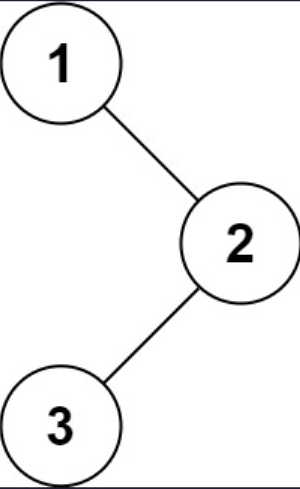

## I Problem
Given the `root` of a binary tree, return *the preorder traversal of its nodes' values*.

**Example 1**

Input: root = [1, null, 2, 3]
Output: [1, 2, 3]

**Example 2**
Input: root = []
Output: []

**Example 3**
Input: root = [1]
Output: [1]

**Constraints**
- The number of nodes in the tree is in the range `[0, 100]`
- `-100 <= Node.val <= 100`

**Follow up**
Recursive solution is trivial, could you do it iteratively?

**Related Topics**
- Stack
- Tree
- Depth-First Search
- Binary Tree


## II Solution
::: code-tabs
@tab Rust Node Definition
```rust
#[derive(Debug, PartialEq, Eq)]
pub struct TreeNode {
    pub val: i32,
    pub left: Option<Rc<RefCell<TreeNode>>>,
    pub right: Option<Rc<RefCell<TreeNode>>>,
}

impl TreeNode {
    #[inline]
    pub fn new(val: i32) -> Self {
        TreeNode {
            val,
            left: None,
            right: None,
        }
    }
}
```

@tab Java Node Definition
```java
public class TreeNode {
    int val;
    TreeNode left;
    TreeNode right;

    TreeNode() {}
    TreeNode(int val) { this.val = val; }
    TreeNode(int val, TreeNode left, TreeNode right) {
        this.val = val;
        this.left = left;
        this.right = right;
    }
}
```
:::

### Approach 1: Recursion
::: code-tabs
@tab Rust
```rust
pub fn preorder_traversal(root: Option<Rc<RefCell<TreeNode>>>) -> Vec<i32> {
    let mut res = vec![];
    const RECURSION_IMPL: fn(Option<Rc<RefCell<TreeNode>>>, &mut Vec<i32>) =
        |root, res| match root {
            None => {}
            Some(node) => {
                res.push(node.borrow().val);                         // Root
                RECURSION_IMPL(node.borrow_mut().left.take(), res);  // Left
                RECURSION_IMPL(node.borrow_mut().right.take(), res); // Right
            }
        };

    RECURSION_IMPL(root, &mut res);

    res
}
```

@tab Java
```java
BiConsumer<TreeNode, List<Integer>> recursionImpl = (root, res) -> {
    if (root == null) {
        return;
    }
    res.add(root.val);                          // Root
    this.recursionImpl.accept(root.left, res);  // Left
    this.recursionImpl.accept(root.right, res); // Right
};

public List<Integer> preorderTraversal(TreeNode root) {
    List<Integer> res = new ArrayList<>();
    this.recursionImpl.accept(root, res);
    return res;
}
```
:::

### Approach 2: Iteration
::: code-tabs
@tab Rust
```rust
pub fn preorder_traversal(root: Option<Rc<RefCell<TreeNode>>>) -> Vec<i32> {
    Self::iteration_impl_1(root)
    //Self::iteration_impl_2(root)
    //Self::iteration_impl_3(root)
    //Self::iteration_impl_4(root)
}

fn iteration_impl_1(root: Option<Rc<RefCell<TreeNode>>>) -> Vec<i32> {
    let mut res = vec![];

    if let Some(node) = root {
        let mut stack = vec![node];

        while !stack.is_empty() {
            if let Some(curr) = stack.pop() {
                res.push(curr.borrow().val);

                if let Some(right) = curr.borrow_mut().right.take() {
                    stack.push(right);
                }

                if let Some(left) = curr.borrow_mut().left.take() {
                    stack.push(left);
                }
            }
        }
    }

    res
}

fn iteration_impl_2(mut root: Option<Rc<RefCell<TreeNode>>>) -> Vec<i32> {
    let mut res = vec![];
    let mut stack = vec![];

    while root.is_some() || !stack.is_empty() {
        while let Some(curr) = root {
            res.push(curr.borrow().val);
            root = curr.borrow_mut().left.take();
            stack.push(curr);
        }

        if let Some(curr) = stack.pop() {
            root = curr.borrow_mut().right.take();
        }
    }

    res
}

fn iteration_impl_3(mut root: Option<Rc<RefCell<TreeNode>>>) -> Vec<i32> {
    let mut res = vec![];
    let mut stack = vec![];

    while root.is_some() || !stack.is_empty() {
        match root {
            Some(curr) => {
                res.push(curr.borrow().val);
                root = curr.borrow_mut().left.take();
                stack.push(curr);
            }
            None => {
                if let Some(curr) = stack.pop() {
                    root = curr.borrow_mut().right.take();
                }
            }
        }
    }

    res
}

fn iteration_impl_4(root: Option<Rc<RefCell<TreeNode>>>) -> Vec<i32> {
    let mut res = vec![];

    if root.is_some() {
        let mut stack = vec![root];

        while !stack.is_empty() {
            match stack.pop().unwrap() {
                Some(curr) => {
                    if let Some(right) = curr.borrow_mut().right.take() {
                        stack.push(Some(right)); // Right
                    }
                    if let Some(left) = curr.borrow_mut().left.take() {
                        stack.push(Some(left));  // Left
                    }
                    stack.push(Some(curr));      // Root
                    stack.push(None);
                }
                None => {
                    if let Some(curr) = stack.pop().unwrap() {
                        res.push(curr.borrow().val);
                    }
                }
            }
        }
    }

    res
}

```

@tab Java
```java
public List<Integer> preorderTraversal(TreeNode root) {
    //return this.iterationImpl1(root);
    //return this.iterationImpl2(root);
    //return this.iterationImpl3(root);
    return this.iterationImpl4(root);
}

List<Integer> iterationImpl1(TreeNode root) {
    List<Integer> res = new ArrayList<>();

    if (root != null) {
        Deque<TreeNode> stack = new ArrayDeque<>() {{
            this.push(root);
        }};

        while (!stack.isEmpty()) {
            TreeNode curr = stack.pop();
            res.add(curr.val);

            if (curr.right != null) {
                stack.push(curr.right);
            }
            if (curr.left != null) {
                stack.push(curr.left);
            }
        }
    }

    return res;
}

List<Integer> iterationImpl2(TreeNode root) {
    List<Integer> res = new ArrayList<>();
    Deque<TreeNode> stack = new ArrayDeque<>();

    while (root != null || !stack.isEmpty()) {
        while (root != null) {
            res.add(root.val);
            stack.push(root);
            root = root.left;
        }

        TreeNode curr = stack.pop();
        root = curr.right;
    }

    return res;
}

List<Integer> iterationImpl3(TreeNode root) {
    List<Integer> res = new ArrayList<>();
    Deque<TreeNode> stack = new ArrayDeque<>();

    while (root != null || !stack.isEmpty()) {
        if (root != null) {
            res.add(root.val);
            stack.push(root);
            root = root.left;
        } else {
            TreeNode curr = stack.pop();
            root = curr.right;
        }
    }

    return res;
}

List<Integer> iterationImpl4(TreeNode root) {
    List<Integer> res = new ArrayList<>();

    if (root != null) {
        Stack<TreeNode> stack = new Stack<>() {{
            this.push(root);
        }};

        while (!stack.isEmpty()) {
            TreeNode curr = stack.pop();

            if (curr != null) {
                if (curr.right != null) {
                    stack.push(curr.right);
                }
                if (curr.left != null) {
                    stack.push(curr.left);
                }
                stack.push(curr);
                stack.push(null); // Stack can push null, ArrayDeque can't.
            } else {
                TreeNode top = stack.pop();
                res.add(top.val);
            }
        }
    }

    return res;
}

```
:::