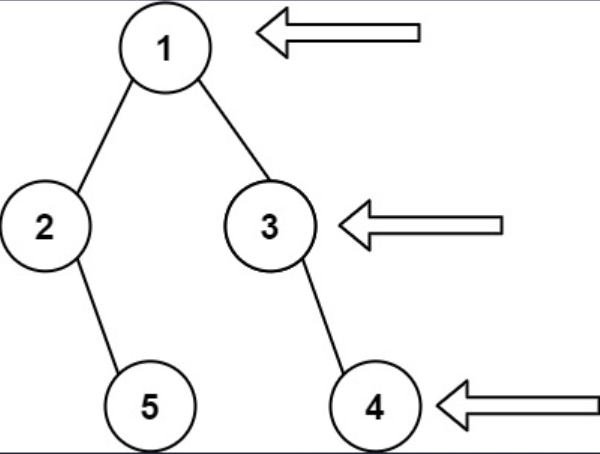

## I Problem
Given the `root` of a binary tree, imagine yourself standing on the **right side** of it, return *the values of the nodes you can see ordered from top to bottom*.

**Example 1**

Input: root = [1, 2, 3, null, 5, null, 4]
Output: [1, 3, 4]

**Example 2**
Input: root = [1, null, 3]
Output: [1, 3]

**Example 3**
Input: root = []
Output: []

**Constraints**
- The number of nodes in the tree is in the range `[0, 100]`
- `-100 <= Node.val <= 100`

**Related Topics**
- Tree
- Depth-First Search
- Breadth-First Search
- Binary Tree


## II Solution
::: code-tabs
@tab Rust Node Definition
```rust
#[derive(Debug, PartialEq, Eq)]
pub struct TreeNode {
    pub val: i32,
    pub left: Option<Rc<RefCell<TreeNode>>>,
    pub right: Option<Rc<RefCell<TreeNode>>>,
}

impl TreeNode {
    #[inline]
    pub fn new(val: i32) -> Self {
        TreeNode {
            val,
            left: None,
            right: None,
        }
    }
}
```

@tab Java Node Definition
```java
public class TreeNode {
    int val;
    TreeNode left;
    TreeNode right;

    TreeNode() {}
    TreeNode(int val) { this.val = val; }
    TreeNode(int val, TreeNode left, TreeNode right) {
        this.val = val;
        this.left = left;
        this.right = right;
    }
}
```
:::

### Approach 1: Depth-First Search
::: code-tabs
@tab Rust
```rust
pub fn right_side_view(root: Option<Rc<RefCell<TreeNode>>>) -> Vec<i32> {
    //Self::dfs_recursion(root)
    //Self::dfs_iteration_1(root)
    //Self::dfs_iteration_2(root)
    Self::dfs_iteration_3(root)
}

///
/// DFS - Recursion Impl
///
fn dfs_recursion(root: Option<Rc<RefCell<TreeNode>>>) -> Vec<i32> {
    let mut res = vec![];
    const RECURSION_IMPL: fn(Option<Rc<RefCell<TreeNode>>>, usize, &mut Vec<i32>) =
        |root, level, res| {
            if let Some(curr) = root {
                if level == res.len() {
                    res.push(curr.borrow().val);
                }
                // go Right
                RECURSION_IMPL(curr.borrow_mut().right.take(), level + 1, res);
                // go Left
                RECURSION_IMPL(curr.borrow_mut().left.take(), level + 1, res);
            }
        };

    RECURSION_IMPL(root, 0, &mut res);

    res
}

///
/// DFS - Iteration Impl
///
fn dfs_iteration_1(root: Option<Rc<RefCell<TreeNode>>>) -> Vec<i32> {
    let mut res = vec![];
    let mut root = (root, 0);
    let mut stack = vec![];

    while root.0.is_some() || !stack.is_empty() {
        match root.0 {
            Some(curr) => {
                let curr_level = root.1;
                if res.len() == curr_level {
                    res.push(curr.borrow().val);
                }
                root = (curr.borrow_mut().right.take(), curr_level + 1);
                stack.push((curr, curr_level));
            }
            None => {
                if let Some((curr, curr_level)) = stack.pop() {
                    root = (curr.borrow_mut().left.take(), curr_level + 1);
                }
            }
        }
    }
    res
}

///
/// DFS - Iteration Impl
///
fn dfs_iteration_2(root: Option<Rc<RefCell<TreeNode>>>) -> Vec<i32> {
    let mut res = vec![];
    let mut root = (root, 0);
    let mut stack = vec![];

    while root.0.is_some() || !stack.is_empty() {
        while let Some(curr) = root.0 {
            let curr_level = root.1;
            if res.len() == curr_level {
                res.push(curr.borrow().val);
            }
            root = (curr.borrow_mut().right.take(), curr_level + 1);
            stack.push((curr, curr_level));
        }
        if let Some((curr, curr_level)) = stack.pop() {
            root = (curr.borrow_mut().left.take(), curr_level + 1);
        }
    }

    res
}

///
/// DFS - Iteration Impl
///
fn dfs_iteration_3(root: Option<Rc<RefCell<TreeNode>>>) -> Vec<i32> {
    let mut res = vec![];

    if let Some(root) = root {
        let mut stack = vec![Ok((root, 0))];

        while let Some(root) = stack.pop() {
            match root {
                Ok((curr, curr_level)) => {
                    // Left
                    if let Some(left) = curr.borrow_mut().left.take() {
                        stack.push(Ok((left, curr_level + 1)));
                    }
                    // Right
                    if let Some(right) = curr.borrow_mut().right.take() {
                        stack.push(Ok((right, curr_level + 1)));
                    }
                    // Root
                    stack.push(Err((curr.borrow().val, curr_level)));
                }
                Err((val, curr_level)) => {
                    if res.len() == curr_level {
                        res.push(val);
                    }
                }
            }
        }
    }

    res
}

```

@tab Java
```java
public List<Integer> rightSideView(TreeNode root) {
    //return this.dfsRecursion(root);
    //return this.dfsIteration1(root);
    //return this.dfsIteration2(root);
    return this.dfsIteration3(root);
}

@FunctionalInterface
interface TriConsumer<X, Y, Z> {
    void accept(X x, Y y, Z z);
}

TriConsumer<TreeNode, Integer, List<Integer>> recurImpl = (root, level, res) -> {
    if (root == null) {
        return;
    }
    if (level == res.size()) {
        res.add(root.val);
    }
    if (root.right != null) {
        this.recurImpl.accept(root.right, level + 1, res);
    }
    if (root.left != null) {
        this.recurImpl.accept(root.left, level + 1, res);
    }
};

/**
 * DFS - Recursion Impl 
 */
List<Integer> dfsRecursion(TreeNode _root) {
    List<Integer> res = new ArrayList<>();
    this.recurImpl.accept(_root, 0, res);
    return res;
}

/**
 * DFS - Iteration Impl 
 */
List<Integer> dfsIteration1(TreeNode _root) {
    List<Integer> res = new ArrayList<>();
    Deque<Object[]> stack = new ArrayDeque<>();
    Object[] root = new Object[]{_root, 0};

    while (root[0] != null || !stack.isEmpty()) {
        TreeNode curr = (TreeNode) root[0];
        int curr_level = (int) root[1];

        if (curr != null) {
            if (curr_level == res.size()) {
                res.add(curr.val);
            }
            stack.push(new Object[]{curr, curr_level});
            // go Right
            root = new Object[]{curr.right, curr_level + 1};
        } else {
            Object[] top = stack.pop();
            TreeNode top_node = (TreeNode) top[0];
            int top_level = (int) top[1];
            root = new Object[]{top_node.left, top_level + 1};
        }
    }

    return res;
}

/**
 * DFS - Iteration Impl 
 */
List<Integer> dfsIteration2(TreeNode _root) {
    List<Integer> res = new ArrayList<>();
    Deque<Object[]> stack = new ArrayDeque<>();
    Object[] root = new Object[]{_root, 0};

    while (root[0] != null || !stack.isEmpty()) {
        while (root[0] != null) {
            TreeNode curr = (TreeNode) root[0];
            int curr_level = (int) root[1];
            if (curr_level == res.size()) {
                res.add(curr.val);
            }
            stack.push(new Object[]{curr, curr_level});
            // go Right
            root = new Object[]{curr.right, curr_level + 1};
        }

        Object[] top = stack.pop();
        TreeNode top_node = (TreeNode) top[0];
        int top_level = (int) top[1];
        root = new Object[]{top_node.left, top_level + 1};
    }

    return res;
}

/**
 * DFS - Iteration Impl 
 */
List<Integer> dfsIteration3(TreeNode _root) {
    List<Integer> res = new ArrayList<>();

    if (_root != null) {
        Deque<Object[]> stack = new ArrayDeque<>() {{
            this.push(new Object[]{_root, 0});
        }};

        while (!stack.isEmpty()) {
            Object[] pop = stack.pop();
            if (pop instanceof Integer[] vals) {
                if (vals[1] == res.size()) {
                    res.add(vals[0]);
                }
            } else {
                TreeNode curr = (TreeNode) pop[0];
                int curr_level = (int) pop[1];
                // Left
                if (curr.left != null) {
                    stack.push(new Object[]{curr.left, curr_level + 1});
                }
                // Right
                if (curr.right != null) {
                    stack.push(new Object[]{curr.right, curr_level + 1});
                }
                // Root
                stack.push(new Integer[]{curr.val, curr_level});
            }
        }
    }

    return res;
}

```
:::

### Approach 2: Breadth-First Search
::: code-tabs
@tab Rust
```rust
pub fn right_side_view(root: Option<Rc<RefCell<TreeNode>>>) -> Vec<i32> {
    //Self::bfs_iteration_1(root)
    Self::bfs_iteration_2(root)
}

///
/// BFS - Iteration Impl
///
fn bfs_iteration_1(root: Option<Rc<RefCell<TreeNode>>>) -> Vec<i32> {
    let mut res = vec![];

    if let Some(root) = root {
        let mut queue = VecDeque::from([root]);

        while !queue.is_empty() {
            let level_len = queue.len();
            for i in 1..=level_len {
                if let Some(curr) = queue.pop_front() {
                    // if you enqueue left node first, here should be i == level_len
                    // if you enqueue right node first, here should be i == 0
                    if i == level_len {
                        res.push(curr.borrow().val);
                    }
                    if let Some(left) = curr.borrow_mut().left.take() {
                        queue.push_back(left);
                    }
                    if let Some(right) = curr.borrow_mut().right.take() {
                        queue.push_back(right);
                    }
                }
            }
        }
    }

    res
}

///
/// BFS - Iteration Impl
///
fn bfs_iteration_2(root: Option<Rc<RefCell<TreeNode>>>) -> Vec<i32> {
    let mut res = vec![];

    if let Some(root) = root {
        let mut queue = VecDeque::from([(root, 0)]);

        while let Some((curr, curr_level)) = queue.pop_front() {
            if curr_level == res.len() {
                res.push(curr.borrow().val);
            }

            if let Some(right) = curr.borrow_mut().right.take() {
                queue.push_back((right, curr_level + 1));
            }
            if let Some(left) = curr.borrow_mut().left.take() {
                queue.push_back((left, curr_level + 1));
            }
        }
    }

    res
}

```

@tab Java
```java
public List<Integer> rightSideView(TreeNode root) {
    //return this.bfsIteration1(root);
    return this.bfsIteration2(root);
}

/**
 * BFS - Iteration Impl
 */
List<Integer> bfsIteration1(TreeNode _root) {
    List<Integer> res = new ArrayList<>();

    if (_root != null) {
        Deque<TreeNode> queue = new ArrayDeque<>() {{
            this.addLast(_root);
        }};

        while (!queue.isEmpty()) {
            int levelSize = queue.size();

            for (int i = 1; i <= levelSize; i++) {
                TreeNode curr = queue.removeFirst();
                // if you enqueue left node first, here should be i == levelSize
                // if you enqueue right node first, here should be i == 0
                if (i == levelSize) {
                    res.add(curr.val);
                }
                if (curr.left != null) {
                    queue.addLast(curr.left);
                }
                if (curr.right != null) {
                    queue.addLast(curr.right);
                }
            }
        }
    }

    return res;
}

/**
 * BFS - Iteration Impl
 */
List<Integer> bfsIteration2(TreeNode _root) {
    List<Integer> res = new ArrayList<>();

    if (_root != null) {
        Deque<Object[]> queue = new ArrayDeque<>() {{
            this.addLast(new Object[]{_root, 0});
        }};

        while (!queue.isEmpty()) {
            Object[] pop = queue.removeFirst();
            TreeNode curr = (TreeNode) pop[0];
            int curr_level = (int) pop[1];

            if (curr_level == res.size()) {
                res.add(curr.val);
            }
            if (curr.right != null) {
                queue.addLast(new Object[]{curr.right, curr_level + 1});
            }
            if (curr.left != null) {
                queue.addLast(new Object[]{curr.left, curr_level + 1});
            }
        }
    }

    return res;
}
```
:::