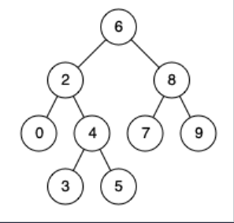

## I Problem
Given a binary search tree (BST), find the lowest common ancestor (LCA) node of two given nodes in the BST.

According to the [definition of LCA on Wikipedia][LCA]: "The lowest common ancestor is defined between two nodes `p` and `q` as the lowest node in `T` that has both `p` and `q` as descendants (where we allow **a node to be a descendant of itself**)."

**Example 1**

Input: root = [6, 2, 8, 0, 4, 7, 9, null, null, 3, 5], p = 2, q = 8
Output: 6
Explanation: The LCA of nodes `2` and `8` is `6`.

**Example 2**

Input: root = [6, 2, 8, 0, 4, 7, 9, null, null, 3, 5], p = 2, q = 4
Output: 2
Explanation: The LCA of nodes `2` and `4` is `2`, since a node can be a descendant of itself according to the LCA definition.

**Example 3**
Input: root = [2, 1], p = 2, q = 1
Output: 2

**Constraints**
- The number of nodes in the tree is in the range `[2, 10⁵]`.
- `-10⁹ <= Node.val <= 10⁹`
- All `Node.val` are unique.
- `p != q`
- `p` and `q` will exist in the BST.

**Related Topics**
- Tree
- Depth-First Search
- Binary Tree
- Binary Search Tree


[LCA]: https://en.wikipedia.org/wiki/Lowest_common_ancestor


## II Solution
::: code-tabs
@tab Rust Node Definition
```rust
#[derive(Debug, PartialEq, Eq)]
pub struct TreeNode {
    pub val: i32,
    pub left: Option<Rc<RefCell<TreeNode>>>,
    pub right: Option<Rc<RefCell<TreeNode>>>,
}

impl TreeNode {
    #[inline]
    pub fn new(val: i32) -> Self {
        TreeNode {
            val,
            left: None,
            right: None,
        }
    }
}
```

@tab Java Node Definition
```java
public class TreeNode {
    int val;
    TreeNode left;
    TreeNode right;

    TreeNode() {}
    TreeNode(int val) { this.val = val; }
    TreeNode(int val, TreeNode left, TreeNode right) {
        this.val = val;
        this.left = left;
        this.right = right;
    }
}
```
:::

### Approach 1: Two Traversals
::: code-tabs
@tab Rust
```rust
pub fn lowest_common_ancestor(
    root: Option<Rc<RefCell<TreeNode>>>, p: Option<Rc<RefCell<TreeNode>>>, q: Option<Rc<RefCell<TreeNode>>>,
) -> Option<Rc<RefCell<TreeNode>>> {
    //Self::two_traversal_recur(root, p, q)
    Self::two_traversal_iter(root, p, q)
}

fn two_traversal_recur(
    root: Option<Rc<RefCell<TreeNode>>>, p: Option<Rc<RefCell<TreeNode>>>, q: Option<Rc<RefCell<TreeNode>>>,
) -> Option<Rc<RefCell<TreeNode>>> {
    let p = p.unwrap().borrow().val;
    let q = q.unwrap().borrow().val;
    const TRAVERSAL: fn(Option<Rc<RefCell<TreeNode>>>, i32, &mut Vec<Option<Rc<RefCell<TreeNode>>>>,) = 
        |root, target, path| {
            if let Some(curr) = root {
                let curr_val = curr.borrow().val;
                path.push(Some(curr.clone()));
    
                if target > curr_val {
                    TRAVERSAL(curr.borrow().right.clone(), target, path);
                } else if target < curr_val {
                    TRAVERSAL(curr.borrow().left.clone(), target, path);
                } else {
                    return;
                }
            }
        };

    let mut p_path = vec![];
    TRAVERSAL(root.clone(), p, &mut p_path);
    let mut q_path = vec![];
    TRAVERSAL(root, q, &mut q_path);

    let len = std::cmp::min(p_path.len(), q_path.len());
    for i in (0..len).rev() {
        if p_path[i] == q_path[i] {
            return p_path[i].clone();
        }
    }

    None
}

fn two_traversal_iter(
    root: Option<Rc<RefCell<TreeNode>>>, p: Option<Rc<RefCell<TreeNode>>>, q: Option<Rc<RefCell<TreeNode>>>,
) -> Option<Rc<RefCell<TreeNode>>> {
    let p = p.unwrap().borrow().val;
    let q = q.unwrap().borrow().val;
    let traversal = |mut root: Option<Rc<RefCell<TreeNode>>>, target: i32| {
        let mut path = vec![];

        while let Some(curr) = root {
            let curr_val = curr.borrow().val;
            path.push(Some(curr.clone()));
            if target > curr_val {
                root = curr.borrow().right.clone();
            } else if target < curr_val {
                root = curr.borrow().left.clone();
            } else {
                break;
            }
        }

        path
    };

    let p_path = traversal(root.clone(), p);
    let q_path = traversal(root, q);

    let len = std::cmp::min(p_path.len(), q_path.len());
    for i in (0..len).rev() {
        if p_path[i] == q_path[i] {
            return p_path[i].clone();
        }
    }

    None
}
```

@tab Java
```java
public TreeNode lowestCommonAncestor(TreeNode root, TreeNode p, TreeNode q) {
    //return this.twoTraversalRecur(root, p, q);
    return this.twoTraversalIter(root, p, q);
}

@FunctionalInterface
interface TriConsumer<A, B, C> {
    void accept(A a, B b, C c);
}

TriConsumer<TreeNode, Integer, List<TreeNode>> recur1 = (root, target, path) -> {
    if (root == null) {
        return;
    }

    path.add(root);
    if (root.val == target) {
        return;
    }

    if (target > root.val) {
        this.recur1.accept(root.right, target, path);
    } else {
        this.recur1.accept(root.left, target, path);
    }
};

TreeNode twoTraversalRecur(TreeNode root, TreeNode p, TreeNode q) {
    List<TreeNode> pPath = new ArrayList<>();
    this.recur1.accept(root, p.val, pPath);
    List<TreeNode> qPath = new ArrayList<>();
    this.recur1.accept(root, q.val, qPath);

    int size = Math.min(pPath.size(), qPath.size());
    for (int i = size - 1; i >= 0; i--) {
        if (pPath.get(i).val == qPath.get(i).val) {
            return pPath.get(i);
        }
    }

    return null;
}


BiFunction<TreeNode, Integer, List<TreeNode>> iter1 = (root, target) -> {
    List<TreeNode> path = new ArrayList<>();

    while (root != null) {
        path.add(root);

        if (root.val == target) {
            break;
        }

        if (target > root.val) {
            root = root.right;
        } else {
            root = root.left;
        }
    }

    return path;
};

TreeNode twoTraversalIter(TreeNode root, TreeNode p, TreeNode q) {
    List<TreeNode> pPath = this.iter1.apply(root, p.val);
    List<TreeNode> qPath = this.iter1.apply(root, q.val);

    int size = Math.min(pPath.size(), qPath.size());
    for (int i = size - 1; i >= 0; i--) {
        if (pPath.get(i).val == qPath.get(i).val) {
            return pPath.get(i);
        }
    }

    return null;
}
```
:::


### Approach 2: One Traversal
::: code-tabs
@tab Rust
```rust
pub fn lowest_common_ancestor(
    root: Option<Rc<RefCell<TreeNode>>>, p: Option<Rc<RefCell<TreeNode>>>, q: Option<Rc<RefCell<TreeNode>>>,
) -> Option<Rc<RefCell<TreeNode>>> {
    //Self::one_traversal_recur(root, p, q
    Self::one_traversal_iter(root, p, q)
}

fn one_traversal_recur(
    root: Option<Rc<RefCell<TreeNode>>>, p: Option<Rc<RefCell<TreeNode>>>, q: Option<Rc<RefCell<TreeNode>>>,
) -> Option<Rc<RefCell<TreeNode>>> {
    let p = p.unwrap().borrow().val;
    let q = q.unwrap().borrow().val;
    const TRAVERSAL: fn(Option<Rc<RefCell<TreeNode>>>, i32, i32) -> Option<Rc<RefCell<TreeNode>>> = 
        |root, p, q| match root {
            None => None,
            Some(curr) => {
                let curr_val = curr.borrow().val;

                if p < curr_val && q < curr_val {
                    TRAVERSAL(curr.borrow().left.clone(), p, q)
                } else if p > curr_val && q > curr_val {
                    TRAVERSAL(curr.borrow().right.clone(), p, q)
                } else {
                    Some(curr)
                }
            }
        };

    TRAVERSAL(root, p, q)
}

fn one_traversal_iter(
    root: Option<Rc<RefCell<TreeNode>>>, p: Option<Rc<RefCell<TreeNode>>>, q: Option<Rc<RefCell<TreeNode>>>,
) -> Option<Rc<RefCell<TreeNode>>> {
    let p = p.unwrap().borrow().val;
    let q = q.unwrap().borrow().val;
    let traversal = |mut root: Option<Rc<RefCell<TreeNode>>>| {
        while let Some(curr) = root {
            let curr_val = curr.borrow().val;

            if p < curr_val && q < curr_val {
                root = curr.borrow().left.clone();
            } else if p > curr_val && q > curr_val {
                root = curr.borrow().right.clone();
            } else {
                return Some(curr);
            }
        }

        None
    };

    traversal(root)
}
```

@tab Java
```java
public TreeNode lowestCommonAncestor(TreeNode root, TreeNode p, TreeNode q) {
    //return this.oneTraversalRecur(root, p, q);
    return this.oneTraversalIter(root, p, q);
}

BiFunction<TreeNode, int[], TreeNode> recur2 = (root, target) -> {
    if (root == null) {
        return null;
    }
    int p = target[0];
    int q = target[1];

    if (p > root.val && q > root.val) {
        return this.recur2.apply(root.right, target);
    } else if (p < root.val && q < root.val) {
        return this.recur2.apply(root.left, target);
    } else {
        return root;
    }
};

TreeNode oneTraversalRecur(TreeNode root, TreeNode p, TreeNode q) {
    return this.recur2.apply(root, new int[]{p.val, q.val});
}


BiFunction<TreeNode, int[], TreeNode> iter2 = (root, target) -> {
    while (root != null) {
        int p = target[0];
        int q = target[1];

        if (p > root.val && q > root.val) {
            root = root.right;
        } else if (p < root.val && q < root.val) {
            root = root.left;
        } else {
            break;
        }
    }

    return root;
};

TreeNode oneTraversalIter(TreeNode root, TreeNode p, TreeNode q) {
    return this.iter2.apply(root, new int[]{p.val, q.val});
}
```
:::