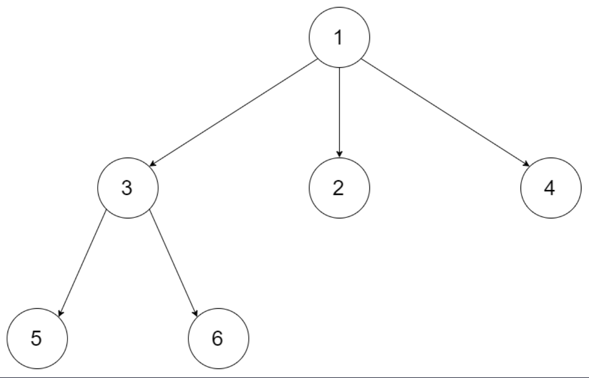
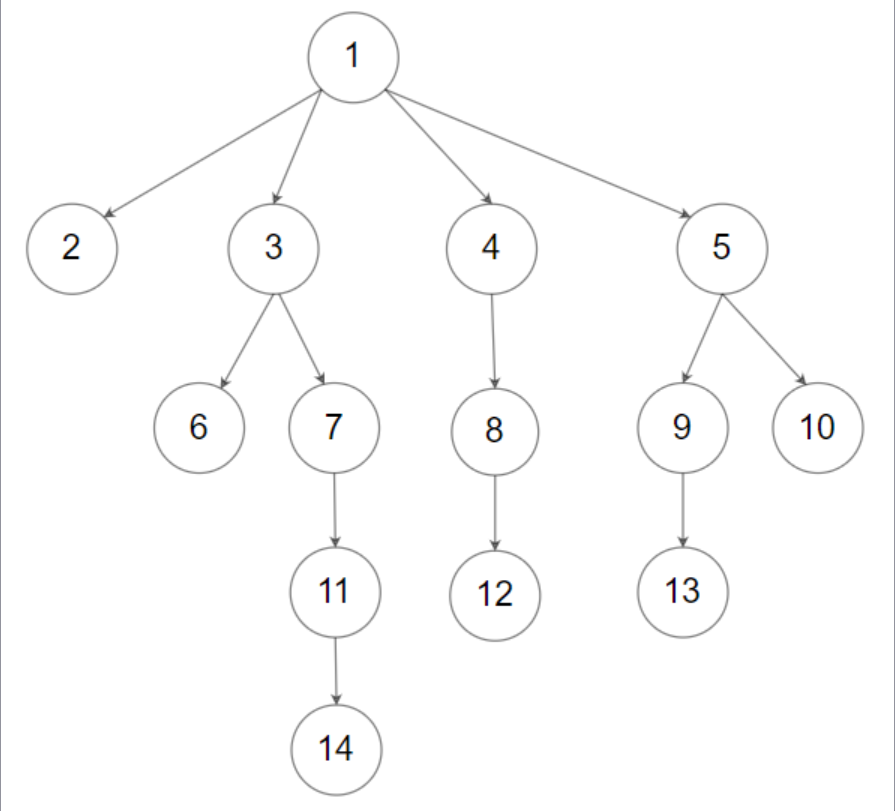

## I Problem
Given an n-ary tree, return the *level order* traversal of its nodes' values.

Nary-Tree *input serialization is represented in their level order traversal, each group of children is separated by the null value (See examples)*.

**Example 1**

Input: root = [1, null, 3, 2, 4, null, 5, 6]
Output: [[1], [3, 2, 4], [5, 6]]

**Example 2**

Input: root = [1, null, 2, 3, 4, 5, null, null, 6, 7, null, 8, null, 9, 10, null, null, 11, null, 12, null, 13, null, null, 14]
Output: [[1], [2, 3, 4, 5], [6, 7, 8, 9, 10], [11, 12, 13], [14]]

**Constraints**
- The height of the n-ary tree is less than or equal to `1000`
- The total number of nodes is between `[0, 10⁴]`

**Related Topics**
- Tree
- Breadth-First Search


## II Solution
::: code-tabs
@tab Rust Node Definition
```rust
#[derive(Debug, PartialEq, Eq)]
pub struct Node {
    pub val: i32,
    pub children: Option<Vec<Option<Rc<RefCell<Node>>>>>,
}

impl Node {
    ///
    /// Node with no children
    ///
    pub fn new(val: i32) -> Option<Rc<RefCell<Node>>> {
        Some(Rc::new(RefCell::new(Node {
            val,
            children: None,
        })))
    }
    ///
    /// Node with children
    ///
    pub fn new_with_children(val: i32, children: Vec<Option<Rc<RefCell<Node>>>>) -> Option<Rc<RefCell<Node>>> {
        Some(Rc::new(RefCell::new(Node {
            val,
            children: if children.is_empty() {
                None
            } else {
                Some(children)
            },
        })))
    }
}
```

@tab Java Node Definition
```java
public class Node {
    int val;
    List<Node> children;

    public Node() {}

    public Node(int _val) {
        val = _val;
    }

    public Node(int _val, List<Node> _children) {
        val = _val;
        children = _children;
    }
}
```
:::

### Approach 1: Depth-First Search
::: code-tabs
@tab Rust
```rust
pub fn level_order(root: Option<Rc<RefCell<Node>>>) -> Vec<Vec<i32>> {
    //Self::dfs_recur_pre_order(root)
    //Self::dfs_iter_pre_order_1(root)
    //Self::dfs_iter_pre_order_2(root)
    Self::dfs_iter_pre_order_3(root)
}

///
/// DFS - Recursion(Pre-Order)
///
fn dfs_recur_pre_order(root: Option<Rc<RefCell<Node>>>) -> Vec<Vec<i32>> {
    let mut res = vec![];
    const PRE_ORDER: fn(Option<Rc<RefCell<Node>>>, usize, &mut Vec<Vec<i32>>) =
        |root, level, res| {
            if let Some(curr) = root {
                if level == res.len() {
                    res.push(vec![]);
                }
                res[level].push(curr.borrow().val);
                if let Some(children) = curr.borrow_mut().children.take() {
                    for child in children {
                        PRE_ORDER(child, level + 1, res);
                    }
                }
            }
        };

    PRE_ORDER(root, 0, &mut res);

    res
}

///
/// DFS - Iteration(Pre-Order)
///
fn dfs_iter_pre_order_1(root: Option<Rc<RefCell<Node>>>) -> Vec<Vec<i32>> {
    let mut res = vec![];
    let mut root = (root, 0);
    let mut stack = vec![];

    while root.0.is_some() || !stack.is_empty() {
        while let Some(curr) = root.0 {
            let level = root.1;
            if level == res.len() {
                res.push(vec![]);
            }
            res[level].push(curr.borrow().val);

            root = if let Some(ref mut children) = curr.borrow_mut().children {
                (children[0].take(), level + 1)
            } else {
                (None, level + 1)
            };
            stack.push((curr, level));
        }

        if let Some((curr, level)) = stack.pop() {
            root = if let Some(ref mut children) = curr.borrow_mut().children {
                if children.len() <= 1 {
                    (None, level + 1)
                } else {
                    let right = children.remove(1);
                    if children.len() > 1 {
                        stack.push((curr.clone(), level));
                    }
                    (right, level + 1)
                }
            } else {
                (None, level + 1)
            };
        };
    }

    res
}

///
/// DFS - Iteration(Pre-Order)
///
fn dfs_iter_pre_order_2(root: Option<Rc<RefCell<Node>>>) -> Vec<Vec<i32>> {
    let mut res = vec![];
    let mut root = (root, 0);
    let mut stack = vec![];

    while root.0.is_some() || !stack.is_empty() {
        if let Some(curr) = root.0 {
            let level = root.1;
            if level == res.len() {
                res.push(vec![]);
            }
            res[level].push(curr.borrow().val);

            root = (None, level + 1);
            if let Some(ref mut children) = curr.borrow_mut().children {
                root.0 = children[0].take();
            }
            stack.push((curr, level));
        } else {
            if let Some((curr, level)) = stack.pop() {
                root = (None, level + 1);
                if let Some(ref mut children) = curr.borrow_mut().children {
                    if children.len() > 1 {
                        root.0 = children.remove(1);
                        if children.len() > 1 {
                            stack.push((curr.clone(), level));
                        }
                    }
                };
            };
        }
    }

    res
}

///
/// DFS - Iteration(Pre-Order)
///
fn dfs_iter_pre_order_3(root: Option<Rc<RefCell<Node>>>) -> Vec<Vec<i32>> {
    let mut res = vec![];

    if let Some(root) = root {
        let mut stack = vec![(Ok(root), 0)];

        while let Some((curr, level)) = stack.pop() {
            match curr {
                Ok(node) => {
                    if let Some(mut children) = node.borrow_mut().children.take() {
                        for i in (0..children.len()).rev() {
                            if let Some(child) = children[i].take() {
                                stack.push((Ok(child), level + 1));
                            }
                        }
                    }
                    stack.push((Err(node.borrow().val), level));
                }
                Err(val) => {
                    if level == res.len() {
                        res.push(vec![]);
                    }
                    res[level].push(val);
                }
            }
        }
    }

    res
}

```

@tab Java
```java
public List<List<Integer>> levelOrder(Node root) {
    //return this.dfsRecurPreOrder(root);
    //return this.dfsIterPreOrder1(root);
    //return this.dfsIterPreOrder2(root);
    return this.dfsIterPreOrder3(root);
}

@FunctionalInterface
interface TriConsumer<A, B, C> {
    void accept(A a, B b, C c);
}

TriConsumer<Node, Integer, List<List<Integer>>> preOrder = (root, level, res) -> {
    if (root == null) {
        return;
    }
    if (level == res.size()) {
        res.add(new ArrayList<>());
    }
    res.get(level).add(root.val);
    for (Node child : root.children) {
        this.preOrder.accept(child, level + 1, res);
    }
};

/**
 * DFS - Recursion(Pre-Order)
 */
List<List<Integer>> dfsRecurPreOrder(Node root) {
    List<List<Integer>> res = new ArrayList<>();
    this.preOrder.accept(root, 0, res);
    return res;
}

/**
 * DFS - Iteration(Pre-Order)
 */
List<List<Integer>> dfsIterPreOrder1(Node _root) {
    List<List<Integer>> res = new ArrayList<>();
    Deque<Object[]> stack = new ArrayDeque<>();
    Object[] root = new Object[]{_root, 0};

    while (root[0] != null || !stack.isEmpty()) {
        while (root[0] != null) {
            Node curr = (Node) root[0];
            int level = (int) root[1];
            if (level == res.size()) {
                res.add(new ArrayList<>());
            }
            res.get(level).add(curr.val);

            root = new Object[]{this.isBlank(curr.children) ? null : curr.children.get(0), level + 1};
            stack.push(new Object[]{curr, level});
        }

        Object[] objs = stack.pop();
        Node curr = (Node) objs[0];
        int level = (int) objs[1];

        if (this.isBlank(curr.children) || curr.children.size() == 1) {
            root = new Object[]{null, level + 1};
        } else {
            Node right = curr.children.remove(1);
            if (curr.children.size() > 1) {
                stack.push(new Object[]{curr, level});
            }
            root = new Object[]{right, level + 1};
        }
    }

    return res;
}

boolean isBlank(List<Node> children) {
    return children == null || children.isEmpty();
}

/**
 * DFS - Iteration(Pre-Order)
 */
List<List<Integer>> dfsIterPreOrder2(Node _root) {
    List<List<Integer>> res = new ArrayList<>();
    Deque<Object[]> stack = new ArrayDeque<>();
    Object[] root = new Object[]{_root, 0};

    while (root[0] != null || !stack.isEmpty()) {
        if (root[0] != null) {
            Node curr = (Node) root[0];
            int level = (int) root[1];
            if (level == res.size()) {
                res.add(new ArrayList<>());
            }
            res.get(level).add(curr.val);

            root = new Object[]{null, level + 1};
            if (!this.isBlank(curr.children)) {
                root[0] = curr.children.get(0);
            }
            stack.push(new Object[]{curr, level});
        } else {
            Object[] objs = stack.pop();
            Node curr = (Node) objs[0];
            int level = (int) objs[1];
            root = new Object[]{null, level + 1};

            if (!this.isBlank(curr.children) && curr.children.size() > 1) {
                root[0] = curr.children.remove(1);
                if (curr.children.size() > 1) {
                    stack.push(new Object[]{curr, level});
                }
            }
        }
    }

    return res;
}

/**
 * DFS - Iteration(Pre-Order)
 */
List<List<Integer>> dfsIterPreOrder3(Node _root) {
    List<List<Integer>> res = new ArrayList<>();

    if (_root != null) {
        Deque<Object[]> stack = new ArrayDeque<>() {{
            this.push(new Object[]{_root, 0});
        }};

        while (!stack.isEmpty()) {
            Object[] root = stack.pop();
            Object curr = root[0];
            int level = (int) root[1];

            switch (curr) {
                case Node node -> {
                    Collections.reverse(node.children);
                    for (Node n : node.children) {
                        stack.push(new Object[]{n, level + 1});
                    }
                    stack.push(new Object[]{node.val, level});
                }
                case Integer val -> {
                    if (level == res.size()) {
                        res.add(new ArrayList<>());
                    }
                    res.get(level).add(val);
                }
                default -> throw new IllegalStateException("Unexpected value: " + curr);
            }
        }
    }

    return res;
}

```
:::

### Approach 2: Breadth-First Search
::: code-tabs
@tab Rust
```rust
pub fn level_order(root: Option<Rc<RefCell<Node>>>) -> Vec<Vec<i32>> {
    //Self::bfs_iter_1(root)
    Self::bfs_iter_2(root)
}

///
/// BFS - Iteration(Level Order)
///
fn bfs_iter_1(root: Option<Rc<RefCell<Node>>>) -> Vec<Vec<i32>> {
    let mut res = vec![];

    if let Some(root) = root {
        let mut queue = VecDeque::from([root]);

        while !queue.is_empty() {
            let level_len = queue.len();
            let mut level_vec = vec![];

            for _ in 0..level_len {
                if let Some(curr) = queue.pop_front() {
                    level_vec.push(curr.borrow().val);

                    if let Some(children) = curr.borrow_mut().children.take() {
                        for child in children {
                            if let Some(child) = child {
                                queue.push_back(child);
                            }
                        }
                    }
                }
            }

            res.push(level_vec);
        }
    }

    res
}

///
/// BFS - Iteration(Level Order)
///
fn bfs_iter_2(root: Option<Rc<RefCell<Node>>>) -> Vec<Vec<i32>> {
    let mut res = vec![];

    if let Some(root) = root {
        let mut queue = VecDeque::from([(root, 0)]);

        while let Some((curr, level)) = queue.pop_front() {
            if level == res.len() {
                res.push(vec![]);
            }
            res[level].push(curr.borrow().val);

            if let Some(children) = curr.borrow_mut().children.take() {
                for child in children {
                    if let Some(child) = child {
                        queue.push_back((child, level + 1));
                    }
                }
            }
        }
    }

    res
}

```

@tab Java
```java
public List<List<Integer>> levelOrder(Node root) {
    //return this.bfsIter1(root);
    return this.bfsIter2(root);
}

/**
 * BFS - Iteration(Level Order)
 */
List<List<Integer>> bfsIter1(Node root) {
    List<List<Integer>> res = new ArrayList<>();

    if (root != null) {
        Deque<Node> queue = new ArrayDeque<>() {{
            this.addLast(root);
        }};

        while (!queue.isEmpty()) {
            int levelSize = queue.size();
            List<Integer> levelList = new ArrayList<>();

            for (int i = 0; i < levelSize; i++) {
                Node curr = queue.removeFirst();
                levelList.add(curr.val);
                for (Node child : curr.children) {
                    queue.addLast(child);
                }
            }

            res.add(levelList);
        }
    }

    return res;
}

/**
 * BFS - Iteration(Level Order)
 */
List<List<Integer>> bfsIter2(Node root) {
    List<List<Integer>> res = new ArrayList<>();

    if (root != null) {
        Deque<Object[]> queue = new ArrayDeque<>() {{
            this.addLast(new Object[]{root, 0});
        }};

        while (!queue.isEmpty()) {
            Object[] objs = queue.removeFirst();
            Node curr = (Node) objs[0];
            int level = (int) objs[1];
            if (level == res.size()) {
                res.add(new ArrayList<>());
            }
            res.get(level).add(curr.val);

            for (Node child : curr.children) {
                queue.addLast(new Object[]{child, level + 1});
            }
        }
    }

    return res;
}

```
:::