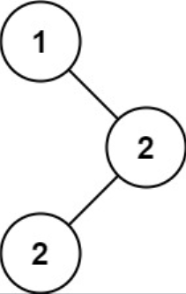

## I Problem
Given the `root` of a binary search tree (BST) with duplicates, return *all the [mode(s)][mode] (i.e., the most frequently occurred element) in it*.

If the tree has more than one mode, return them in **any order**.

Assume a BST is defined as follows:
- The left subtree of a node contains only nodes with keys **less than or equal to** the node's key.
- The right subtree of a node contains only nodes with keys **greater than or equal to** the node's key.
- Both the left and right subtrees must also be binary search trees.

**Example 1**

Input: root = [1, null, 2, 2]
Output: [2]

**Example 2**
Input: root = [0]
Output: [0]

**Constraints**
- The number of nodes in the tree is in the range `[1, 10⁴]`.
- `-10⁵ <= Node.val <= 10⁵`

**Follow up**
Could you do that without using any extra space? (Assume that the implicit stack space incurred due to recursion does not count).

**Related Topics**
- Tree
- Depth-First Search
- Binary Search Tree
- Binary Tree

[mode]: https://en.wikipedia.org/wiki/Mode_(statistics)

## II Solution
::: code-tabs
@tab Rust Node Definition
```rust
#[derive(Debug, PartialEq, Eq)]
pub struct TreeNode {
    pub val: i32,
    pub left: Option<Rc<RefCell<TreeNode>>>,
    pub right: Option<Rc<RefCell<TreeNode>>>,
}

impl TreeNode {
    #[inline]
    pub fn new(val: i32) -> Self {
        TreeNode {
            val,
            left: None,
            right: None,
        }
    }
}

///       val: The value of the node being traversed
///  curr_val: Value being processed
/// curr_freq: The frequency of occurrences of values being processed
///  max_freq: Maximum frequency of occurrence
///       res: result
fn update(val: i32, curr_val: &mut i32, curr_freq: &mut usize, max_freq: &mut usize, res: &mut Vec<i32>) {
    if val == *curr_val {
        *curr_freq += 1;
    } else {
        *curr_val = val;
        *curr_freq = 1;
    }
    if *curr_freq > *max_freq {
        res.clear();
        *max_freq = *curr_freq;
    }
    if *curr_freq == *max_freq {
        res.push(val);
    }
}
```

@tab Java Node Definition
```java
public class TreeNode {
    int val;
    TreeNode left;
    TreeNode right;

    TreeNode() {}
    TreeNode(int val) { this.val = val; }
    TreeNode(int val, TreeNode left, TreeNode right) {
        this.val = val;
        this.left = left;
        this.right = right;
    }
}

/**
 * val: The value of the node being traversed
 * params:
 *    0: Value being processed
 *    1: The frequency of occurrences of values being processed
 *    2: Maximum frequency of occurrence
 * res: result
 */
TriConsumer<Integer, int[], List<Integer>> update = (val, params, res) -> {
    if (val == params[0]) {
        params[1]++;
    } else {
        params[0] = val;
        params[1] = 1;
    }
    if (params[1] > params[2]) {
        res.clear();
        params[2] = params[1];
    }
    if (params[1] == params[2]) {
        res.add(val);
    }
};
```
:::

### Approach 1: Count Frequency With Hash Map
::: code-tabs
@tab Rust
```rust
pub fn find_mode(root: Option<Rc<RefCell<TreeNode>>>) -> Vec<i32> {
    //Self::use_hashmap_recur(root)
    Self::use_hashmap_iter(root)
}

///
/// Time complexity: O(n)
/// Space complexity: O(n)
///
fn use_hashmap_recur(root: Option<Rc<RefCell<TreeNode>>>) -> Vec<i32> {
    let mut map = HashMap::new();
    const PREORDER: fn(Option<Rc<RefCell<TreeNode>>>, &mut HashMap<i32, usize>) =
        |root, counter| {
            if let Some(curr) = root {
                let curr_val = curr.borrow().val;
                counter
                    .entry(curr_val)
                    .and_modify(|count| *count += 1)
                    .or_insert(1);
                PREORDER(curr.borrow_mut().left.take(), counter);
                PREORDER(curr.borrow_mut().right.take(), counter);
            }
        };

    PREORDER(root, &mut map);

    let max_freq = map.values().max().map(|v| *v).unwrap_or_default();
    map.into_iter()
        .filter_map(|(k, v)| {
            if v == max_freq {
                return Some(k);
            }
            None
        })
        .collect()
}

///
/// Time complexity: O(n)
/// Space complexity: O(n)
///
fn use_hashmap_iter(root: Option<Rc<RefCell<TreeNode>>>) -> Vec<i32> {
    let mut map = HashMap::new();

    if let Some(root) = root {
        let mut stack = vec![root];
        while let Some(curr) = stack.pop() {
            let curr_val = curr.borrow().val;
            map.entry(curr_val)
                .and_modify(|count| *count += 1)
                .or_insert(1);

            if let Some(right) = curr.borrow_mut().right.take() {
                stack.push(right);
            }
            if let Some(left) = curr.borrow_mut().left.take() {
                stack.push(left);
            }
        }
    }

    let max_freq = map.values().max().map(|v| *v).unwrap_or_default();
    map.into_iter()
        .filter_map(|(k, v)| {
            if v == max_freq {
                return Some(k);
            }
            None
        })
        .collect()
}
```

@tab Java
```java
public int[] findMode(TreeNode root) {
    //return this.useHashmapRecur(root);
    return this.useHashmapIter(root);
}

BiConsumer<TreeNode, Map<Integer, Integer>> preorder = (root, counter) -> {
    if (root == null) {
        return;
    }

    counter.put(root.val, counter.getOrDefault(root.val, 0) + 1);

    this.preorder.accept(root.left, counter);
    this.preorder.accept(root.right, counter);
};
/**
 * Time complexity: O(n)
 * Space complexity: O(n)
 */
int[] useHashmapRecur(TreeNode root) {
    Map<Integer, Integer> counter = new HashMap<>();

    this.preorder.accept(root, counter);

    Integer maxFreq = counter.values().stream().max(Comparator.naturalOrder()).orElse(0);
    return counter.entrySet().stream()
            .filter(e -> Objects.equals(e.getValue(), maxFreq))
            .map(Map.Entry::getKey).mapToInt(Integer::intValue)
            .toArray();
}


/**
 * Time complexity: O(n)
 * Space complexity: O(n)
 */
int[] useHashmapIter(TreeNode root) {
    Map<Integer, Integer> counter = new HashMap<>();

    if (root != null) {
        Deque<TreeNode> stack = new ArrayDeque<>() {{
            this.push(root);
        }};

        while (!stack.isEmpty()) {
            TreeNode curr = stack.pop();
            counter.put(curr.val, counter.getOrDefault(curr.val, 0) + 1);

            if (curr.right != null) {
                stack.push(curr.right);
            }
            if (curr.left != null) {
                stack.push(curr.left);
            }
        }
    }

    Integer maxFreq = counter.values().stream().max(Comparator.naturalOrder()).orElse(0);
    return counter.entrySet().stream()
            .filter(e -> Objects.equals(e.getValue(), maxFreq))
            .map(Map.Entry::getKey).mapToInt(Integer::intValue)
            .toArray();
}
```
:::

### Approach 2: In-order Traversal
::: code-tabs
@tab Rust
```rust
pub fn find_mode(root: Option<Rc<RefCell<TreeNode>>>) -> Vec<i32> {
    //Self::in_order_traversal_recur(root)
    Self::in_order_traversal_iter(root)
}

///
/// Time complexity: O(n)
/// Space complexity: O(n)
///
fn in_order_traversal_recur(root: Option<Rc<RefCell<TreeNode>>>) -> Vec<i32> {
    let mut res = vec![];
    let mut curr_val = i32::MIN;
    let mut curr_freq = 0;
    let mut max_freq = 0;
    const INORDER: fn(Option<Rc<RefCell<TreeNode>>>, &mut i32, &mut usize, &mut usize, &mut Vec<i32>) = 
        |root, curr_val, curr_freq, max_freq, res| {
            if let Some(curr) = root {
                INORDER(curr.borrow_mut().left.take(), curr_val, curr_freq, max_freq, res);
                
                let val = curr.borrow().val;
                Solution::update(val, curr_val, curr_freq, max_freq, res);
                
                INORDER(curr.borrow_mut().right.take(), curr_val, curr_freq, max_freq, res);
            }
    };

    INORDER(root, &mut curr_val, &mut curr_freq, &mut max_freq, &mut res);

    res
}

///
/// Time complexity: O(n)
/// Space complexity: O(n)
///
fn in_order_traversal_iter(root: Option<Rc<RefCell<TreeNode>>>) -> Vec<i32> {
    let mut res = vec![];

    if let Some(root) = root {
        let mut curr_val = i32::MIN;
        let mut curr_freq = 0;
        let mut max_freq = 0;
        let mut stack = vec![Ok(root)];

        while let Some(curr) = stack.pop() {
            match curr {
                Ok(node) => {
                    if let Some(right) = node.borrow_mut().right.take() {
                        stack.push(Ok(right));
                    }

                    stack.push(Err(node.borrow().val));

                    if let Some(left) = node.borrow_mut().left.take() {
                        stack.push(Ok(left));
                    }
                }
                Err(val) => {
                    Solution::update(val, &mut curr_val, &mut curr_freq, &mut max_freq, &mut res);
                }
            }
        }
    }

    res
}
```

@tab Java
```java
public int[] findMode(TreeNode root) {
    //return this.inorderTraversalRecur(root);
    return this.inorderTraversalIter(root);
}

@FunctionalInterface
interface TriConsumer<A, B, C> {
    void accept(A a, B b, C c);
}

TriConsumer<TreeNode, int[], List<Integer>> inorder = (root, params, res) -> {
    if (root == null) {
        return;
    }
    this.inorder.accept(root.left, params, res);

    this.update.accept(root.val, params, res);

    this.inorder.accept(root.right, params, res);
};

/**
 * Time complexity: O(n)
 * Space complexity: O(n)
 */
int[] inorderTraversalRecur(TreeNode root) {
    List<Integer> res = new ArrayList<>();
    int[] params = {Integer.MIN_VALUE, 0, 0};

    this.inorder.accept(root, params, res);

    return res.stream().mapToInt(Integer::intValue).toArray();
}

/**
 * Time complexity: O(n)
 * Space complexity: O(n)
 */
int[] inorderTraversalIter(TreeNode root) {
    List<Integer> res = new ArrayList<>();

    if (root != null) {
        int[] params = new int[]{Integer.MIN_VALUE, 0, 0};
        Deque<Object> stack = new ArrayDeque<>() {{
            this.push(root);
        }};

        while (!stack.isEmpty()) {
            Object obj = stack.pop();
            switch (obj) {
                case TreeNode curr -> {
                    if (curr.right != null) {
                        stack.push(curr.right);
                    }

                    stack.push(curr.val);

                    if (curr.left != null) {
                        stack.push(curr.left);
                    }
                }
                case Integer val -> {
                    this.update.accept(val, params, res);
                }
                default -> throw new IllegalStateException("Unexpected value: " + obj);
            }
        }
    }

    return res.stream().mapToInt(Integer::intValue).toArray();
}
```
:::

### Approach 3: Morris In-order Traversal
::: code-tabs
@tab Rust
```rust
pub fn find_mode(root: Option<Rc<RefCell<TreeNode>>>) -> Vec<i32> {
    //Self::morris_in_order_iter_1(root)
    Self::morris_in_order_iter_2(root)
}

///
/// Time complexity: O(n)
/// Space complexity: O(1)
///
fn morris_in_order_iter_1(mut root: Option<Rc<RefCell<TreeNode>>>) -> Vec<i32> {
    let mut res = vec![];
    let mut curr_val = i32::MIN;
    let mut curr_freq = 0;
    let mut max_freq = 0;
    let mut prev_node = None;

    while let Some(curr) = root.clone() {
        let val = curr.borrow().val;

        if let Some(left) = curr.borrow().left.clone() {
            prev_node = Some(left.clone());

            while let Some(prev1) = prev_node.clone() {
                if let Some(right) = prev1.borrow().right.clone() {
                    if right == curr.clone() {
                        break;
                    }
                    prev_node = Some(right);
                } else {
                    break;
                };
            }

            if let Some(prev2) = prev_node.take() {
                let mut prev2 = prev2.borrow_mut();

                if let Some(_) = prev2.right.take() {
                    Solution::update(val, &mut curr_val, &mut curr_freq, &mut max_freq, &mut res);
                    root = curr.borrow().right.clone();
                } else {
                    prev2.right = Some(curr.clone());
                    root = Some(left);
                }
            }
        } else {
            Solution::update(val, &mut curr_val, &mut curr_freq, &mut max_freq, &mut res);
            root = curr.borrow().right.clone();
        };
    }

    res
}

///
/// Time complexity: O(n)
/// Space complexity: O(1)
///
fn morris_in_order_iter_2(mut root: Option<Rc<RefCell<TreeNode>>>) -> Vec<i32> {
    let mut res = vec![];
    let mut curr_val = i32::MIN;
    let mut curr_freq = 0;
    let mut max_freq = 0;
    let mut prev_node = None;

    while let Some(curr) = root.clone() {
        let left = curr.borrow().left.clone();
        let val = curr.borrow().val;

        if left.is_none() {
            Solution::update(val, &mut curr_val, &mut curr_freq, &mut max_freq, &mut res);
            root = curr.borrow().right.clone();
            continue;
        }

        prev_node = left.clone();
        while let Some(prev) = prev_node.clone() {
            if let Some(right) = prev.borrow().right.clone() {
                if right == curr {
                    break;
                }
                prev_node = Some(right);
            } else {
                break;
            }
        }

        if let Some(prev) = prev_node {
            let mut prev = prev.borrow_mut();

            if let Some(_) = prev.right.take() {
                Solution::update(val, &mut curr_val, &mut curr_freq, &mut max_freq, &mut res);
                root = curr.borrow().right.clone();
            } else {
                prev.right = Some(curr);
                root = left;
            }
        }
    }

    res
}
```

@tab Java
```java
public int[] findMode(TreeNode root) {
    //return this.morrisInorderIter1(root);
    return this.morrisInorderIter2(root);
}

/**
 * Time complexity: O(n)
 * Space complexity: O(1)
 */
int[] morrisInorderIter1(TreeNode root) {
    List<Integer> res = new ArrayList<>();
    int[] params = new int[]{Integer.MIN_VALUE, 0, 0};
    TreeNode prev = null;

    while (root != null) {
        if (root.left != null) {
            prev = root.left;

            while (prev.right != null && prev.right != root) {
                prev = prev.right;
            }

            if (prev.right == null) {
                prev.right = root;
                root = root.left;
            } else {
                prev.right = null;
                this.update.accept(root.val, params, res);
                root = root.right;
            }
        } else {
            this.update.accept(root.val, params, res);
            root = root.right;
        }
    }

    return res.stream().mapToInt(Integer::intValue).toArray();
}

/**
 * Time complexity: O(n)
 * Space complexity: O(1)
 */
int[] morrisInorderIter2(TreeNode root) {
    List<Integer> res = new ArrayList<>();
    int[] params = new int[]{Integer.MIN_VALUE, 0, 0};
    TreeNode prev = null;

    while (root != null) {
        if (root.left == null) {
            this.update.accept(root.val, params, res);
            root = root.right;
            continue;
        }

        prev = root.left;
        while (prev.right != null && prev.right != root) {
            prev = prev.right;
        }

        if (prev.right == null) {
            prev.right = root;
            root = root.left;
        } else {
            prev.right = null;
            this.update.accept(root.val, params, res);
            root = root.right;
        }
    }

    return res.stream().mapToInt(Integer::intValue).toArray();
}
```
:::