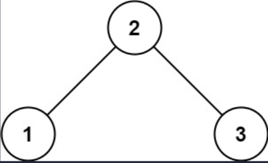
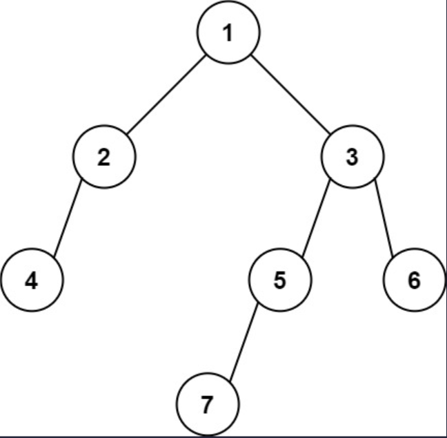

## I Problem
Given the `root` of a binary tree, return the leftmost value in the last row of the tree.

**Example 1**

Input: root = [2, 1, 3]
Output: 1

**Example 2**

Input: root = [1, 2, 3, 4, null, 5, 6, null, null, 7]
Output: 7

**Constraints**
- The number of nodes in the tree is in the range `[1, 10⁴]`.
- `-2³¹ <= Node.val <= 2³¹ - 1`

**Related Topics**
- Tree
- Depth-First Search
- Breadth-First Search
- Binary Tree


## II Solution
::: code-tabs
@tab Rust Node Definition
```rust
#[derive(Debug, PartialEq, Eq)]
pub struct TreeNode {
    pub val: i32,
    pub left: Option<Rc<RefCell<TreeNode>>>,
    pub right: Option<Rc<RefCell<TreeNode>>>,
}

impl TreeNode {
    #[inline]
    pub fn new(val: i32) -> Self {
        TreeNode {
            val,
            left: None,
            right: None,
        }
    }
}
```

@tab Java Node Definition
```java
public class TreeNode {
    int val;
    TreeNode left;
    TreeNode right;

    TreeNode() {}
    TreeNode(int val) { this.val = val; }
    TreeNode(int val, TreeNode left, TreeNode right) {
        this.val = val;
        this.left = left;
        this.right = right;
    }
}
```
:::

### Approach 1: Depth-First Search
::: code-tabs
@tab Rust
```rust
pub fn find_bottom_left_value(root: Option<Rc<RefCell<TreeNode>>>) -> i32 {
    //Self::dfs_recur(root)
    Self::dfs_iter(root)
}

///
/// DFS - Recursion(Pre-Order)
///
fn dfs_recur(root: Option<Rc<RefCell<TreeNode>>>) -> i32 {
    let mut val = 0;
    let mut val_level = i32::MIN;
    const RECUR: fn(Option<Rc<RefCell<TreeNode>>>, i32, &mut i32, &mut i32) =
        |root, level, val, val_level| {
            if let Some(curr) = root {
                let left = curr.borrow_mut().left.take();
                let right = curr.borrow_mut().right.take();

                if left.is_none() && right.is_none() && level > *val_level {
                    *val = curr.borrow().val;
                    *val_level = level;
                }

                RECUR(left, level + 1, val, val_level);
                RECUR(right, level + 1, val, val_level);
            }
        };

    RECUR(root, 0, &mut val, &mut val_level);

    val
}

///
/// DFS - Iteration(Pre-Order)
///
fn dfs_iter(root: Option<Rc<RefCell<TreeNode>>>) -> i32 {
    let mut val = 0;
    let mut val_level = i32::MIN;

    if let Some(root) = root {
        let mut stack = vec![(root, 0)];

        while let Some((curr, level)) = stack.pop() {
            let left = curr.borrow_mut().left.take();
            let right = curr.borrow_mut().right.take();

            if left.is_none() && right.is_none() && level > val_level {
                val = curr.borrow().val;
                val_level = level;
            }

            if let Some(right) = right {
                stack.push((right, level + 1));
            }
            if let Some(left) = left {
                stack.push((left, level + 1));
            }
        }
    }

    val
}
```

@tab Java
```java
public int findBottomLeftValue(TreeNode root) {
    //return this.dfsRecur(root);
    return this.dfsIter(root);
}

@FunctionalInterface
interface TriConsumer<X, Y, Z> {
    void accept(X x, Y y, Z z);
}

TriConsumer<TreeNode, Integer, int[]> recur = (root, level, val) -> {
    if (root == null) {
        return;
    }
    if (root.left == null && root.right == null && level > val[1]) {
        val[0] = root.val;
        val[1] = level;
    }
    this.recur.accept(root.left, level + 1, val);
    this.recur.accept(root.right, level + 1, val);
};

/**
 * DFS - Recursion(Pre-Order)
 */
int dfsRecur(TreeNode root) {
    int[] val = new int[] {0, Integer.MIN_VALUE};
    this.recur.accept(root, 0, val);
    return val[0];
}

/**
 * DFS - Iteration(Pre-Order)
 */
int dfsIter(TreeNode root) {
    int val = 0;
    int val_level = Integer.MIN_VALUE;
    Deque<Object[]> stack = new ArrayDeque<>() {{
        this.push(new Object[]{root, 0});
    }};

    while (!stack.isEmpty()) {
        Object[] objs = stack.pop();
        TreeNode curr = (TreeNode) objs[0];
        int level = (int) objs[1];

        if (curr.left == null && curr.right == null && level > val_level) {
            val = curr.val;
            val_level = level;
        }

        if (curr.right != null) {
            stack.push(new Object[]{curr.right, level + 1});
        }
        if (curr.left != null) {
            stack.push(new Object[]{curr.left, level + 1});
        }
    }

    return val;
}
```
:::

### Approach 2: Breadth-First Search
::: code-tabs
@tab Rust
```rust
pub fn find_bottom_left_value(root: Option<Rc<RefCell<TreeNode>>>) -> i32 {
    //Self::bfs_iter_1(root)
    Self::bfs_iter_2(root)
}

///
/// BFS - Iteration(Level Order)
///
fn bfs_iter_1(root: Option<Rc<RefCell<TreeNode>>>) -> i32 {
    let mut val = 0;

    if let Some(root) = root {
        let mut queue = VecDeque::from([root]);

        while !queue.is_empty() {
            let level_len = queue.len();

            for i in 0..level_len {
                if let Some(curr) = queue.pop_front() {
                    if i == 0 {
                        val = curr.borrow().val;
                    }
                    if let Some(left) = curr.borrow_mut().left.take() {
                        queue.push_back(left);
                    }
                    if let Some(right) = curr.borrow_mut().right.take() {
                        queue.push_back(right);
                    }
                }
            }
        }
    }

    val
}

///
/// BFS - Iteration(Level Order)
///
fn bfs_iter_2(root: Option<Rc<RefCell<TreeNode>>>) -> i32 {
    let mut val = 0;

    if let Some(root) = root {
        let mut queue = VecDeque::from([(root, 0)]);
        let mut prev_level = -1;

        while let Some((curr, level)) = queue.pop_front() {
            if prev_level != level {
                val = curr.borrow().val;
            }
            prev_level = level;
            
            if let Some(left) = curr.borrow_mut().left.take() {
                queue.push_back((left, level + 1));
            }
            if let Some(right) = curr.borrow_mut().right.take() {
                queue.push_back((right, level + 1));
            }
        }
    }

    val
}
```

@tab Java
```java
public int findBottomLeftValue(TreeNode root) {
    //return this.bfsIter1(root);
    return this.bfsIter2(root);
}

/**
 * BFS - Iteration(Level Order)
 */
int bfsIter1(TreeNode root) {
    int val = 0;
    Deque<TreeNode> queue = new ArrayDeque<>() {{
        this.addLast(root);
    }};

    while (!queue.isEmpty()) {
        int levelSize = queue.size();

        for (int i = 0; i < levelSize; i++) {
            TreeNode curr = queue.removeFirst();
            if (i == 0) {
                val = curr.val;
            }
            if (curr.left != null) {
                queue.addLast(curr.left);
            }
            if (curr.right != null) {
                queue.addLast(curr.right);
            }
        }
    }

    return val;
}

/**
 * BFS - Iteration(Level Order)
 */
int bfsIter2(TreeNode root) {
    int val = 0;
    int prevLevel = -1;
    Deque<Object[]> queue = new ArrayDeque<>() {{
        this.addLast(new Object[]{root, 0});
    }};

    while (!queue.isEmpty()) {
        Object[] objs = queue.removeFirst();
        TreeNode curr = (TreeNode) objs[0];
        int level = (int) objs[1];

        if (prevLevel != level) {
            val = curr.val;
        }
        prevLevel = level;

        if (curr.left != null) {
            queue.addLast(new Object[]{curr.left, level + 1});
        }
        if (curr.right != null) {
            queue.addLast(new Object[]{curr.right, level + 1});
        }
    }

    return val;
}
```
:::