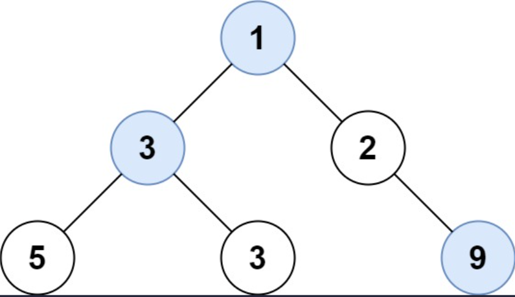

## I Problem
Given the `root` of a binary tree, return *an array of the largest value in each row* of the tree (0-indexed).

**Example 1**

Input: root = [1, 3, 2, 5, 3, null, 9]
Output: [1, 3, 9]

**Example 2**
Input: root = [1, 2, 3]
Output: [1, 3]

**Constraints**
- The number of nodes in the tree will be in the range `[0, 10⁴]`
- `-2³¹ <= Node.val <= 2³¹ - 1`

**Related Topics**
- Tree
- Depth-First Search
- Breadth-First Search
- Binary Tree


## II Solution
::: code-tabs
@tab Rust Node Definition
```rust
#[derive(Debug, PartialEq, Eq)]
pub struct TreeNode {
    pub val: i32,
    pub left: Option<Rc<RefCell<TreeNode>>>,
    pub right: Option<Rc<RefCell<TreeNode>>>,
}

impl TreeNode {
    #[inline]
    pub fn new(val: i32) -> Self {
        TreeNode {
            val,
            left: None,
            right: None,
        }
    }
}
```

@tab Java Node Definition
```java
public class TreeNode {
    int val;
    TreeNode left;
    TreeNode right;

    TreeNode() {}
    TreeNode(int val) { this.val = val; }
    TreeNode(int val, TreeNode left, TreeNode right) {
        this.val = val;
        this.left = left;
        this.right = right;
    }
}
```
:::

### Approach 1: Depth-First Search
::: code-tabs
@tab Rust
```rust
pub fn largest_values(root: Option<Rc<RefCell<TreeNode>>>) -> Vec<i32> {
    //Self::dfs_recur_pre_order(root)
    //Self::dfs_iter_pre_order_1(root)
    //Self::dfs_iter_pre_order_2(root)
    Self::dfs_iter_pre_order_3(root)
}

///
/// DFS - Recursion(Pre-Order)
///
fn dfs_recur_pre_order(root: Option<Rc<RefCell<TreeNode>>>) -> Vec<i32> {
    let mut res = vec![];
    const PRE_ORDER: fn(Option<Rc<RefCell<TreeNode>>>, usize, &mut Vec<i32>) =
        |root, level, res| {
            if let Some(curr) = root {
                if level == res.len() {
                    res.push(i32::MIN);
                }
                let curr_val = curr.borrow().val;
                if res[level] < curr_val {
                    res[level] = curr_val;
                }
                PRE_ORDER(curr.borrow_mut().left.take(), level + 1, res);
                PRE_ORDER(curr.borrow_mut().right.take(), level + 1, res);
            }
        };

    PRE_ORDER(root, 0, &mut res);

    res
}

///
/// DFS - Iteration(Pre-Order)
///
fn dfs_iter_pre_order_1(root: Option<Rc<RefCell<TreeNode>>>) -> Vec<i32> {
    let mut res = vec![];
    let mut root = (root, 0);
    let mut stack = vec![];

    while root.0.is_some() || !stack.is_empty() {
        while let Some(curr) = root.0 {
            let level = root.1;
            if level == res.len() {
                res.push(i32::MIN);
            }
            let curr_val = curr.borrow().val;
            if res[level] < curr_val {
                res[level] = curr_val;
            }

            root = (curr.borrow_mut().left.take(), level + 1);
            stack.push((curr, level));
        }
        if let Some((curr, level)) = stack.pop() {
            root = (curr.borrow_mut().right.take(), level + 1);
        }
    }

    res
}

///
/// DFS - Iteration(Pre-Order)
///
fn dfs_iter_pre_order_2(root: Option<Rc<RefCell<TreeNode>>>) -> Vec<i32> {
    let mut res = vec![];
    let mut root = (root, 0);
    let mut stack = vec![];

    while root.0.is_some() || !stack.is_empty() {
        if let Some(curr) = root.0 {
            let level = root.1;
            if level == res.len() {
                res.push(i32::MIN);
            }
            let curr_val = curr.borrow().val;
            if res[level] < curr_val {
                res[level] = curr_val;
            }

            root = (curr.borrow_mut().left.take(), level + 1);
            stack.push((curr, level));
        } else {
            if let Some((curr, level)) = stack.pop() {
                root = (curr.borrow_mut().right.take(), level + 1);
            }
        }
    }

    res
}

///
/// DFS - Iteration(Pre-Order)
///
fn dfs_iter_pre_order_3(root: Option<Rc<RefCell<TreeNode>>>) -> Vec<i32> {
    let mut res = vec![];

    if let Some(root) = root {
        let mut stack = vec![(Ok(root), 0)];

        while let Some((curr, level)) = stack.pop() {
            match curr {
                Ok(node) => {
                    if let Some(right) = node.borrow_mut().right.take() {
                        stack.push((Ok(right), level + 1));
                    }
                    if let Some(left) = node.borrow_mut().left.take() {
                        stack.push((Ok(left), level + 1));
                    }
                    stack.push((Err(node.borrow().val), level));
                }
                Err(curr_val) => {
                    if level == res.len() {
                        res.push(i32::MIN);
                    }
                    if res[level] < curr_val {
                        res[level] = curr_val;
                    }
                }
            }
        }
    }

    res
}

```

@tab Java
```java
public List<Integer> largestValues(TreeNode root) {
    //return this.dfsRecurPreOrder(root);
    return this.dfsIterPreOrder3(root);
}

@FunctionalInterface
interface TriConsumer<P1, P2, P3> {
    void accept(P1 p1, P2 p2, P3 p3);
}

TriConsumer<TreeNode, Integer, List<Integer>> preOrder = (root, level, res) -> {
    if (root == null) {
        return;
    }
    if (level == res.size()) {
        res.add(Integer.MIN_VALUE);
    }
    int currVal = root.val;
    if (res.get(level) < currVal) {
        res.set(level, currVal);
    }
    if (root.left != null) {
        this.preOrder.accept(root.left, level + 1, res);
    }
    if (root.right != null) {
        this.preOrder.accept(root.right, level + 1, res);
    }
};

/**
 * DFS - Recursion(Pre-Order)
 */
List<Integer> dfsRecurPreOrder(TreeNode root) {
    List<Integer> res = new ArrayList<>();
    this.preOrder.accept(root, 0, res);
    return res;
}

/**
 * DFS - Iteration(Pre-Order)
 */
List<Integer> dfsIterPreOrder3(TreeNode root) {
    List<Integer> res = new ArrayList<>();

    if (root != null) {
        Deque<Object[]> stack = new ArrayDeque<>() {{
            this.push(new Object[]{root, 0});
        }};
        
        while (!stack.isEmpty()) {
            Object[] pop = stack.pop();
            Object curr = pop[0];
            int level = (int) pop[1];
            
            switch (curr) {
                case TreeNode node -> {
                    if (node.right != null) {
                        stack.push(new Object[]{node.right, level + 1});
                    }
                    if (node.left != null) {
                        stack.push(new Object[]{node.left, level + 1});
                    }
                    stack.push(new Object[]{node.val, level});
                }
                case Integer currVal -> {
                    if (level == res.size()) {
                        res.add(Integer.MIN_VALUE);
                    }
                    if (res.get(level) < currVal) {
                        res.set(level, currVal);
                    }
                }
                default -> throw new IllegalStateException("Unexpected value: " + curr);
            }
        }
    }

    return res;
}
```
:::

### Approach 2: Breadth-First Search
::: code-tabs
@tab Rust
```rust
pub fn largest_values(root: Option<Rc<RefCell<TreeNode>>>) -> Vec<i32> {
    //Self::bfs_iter_1(root)
    Self::bfs_iter_2(root)
}

///
/// BFS - Iteration(Level Order)
///
fn bfs_iter_1(root: Option<Rc<RefCell<TreeNode>>>) -> Vec<i32> {
    let mut res = vec![];

    if let Some(root) = root {
        let mut queue = VecDeque::from([(root, 0)]);

        while let Some((curr, level)) = queue.pop_front() {
            if level == res.len() {
                res.push(i32::MIN);
            }
            let curr_val = curr.borrow().val;
            if res[level] < curr_val {
                res[level] = curr_val;
            }
            if let Some(left) = curr.borrow_mut().left.take() {
                queue.push_back((left, level + 1));
            }
            if let Some(right) = curr.borrow_mut().right.take() {
                queue.push_back((right, level + 1));
            }
        }
    }

    res
}

///
/// BFS - Iteration(Level Order)
///
fn bfs_iter_2(root: Option<Rc<RefCell<TreeNode>>>) -> Vec<i32> {
    let mut res = vec![];

    if let Some(root) = root {
        let mut queue = VecDeque::from([root]);

        while !queue.is_empty() {
            let level_len = queue.len();
            let mut level_largest = i32::MIN;
            for _ in 0..level_len {
                if let Some(curr) = queue.pop_front() {
                    let curr_val = curr.borrow().val;
                    if curr_val > level_largest {
                        level_largest = curr_val;
                    }
                    if let Some(left) = curr.borrow_mut().left.take() {
                        queue.push_back(left);
                    }
                    if let Some(right) = curr.borrow_mut().right.take() {
                        queue.push_back(right);
                    }
                }
            }
            res.push(level_largest);
        }
    }

    res
}
```

@tab Java
```java
public List<Integer> largestValues(TreeNode root) {
    return this.bfsIter2(root);
}

/**
 * BFS - Iteration(Level Order)
 */
List<Integer> bfsIter2(TreeNode root) {
    List<Integer> res = new ArrayList<>();

    if (root != null) {
        Deque<TreeNode> queue = new ArrayDeque<>() {{
            this.addLast(root);
        }};

        while (!queue.isEmpty()) {
            int levelSize = queue.size();
            int levelLargest = Integer.MIN_VALUE;
            for (int i = 0; i < levelSize; i++) {
                TreeNode curr = queue.removeFirst();
                if (curr.val > levelLargest) {
                    levelLargest = curr.val;
                }
                if (curr.left != null) {
                    queue.addLast(curr.left);
                }
                if (curr.right != null) {
                    queue.addLast(curr.right);
                }
            }
            res.add(levelLargest);
        }
    }

    return res;
}
```
:::