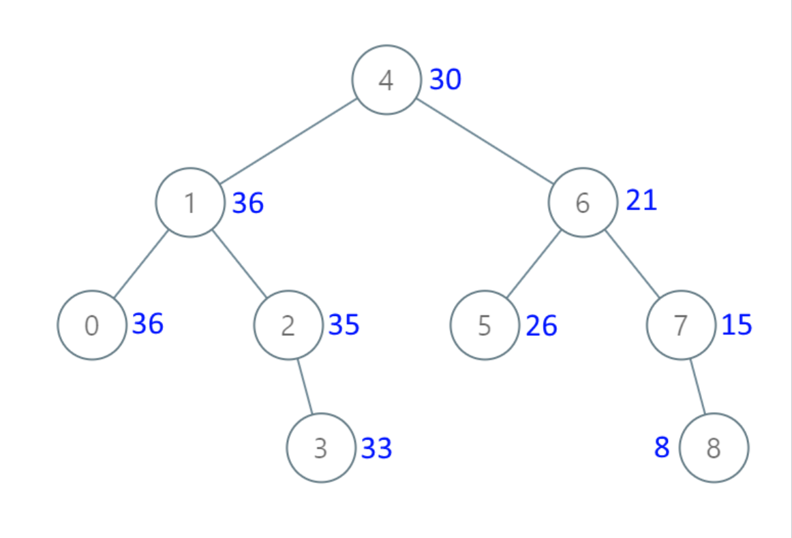

## I Problem
Given the `root` of a Binary Search Tree (BST), convert it to a Greater Tree such that every key of the original BST is changed to the original key plus the sum of all keys greater than the original key in BST.

As a reminder, a *binary search tree* is a tree that satisfies these constraints:
- The left subtree of a node contains only nodes with keys **less than** the node's key.
- The right subtree of a node contains only nodes with keys **greater than** the node's key.
- Both the left and right subtrees must also be binary search trees.


**Example 1**

Input: root = [4, 1, 6, 0, 2, 5, 7, null, null, null, 3, null, null, null, 8]
Output: [30, 36, 21, 36, 35, 26, 15, null, null, null, 33, null, null, null, 8]

**Example 2**
Input: root = [0, null, 1]
Output: [1, null, 1]

**Constraints**
- The number of nodes in the tree is in the range `[0, 10⁴]`.
- `10⁴ <= Node.val <= 10⁴`
- All the values in the tree are **unique**.
- `root` is guaranteed to be a valid binary search tree.

**NOTE**: This question is the same as [1038: Binary Search Tree to Greater Sum Tree][1038].

**Related Topics**
- Tree
- Depth-First Search
- Binary Search Tree
- Binary Tree


[1038]: https://leetcode.com/problems/binary-search-tree-to-greater-sum-tree/


## II Solution
::: code-tabs
@tab Rust Node Definition
```rust
#[derive(Debug, PartialEq, Eq)]
pub struct TreeNode {
    pub val: i32,
    pub left: Option<Rc<RefCell<TreeNode>>>,
    pub right: Option<Rc<RefCell<TreeNode>>>,
}

impl TreeNode {
    #[inline]
    pub fn new(val: i32) -> Self {
        TreeNode {
            val,
            left: None,
            right: None,
        }
    }
}
```

@tab Java Node Definition
```java
public class TreeNode {
    int val;
    TreeNode left;
    TreeNode right;

    TreeNode() {}
    TreeNode(int val) { this.val = val; }
    TreeNode(int val, TreeNode left, TreeNode right) {
        this.val = val;
        this.left = left;
        this.right = right;
    }
}
```
:::

### Approach 1: Mirror In-order Traversal
::: code-tabs
@tab Rust
```rust
pub fn convert_bst(root: Option<Rc<RefCell<TreeNode>>>) -> Option<Rc<RefCell<TreeNode>>> {
    //Self::mirror_in_order_recur_1(root)
    //Self::mirror_in_order_iter_1(root)
    Self::mirror_in_order_recur_2(root)
}

fn mirror_in_order_recur_1(root: Option<Rc<RefCell<TreeNode>>>) -> Option<Rc<RefCell<TreeNode>>> {
    let mut sum = 0;
    const TRAVERSAL: fn(Option<Rc<RefCell<TreeNode>>>, &mut i32) = |root, sum| {
        if let Some(curr) = root {
            TRAVERSAL(curr.borrow().right.clone(), sum);

            curr.borrow_mut().val += *sum;
            *sum = curr.borrow().val;

            TRAVERSAL(curr.borrow().left.clone(), sum);
        }
    };

    TRAVERSAL(root.clone(), &mut sum);

    root
}

fn mirror_in_order_iter_1(root: Option<Rc<RefCell<TreeNode>>>) -> Option<Rc<RefCell<TreeNode>>> {
    if let Some(root) = root.clone() {
        let mut sum = 0;
        let mut stack = vec![Ok(root)];

        while let Some(curr) = stack.pop() {
            match curr {
                Ok(node) => {
                    if let Some(left) = node.borrow().left.clone() {
                        stack.push(Ok(left));
                    }

                    stack.push(Err(node.clone()));

                    if let Some(right) = node.borrow().right.clone() {
                        stack.push(Ok(right));
                    }
                }
                Err(target) => {
                    target.borrow_mut().val += sum;
                    sum = target.borrow().val;
                }
            }
        }
    }

    root
}

fn mirror_in_order_recur_2(root: Option<Rc<RefCell<TreeNode>>>) -> Option<Rc<RefCell<TreeNode>>> {
    const TRAVERSAL: fn(Option<Rc<RefCell<TreeNode>>>, i32) -> i32 = |root, sum| match root {
        None => sum,
        Some(curr) => {
            let r_sum = TRAVERSAL(curr.borrow().right.clone(), sum);

            curr.borrow_mut().val += r_sum;

            TRAVERSAL(curr.borrow().left.clone(), curr.borrow().val)
        }
    };

    TRAVERSAL(root.clone(), 0);

    root
}
```

@tab Java
```java
public TreeNode convertBST(TreeNode root) {
    //return mirrorInorderRecur1(root);
    //return mirrorInorderIter1(root);
    return mirrorInorderRecur2(root);
}

BiConsumer<TreeNode, int[]> traversal1 = (root, sum) -> {
    if (root == null) {
        return;
    }
    this.traversal1.accept(root.right, sum);

    root.val += sum[0];
    sum[0] = root.val;

    this.traversal1.accept(root.left, sum);
};

TreeNode mirrorInorderRecur1(TreeNode root) {
    int[] sum = new int[]{0};
    this.traversal1.accept(root, sum);
    return root;
}

TreeNode mirrorInorderIter1(TreeNode root) {
    if (root != null) {
        int sum = 0;
        Deque<Object[]> stack = new ArrayDeque<>() {{
            this.push(new Object[]{false, root});
        }};

        while (!stack.isEmpty()) {
            Object[] objs = stack.pop();
            boolean isTarget = (boolean) objs[0];
            TreeNode curr = (TreeNode) objs[1];

            if (isTarget) {
                curr.val += sum;
                sum = curr.val;
            } else {
                if (curr.left != null) {
                    stack.push(new Object[]{false, curr.left});
                }

                stack.push(new Object[]{true, curr});

                if (curr.right != null) {
                    stack.push(new Object[]{false, curr.right});
                }
            }
        }
    }

    return root;
}

BiFunction<TreeNode, Integer, Integer> traversal2 = (root, sum) -> {
    if (root == null) {
        return sum;
    }
    Integer r_sum = this.traversal2.apply(root.right, sum);

    root.val += r_sum;

    return this.traversal2.apply(root.left, root.val);
};

TreeNode mirrorInorderRecur2(TreeNode root) {
    this.traversal2.apply(root, 0);

    return root;
}
```
:::

### Approach 2: Morris Mirror In-order Traversal
::: code-tabs
@tab Rust
```rust
pub fn convert_bst(root: Option<Rc<RefCell<TreeNode>>>) -> Option<Rc<RefCell<TreeNode>>> {
    let mut root_node = root.clone();
    let mut sum = 0;

    while let Some(curr) = root_node {
        let right = curr.borrow().right.clone();

        if right.is_some() {
            let mut prev_node = right.clone();

            while let Some(ref prev) = prev_node {
                let left = prev.borrow().left.clone();
                if left.is_none() || left == Some(curr.clone()) {
                    break;
                } else {
                    prev_node = left;
                }
            }

            match prev_node {
                None => break, // this is a mark code
                Some(prev) => {
                    let mut prev = prev.borrow_mut();

                    if let Some(_) = prev.left.take() {
                        curr.borrow_mut().val += sum;
                        sum = curr.borrow().val;
                        root_node = curr.borrow().left.clone();
                    } else {
                        prev.left = Some(curr.clone());
                        root_node = right;
                    }
                }
            }
        } else {
            curr.borrow_mut().val += sum;
            sum = curr.borrow().val;
            root_node = curr.borrow().left.clone();
        };
    }

    root
}
```

@tab Java
```java
public TreeNode convertBST(TreeNode root) {
    TreeNode curr = root;
    int sum = 0;

    while (curr != null) {
        if (curr.right != null) {
            TreeNode prev = curr.right;

            while (prev.left != null && prev.left != curr) {
                prev = prev.left;
            }
            
            if (prev.left == null) {
                prev.left = curr;
                curr = curr.right;
            } else {
                prev.left = null;
                curr.val += sum;
                sum = curr.val;
                curr = curr.left;
            }
        } else {
            curr.val += sum;
            sum = curr.val;
            curr = curr.left;
        }
    }

    return root;
}
```
:::