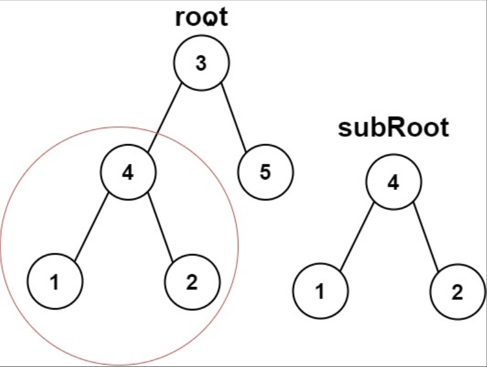
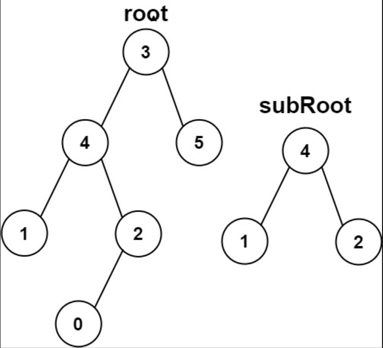

## I Problem
Given the roots of two binary trees `root` and `subRoot`, return `true` if there is a subtree of `root` with the same structure and node values of `subRoot` and `false` otherwise.

A subtree of a binary `tree` tree is a tree that consists of a node in `tree` and all of this node's descendants. The tree `tree` could also be considered as a subtree of itself.

**Example 1**

Input: root = [3, 4, 5, 1, 2], subRoot = [4, 1, 2]
Output: true

**Example 2**

Input: root = [3, 4, 5, 1, 2, null, null, null, null, 0], subRoot = [4, 1, 2]
Output: false

**Constraints**
- The number of nodes in the `root` tree is in the range `[1, 2000]`.
- The number of nodes in the `subRoot` tree is in the range `[1, 1000]`.
- `-10⁴ <= root.val <= 10⁴`
- -`10⁴ <= subRoot.val <= 10⁴`

**Related Topics**
- Tree
- Depth-First Search
- Binary Tree
- String Matching
- Hash Function


## II Solution
::: code-tabs
@tab Rust Node Definition
```rust
#[derive(Debug, PartialEq, Eq)]
pub struct TreeNode {
    pub val: i32,
    pub left: Option<Rc<RefCell<TreeNode>>>,
    pub right: Option<Rc<RefCell<TreeNode>>>,
}

impl TreeNode {
    #[inline]
    pub fn new(val: i32) -> Self {
        TreeNode {
            val,
            left: None,
            right: None,
        }
    }
}
```

@tab Java Node Definition
```java
public class TreeNode {
    int val;
    TreeNode left;
    TreeNode right;

    TreeNode() {}
    TreeNode(int val) { this.val = val; }
    TreeNode(int val, TreeNode left, TreeNode right) {
        this.val = val;
        this.left = left;
        this.right = right;
    }
}
```
:::

### Approach 1: DFS for Matching
::: code-tabs
@tab Rust
```rust
pub fn is_subtree(root: Option<Rc<RefCell<TreeNode>>>, sub_root: Option<Rc<RefCell<TreeNode>>>) -> bool {
    Self::dfs_recur_match(root, sub_root)
}

///
/// Time Complexity: O(|r| * |s|)
/// Space Complexity: O(max(dr, ds))
///
fn dfs_recur_match(
    root: Option<Rc<RefCell<TreeNode>>>,
    sub_root: Option<Rc<RefCell<TreeNode>>>,
) -> bool {
    const CHECK: fn(Option<Rc<RefCell<TreeNode>>>, Option<Rc<RefCell<TreeNode>>>) -> bool =
        |root, sub_root| match (root, sub_root) {
            (None, None) => true,
            (Some(root), Some(sub_root)) => {
                if root.borrow().val != sub_root.borrow().val {
                    return false;
                }

                CHECK(root.borrow().left.clone(), sub_root.borrow().left.clone())
                    && CHECK(root.borrow().right.clone(), sub_root.borrow().right.clone())
            }
            _ => false,
        };

    const DFS: fn(Option<Rc<RefCell<TreeNode>>>, Option<Rc<RefCell<TreeNode>>>) -> bool =
        |root, sub_root| match root {
            None => false,
            Some(root) => {
                let left = root.borrow().left.clone();
                let right = root.borrow().right.clone();

                CHECK(Some(root), sub_root.clone())
                    || DFS(left, sub_root.clone())
                    || DFS(right, sub_root)
            }
        };

    DFS(root, sub_root)
}
```

@tab Java
```java
public boolean isSubtree(TreeNode root, TreeNode subRoot) {
    return this.dfsRecurMatch(root, subRoot);
}

BiFunction<TreeNode, TreeNode, Boolean> check = (root, subRoot) -> {
    if (root == null && subRoot == null) {
        return true;

    } else if (root != null && subRoot != null) {
        if (root.val != subRoot.val) {
            return false;
        }

        return this.check.apply(root.left, subRoot.left)
                && this.check.apply(root.right, subRoot.right);

    } else {
        return false;
    }
};

BiFunction<TreeNode, TreeNode, Boolean> dfs = (root, subRoot) -> {
    if (root == null) {
        return false;
    }

    return this.check.apply(root, subRoot)
            || this.dfs.apply(root.left, subRoot)
            || this.dfs.apply(root.right, subRoot);
};

/**
 * Time Complexity：O(|r| * |s|)
 * Space Complexity：O(max(dr, ds))
 */
boolean dfsRecurMatch(TreeNode root, TreeNode subRoot) {
    return this.dfs.apply(root, subRoot);
}
```
:::

### Approach 2: DFS for KMP Matching
::: code-tabs
@tab Rust
```rust
pub fn is_subtree(root: Option<Rc<RefCell<TreeNode>>>, sub_root: Option<Rc<RefCell<TreeNode>>>) -> bool {
    Self::dfs_sequence_match(root, sub_root)
}

///
/// Time Complexity: O(|r| + |s|)
/// Space Complexity: O(|r| + |s|)
///
fn dfs_sequence_match(
    root: Option<Rc<RefCell<TreeNode>>>,
    sub_root: Option<Rc<RefCell<TreeNode>>>,
) -> bool {
    const GET_MAX_ELEMENT: fn(&Option<Rc<RefCell<TreeNode>>>) -> i32 = |root| match root {
        None => i32::MIN,
        Some(curr) => {
            let max_child = std::cmp::max(
                GET_MAX_ELEMENT(&curr.borrow().left),
                GET_MAX_ELEMENT(&curr.borrow().right),
            );

            std::cmp::max(max_child, curr.borrow().val)
        }
    };

    let max_elem = std::cmp::max(GET_MAX_ELEMENT(&root), GET_MAX_ELEMENT(&sub_root));
    let (l_null, r_null) = (max_elem + 1, max_elem + 2);

    let get_dfs_order = |root| {
        let mut vals = vec![];

        const GET_DFS_ORDER: fn(Option<Rc<RefCell<TreeNode>>>, &mut Vec<i32>, i32, i32) =
            |root, vals, l_null, r_null| {
                if let Some(curr) = root {
                    vals.push(curr.borrow().val);
                    let left = curr.borrow_mut().left.take();
                    let right = curr.borrow_mut().right.take();

                    if left.is_some() {
                        GET_DFS_ORDER(left, vals, l_null, r_null);
                    } else {
                        vals.push(l_null);
                    }

                    if right.is_some() {
                        GET_DFS_ORDER(right, vals, l_null, r_null);
                    } else {
                        vals.push(r_null);
                    }
                }
            };

        GET_DFS_ORDER(root, &mut vals, l_null, r_null);

        vals
    };
    let root_vals = get_dfs_order(root);
    let sub_vals = get_dfs_order(sub_root);

    let kmp = || {
        let root_len = root_vals.len();
        let sub_len = sub_vals.len();
        let mut fail = vec![-1; sub_len];
        let mut j = -1_i32;

        for i in 1..sub_len {
            while j != -1 && sub_vals[i] != sub_vals[(j + 1) as usize] {
                j = fail[j as usize]
            }
            if sub_vals[i] == sub_vals[(j + 1) as usize] {
                j += 1;
            }
            fail[i] = j;
        }

        j = -1;
        for i in 0..root_len {
            while j != -1 && root_vals[i] != sub_vals[(j + 1) as usize] {
                j = fail[j as usize];
            }
            if root_vals[i] == sub_vals[(j + 1) as usize] {
                j += 1;
            }
            if (j + 1) as usize == sub_len {
                return true;
            }
        }

        false
    };

    kmp()
}
```

@tab Java
```java
public boolean isSubtree(TreeNode root, TreeNode subRoot) {
    return this.dfsSequenceMatch(root, subRoot);
}

Function<TreeNode, Integer> getMaxElem = (root) -> {
    if (root == null) {
        return Integer.MIN_VALUE;
    }

    int maxChild = Math.max(this.getMaxElem.apply(root.left), this.getMaxElem.apply(root.right));

    return Math.max(maxChild, root.val);
};

@FunctionalInterface
interface QuadrConsumer<A, B, C, D> {
    void accept(A a, B b, C c, D d);
}

QuadrConsumer<TreeNode, Integer, Integer, List<Integer>> getDfsOrder = (root, lNull, rNull, vals) -> {
    if (root == null) {
        return;
    }

    vals.add(root.val);

    if (root.left != null) {
        this.getDfsOrder.accept(root.left, lNull, rNull, vals);
    } else {
        vals.add(lNull);
    }

    if (root.right != null) {
        this.getDfsOrder.accept(root.right, lNull, rNull, vals);
    } else {
        vals.add(rNull);
    }
};

BiPredicate<List<Integer>, List<Integer>> kmp = (rootVals, subVals) -> {
    int rootSize = rootVals.size();
    int subSize = subVals.size();
    int[] fail = new int[subSize];
    Arrays.fill(fail, -1);

    for (int i = 1, j = -1; i < subSize; i++) {
        while (j != -1 && !Objects.equals(subVals.get(i), subVals.get(j + 1))) {
            j = fail[j];
        }
        if (Objects.equals(subVals.get(i), subVals.get(j + 1))) {
            j++;
        }
        fail[i] = j;
    }

    for (int i = 0, j = -1; i < rootSize; i++) {
        while (j != -1 && !Objects.equals(rootVals.get(i), subVals.get(j + 1))) {
            j = fail[j];
        }
        if (Objects.equals(rootVals.get(i), subVals.get(j + 1))) {
            j++;
        }
        if (j + 1 == subSize) {
            return true;
        }
    }

    return false;
};
/**
 * Time Complexity：O(|r| + |s|)
 * Space Complexity：O(|r| + |s|)
 */
boolean dfsSequenceMatch(TreeNode root, TreeNode subRoot) {
    int max = Math.max(this.getMaxElem.apply(root), this.getMaxElem.apply(subRoot));
    int lNull = max + 1;
    int rNull = max + 2;

    List<Integer> rootVals = new ArrayList<>();
    this.getDfsOrder.accept(root, lNull, rNull, rootVals);
    List<Integer> subVals = new ArrayList<>();
    this.getDfsOrder.accept(subRoot, lNull, rNull, subVals);

    return this.kmp.test(rootVals, subVals);
}
```
:::