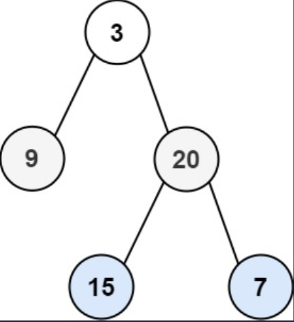
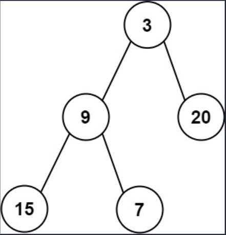

## I Problem
Given the `root` of a binary tree, return *the average value of the nodes on each level in the form of an array*. Answers within `10⁻⁵` of the actual answer will be accepted.

**Example 1**

Input: root = [3, 9, 20, null, null, 15, 7]
Output: [3.00000, 14.50000, 11.00000]
Explanation: The average value of nodes on level 0 is 3, on level 1 is 14.5, and on level 2 is 11. Hence return [3, 14.5, 11].

**Example 2**

Input: root = [3, 9, 20, 15, 7]
Output: [3.00000, 14.50000, 11.00000]

**Constraints**
- The number of nodes in the tree is in the range `[1, 10⁴]`.
- `-2³¹ <= Node.val <= 2³¹ - 1`

**Related Topics**
- Tree
- Depth-First Search
- Breadth-First Search
- Binary Tree


## II Solution
::: code-tabs
@tab Rust Node Definition
```rust
#[derive(Debug, PartialEq, Eq)]
pub struct TreeNode {
    pub val: i32,
    pub left: Option<Rc<RefCell<TreeNode>>>,
    pub right: Option<Rc<RefCell<TreeNode>>>,
}

impl TreeNode {
    #[inline]
    pub fn new(val: i32) -> Self {
        TreeNode {
            val,
            left: None,
            right: None,
        }
    }
}
```

@tab Java Node Definition
```java
public class TreeNode {
    int val;
    TreeNode left;
    TreeNode right;

    TreeNode() {}
    TreeNode(int val) { this.val = val; }
    TreeNode(int val, TreeNode left, TreeNode right) {
        this.val = val;
        this.left = left;
        this.right = right;
    }
}
```
:::

### Approach 1: Depth-First Search
::: code-tabs
@tab Rust
```rust
pub fn average_of_levels(root: Option<Rc<RefCell<TreeNode>>>) -> Vec<f64> {
    //Self::dfs_recursion(root)
    Self::dfs_iteration(root)
}

///
/// DFS - Recursion
///
fn dfs_recursion(root: Option<Rc<RefCell<TreeNode>>>) -> Vec<f64> {
    let mut level_sum = vec![];
    const PRE_ORDER: fn(Option<Rc<RefCell<TreeNode>>>, usize, &mut Vec<(usize, i64)>) =
        |root, level, level_sum| {
            if let Some(curr) = root {
                if level == level_sum.len() {
                    level_sum.push((0, 0));
                }
                level_sum[level].0 += 1;
                level_sum[level].1 += curr.borrow().val as i64;
                
                PRE_ORDER(curr.borrow_mut().left.take(), level + 1, level_sum);
                PRE_ORDER(curr.borrow_mut().right.take(), level + 1, level_sum);
            }
        };

    PRE_ORDER(root, 0, &mut level_sum);

    level_sum
        .into_iter()
        .map(|(count, sum)| sum as f64 / count as f64)
        .collect()
}

///
/// DFS - Iteration
///
fn dfs_iteration(root: Option<Rc<RefCell<TreeNode>>>) -> Vec<f64> {
    let mut level_sum = vec![];

    if let Some(root) = root {
        let mut stack = vec![Ok((root, 0))];
        while let Some(curr) = stack.pop() {
            match curr {
                Ok((node, level)) => {
                    if let Some(right) = node.borrow_mut().right.take() {
                        stack.push(Ok((right, level + 1)));
                    }
                    if let Some(left) = node.borrow_mut().left.take() {
                        stack.push(Ok((left, level + 1)));
                    }
                    stack.push(Err((node.borrow().val, level)));
                }
                Err((val, level)) => {
                    if level == level_sum.len() {
                        level_sum.push((0_usize, 0_i64));
                    }
                    level_sum[level].0 += 1;
                    level_sum[level].1 += val as i64;
                }
            }
        }
    }

    level_sum
        .into_iter()
        .map(|(count, sum)| sum as f64 / count as f64)
        .collect()
}
```

@tab Java
```java
public List<Double> averageOfLevels(TreeNode root) {
    //return this.dfsRecursion(root);
    return this.dfsIteration(root);
}

@FunctionalInterface
interface TriConsumer<A, B, C> {
    void accept(A a, B b, C c);
}

TriConsumer<TreeNode, Integer, List<Long[]>> preOrder = (root, level, levelSum) -> {
    if (root == null) {
        return;
    }

    if (level == levelSum.size()) {
        levelSum.add(new Long[]{0L, 0L});
    }
    levelSum.get(level)[0] += 1;
    levelSum.get(level)[1] += root.val;

    if (root.left != null) {
        this.preOrder.accept(root.left, level + 1, levelSum);
    }
    if (root.right != null) {
        this.preOrder.accept(root.right, level + 1, levelSum);
    }
};

/**
 * DFS - Recursion
 */
List<Double> dfsRecursion(TreeNode root) {
    List<Long[]> levelSum = new ArrayList<>();
    this.preOrder.accept(root, 0, levelSum);
    return levelSum.stream().map(vals -> (double) vals[1] / vals[0]).collect(Collectors.toList());
}

/**
 * DFS - Iteration
 */
List<Double> dfsIteration(TreeNode root) {
    List<Long[]> levelSum = new ArrayList<>();
    Deque<Object[]> stack = new ArrayDeque<>() {{
        this.push(new Object[]{root, 0});
    }};

    while (!stack.isEmpty()) {
        Object[] pop = stack.pop();
        Integer level = (Integer) pop[1];
        Object curr = pop[0];
        switch (curr) {
            case TreeNode node -> {
                if (node.right != null) {
                    stack.push(new Object[]{node.right, level + 1});
                }
                if (node.left != null) {
                    stack.push(new Object[]{node.left, level + 1});
                }
                stack.push(new Object[]{node.val, level});
            }
            case Integer val -> {
                if (level == levelSum.size()) {
                    levelSum.add(new Long[]{0L, 0L});
                }
                levelSum.get(level)[0] += 1;
                levelSum.get(level)[1] += val;
            }
            default -> throw new IllegalStateException("Unexpected value: " + curr);
        }
    }

    return levelSum.stream().map(vals -> (double) vals[1] / vals[0]).collect(Collectors.toList());
}
```
:::

### Approach 2: Breadth-First Search
::: code-tabs
@tab Rust
```rust
pub fn average_of_levels(root: Option<Rc<RefCell<TreeNode>>>) -> Vec<f64> {
    //Self::bfs_iteration_1(root)
    Self::bfs_iteration_2(root)
}

///
/// BFS - Iteration
///
fn bfs_iteration_1(root: Option<Rc<RefCell<TreeNode>>>) -> Vec<f64> {
    let mut res = vec![];

    if let Some(root) = root {
        let mut queue = VecDeque::from([(root, 0)]);
        let mut level_sum = (0_usize, 0_i64);
        let mut curr_level = 0;

        while let Some((curr, level)) = queue.pop_front() {
            if level != curr_level {
                res.push(level_sum.1 as f64 / level_sum.0 as f64);
                level_sum.0 = 0;
                level_sum.1 = 0;
            }
            level_sum.0 += 1;
            level_sum.1 += curr.borrow().val as i64;
            curr_level = level;

            if let Some(left) = curr.borrow_mut().left.take() {
                queue.push_back((left, level + 1));
            }
            if let Some(right) = curr.borrow_mut().right.take() {
                queue.push_back((right, level + 1));
            }
        }

        res.push(level_sum.1 as f64 / level_sum.0 as f64);
    }

    res
}

///
/// BFS - Iteration
///
fn bfs_iteration_2(root: Option<Rc<RefCell<TreeNode>>>) -> Vec<f64> {
    let mut res = vec![];

    if let Some(root) = root {
        let mut queue = VecDeque::from([root]);

        while !queue.is_empty() {
            let level_len = queue.len();
            let mut level_sum = 0_i64;

            for _ in 1..=level_len {
                if let Some(curr) = queue.pop_front() {
                    level_sum += curr.borrow().val as i64;

                    if let Some(left) = curr.borrow_mut().left.take() {
                        queue.push_back(left);
                    }
                    if let Some(right) = curr.borrow_mut().right.take() {
                        queue.push_back(right);
                    }
                }
            }

            res.push(level_sum as f64 / level_len as f64);
        }
    }

    res
}
```

@tab Java
```java
public List<Double> averageOfLevels(TreeNode root) {
    //return this.bfsIteration1(root);
    return this.bfsIteration2(root);
}

/**
 * BFS - Iteration
 */
List<Double> bfsIteration1(TreeNode root) {
    List<Double> res = new ArrayList<>();
    ArrayDeque<Object[]> queue = new ArrayDeque<>() {{
        this.addLast(new Object[]{root, 0});
    }};
    int levelCount = 0;
    long levelSum = 0L;
    int currLevel = 0;

    while (!queue.isEmpty()) {
        Object[] objs = queue.removeFirst();
        TreeNode curr = (TreeNode) objs[0];
        int level = (Integer) objs[1];
        if (level != currLevel) {
            res.add((double) levelSum / levelCount);
            levelSum = 0L;
            levelCount = 0;
        }
        currLevel = level;
        levelCount += 1;
        levelSum += curr.val;

        if (curr.left != null) {
            queue.addLast(new Object[]{curr.left, level + 1});
        }
        if (curr.right != null) {
            queue.addLast(new Object[]{curr.right, level + 1});
        }
    }
    res.add((double) levelSum / levelCount);

    return res;
}

/**
 * BFS - Iteration
 */
List<Double> bfsIteration2(TreeNode root) {
    List<Double> res = new ArrayList<>();
    ArrayDeque<TreeNode> queue = new ArrayDeque<>() {{
        this.addLast(root);
    }};

    while (!queue.isEmpty()) {
        int levelSize = queue.size();
        long levelSum = 0L;

        for (int i = 1; i <= levelSize; i++) {
            TreeNode curr = queue.removeFirst();
            levelSum += curr.val;

            if (curr.left != null) {
                queue.addLast(curr.left);
            }
            if (curr.right != null) {
                queue.addLast(curr.right);
            }
        }

        res.add((double) levelSum / levelSize);
    }

    return res;
}
```
:::