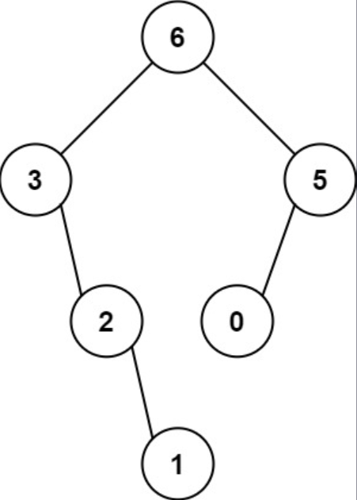
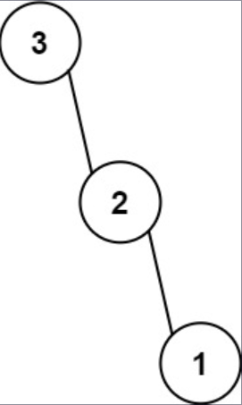

## I Problem
You are given an integer array `nums` with no duplicates. A **maximum binary tree** can be built recursively from `nums` using the following algorithm:
1. Create a root node whose value is the maximum value in `nums`.
2. Recursively build the left subtree on the **subarray prefix** to the **left** of the maximum value.
3. Recursively build the right subtree on the **subarray suffix** to the **right** of the maximum value.

Return *the **maximum binary** tree built from `nums`*.

**Example 1**

Input: nums = [3, 2, 1, 6, 0, 5]
Output: [6, 3, 5, null, 2, 0, null, null, 1]
Explanation: The recursive calls are as follow:
```text
- The largest value in [3, 2, 1, 6, 0, 5] is 6. Left prefix is [3, 2, 1] and right suffix is [0, 5].
  - The largest value in [3, 2, 1] is 3. Left prefix is [] and right suffix is [2, 1].
    - Empty array, so no child.
    - The largest value in [2, 1] is 2. Left prefix is [] and right suffix is [1].
      - Empty array, so no child.
      - Only one element, so child is a node with value 1.
  - The largest value in [0, 5] is 5. Left prefix is [0] and right suffix is [].
    - Only one element, so child is a node with value 0.
    - Empty array, so no child.
```

**Example 2**

Input: nums = [3, 2, 1]
Output: [3, null, 2, null, 1]

**Constraints**
- `1 <= nums.length <= 1000`
- `0 <= nums[i] <= 1000`
- **All** integers in `nums` are **unique**

**Related Topics**
- Array
- Divide and Conquer
- Stack
- Tree
- Monotonic Stack
- Binary Tree


## II Solution
::: code-tabs
@tab Rust Node Definition
```rust
#[derive(Debug, PartialEq, Eq)]
pub struct TreeNode {
    pub val: i32,
    pub left: Option<Rc<RefCell<TreeNode>>>,
    pub right: Option<Rc<RefCell<TreeNode>>>,
}

impl TreeNode {
    #[inline]
    pub fn new(val: i32) -> Self {
        TreeNode {
            val,
            left: None,
            right: None,
        }
    }
}
```

@tab Java Node Definition
```java
public class TreeNode {
    int val;
    TreeNode left;
    TreeNode right;

    TreeNode() {}
    TreeNode(int val) { this.val = val; }
    TreeNode(int val, TreeNode left, TreeNode right) {
        this.val = val;
        this.left = left;
        this.right = right;
    }
}
```
:::

### Approach 1: Recursion
::: code-tabs
@tab Rust
```rust
pub fn construct_maximum_binary_tree(nums: Vec<i32>) -> Option<Rc<RefCell<TreeNode>>> {
    //Self::recur_1(nums)
    Self::recur_2(nums)
}

///
/// Time complexity: O(n^2)
/// Space complexity: O(n)
///
fn recur_1(nums: Vec<i32>) -> Option<Rc<RefCell<TreeNode>>> {
    const RECUR: fn(&[i32]) -> Option<Rc<RefCell<TreeNode>>> = |nums| {
        let len = nums.len();
        if len == 0 {
            return None;
        }

        let (max_idx, max_val) = nums
            .iter()
            .enumerate()
            .max_by(|&(_, a), &(_, b)| a.cmp(b))
            .map(|(idx, &val)| (idx, val))
            .unwrap_or_default();
        let root = Rc::new(RefCell::new(TreeNode::new(max_val)));
        if len == 1 {
            return Some(root);
        }

        let (left_nums, right_nums) = (&nums[..max_idx], &nums[max_idx + 1..]);
        root.borrow_mut().left = RECUR(left_nums);
        root.borrow_mut().right = RECUR(right_nums);

        Some(root)
    };

    RECUR(&nums)
}

///
/// Time complexity: O(n^2)
/// Space complexity: O(n)
///
fn recur_2(nums: Vec<i32>) -> Option<Rc<RefCell<TreeNode>>> {
    const RECUR: fn(&[i32], usize, usize) -> Option<Rc<RefCell<TreeNode>>> =
        |nums, l_idx, r_idx| {
            let len = r_idx - l_idx;
            if len == 0 {
                return None;
            }

            let (max_idx, max_val) = nums[l_idx..r_idx]
                .iter()
                .enumerate()
                .max_by(|&(_, a), &(_, b)| a.cmp(b))
                .map(|(idx, val)| (idx + l_idx, *val))
                .unwrap_or_default();
            let root = Rc::new(RefCell::new(TreeNode::new(max_val)));
            if len == 1 {
                return Some(root);
            }

            root.borrow_mut().left = RECUR(nums, l_idx, max_idx);
            root.borrow_mut().right = RECUR(nums, max_idx + 1, r_idx);

            Some(root)
        };

    RECUR(&nums, 0, nums.len())
}
```

@tab Java
```java
public TreeNode constructMaximumBinaryTree(int[] nums) {
    //return this.recur1(nums);
    return this.recur2(nums);
}

Function<List<Integer>, int[]> getMaxAndIdx = nums -> {
    int[] res = new int[]{Integer.MIN_VALUE, 0};

    for (int i = 0, size = nums.size(); i < size; i++) {
        if (nums.get(i) > res[0]) {
            res[0] = nums.get(i);
            res[1] = i;
        }
    }

    return res;
};

Function<List<Integer>, TreeNode> helper1 = nums -> {
    int size = nums.size();
    if (size == 0) {
        return null;
    }

    int[] valAndIdx = this.getMaxAndIdx.apply(nums);
    int maxVal = valAndIdx[0];
    int maxIdx = valAndIdx[1];
    TreeNode root = new TreeNode(maxVal);
    if (size == 1) {
        return root;
    }

    root.left = this.helper1.apply(nums.subList(0, maxIdx));
    root.right = this.helper1.apply(nums.subList(maxIdx + 1, size));

    return root;
};

/**
 * Time complexity: O(n^2)
 * Space complexity: O(n)
 */
TreeNode recur1(int[] _nums) {
    List<Integer> nums = Arrays.stream(_nums).boxed().collect(Collectors.toList());
    return this.helper1.apply(nums);
}


@FunctionalInterface
interface TriFunction<A, B, C, D> {
    D apply(A a, B b, C c);
}

TriFunction<List<Integer>, Integer, Integer, TreeNode> helper2 = (nums, lIdx, rIdx) -> {
    int size = rIdx - lIdx;
    if (size == 0) {
        return null;
    }

    int[] valAndIdx = this.getMaxAndIdx.apply(nums.subList(lIdx, rIdx));
    int maxVal = valAndIdx[0];
    int maxIdx = valAndIdx[1] + lIdx;
    TreeNode root = new TreeNode(maxVal);
    if (size == 1) {
        return root;
    }

    root.left = this.helper2.apply(nums, lIdx, maxIdx);
    root.right = this.helper2.apply(nums, maxIdx + 1, rIdx);

    return root;
};

/**
 * Time complexity: O(n^2)
 * Space complexity: O(n)
 */
TreeNode recur2(int[] _nums) {
    List<Integer> nums = Arrays.stream(_nums).boxed().collect(Collectors.toList());
    return this.helper2.apply(nums, 0, _nums.length);
}
```
:::

### Approach 2: Monotonic Stack
::: code-tabs
@tab Rust
```rust
pub fn construct_maximum_binary_tree(nums: Vec<i32>) -> Option<Rc<RefCell<TreeNode>>> {
    //Self::monotonic_stack_1(nums)
    Self::monotonic_stack_2(nums)
}

///
/// Time complexity: O(n)
/// Space complexity: O(n)
///
fn monotonic_stack_1(nums: Vec<i32>) -> Option<Rc<RefCell<TreeNode>>> {
    let len = nums.len();
    if len == 0 {
        return None;
    }
    let mut stack = Vec::with_capacity(len);
    let mut left = vec![usize::MAX; len];
    let mut right = vec![usize::MAX; len];
    let mut tree = Vec::with_capacity(len);

    for i in 0..len {
        tree.push(Rc::new(RefCell::new(TreeNode::new(nums[i]))));

        while let Some(&last) = stack.last() {
            if !(nums[i] > nums[last]) {
                break;
            }
            right[last] = i;
            stack.pop();
        }
        if let Some(&last) = stack.last() {
            left[i] = last;
        }

        stack.push(i);
    }

    let mut root = None;
    for i in 0..len {
        if left[i] == usize::MAX && right[i] == usize::MAX {
            root = Some(tree[i].clone());
        } else if right[i] == usize::MAX
            || (left[i] != usize::MAX && nums[left[i]] < nums[right[i]])
        {
            tree[left[i]].borrow_mut().right = Some(tree[i].clone());
        } else {
            tree[right[i]].borrow_mut().left = Some(tree[i].clone());
        }
    }

    root
}

///
/// Time complexity: O(n)
/// Space complexity: O(n)
///
fn monotonic_stack_2(nums: Vec<i32>) -> Option<Rc<RefCell<TreeNode>>> {
    let len = nums.len();
    if len == 0 {
        return None;
    }
    let mut stack: Vec<usize> = Vec::with_capacity(len);
    let mut tree = Vec::with_capacity(len);

    for i in 0..len {
        tree.push(Rc::new(RefCell::new(TreeNode::new(nums[i]))));

        while let Some(&last) = stack.last() {
            if !(nums[i] > nums[last]) {
                break;
            }
            tree[i].borrow_mut().left = Some(tree[last].clone());
            stack.pop();
        }
        if let Some(&last) = stack.last() {
            tree[last].borrow_mut().right = Some(tree[i].clone())
        }

        stack.push(i);
    }

    Some(tree[stack[0]].clone())
}
```

@tab Java
```java
public TreeNode constructMaximumBinaryTree(int[] nums) {
    //return this.monotonicStack1(nums);
    return this.monotonicStack2(nums);
}

/**
 * Time complexity: O(n)
 * Space complexity: O(n)
 */
TreeNode monotonicStack1(int[] nums) {
    int len = nums.length;
    if (len == 0) {
        return null;
    }
    Deque<Integer> stack = new ArrayDeque<>(len);
    TreeNode[] tree = new TreeNode[len];
    int[] left = new int[len];
    int[] right = new int[len];
    Arrays.fill(left, -1);
    Arrays.fill(right, -1);

    for (int i = 0; i < len; i++) {
        tree[i] = new TreeNode(nums[i]);

        while (!stack.isEmpty() && nums[i] > nums[stack.peek()]) {
            right[stack.pop()] = i;
        }
        if (!stack.isEmpty()) {
            left[i] = stack.peek();
        }

        stack.push(i);
    }

    TreeNode root = null;
    for (int i = 0; i < len; i++) {
        if (left[i] == -1 && right[i] == -1) {
            root = tree[i];
        } else if (right[i] == -1 || (left[i] != -1 && nums[left[i]] < nums[right[i]])) {
            tree[left[i]].right = tree[i];
        } else {
            tree[right[i]].left = tree[i];
        }
    }

    return root;
}

/**
 * Time complexity: O(n)
 * Space complexity: O(n)
 */
TreeNode monotonicStack2(int[] nums) {
    int len = nums.length;
    if (len == 0) {
        return null;
    }
    Deque<Integer> stack = new ArrayDeque<>(len);
    TreeNode[] tree = new TreeNode[len];

    for (int i = 0; i < len; i++) {
        tree[i] = new TreeNode(nums[i]);

        while (!stack.isEmpty() && nums[i] > nums[stack.peek()]) {
            tree[i].left = tree[stack.pop()];
        }
        if (!stack.isEmpty()) {
            tree[stack.peek()].right = tree[i];
        }

        stack.push(i);
    }

    // Here we should get the element at the bottom of the stack
    return tree[stack.getLast()];
}
```
:::
