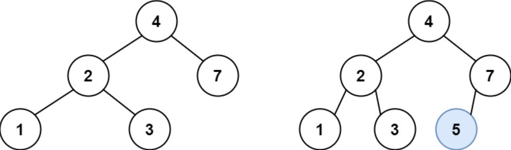

## I Problem
You are given the `root` node of a binary search tree (BST) and a `value` to insert into the tree. Return *the root node of the BST after the insertion*. It is **guaranteed** that the new value does not exist in the original BST.

**Notice** that there may exist multiple valid ways for the insertion, as long as the tree remains a BST after insertion. You can return **any of them**.

**Example 1**

Input: root = [4, 2, 7, 1, 3], val = 5
Output: [4, 2, 7, 1, 3, 5]
Explanation: Another accepted tree is:


**Example 2**
Input: root = [40, 20, 60, 10, 30, 50, 70], val = 25
Output: [40, 20, 60, 10, 30, 50, 70, null, null, 25]

**Example 3**
Input: root = [4, 2, 7, 1, 3, null, null, null, null, null, null], val = 5
Output: [4, 2, 7, 1, 3, 5]

**Constraints**
- The number of nodes in the tree will be in the range `[0, 10⁴]`.
- `-10⁸ <= Node.val <= 10⁸`
- All the values `Node.val` are **unique**.
- `-10⁸ <= val <= 10⁸`
- It's **guaranteed** that `val` does not exist in the original BST.

**Related Topics**
- Tree
- Binary Tree
- Binary Search Tree

## II Solution
::: code-tabs
@tab Rust Node Definition
```rust
#[derive(Debug, PartialEq, Eq)]
pub struct TreeNode {
    pub val: i32,
    pub left: Option<Rc<RefCell<TreeNode>>>,
    pub right: Option<Rc<RefCell<TreeNode>>>,
}

impl TreeNode {
    #[inline]
    pub fn new(val: i32) -> Self {
        TreeNode {
            val,
            left: None,
            right: None,
        }
    }
}
```

@tab Java Node Definition
```java
public class TreeNode {
    int val;
    TreeNode left;
    TreeNode right;

    TreeNode() {}
    TreeNode(int val) { this.val = val; }
    TreeNode(int val, TreeNode left, TreeNode right) {
        this.val = val;
        this.left = left;
        this.right = right;
    }
}
```
:::

### Approach 1: Recursion
::: code-tabs
@tab Rust
```rust
pub fn insert_into_bst(root: Option<Rc<RefCell<TreeNode>>>, val: i32) -> Option<Rc<RefCell<TreeNode>>> {
    //Self::recur_helper_1(root, val
    Self::recur_helper_2(root, val)
}

fn recur_helper_1(root: Option<Rc<RefCell<TreeNode>>>, val: i32) -> Option<Rc<RefCell<TreeNode>>> {
    let new = Some(Rc::new(RefCell::new(TreeNode::new(val))));
    if root.is_none() {
        return new;
    }

    const TRAVERSAL: fn(Option<Rc<RefCell<TreeNode>>>, i32, Option<Rc<RefCell<TreeNode>>>) =
        |root, val, new| {
            if let Some(curr) = root {
                let curr_val = curr.borrow().val;

                if val > curr_val {
                    let right = curr.borrow().right.clone();
                    if right.is_some() {
                        TRAVERSAL(right, val, new);
                    } else {
                        curr.borrow_mut().right = new;
                    }
                } else {
                    let left = curr.borrow().left.clone();
                    if left.is_some() {
                        TRAVERSAL(left, val, new);
                    } else {
                        curr.borrow_mut().left = new;
                    }
                }
            }
        };
    TRAVERSAL(root.clone(), val, new);

    root
}

fn recur_helper_2(root: Option<Rc<RefCell<TreeNode>>>, val: i32) -> Option<Rc<RefCell<TreeNode>>> {
    const TRAVERSAL: fn(Option<Rc<RefCell<TreeNode>>>, i32) -> Option<Rc<RefCell<TreeNode>>> =
        |root, val| match root {
            None => Some(Rc::new(RefCell::new(TreeNode::new(val)))),
            Some(curr) => {
                let curr_val = curr.borrow().val;

                if val > curr_val {
                    let right = curr.borrow_mut().right.take();
                    curr.borrow_mut().right = TRAVERSAL(right, val);
                } else {
                    let left = curr.borrow_mut().left.take();
                    curr.borrow_mut().left = TRAVERSAL(left, val);
                }

                Some(curr)
            }
        };

    TRAVERSAL(root, val)
}
```

@tab Java
```java
public TreeNode insertIntoBST(TreeNode root, int val) {
    //return this.recurHelper1(root, val);
    return this.recurHelper2(root, val);
}

BiConsumer<TreeNode, TreeNode> traversal1 = (root, newNode) -> {
    if (root == null) {
        return;
    }

    if (newNode.val > root.val) {
        TreeNode right = root.right;
        if (right != null) {
            this.traversal1.accept(right, newNode);
        } else {
            root.right = newNode;
        }
    } else {
        TreeNode left = root.left;
        if (left != null) {
            this.traversal1.accept(left, newNode);
        } else {
            root.left = newNode;
        }
    }
};

TreeNode recurHelper1(TreeNode root, int val) {
    TreeNode node = new TreeNode(val);
    if (root == null) {
        return node;
    }

    this.traversal1.accept(root, node);

    return root;
}


BiFunction<TreeNode, Integer, TreeNode> traversal2 = (root, val) -> {
    if (root == null) {
        return new TreeNode(val);
    }

    if (val > root.val) {
        root.right = this.traversal2.apply(root.right, val);
    } else {
        root.left = this.traversal2.apply(root.left, val);
    }

    return root;
};

TreeNode recurHelper2(TreeNode root, int val) {
    return this.traversal2.apply(root, val);
}
```
:::

### Approach 2: Iteration
::: code-tabs
@tab Rust
```rust
pub fn insert_into_bst(root: Option<Rc<RefCell<TreeNode>>>, val: i32) -> Option<Rc<RefCell<TreeNode>>> {
    //Self::iter_helper_1(root, val)
    Self::iter_helper_2(root, val)
}

fn iter_helper_1(root: Option<Rc<RefCell<TreeNode>>>, val: i32) -> Option<Rc<RefCell<TreeNode>>> {
    let new = Some(Rc::new(RefCell::new(TreeNode::new(val))));
    if root.is_none() {
        return new;
    }

    let mut root_node = root.clone();
    while let Some(curr) = root_node {
        let curr_val = curr.borrow().val;

        let (next, is_right) = if val > curr_val {
            (curr.borrow().right.clone(), true)
        } else {
            (curr.borrow().left.clone(), false)
        };

        if next.is_some() {
            root_node = next;
        } else {
            if is_right {
                curr.borrow_mut().right = new;
            } else {
                curr.borrow_mut().left = new;
            }
            break;
        }
    }

    root
}

fn iter_helper_2(root: Option<Rc<RefCell<TreeNode>>>, val: i32) -> Option<Rc<RefCell<TreeNode>>> {
    let new = Some(Rc::new(RefCell::new(TreeNode::new(val))));
    if root.is_none() {
        return new;
    }

    let mut root_node = root.clone();
    while let Some(curr) = root_node {
        let curr_val = curr.borrow().val;

        if val > curr_val {
            let right = curr.borrow().right.clone();
            if right.is_some() {
                root_node = right;
            } else {
                curr.borrow_mut().right = new;
                break;
            }
        } else {
            let left = curr.borrow().left.clone();
            if left.is_some() {
                root_node = left;
            } else {
                curr.borrow_mut().left = new;
                break;
            }
        }
    }

    root
}
```

@tab Java
```java
public TreeNode insertIntoBST(TreeNode root, int val) {
    //return this.iterHelper1(root, val);
    return this.iterHelper2(root, val);
}

TreeNode iterHelper1(TreeNode root, int val) {
    TreeNode node = new TreeNode(val);
    if (root == null) {
        return node;
    }

    TreeNode rootNode = root;
    while (rootNode != null) {
        TreeNode next;
        boolean isRight;

        if (val > rootNode.val) {
            next = rootNode.right;
            isRight = true;
        } else {
            next = rootNode.left;
            isRight = false;
        }

        if (next != null) {
            rootNode = next;
        } else {
            if (isRight) {
                rootNode.right = node;
            } else {
                rootNode.left = node;
            }
            break;
        }
    }

    return root;
}

TreeNode iterHelper2(TreeNode root, int val) {
    TreeNode node = new TreeNode(val);
    if (root == null) {
        return node;
    }

    TreeNode curr = root;
    while (curr != null) {
        if (val > curr.val) {
            TreeNode right = curr.right;
            if (right != null) {
                curr = right;
            } else {
                curr.right = node;
                break;
            }
        } else {
            TreeNode left = curr.left;
            if (left != null) {
                curr = left;
            } else {
                curr.left = node;
                break;
            }
        }
    }
    
    return root;
}
```
:::