## Binary Tree
### Definition
In computer science, a [**binary tree**][binary_tree] is a tree data structure in which each node has at most two children, referred to as the `left child` and the `right child`. That is, it is a [**k-ary tree**][k_ary_tree] with k = 2. A *recursive definition* using set theory is that a binary tree is a tuple (L, S, R), where L and R are binary trees or the empty set and S is a singleton set containing the root.
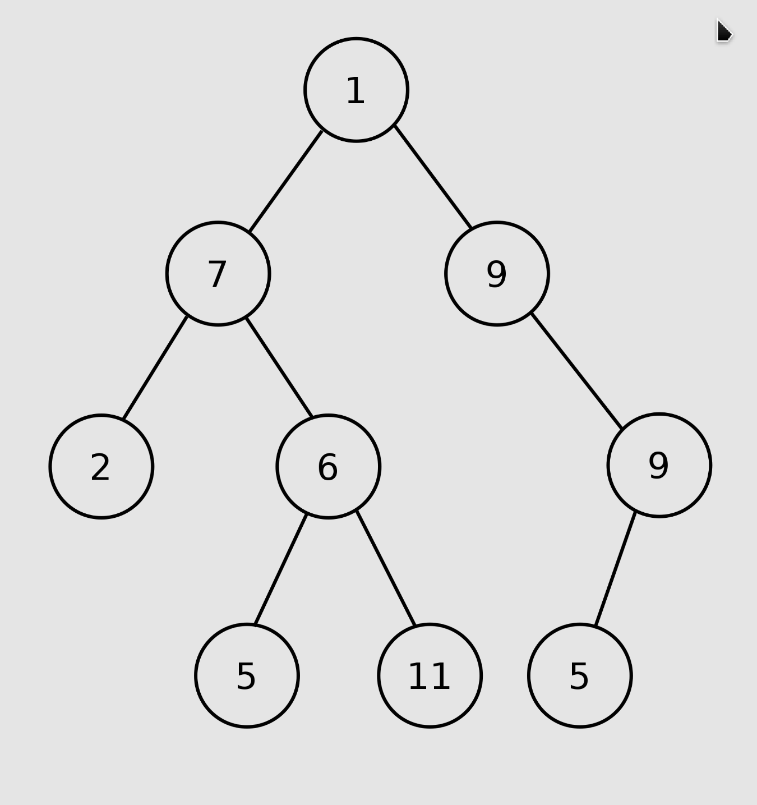

### Definition in Graph Theory
From a graph theory perspective, binary trees as defined here are **arborescences**. A binary tree may thus be also called a **bifurcating arborescence**, a term which appears in some very old programming books before the modern computer science terminology prevailed. It is also possible to interpret a binary tree as an undirected, rather than directed graph, in which case a binary tree is an ordered, rooted tree. Some authors use rooted binary tree instead of binary tree to emphasize the fact that the tree is rooted, but as defined above, a binary tree is always rooted.

### Types of Binary Trees
1. **Full Binary Tree**: A full binary tree (sometimes referred to as a **proper**, **plane**, or **strict** binary tree) is a tree in which every node has either 0 or 2 children. Another way of defining a full binary tree is a recursive definition. A full binary tree is either:
   - A single vertex (a single node as the root node).
   - A tree whose root node has two subtrees, both of which are full binary trees.
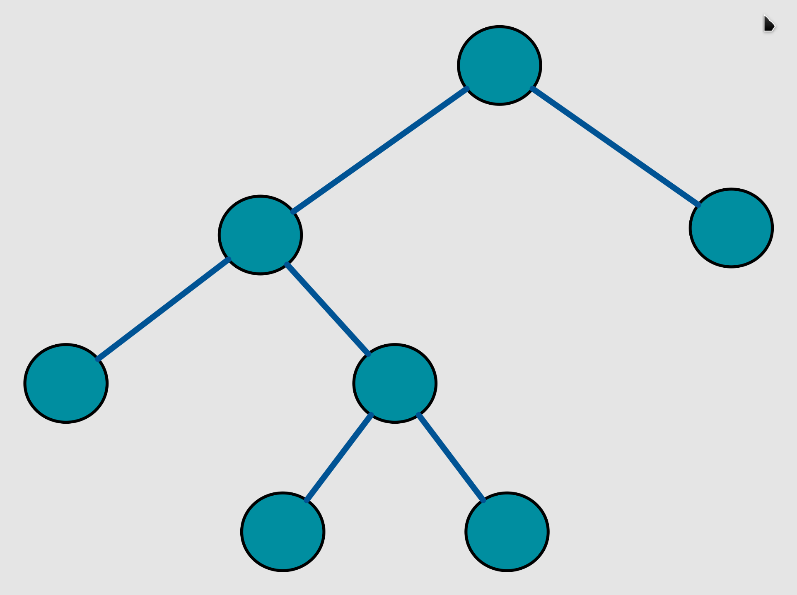

2. **Perfect Binary Tree**: A perfect binary tree is a binary tree in which all interior nodes have two children and all leaves have the same depth or same level (the level of a node defined as the number of edges or links from the root node to a node). A perfect binary tree is a full binary tree.


3. **Complete Binary Tree**: A complete binary tree is a binary tree in which every level, except possibly the last, is completely filled, and all nodes in the last level are as far left as possible. It can have between 1 and 2^h nodes at the last level h. A perfect tree is therefore always complete but a complete tree is not always perfect.
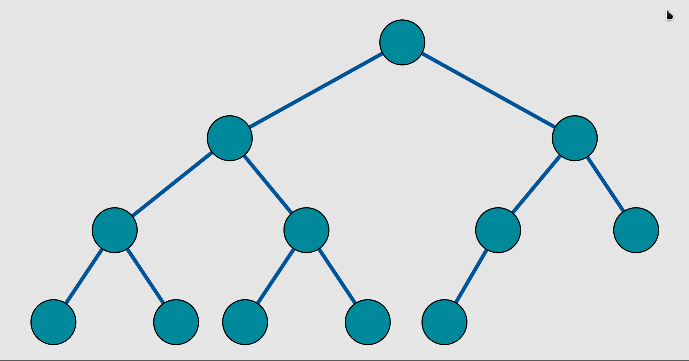

4. **Degenerate Tree**: A degenerate (or **pathological**) tree is where each parent node has only one associated child node. This means that the tree will behave like a linked list data structure.
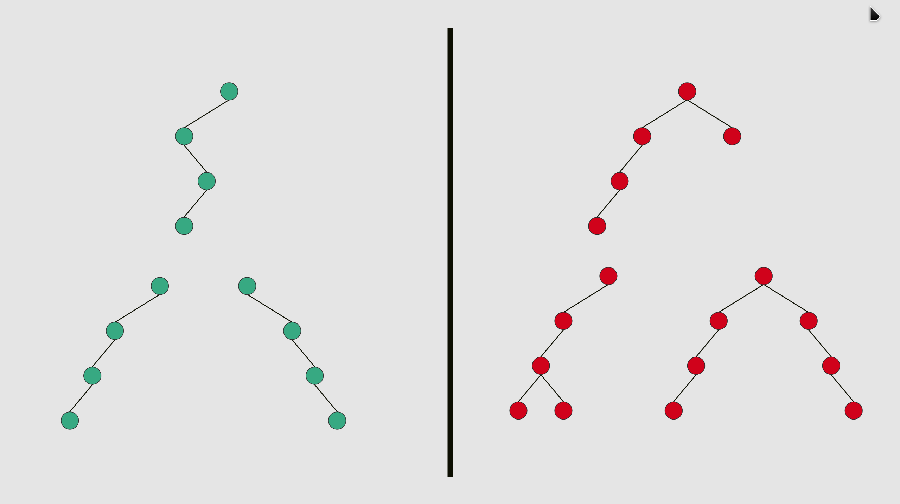

5. [**Binary Search Tree**][BST]: an ordered or sorted binary tree, is a rooted binary tree data structure with the key of each internal node being greater than all the keys in the respective node's left subtree and less than the ones in its right subtree.
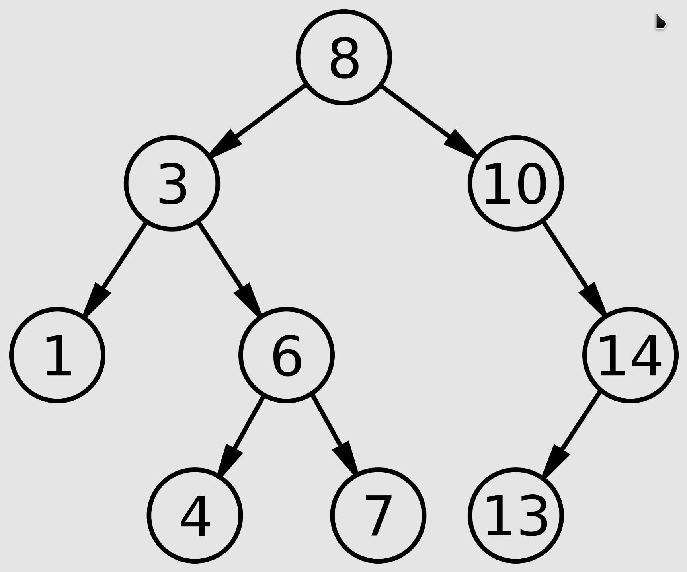

6. [**AVL**][AVL]: an AVL tree (named after inventors Adelson-Velsky and Landis) is a **self-balancing binary search tree**. In an AVL tree, the heights of the two child subtrees of any node differ by at most one; if at any time they differ by more than one, **rebalancing** is done to restore this property.
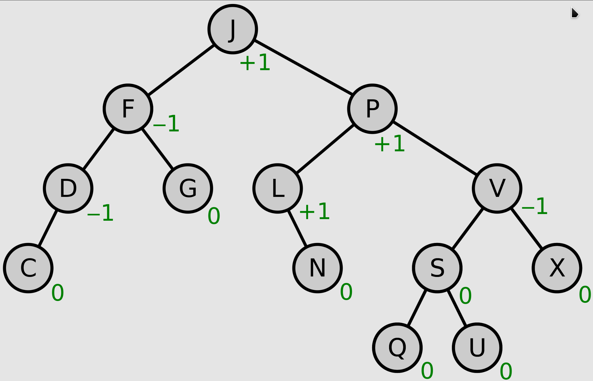

7. [**Red Black Tree**][RBT]: a red–black tree is a specialised binary search tree, compared to other self-balancing binary search trees, the nodes in a red-black tree hold an extra bit called "color" representing "red" and "black" which is used when re-organising the tree to ensure that it is always approximately balanced. It has the following properties:
   - Every node is either red or black.
   - All NIL nodes are considered black.
   - A red node does not have a red child.
   - Every path from a given node to any of its descendant NIL nodes goes through the same number of black nodes.
   - If a node N has exactly one child, it must be a red child.
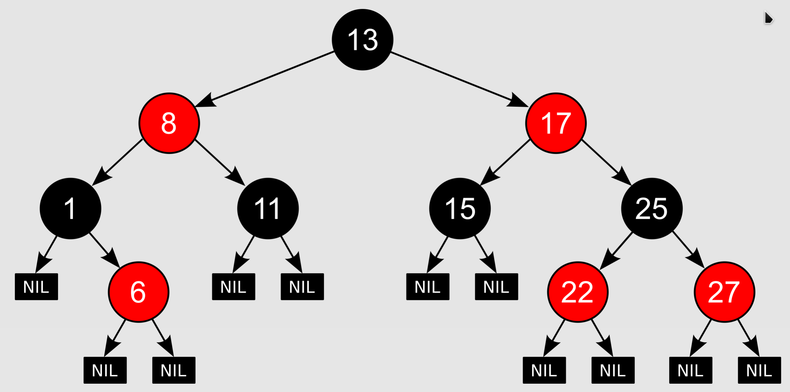

### Properties of Binary Trees
- The number of nodes `n` in a full binary tree is at least `2ℎ + 1` and at most `2^(ℎ+1) − 1` (i.e., the number of nodes in a perfect binary tree), where `ℎ` is the height of the tree. A tree consisting of only a root node has a height of 0. For a perfect tree, the number of nodes is `1 + 2 + 4 + … + 2^ℎ = 2^(ℎ+1) − 1`.

- The number of leaf nodes `l` in a perfect binary tree is `(n + 1) / 2` (where `n` is the number of nodes in the tree).

- For any non-empty binary tree with `l` leaf nodes and `i2` nodes of degree 2 (internal nodes with two child nodes), `l = i2 + 1`.

- With given `n` nodes, the minimum possible tree height is `ℎ = log2(n + 1) − 1` with which the tree is a balanced full tree or perfect tree. 

- A binary Tree with `l` leaves has at least the height `ℎ = log2(l)`.

- In a non-empty binary tree, if `n` is the total number of nodes and `e` is the total number of edges, then `e = n − 1`.

- The number of null links (i.e., absent children of the nodes) in a binary tree of `n` nodes is `(n + 1)`.

- The number of internal nodes in a complete binary tree of `n` nodes is `⌊n/2⌋`.

### Operations of Binary Trees
#### Insertion
- Leaf nodes
- Internal nodes
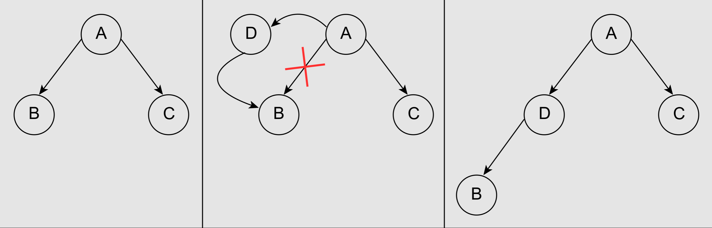

#### Deletion
- Node with zero or one children
- Node with two children
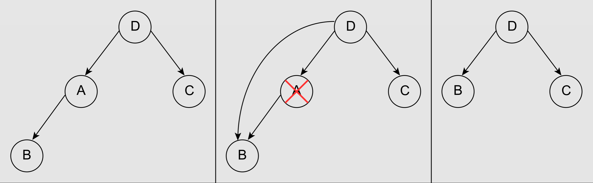

#### Traversal  
##### Depth First Search(DFS)
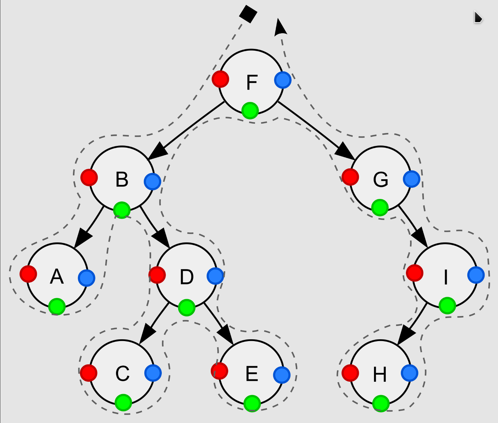
- Pre-order(NLR), node visited at position red ●: F, B, A, D, C, E, G, I, H
::: code-tabs
@tab Recursive Impl
```text
procedure pre_order(node)
    if node = null
        return
    visit(node)
    pre_order(node.left)
    pre_order(node.right)
```

@tab Iterative Impl
```text
procedure pre_order(node)
    if node = null
        return
    stack ← empty stack
    stack.push(node)
    while not stack.isEmpty()
        node ← stack.pop()
        visit(node)
        // right child is pushed first so that left is processed first
        if node.right ≠ null
            stack.push(node.right)
        if node.left ≠ null
            stack.push(node.left)
```
:::

- In-order(LNR), node visited at position green ●: A, B, C, D, E, F, G, H, I
::: code-tabs
@tab Recursive Impl
```text
procedure in_order(node)
    if node = null
        return
    in_order(node.left)
    visit(node)
    in_order(node.right)
```

@tab Iterative Impl
```text
procedure in_order(node)
    stack ← empty stack
    while not stack.isEmpty() or node ≠ null
        if node ≠ null
            stack.push(node)
            node ← node.left
        else
            node ← stack.pop()
            visit(node)
            node ← node.right
```
:::

- Post-order(LRN), node visited at position blue ●: A, C, E, D, B, H, I, G, F
::: code-tabs
@tab Recursive Impl
```text
procedure post_order(node)
    if node = null
        return
    post_order(node.left)
    post_order(node.right)
    visit(node)
```

@tab Iterative Impl
```text
procedure post_order(node)
    stack ← empty stack
    lastNodeVisited ← null
    while not stack.isEmpty() or node ≠ null
        if node ≠ null
            stack.push(node)
            node ← node.left
        else
            peekNode ← stack.peek()
            // if right child exists and traversing node
            // from left child, then move right
            if peekNode.right ≠ null and lastNodeVisited ≠ peekNode.right
                node ← peekNode.right
            else
                visit(peekNode)
                lastNodeVisited ← stack.pop()
```
:::
##### Breadth First Search(BFS)
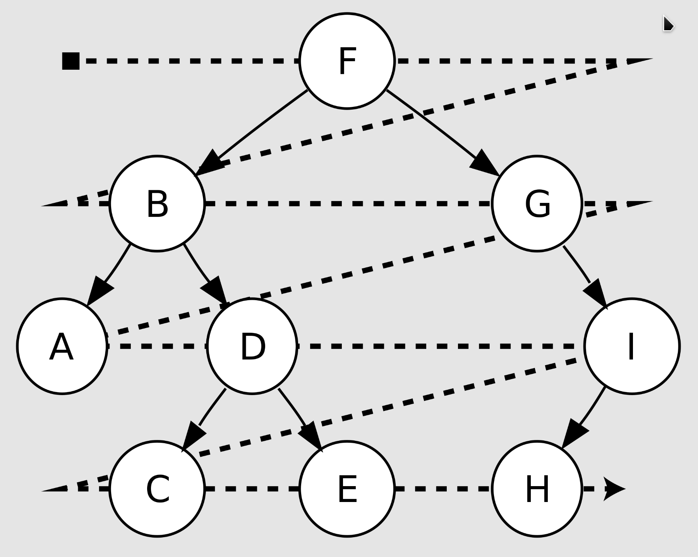
- Level-order: F, B, G, A, D, I, C, E, H
::: code-tabs
@tab Iterative Impl
```text
procedure level_order(node)
    queue ← empty queue
    queue.enqueue(node)
    while not queue.isEmpty()
        node ← queue.dequeue()
        visit(node)
        if node.left ≠ null
            queue.enqueue(node.left)
        if node.right ≠ null
            queue.enqueue(node.right)
```
:::

### Complexity in Big O Notation
#### Time Complexity
|Operation|Average|Worst case|
|-|-|-|
|Search|O(log(n))|O(n)|
|Insert|O(log(n))|O(n)|
|Delete|O(log(n))|O(n)|

#### Space Complexity
|Operation|Average|Worst case|
|-|-|-|
|Space|O(n)|O(n)|


## Exercise
### Traversal of Binary Trees
[144: Binary Tree Pre-order Traversal](144_binary_tree_pre_order_traversal.md)
[94: Binary Tree In-order Traversal](94_binary_tree_in_order_traversal.md)
[145: Binary Tree Post-order Traversal](145_binary_tree_post_order_traversal.md)
[102: Binary Tree Level Order Traversal](102_binary_tree_level_order_traversal.md)

### Level Order Traversal
[107: Binary Tree Level Order Traversal II]
[199: Binary Tree Right Side View]
[637: Average of Levels in Binary Tree]
[429: N-ary Tree Level Order Traversal]
[515: Find Largest Value in Each Tree Row]
[116: Populating Next Right Pointers in Each Node]
[117: Populating Next Right Pointers in Each Node II]

### Properties of Binary Trees
[101: Symmetric Tree]
[104: Maximum Depth of Binary Tree]
[111: Minimum Depth of Binary Tree]
[222: Count Complete Tree Nodes]
[110: Balanced Binary Tree]
[257: Binary Tree Paths]
[404: Sum of Left Leaves]
[513: Find Bottom Left Tree Value]
[112: Path Sum]

### Operations of Binary Trees
[226: Invert Binary Tree]
[105: Construct Binary Tree from Pre-order and In-order Traversal]
[106: Construct Binary Tree from Post-order and In-order Traversal]
[654: Maximum Binary Tree]
[617: Merge Two Binary Trees]

### Properties of Binary Search Trees
[700: Search in a Binary Search Tree]
[98: Validate Binary Search Tree]
[530: Minimum Absolute Difference in BST]
[501: Find Mode in Binary Search Tree]
[538: Convert BST to Greater Tree]

### Common Ancestor of Binary Trees
[236: Lowest Common Ancestor of a Binary Tree]
[235: Lowest Common Ancestor of a Binary Search Tree]

### Operations of Binary Search Trees
[701: Insert into a Binary Search Tree]
[450: Delete Node in a BST]
[669: Trim a Binary Search Tree]
[108: Convert Sorted Array to Binary Search Tree]
[109: Convert Sorted List to Binary Search Tree]


## Summary


[binary_tree]: https://en.wikipedia.org/wiki/Binary_tree
[k_ary_tree]: https://en.wikipedia.org/wiki/M-ary_tree
[BST]: https://en.wikipedia.org/wiki/Binary_search_tree
[AVL]: https://en.wikipedia.org/wiki/AVL_tree
[RBT]: https://en.wikipedia.org/wiki/Red%E2%80%93black_tree