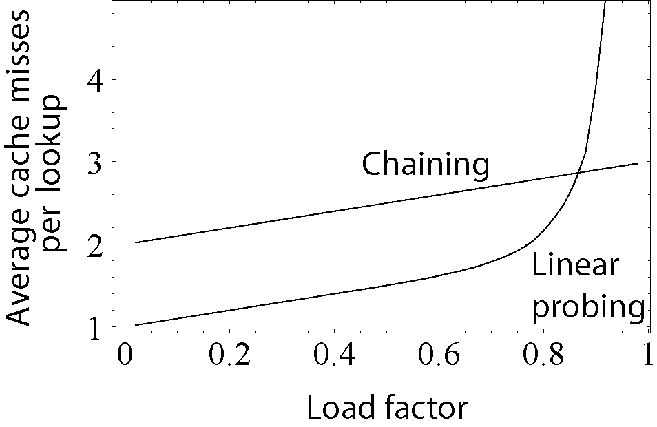

## About HashTable
### Concept
In computing, a hash table, also known as a hash map, is a data structure that implements an associative array, also called a dictionary, which is an abstract data type that maps keys to values. A hash table uses a hash function to compute an index, also called a hash code, into an array of buckets or slots, from which the desired value can be found. During lookup, the key is hashed and the resulting hash indicates where the corresponding value is stored.

Ideally, the hash function will assign each key to a unique bucket, but most hash table designs employ an imperfect hash function, which might cause hash collisions where the hash function generates the same index for more than one key. Such collisions are typically accommodated in some way.

### Hash Function
A hash function *h* maps the universe **U** of keys `h : U -> {0,...,m − 1}` to array indices or slots within the table for each `h(x) ∈ 0,...,m - 1` where x ∈ **S** and m < n. The conventional implementations of hash functions are based on the *integer universe assumption* that all elements of the table stem from the universe `U = {0,...,u - 1}`, where the bit length of u is confined within the word size of a computer architecture.

A perfect hash function *h* is defined as an injective function such that each element x in **S** maps to a unique value in `0,...,m − 1`. A perfect hash function can be created if all the keys are known ahead of time.

### Collision Resolution
#### 1. Separate chaining
The collided items are chained together through a single linked list, which can be traversed to access the item with a unique search key.

#### 2. Open addressing

- ***Linear probing***, in which the interval between probes is fixed (usually 1).

- ***Quadratic probing***, in which the interval between probes is increased by adding the successive outputs of a quadratic polynomial to the value given by the original hash computation. An example sequence using quadratic probing is: `H + 1^2, H + 2^2, H + 3^2, H + 4^2,...,H + k^2`
- ***Double hashing***, in which the interval between probes is computed by a secondary hash function.

### Load Factor
A load factor is a critical statistic of a hash table, and is defined as follows:

load factor(a) = n / m, where n is the number of entries occupied in the hash table, m is the number of buckets.

The performance of the hash table deteriorates in relation to the load factor a. Therefore a hash table is resized or rehashed if the load factor a approaches 1. A table is also resized if the load factor drops below a(max) / 4. Acceptable figures of load factor a should range around 0.6 to 0.75.

## Exercise
### Valid Anagram
[242: Valid Anagram](242_valid_anagram.md)
[383: Ransom Note](383_ransom_note.md)
[49: Group Anagrams](49_group_anagrams.md)
[438: Find All Anagrams in a String](438_find_all_anagrams_in_a_string.md)

### Intersection of Two Arrays
[349: Intersection of Two Arrays](349_intersection_of_two_arrays.md)
[350: Intersection of Two Arrays II](350_intersection_of_two_arrays_ii.md)

### Happy Number
[202: Happy Number]

### Two Sum
[1: Two Sum]

### Three Sum
[15: Three Sum]
[16: Three Sum Closest]

### Four Sum
[18: Four Sum]
[454: Four Sum II]

## Summary
