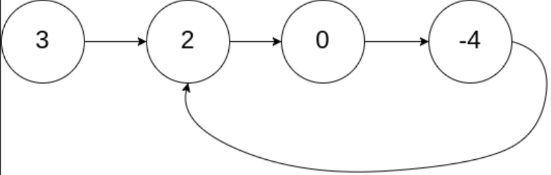
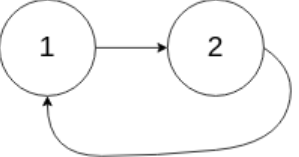

## I Problem
Given `head`, the head of a linked list, determine if the linked list has a cycle in it.

There is a cycle in a linked list if there is some node in the list that can be reached again by continuously following the `next` pointer.
Internally, `pos` is used to denote the index of the node that tail's `next` pointer is connected to. **Note that `pos` is not passed as a parameter.**

Return `true` *if there is a cycle in the linked list.* Otherwise, return `false`.

**Example 1**

Input: head = [3, 2, 0, -4], pos = 1
Output: true
Explanation: There is a cycle in the linked list, where the tail connects to the 1st node (0-indexed).

**Example 2**

Input: head = [1, 2], pos = 0
Output: true
Explanation: There is a cycle in the linked list, where the tail connects to the 0th node.

**Example 3**

Input: head = [1], pos = -1
Output: false
Explanation: There is no cycle in the linked list.

**Constraints**

- The number of the nodes in the list is in the range `[0, 10⁴]`.
- `-10⁵ <= Node.val <= 10⁵`
- `pos` is `-1` or a valid index in the linked-list.

**Follow up**
Can you solve it using `O(1)` (i.e. constant) memory?

**Related Topics**

- Hash Table
- Linked List
- Two Pointers

## II Solution
::: code-tabs
@tab ListNode(Rust)
```rust
type NLink = *mut ListNode;

pub struct ListNode {
    pub val: i32,
    pub next: NLink,
}

impl ListNode {
    pub fn new(val: i32, next: NLink) -> NLink {
        Box::into_raw(Box::new(ListNode { val, next }))
    }
}
```

@tab ListNode(Java)
```java
public class ListNode {
    int val;
    ListNode next;
    public ListNode() {}
    public ListNode(int val) { this.val = val; }
    public ListNode(int val, ListNode next) { this.val = val; this.next = next; }
}
```
:::


### Approach 1: Use HashSet
::: code-tabs
@tab Rust
```rust
pub fn has_cycle(head: NLink) -> bool {
    let mut set = HashSet::new();

    while !node.is_null() {
        if set.contains(&node) {
            return true;
        }
        set.insert(node);
        unsafe {
            node = (*node).next;
        }
    }

    false
}
```

@tab Java
```java
public boolean hasCycle(ListNode head) {
    HashSet<ListNode> set = new HashSet<>();

    while (node != null) {
        if (set.contains(node)) {
            return true;
        }
        set.add(node);
        node = node.next;
    }

    return false;
}
```
:::

### Approach 2: Two Pointers
::: code-tabs
@tab Rust
```rust
pub fn has_cycle(head: NLink) -> bool {
    let mut slow = node;
    let mut fast = node;

    loop {
        unsafe {
            if fast.is_null() {
                break;
            }
            fast = (*fast).next;
            if fast.is_null() {
                break;
            }
            fast = (*fast).next;
            slow = (*slow).next;
            if slow == fast {
                break;
            }
        }
    }

    !fast.is_null()
}
```

@tab Java
```java
public boolean hasCycle(ListNode head) {
    ListNode slow = node;
    ListNode fast = node;

    do {
        if (fast == null) {
            break;
        }
        fast = fast.next;
        if (fast == null) {
            break;
        }
        fast = fast.next;
        slow = slow.next;
    } while (slow != fast);
    
    return fast != null;
}
```
:::