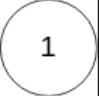

## I Problem
Given the `head` of a linked list, return *the node where the cycle begins. If there is no cycle, return `null`*.

There is a cycle in a linked list if there is some node in the list that can be reached again by continuously following the `next` pointer.
Internally, `pos` is used to denote the index of the node that tail's `next` pointer is connected to (**0-indexed**). It is `-1` if there is no cycle.
**Note that `pos` is not passed as a parameter**.

**Do not modify** the linked list.

**Example 1**

Input: head = [3, 2, 0, -4], pos = 1
Output: tail connects to node index 1
Explanation: There is a cycle in the linked list, where tail connects to the second node.

**Example 2**

Input: head = [1, 2], pos = 0
Output: tail connects to node index 0
Explanation: There is a cycle in the linked list, where tail connects to the first node.

**Example 3**

Input: head = [1], pos = -1
Output: no cycle
Explanation: There is no cycle in the linked list.

**Constraints**

- The number of the nodes in the list is in the range `[0, 10⁴]`.
- `-10⁵ <= Node.val <= 10⁵`
- `pos` is `-1` or a **valid index** in the linked-list.

**Follow up**

- Can you solve it using `O(1)` (i.e. constant) memory?

**Related Topics**

- Hash Table
- Linked List
- Two Pointers

## II Solution
::: code-tabs
@tab ListNode(Rust)
```rust
type NLink = *mut ListNode;

pub struct ListNode {
    pub val: i32,
    pub next: NLink,
}

impl ListNode {
    pub fn new(val: i32, next: NLink) -> NLink {
        Box::into_raw(Box::new(ListNode { val, next }))
    }
}
```

@tab ListNode(Java)
```java
public class ListNode {
    int val;
    ListNode next;

    public ListNode() {}
    public ListNode(int val) { 
        this.val = val; 
    }
    public ListNode(int val, ListNode next) { 
        this.val = val; 
        this.next = next; 
    }
}
```
:::


### Approach 1: Use Hash Collections
::: code-tabs
@tab Rust
```rust
pub fn detect_cycle(head: *mut ListNode) -> *mut ListNode {
    let mut set = HashSet::new();

    while !head.is_null() {
        if !set.insert(head) {
            return head;
        }
        unsafe {
            head = (*head).next;
        }
    }

    null_mut()
}
```

@tab Java
```java
public ListNode detectCycle(ListNode head) {
    HashSet<ListNode> set = new HashSet<>();

    while (head != null) {
        if (!set.add(head)) {
            return head;
        }
        head = head.next;
    }

    return null;
}
```
:::

### Approach 2: Two Pointers
::: code-tabs
@tab Rust
```rust
pub fn detect_cycle(head: *mut ListNode) -> *mut ListNode {
    let mut fast = head;
    let mut slow = head;

    while !fast.is_null() {
        unsafe {
            fast = (*fast).next;
            if fast.is_null() {
                break;
            }
            fast = (*fast).next;
            slow = (*slow).next;

            if fast == slow {
                fast = head;
                while fast != slow {
                    fast = (*fast).next;
                    slow = (*slow).next;
                }
                break;
            }
        }
    }

    fast
}
```

@tab Java
```java
public ListNode detectCycle(ListNode head) {
    ListNode slow = head;
    ListNode fast = head;

    while (fast != null) {
        fast = fast.next;
        if (fast == null) {
            break;
        }
        fast = fast.next;
        slow = slow.next;

        if (fast == slow) {
            fast = head;
            while (fast != slow) {
                fast = fast.next;
                slow = slow.next;
            }
            break;
        }
    }

    return fast;
}
```
:::