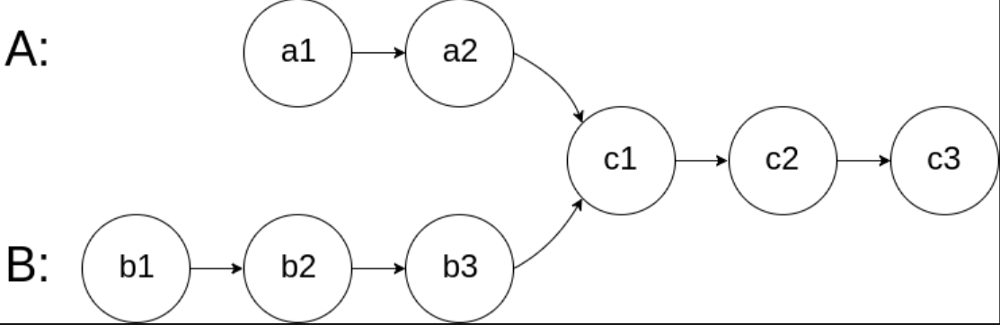
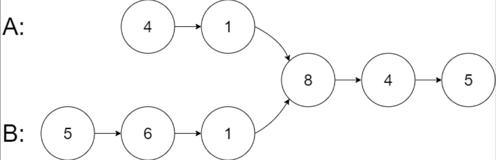
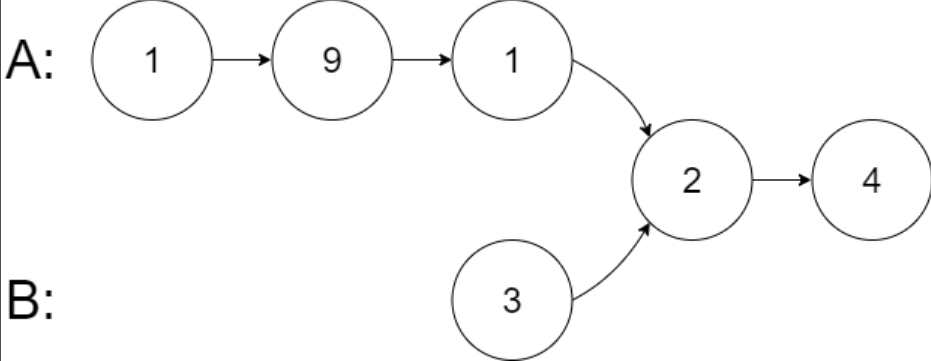
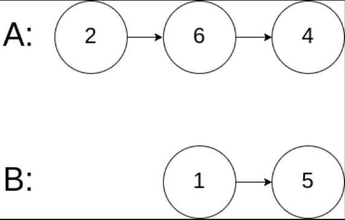

## I Problem
Given the heads of two singly linked-lists headA and headB, return the node at which the two lists intersect. If the two linked lists have no intersection at all, return null.

For example, the following two linked lists begin to intersect at node c1:

The test cases are generated such that there are no cycles anywhere in the entire linked structure.

**Note** that the linked lists must **retain their original structure** after the function returns.

**Custom Judge:**
The inputs to the judge are given as follows (your program is not given these inputs):

- `intersectVal` - The value of the node where the intersection occurs. This is 0 if there is no intersected node.
- `listA` - The first linked list.
- `listB` - The second linked list.
- `skipA` - The number of nodes to skip ahead in listA (starting from the head) to get to the intersected node.
- `skipB` - The number of nodes to skip ahead in listB (starting from the head) to get to the intersected node.

The judge will then create the linked structure based on these inputs and pass the two heads, `headA` and `headB` to your program. If you correctly return the intersected node, then your solution will be accepted.

**Example 1**

Input: intersectVal = 8, listA = [4, 1, 8, 4, 5], listB = [5, 6, 1, 8, 4, 5], skipA = 2, skipB = 3
Output: Intersected at '8'
Explanation: The intersected node's value is 8 (note that this must not be 0 if the two lists intersect).
From the head of A, it reads as [4, 1, 8, 4, 5]. From the head of B, it reads as [5, 6, 1, 8, 4, 5].
There are 2 nodes before the intersected node in A; There are 3 nodes before the intersected node in B.

- Note that the intersected node's value is not 1 because the nodes with value 1 in A and B (2ⁿᵈ node in A and 3ʳᵈ node in B) are different node references.
In other words, they point to two different locations in memory, while the nodes with value 8 in A and B (3ʳᵈ node in A and 4ᵗʰ node in B) point to the same location in memory.

**Example 2**

Input: intersectVal = 2, listA = [1, 9, 1, 2, 4], listB = [3, 2, 4], skipA = 3, skipB = 1
Output: Intersected at '2'
Explanation: The intersected node's value is 2 (note that this must not be 0 if the two lists intersect).
From the head of A, it reads as [1, 9, 1, 2, 4]. From the head of B, it reads as [3, 2, 4].
There are 3 nodes before the intersected node in A; There are 1 node before the intersected node in B.

**Example 3**

Input: intersectVal = 0, listA = [2, 6, 4], listB = [1, 5], skipA = 3, skipB = 2
Output: No intersection
Explanation: From the head of A, it reads as [2, 6, 4]. From the head of B, it reads as [1, 5].
Since the two lists do not intersect, intersectVal must be 0, while skipA and skipB can be arbitrary values.
The two lists do not intersect, so return null.

**Constraints**

- The number of nodes of `listA` is in the `m`.
- The number of nodes of `listB` is in the `n`.
- `1 <= m, n <= 3 * 10⁴`
- `1 <= Node.val <= 10⁵`
- `0 <= skipA < m`
- `0 <= skipB < n`
- `intersectVal` is `0` if `listA` and `listB` do not intersect.
- `intersectVal == listA[skipA] == listB[skipB]` if `listA` and `listB` intersect.

**Follow up**
Could you write a solution that runs in O(m + n) time and use only O(1) memory?

**Related Topics**

- Hash Table
- Linked List
- Two Pointers

## II Solution
::: code-tabs
@tab ListNode(Rust)
```rust
type NLink = *mut ListNode;

pub struct ListNode {
    pub val: i32,
    pub next: NLink,
}

impl ListNode {
    pub fn new(val: i32, next: NLink) -> NLink {
        Box::into_raw(Box::new(ListNode { val, next }))
    }
}
```

@tab ListNode(Java)
```java
public class ListNode {
    int val;
    ListNode next;

    public ListNode() {}
    public ListNode(int val) { this.val = val; }
    public ListNode(int val, ListNode next) { this.val = val; this.next = next; }
}
```
:::

### Approach 1: Use Hash Collection
::: code-tabs
@tab Rust
```rust
pub fn get_intersection_node(head_a: NLink, head_b: NLink) -> NLink {
    if head_a.is_null() || head_b.is_null() {
        return null_mut();
    }

    let mut set = HashSet::new();
    while !head_a.is_null() {
        let temp = head_a;
        set.insert(temp);
        unsafe {
            head_a = (*head_a).next;
        }
    }
    while !head_b.is_null() {
        let temp = head_b;
        if set.contains(&temp) {
            return temp;
        }
        unsafe {
            head_b = (*head_b).next;
        }
    }

    null_mut()
}
```

@tab Java
```java
public ListNode getIntersectionNode(ListNode headA, ListNode headB) {
    if (headA == null || headB == null) {
        return null;
    }

    HashSet<ListNode> set = new HashSet<>();
    while (headA != null) {
        ListNode temp = headA;
        set.add(temp);
        headA = headA.next;
    }
    while (headB != null) {
        ListNode temp = headB;
        if (set.contains(temp)) {
            return temp;
        }
        headB = headB.next;
    }

    return null;
}
```
:::

### Approach 2: Two Pointers
::: code-tabs
@tab Rust
```rust
pub fn get_intersection_node(head_a: NLink, head_b: NLink) -> NLink {
    if head_a.is_null() || head_b.is_null() {
        return null_mut();
    }

    let mut ptr_a = head_a;
    let mut ptr_b = head_b;
    while ptr_a != ptr_b {
        unsafe {
            ptr_a = if ptr_a.is_null() {
                head_b
            } else {
                (*ptr_a).next
            };
            ptr_b = if ptr_b.is_null() {
                head_a
            } else {
                (*ptr_b).next
            };
        }
    }

    ptr_a
}
```

@tab Java
```java
public ListNode getIntersectionNode(ListNode headA, ListNode headB) {
    if (headA == null || headB == null) {
        return null;
    }

    ListNode ptrA = headA, ptrB = headB;
    while (ptrA != ptrB) {
        ptrA = ptrA == null ? headB : ptrA.next;
        ptrB = ptrB == null ? headA : ptrB.next;
    }

    return ptrA;
}
```
:::