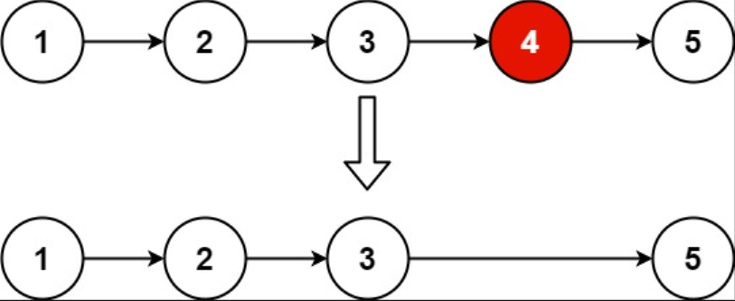

## I Problem
Given the `head` of a linked list, remove the `nᵗʰ` node from the end of the list and return its head.

**Example 1**

Input: head = [1, 2, 3, 4, 5], n = 2
Output: [1, 2, 3, 5]

**Example 2**
Input: head = [1], n = 1
Output: []

**Example 3**
Input: head = [1, 2], n = 1
Output: [1]

**Constraints**

- The number of nodes in the list is sz
- 1 <= sz <= 30
- 0 <= Node.val <= 100
- 1 <= n <= sz

**Follow up**
Could you do this in one pass?

**Related Topics**

- Linked List
- Two Pointers

## II Solution
```text
// for Rust
pub struct ListNode {
    pub val: i32,
    pub next: Option<Box<ListNode>>,
}

// for Java
public class ListNode {
    int val;
    ListNode next;
}
```
### Approach 1: Calculate Length of Linked List
::: code-tabs
@tab Rust
```rust
/// Time Complexity: O(n)
///
/// Space Complexity: O(1)
pub fn remove_nth_from_end(head: Option<Box<ListNode>>, n: i32) -> Option<Box<ListNode>> {
    // calculate the len of linked list
    let mut counter = head.as_ref();
    let mut len = 0;
    while let Some(curr) = counter {
        len += 1;
        counter = curr.next.as_ref();
    }

    let mut dummy = ListNode::new(-1);
    dummy.next = head;
    let mut p = &mut dummy;
    // move p to the previous node of to be deleted node
    for _ in 0..(len - n) {
        p = p.next.as_mut().unwrap();
    }
    if let Some(mut to_be_del) = p.next.take() {
        p.next = to_be_del.next.take();
    }

    dummy.next
}
```

@tab Java
```java
/**
 * Time Complexity: O(n)
 * Space Complexity: O(1)
 */
public ListNode removeNthFromEnd(ListNode head, int n) {
    // calculate the len of linked list
    int len = 0;
    for (ListNode p = head; p != null; ++len) {
        p = p.next;
    }

    // move p to the previous node of to be deleted node
    ListNode dummy = new ListNode(-1, head);
    ListNode p = dummy;
    for (int i = 0; i < len - n; i++) {
        p = p.next;
    }
    p.next = p.next.next;

    return dummy.next;
}
```
:::

### Approach 2: Use Stack
::: code-tabs
@tab Rust
```rust
/// Time Complexity: O(n)
///
/// Space Complexity: O(n)
pub fn remove_nth_from_end(head: Option<Box<ListNode>>, n: i32) -> Option<Box<ListNode>> {
    let mut stack = vec![];
    while let Some(mut curr) = head {
        head = curr.next.take();
        stack.push(curr);
    }

    let mut i = 0;
    let mut head = None;
    while let Some(mut curr) = stack.pop() {
        i += 1;
        if i != n {
            curr.next = head;
            head = Some(curr);
        }
    }

    head
}
```

@tab Java
```java
/**
 * Time Complexity: O(n)
 * Space Complexity: O(n)
 */
public ListNode removeNthFromEnd(ListNode head, int n) {
    Stack<ListNode> stack = new Stack<>();
    while (head != null) {
        ListNode curr = head;
        stack.push(curr);
        head = head.next;
    }

    int i = 0;
    ListNode new_head = null;
    while (!stack.isEmpty()) {
        ListNode node = stack.pop();
        ++i;
        if (i != n) {
            node.next = new_head;
            new_head = node;
        }
    }

    return new_head;
}
```
:::

### Approach 3: Two Pointers
::: code-tabs
@tab Rust
```rust
/// Time Complexity: O(n)
///
/// Space Complexity: O(1)
pub fn remove_nth_from_end(head: Option<Box<ListNode>>, n: i32) -> Option<Box<ListNode>> {
    let mut dummy = ListNode::new(-1);
    dummy.next = head;
    let mut fast = &dummy as *const ListNode;
    let mut slow = &mut dummy as *mut ListNode;

    unsafe {
        for _ in 0..n {
            fast = (*fast).next.as_deref().unwrap();
        }
        loop {
            if (*fast).next.is_none() {
                break;
            }
            fast = (*fast).next.as_deref().unwrap();
            slow = (*slow).next.as_deref_mut().unwrap();
        }
        if let Some(mut to_be_del) = (*slow).next.take() {
            (*slow).next = to_be_del.next.take();
        }
    }

    dummy.next
}
```

@tab Java
```java
/**
 * Time Complexity: O(n)
 * Space Complexity: O(1)
 */
public ListNode removeNthFromEnd(ListNode head, int n) {
    ListNode dummy = new ListNode(-1, head);
    ListNode fast = dummy;
    ListNode slow = dummy;

    for (int i = 0; i < n; i++) {
        fast = fast.next;
    }
    while (fast.next != null) {
        fast = fast.next;
        slow = slow.next;
    }
    slow.next = slow.next.next;

    return dummy.next;
}
```
:::

### Approach 4: Recursion
::: code-tabs
@tab Rust
```rust
pub fn remove_nth_from_end(head: Option<Box<ListNode>>, n: i32) -> Option<Box<ListNode>> {
    const RECURSION_HELPER: fn(Option<Box<ListNode>>, i32) -> (i32, Option<Box<ListNode>>) =
        |curr, n| match curr {
            None => (0, None),
            Some(mut curr) => {
                let (level, next) = RECURSION_HELPER(curr.next.take(), n);
                curr.next = next;
                if level + 1 == n {
                    (level + 1, curr.next)
                } else {
                    (level + 1, Some(curr))
                }
            }
        };

    RECURSION_HELPER(head, n).1
}
```

@tab Java
```java
static class Tuple {
    ListNode data;
    int level;
}

BiFunction<ListNode, Integer, Tuple> recursionHelper = (curr, n) -> {
    if (curr == null) {
        return new Tuple(null, 0);
    }
    Tuple res = this.recursionHelper.apply(curr.next, n);
    curr.next = res.data;
    return res.level + 1 == n ? new Tuple(curr.next, res.level + 1) : new Tuple(curr, res.level + 1);
};

/**
 * Time Complexity: O(n)
 * Space Complexity: O(n)
 */
public ListNode removeNthFromEnd(ListNode head, int n) {
    return this.recursionHelper.apply(head, n).data;
}
```
:::