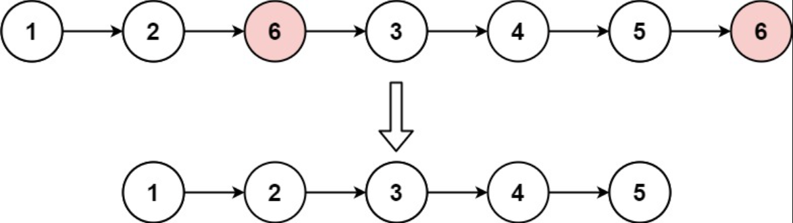

## I Problem
Given the head of a linked list and an integer val, remove all the nodes of the linked list that has Node.val == val, and return the new head.

**Example 1**

Input: head = [1, 2, 6, 3, 4, 5, 6], val = 6
Output: [1, 2, 3, 4, 5]

**Example 2**
Input: head = [], val = 1
Output: []

**Example 3**
Input: head = [7, 7, 7, 7], val = 7
Output: []

**Constraints**

- The number of nodes in the list is in the range [0, 10⁴]
- 1 <= Node.val <= 50
- 0 <= val <= 50

**Related Topics**

- Linked List
- Recursion

## II Solution
::: code-tabs
@tab ListNode(Rust)
```rust
#[derive(PartialEq, Eq, Clone, Debug)]
pub struct ListNode {
    pub val: i32,
    pub next: Option<Box<ListNode>>,
}

impl ListNode {
    #[inline]
    fn new(val: i32) -> Self {
        ListNode { next: None, val }
    }
}
```

@tab ListNode(Java)
```java
public class ListNode {
    int val;
    ListNode next;

    public ListNode() {}
    public ListNode(int val) { this.val = val; }
    public ListNode(int val, ListNode next) { this.val = val; this.next = next; }
}
```
:::

### Approach 1: Iteration
::: code-tabs
@tab Rust
```rust
pub fn remove_elements(head: Option<Box<ListNode>>, val: i32) -> Option<Box<ListNode>> {
    match head {
        None => None,
        Some(head) => {
            let mut dummy = ListNode::new(-1);
            dummy.next = Some(head);
            let mut p = &mut dummy;

            while let Some(curr) = p.next.take() {
                if curr.val == val {
                    p.next = curr.next;
                } else {
                    p.next = Some(curr);
                    p = p.next.as_mut().unwrap();
                }
            }

            dummy.next
        }
    }
}
```

@tab Java
```java
public ListNode removeElements(ListNode head, int val) {
    if (head == null) {
        return null;
    }

    ListNode dummy = new ListNode(-1, head);
    ListNode p = dummy;
    while (p.next != null) {
        ListNode curr = p.next;
        if (curr.val == val) {
            p.next = curr.next;
        } else {
            p = curr;
        }
    }

    return dummy.next;
}
```
:::

### Approach 2: Recursion
::: code-tabs
@tab Rust
```rust
pub fn remove_elements(head: Option<Box<ListNode>>, val: i32) -> Option<Box<ListNode>> {
    match head {
        None => None,
        Some(mut head) => {
            head.next = Self::recursion_helper(head.next.take(), val);
            if head.val == val {
                head.next
            } else {
                Some(head)
            }
        }
    }
}
```

@tab Java
```java
public ListNode removeElements(ListNode head, int val) {
    if (head == null) {
        return null;
    }
    
    head.next = this.recursionHelper(head.next, val);
    return head.val == val ? head.next : head;
}
```
:::