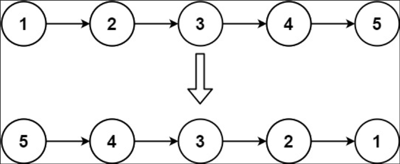

## I Problem
Given the head of a singly linked list, reverse the list, and return the reversed list.

**Example 1**

Input: head = [1, 2, 3, 4, 5]
Output: [5, 4, 3, 2, 1]

**Example 2**

Input: head = [1, 2]
Output: [2, 1]

**Example 3**
Input: head = []
Output: []

**Constraints**

- The number of nodes in the list is the range [0, 5000]
- -5000 <= Node.val <= 5000

**Follow up**
A linked list can be reversed either iteratively or recursively. Could you implement both?

**Related Topics**

- Linked List
- Recursion

## II Solution

### Approach 1: Iteration
::: code-tabs
@tab Rust
```rust
pub struct ListNode {
    pub val: i32,
    pub next: Option<Box<ListNode>>,
}

pub fn reverse_list(mut head: Option<Box<ListNode>>) -> Option<Box<ListNode>> {
    let mut new_head = None;

    while let Some(mut node) = head {
        head = node.next.take();
        node.next = new_head;
        new_head = Some(node);
    }

    new_head
}
```

@tab Java
```java
public class ListNode {
     int val;
     ListNode next;
}

public ListNode reverseList(ListNode head) {
    ListNode newHead = null;
    ListNode curr = null;

    while (head != null) {
        curr = head;
        head = head.next;
        curr.next = newHead;
        newHead = curr;
    }

    return newHead;
}
```
:::

### Approach 2: Recursion
::: code-tabs
@tab Rust
```rust
pub struct ListNode {
    pub val: i32,
    pub next: Option<Box<ListNode>>,
}

pub fn reverse_list(head: Option<Box<ListNode>>) -> Option<Box<ListNode>> {
    const RECURSION_HELPER: fn(
        Option<Box<ListNode>>,
        Option<Box<ListNode>>,
    ) -> Option<Box<ListNode>> = |prev, curr| match curr {
        None => prev,
        Some(mut curr) => {
            let next = curr.next.take();
            curr.next = prev;
            RECURSION_HELPER(Some(curr), next)
        }
    };

    RECURSION_HELPER(None, head)
}
```

@tab Java
```java
public class ListNode {
     int val;
     ListNode next;
}

BiFunction<ListNode, ListNode, ListNode> recursionHelper = (prev, curr) -> {
    if (curr == null) {
        return prev;
    }

    ListNode next = curr.next;
    curr.next = prev;
    return this.recursionHelper.apply(curr, next);
};

public ListNode reverseList(ListNode head) {
    return recursionHelper.apply(null, head);
}
```
:::