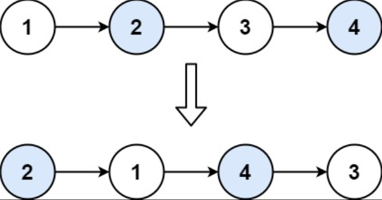

## I Problem
Given a linked list, swap every two adjacent nodes and return its head. You must solve the problem without modifying the values in the list's nodes (i.e., only nodes themselves may be changed.)

**Example 1**

Input: head = [1, 2, 3, 4]
Output: [2, 1, 4, 3]

**Example 2**
Input: head = []
Output: []

**Example 3**
Input: head = [1]
Output: [1]

**Constraints**

- The number of nodes in the list is in the range [0, 100]
- 0 <= Node.val <= 100

**Related Topics**

- Linked List
- Recursion

## II Solution
::: code-tabs
@tab ListNode(Rust)
```rust
#[derive(PartialEq, Eq, Clone, Debug)]
pub struct ListNode {
    pub val: i32,
    pub next: Option<Box<ListNode>>,
}

impl ListNode {
    #[inline]
    fn new(val: i32) -> Self {
        ListNode { next: None, val }
    }
}
```

@tab ListNode(Java)
```java
public class ListNode {
    int val;
    ListNode next;

    public ListNode() {}
    public ListNode(int val) { this.val = val; }
    public ListNode(int val, ListNode next) { this.val = val; this.next = next; }
}
```
:::

### Approach 1: Iteration
::: code-tabs
@tab Rust
```rust
pub fn swap_pairs(head: Option<Box<ListNode>>) -> Option<Box<ListNode>> {
    let mut dummy = ListNode::new(-1);
    dummy.next = head;
    let mut p = &mut dummy;

    while let Some(mut curr) = p.next.take() {
        match curr.next.take() {
            None => {
                p.next = Some(curr);
                break;
            }
            Some(mut next) => {
                curr.next = next.next.take();
                next.next = Some(curr);
                p.next = Some(next);
                p = p.next.as_mut().unwrap().next.as_mut().unwrap();
            }
        }
    }

    dummy.next
}
```

@tab Java
```java
public ListNode swapPairs(ListNode head) {
    ListNode dummy = new ListNode(-1, head);
    ListNode temp = dummy;

    while (temp.next != null) {
        ListNode curr = temp.next;
        ListNode next = curr.next;
        if (next == null) {
            break;
        }
        curr.next = next.next;
        next.next = curr;
        temp.next = next;
        temp = curr;
    }

    return dummy.next;
}
```
:::

### Approach 2: Recursion
::: code-tabs
@tab Rust
```rust
pub fn swap_pairs(head: Option<Box<ListNode>>) -> Option<Box<ListNode>> {
    const RECURSION_HELPER: fn(Option<Box<ListNode>>) -> Option<Box<ListNode>> =
        |curr| match curr {
            None => None,
            Some(mut curr) => match curr.next.take() {
                None => Some(curr),
                Some(mut next) => {
                    curr.next = RECURSION_HELPER(next.next.take());
                    next.next = Some(curr);
                    Some(next)
                }
            },
        };

    RECURSION_HELPER(head)
}
```

@tab Java
```java
Function<ListNode, ListNode> recursionHelper = (curr) -> {
    if (curr == null) {
        return null;
    }
    ListNode next = curr.next;
    if (next == null) {
        return curr;
    }
    curr.next = this.recursionHelper.apply(next.next);
    next.next = curr;
    return next;
};

public ListNode swapPairs(ListNode head) {
    return this.recursionHelper.apply(head);
}
```
:::