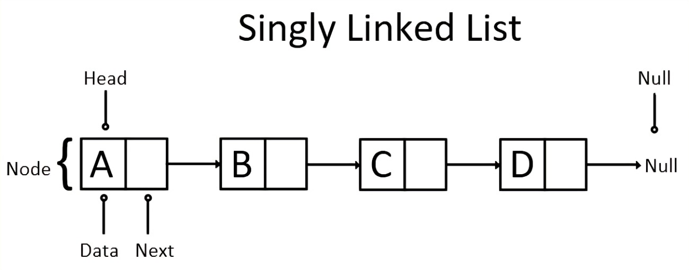
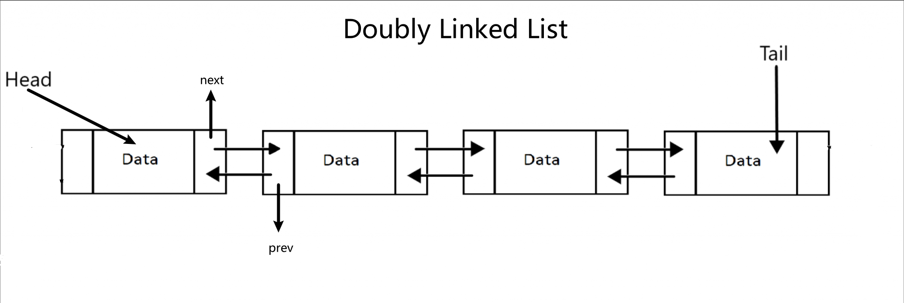
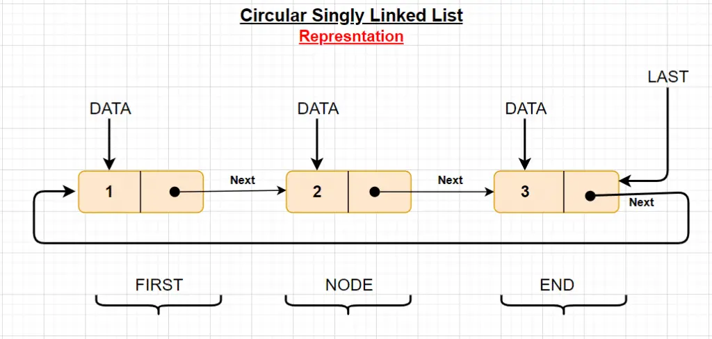
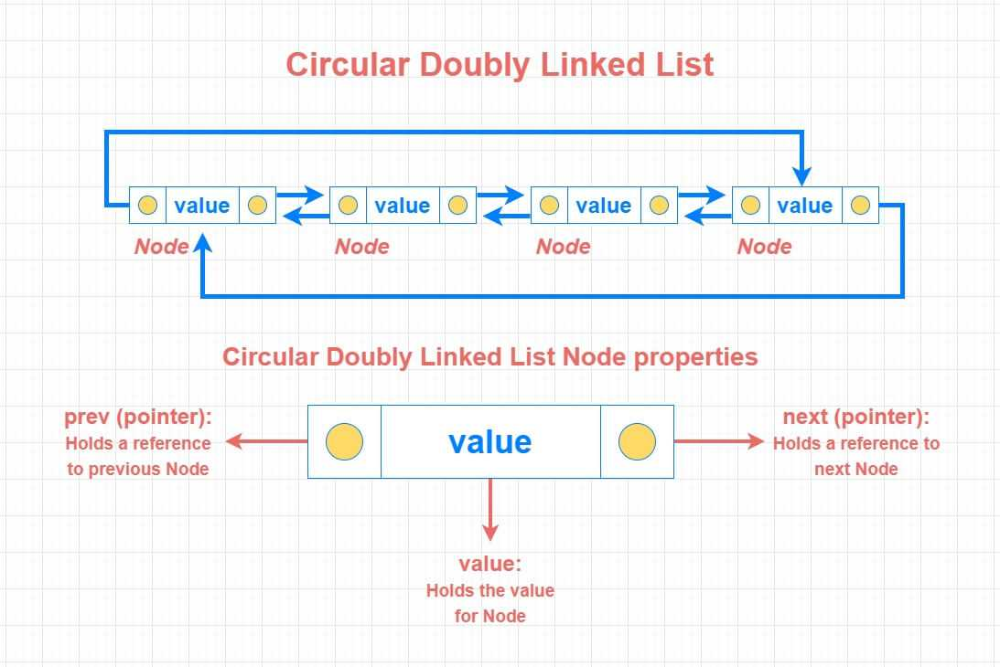
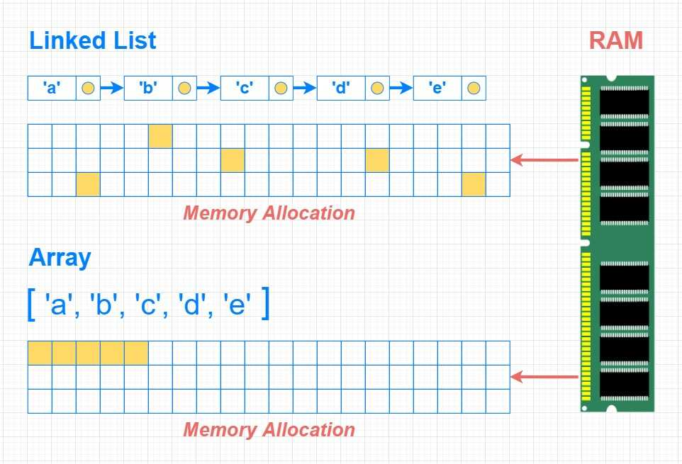
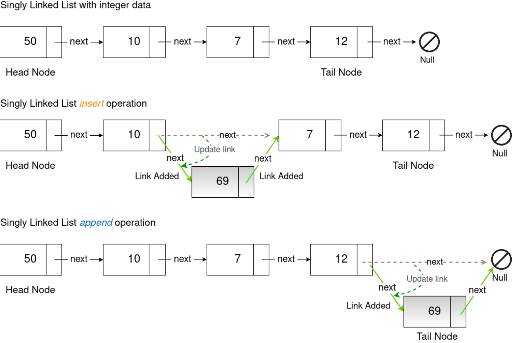
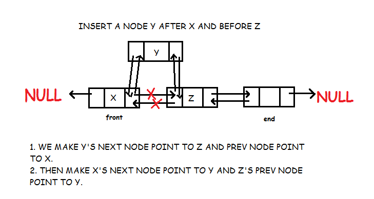
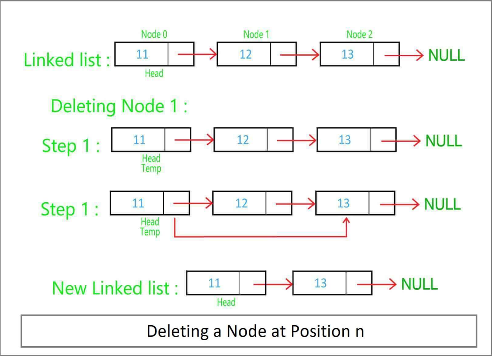
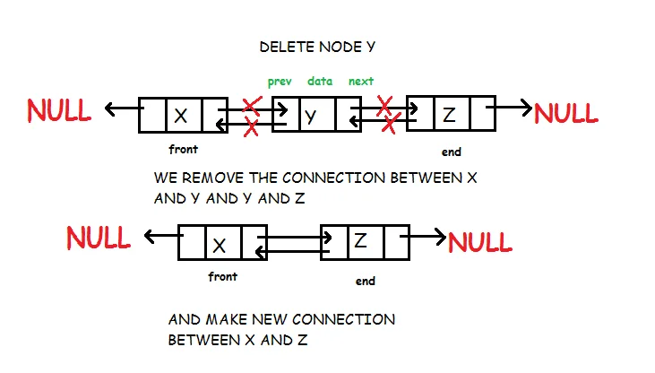

## About Linked List
Linked list is a linear structure linked together by a series of pointers, with each node consisting of two parts, a data field and a pointer field.

### Type of Linked List

- singly linked list

- doubly linked list

- circular singly linked list

- circular doubly linked list

### Linked List Memory Allocation
The nodes in a linked list are not continuously distributed in memory, but are scattered at certain addresses in memory.

### Operation of LinkedList
#### Add

#### Delete

## Exercise
### Remove Linked List Elements
[203: Remove Linked List Elements](203_remove_linked_list_elements.md)

### Design Linked List
[707: Design Linked List](707_design_linked_list.md)

### Reverse Linked List
[206: Reverse Linked List](206_reverse_linked_list.md)

### Swap Nodes in Pairs
[24: Swap Nodes in Pairs](24_swap_nodes_in_pairs.md)

### Remove Nth Node From End of List
[19: Remove Nth Node From End of List](19_remove_nth_node_from_end_of_list.md)

### Intersection of Two Linked Lists
[160: Intersection of Two Linked Lists]

### Linked List Cycle
[141: Linked List Cycle]
[142: Linked List Cycle II]

## Summary
