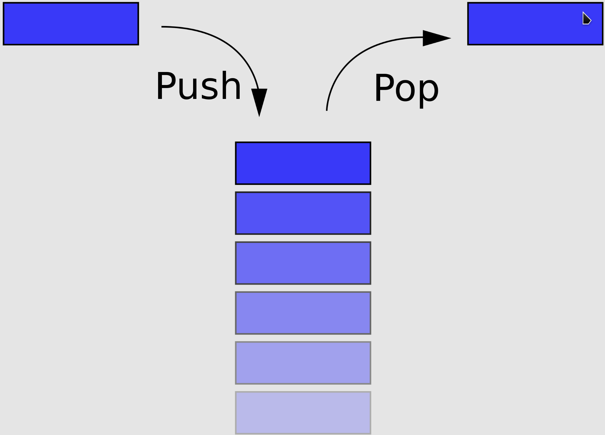
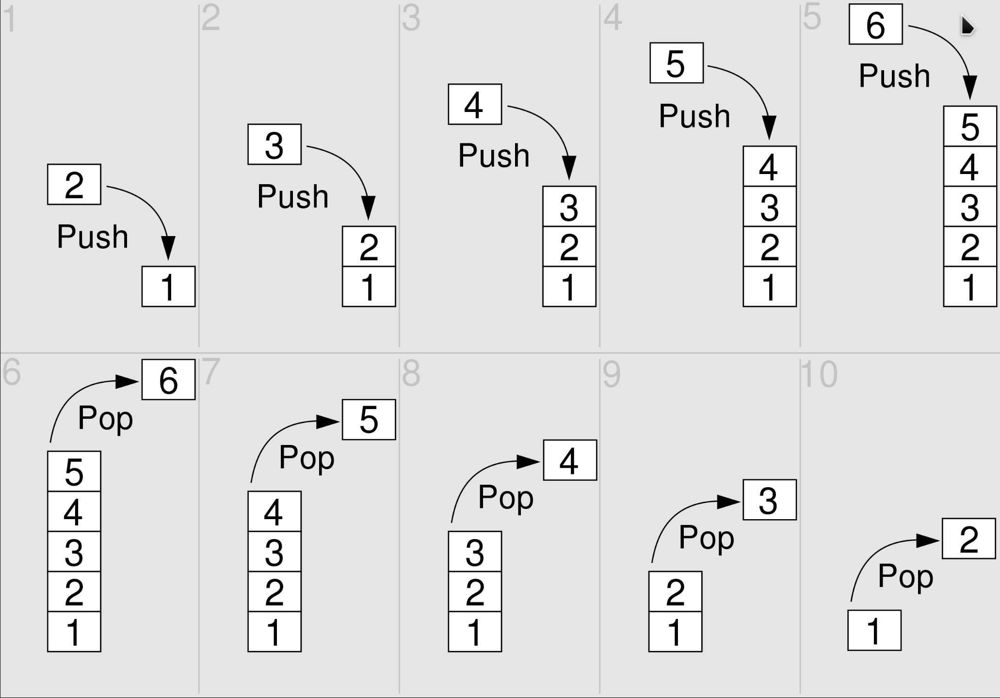
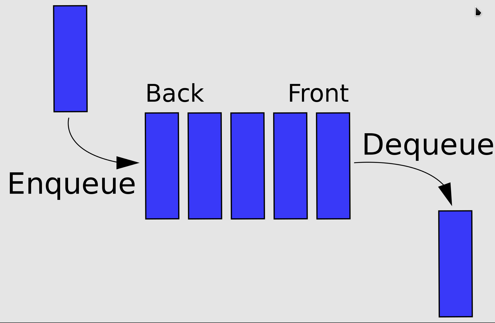

## Stack/Queue
### Stack
In computer science, a `stack` is an abstract data type that serves as a collection of elements with two main operations:
- **Push**, which adds an element to the collection, and
- **Pop**, which removes the most recently added element.

Additionally, a **peek** operation can, without modifying the stack, return the value of the last element added. The name stack is an analogy to a set of physical items stacked one atop another, such as a stack of plates.

The order in which an element added to or removed from a stack is described as last in, first out, referred to by the acronym **LIFO**. As with a stack of physical objects, this structure makes it easy to take an item off the top of the stack, but accessing a datum deeper in the stack may require removing multiple other items first.

Considered a linear data structure, or more abstractly a sequential collection, a stack has one end which is the only position at which the push and pop operations may occur, the top of the stack, and is fixed at the other end, the bottom. This data structure makes it possible to implement a stack as a singly linked list and as a pointer to the top element. A stack may be implemented to have a bounded capacity. If the stack is full and does not contain enough space to accept another element, the stack is in a state of stack overflow.

A stack is needed to implement depth-first search.

### Queue
In computer science, a `queue` is a collection of entities that are maintained in a sequence and can be modified by the addition of entities at one end of the sequence and the removal of entities from the other end of the sequence. By convention, the end of the sequence at which elements are added is called the back, tail, or rear of the queue, and the end at which elements are removed is called the head or front of the queue, analogously to the words used when people line up to wait for goods or services.

The operation of adding an element to the rear of the queue is known as **enqueue**, and the operation of removing an element from the front is known as **dequeue**. Other operations may also be allowed, often including a peek or front operation that returns the value of the next element to be dequeued without dequeuing it.

The operations of a queue make it a first-in-first-out (**FIFO**) data structure. In a FIFO data structure, the first element added to the queue will be the first one to be removed. This is equivalent to the requirement that once a new element is added, all elements that were added before have to be removed before the new element can be removed. A queue is an example of a linear data structure, or more abstractly a sequential collection. Queues are common in computer programs, where they are implemented as data structures coupled with access routines, as an abstract data structure or in object-oriented languages as classes. Common implementations are circular buffers and linked lists.

Queues provide services in computer science, transport, and operations research where various entities such as data, objects, persons, or events are stored and held to be processed later. In these contexts, the queue performs the function of a buffer. Another usage of queues is in the implementation of breadth-first search.

## Exercise
[232: Implement Queue using Stacks](232_implement_queue_using_stacks.md)
[225: Implement Stack using Queues](225_implement_stack_using_queues.md)
[20: Valid Parentheses](20_valid_parentheses.md)
[1047: Remove All Adjacent Duplicates In String](1047_remove_all_adjacent_duplicates_in_string.md)
[150: Evaluate Reverse Polish Notation](150_evaluate_reverse_polish_notation.md)
[239: Sliding Window Maximum]
[347: Top K Frequent Elements]

## Summary
