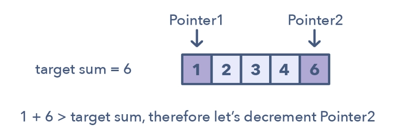

## Two Pointers
The two pointers technique is a technique used to iterate through a data set, typically an array or a list, in a controlled way. It involves using two pointers, one pointing to the beginning of the data set and the other pointing to the end, and moving them towards each other based on specific conditions. This technique is commonly used to solve problems that involve searching for a specific condition or pattern within a data set, or that require a comparison between different elements in the data set.

The two pointers technique is mainly used for solving problems that have a linear time complexity, it can lead to substantial performance improvements over a brute-force approach. Some common examples of problems that can be solved using this technique include:
- Finding the maximum / minimum value in a set of data.
- Counting the number of occurrences of a specific element.
- Finding the longest substring without repeating characters.
- Finding the maximum sum of a sub-array of size k.

Overall, the two pointers technique is a useful approach for solving specific types of problems that involve iterating through a data set in a controlled way, such as in pattern matching, data analysis, and statistics. It allows for an efficient and controlled iteration of a data set, which can lead to improved performance and more accurate results.

## Exercise
### Remove Element
[27: Remove Element](../array/27_remove_element.md)
[26: Remove Duplicates from Sorted Array](../array/26_remove_duplicates_from_sorted_array.md)
[283: Move Zeroes](../array/283_move_zeroes.md)
[844: Backspace String Compare](../array/844_backspace_string_compare.md)
[977: Squares of a Sorted Array](../array/977_squares_of_a_sorted_array.md)

### Reverse String
[344: Reverse String](../string/344_reverse_string.md)

### Replace Numbers
[KamaCoder 54: Replace Numbers](../string/kamacoder_54_replace_numbers.md)

### Reverse Words in s String
[151: Reverse words in a String](../string/151_reverse_words_in_a_string.md)

### Reverse Linked List
[206: Reverse Linked List](../linkedlist/206_reverse_linked_list.md)

### Remove Nth Node From End of List
[19: Remove Nth Node From End of List](../linkedlist/19_remove_nth_node_from_end_of_list.md)

### Intersection of Two Linked Lists
[160: Intersection of Two Linked Lists](../linkedlist/160_intersection_of_two_linked_lists.md)

### Linked List Cycle
[141: Linked List Cycle](../linkedlist/141_linked_list_cycle.md)
[142: Linked List Cycle II](../linkedlist/142_linked_list_cycle_II.md)

### Three Sum
[15: Three Sum](../hashtable/15_three_sum.md)
[16: Three Sum Closest](../hashtable/16_three_sum_closest.md)

### Four Sum
[18: Four Sum](../hashtable/18_four_sum.md)

## Summary