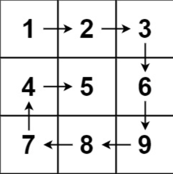
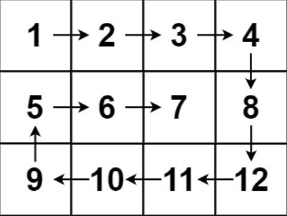

## 一、题目描述
给你一个m行n列的矩阵matrix，请按照顺时针螺旋顺序返回矩阵中的所有元素。

**示例 1**

输入: matrix = [[1, 2, 3],[4, 5, 6],[7, 8, 9]]
输出: [1, 2, 3, 6, 9, 8, 7, 4, 5]

**示例 2**

输入: matrix = [[1, 2, 3, 4],[5, 6, 7, 8],[9, 10, 11, 12]]
输出: [1, 2, 3, 4, 8, 12, 11, 10, 9, 5, 6, 7]

**提示**

- m == matrix.length
- n == matrix[i].length
- 1 <= m, n <= 10
- -100 <= matrix[i][j] <= 100

**相关主题**

- 数组
- 矩阵
- 模拟

## 二、题解
### 方法 1: 模拟
::: code-tabs
@tab Rust
```rust
/// Time Complexity: O(row * col)
///
/// Space Complexity: O(1)
pub fn spiral_order(matrix: Vec<Vec<i32>>) -> Vec<i32> {
    let row = matrix.len() as i32;
    let col = matrix[0].len() as i32;
    let total_len = (row * col) as usize;

    let directions = [(0, 1), (1, 0), (0, -1), (-1, 0)];
    let mut dir_idx = 0;
    let mut i = 0_i32;
    let mut j = 0_i32;
    let mut res = Vec::with_capacity(total_len);
    for _ in 1..=total_len {
        res.push(matrix[i as usize][j as usize]);
        matrix[i as usize][j as usize] = i32::MIN;
        let next_i = i + directions[dir_idx].0;
        let next_j = j + directions[dir_idx].1;
        if next_i < 0
            || next_i >= row
            || next_j < 0
            || next_j >= col
            || matrix[next_i as usize][next_j as usize] == i32::MIN
        {
            dir_idx = (dir_idx + 1) % 4;
        }
        i += directions[dir_idx].0;
        j += directions[dir_idx].1;
    }

    res
}
```

@tab Java
```java
public List<Integer> spiralOrder(int[][] matrix) {
    int row = matrix.length;
    int col = matrix[0].length;
    int totalLen = row * col;

    int[][] directions = new int[][]{{0, 1}, {1, 0}, {0, -1}, {-1, 0}};
    int dirIdx = 0;
    List<Integer> res = new ArrayList<>(totalLen);
    int i = 0, j = 0;
    for (;totalLen-- > 0;) {
        res.add(matrix[i][j]);
        matrix[i][j] = Integer.MIN_VALUE;
        int next_i = i + directions[dirIdx][0];
        int next_j = j + directions[dirIdx][1];
        if (next_i < 0 || next_i >= row || next_j < 0 || next_j >= col || matrix[next_i][next_j] == Integer.MIN_VALUE) {
            dirIdx = (dirIdx + 1) % 4;
        }
        i += directions[dirIdx][0];
        j += directions[dirIdx][1];
    }

    return res;
}
```
:::

### 方法 2: 按层模拟
::: code-tabs
@tab Rust
```rust
/// Time Complexity: O(row * col)
///
/// Space Complexity: O(1)
pub fn spiral_order(matrix: Vec<Vec<i32>>) -> Vec<i32> {
    let row = matrix.len();
    let col = matrix[0].len();
    let total_len = row * col;

    let mut left = 0_i32;
    let mut right = (col - 1) as i32;
    let mut top = 0_i32;
    let mut bottom = (row - 1) as i32;
    let mut res = Vec::with_capacity(total_len);
    while left <= right && top <= bottom {
        // left(top) -> right(top)
        for j in left..=right {
            res.push(matrix[top as usize][j as usize]);
        }
        // right(top)
        //   ↓
        // right(bottom)
        for i in top + 1..=bottom {
            res.push(matrix[i as usize][right as usize]);
        }
        if left < right && top < bottom {
            // left(bottom) <- right(bottom)
            for j in (left + 1..=right - 1).rev() {
                res.push(matrix[bottom as usize][j as usize]);
            }
            // left(top)
            //   ↑
            // left(bottom)
            for i in (top + 1..=bottom).rev() {
                res.push(matrix[i as usize][left as usize]);
            }
        }
        left += 1;
        right -= 1;
        top += 1;
        bottom -= 1;
    }

    res
}
```

@tab Java
```java
public List<Integer> spiralOrder(int[][] matrix) {
    int row = matrix.length;
    int col = matrix[0].length;
    int totalLen = row * col;

    List<Integer> res = new ArrayList<>(totalLen);
    int left = 0;
    int right = col - 1;
    int top = 0;
    int bottom = row - 1;
    while (left <= right && top <= bottom) {
        // left(top) -> right(top)
        for (int j = left; j <= right; j++) {
            res.add(matrix[top][j]);
        }
        // right(top)
        //   ↓
        // right(bottom)
        for (int i = top + 1; i <= bottom; i++) {
            res.add(matrix[i][right]);
        }
        if (left < right && top < bottom) {
            // left(bottom) <- right(bottom)
            for (int j = right - 1; j >= left + 1; j--) {
                res.add(matrix[bottom][j]);
            }
            // left(top)
            //   ↓
            // left(bottom)
            for (int i = bottom; i >= top + 1; i--) {
                res.add(matrix[i][left]);
            }
        }
        left++;
        right--;
        top++;
        bottom--;
    }
    
    return res;
}
```
:::