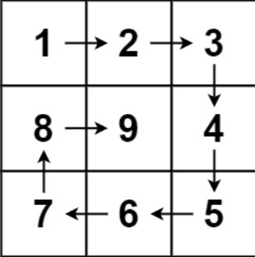

## 一、题目描述
给你一个正整数n，生成一个包含`1到n²`所有元素，且元素按顺时针顺序螺旋排列的`n x n`正方形矩阵matrix。

**示例 1**

输入: n = 3
输出: [[1, 2, 3], [8, 9, 4], [7, 6, 5]]

**示例 2**
输入: n = 1
输出: [[1]]

**提示**

- 1 <= n <= 20

**相关主题**

- 数组
- 矩阵
- 模拟

## 二、题解
### 方法 1: 模拟
::: code-tabs
@tab Rust
```rust
pub fn generate_matrix(n: i32) -> Vec<Vec<i32>> {
    let total_len = n * n;
    let mut res = vec![vec![0; n as usize]; n as usize];
    let directions = [(0, 1), (1, 0), (0, -1), (-1, 0)];
    let mut dir_idx = 0;
    let mut col = 0_i32;
    let mut row = 0_i32;

    for i in 1..=total_len {
        res[row as usize][col as usize] = i;
        let next_row = row + directions[dir_idx].0;
        let next_col = col + directions[dir_idx].1;
        if next_row < 0
            || next_row >= n
            || next_col < 0
            || next_col >= n
            || res[next_row as usize][next_col as usize] != 0
        {
            dir_idx = (dir_idx + 1) % 4;
        }
        row += directions[dir_idx].0;
        col += directions[dir_idx].1;
    }

    res
}
```

@tab Java
```java
public int[][] generateMatrix(int n) {
    int totalLen = n * n;
    int[][] res = new int[n][n];
    int row = 0, col = 0;
    int[][] directions = new int[][]{{0, 1}, {1, 0}, {0, -1}, {-1, 0}};
    int dirIdx = 0;

    for (int val = 1; val <= totalLen; val++) {
        res[row][col] = val;
        int next_row = row + directions[dirIdx][0];
        int next_col = col + directions[dirIdx][1];
        if (next_row < 0 || next_row >= n || next_col < 0 || next_col >= n || res[next_row][next_col] != 0) {
            dirIdx = (dirIdx + 1) % 4;
        }
        row += directions[dirIdx][0];
        col += directions[dirIdx][1];
    }

    return res;
}
```
:::

### 方法 2: 按层模拟
::: code-tabs
@tab Rust
```rust
pub fn generate_matrix(n: i32) -> Vec<Vec<i32>> {
    let mut left = 0;
    let mut right = n - 1;
    let mut top = 0;
    let mut bottom = n - 1;
    let mut res = vec![vec![0; n as usize]; n as usize];
    let mut val = 1;

    while left <= right && top <= bottom {
        // left(top) -> right(top)
        for col in left..=right {
            res[top as usize][col as usize] = val;
            val += 1;
        }
        // right(top)
        //     ↓
        // right(bottom)
        for row in top + 1..=bottom {
            res[row as usize][right as usize] = val;
            val += 1;
        }
        if left < right && top < bottom {
            // left(bottom) <- right(bottom)
            for col in (left + 1..=right - 1).rev() {
                res[bottom as usize][col as usize] = val;
                val += 1;
            }
            // left(top)
            //     ↑
            // left(bottom)
            for row in (top + 1..=bottom).rev() {
                res[row as usize][left as usize] = val;
                val += 1;
            }
        }
        left += 1;
        right -= 1;
        top += 1;
        bottom -= 1;
    }

    res
}
```

@tab Java
```java
public int[][] generateMatrix(int n) {
    int[][] res = new int[n][n];
    int val = 1;
    int left = 0, right = n - 1;
    int top = 0, bottom = n - 1;

    while (left <= right && top <= bottom) {
        // left(top) -> right(top)
        for (int col = left; col <= right; col++) {
            res[top][col] = val++;
        }
        // right(top)
        //     ↓
        // right(bottom)
        for (int row = top + 1; row <= bottom; row++) {
            res[row][right] = val++;
        }
        if (left < right && top < bottom) {
            // left(bottom) <- right(bottom)
            for (int col = right - 1; col >= left + 1; col--) {
                res[bottom][col] = val++;
            }
            // left(top)
            //     ↑
            // left(bottom)
            for (int row = bottom; row >= top + 1; row--) {
                res[row][left] = val++;
            }
        }
        left++;
        right--;
        top++;
        bottom--;
    }
    
    return res;
}
```
:::