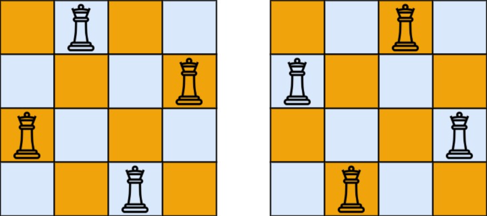

## 一、题目描述
按照国际象棋的规则，皇后可以攻击与之处在同一行或同一列或同一斜线上的棋子。

`n`**皇后问题**研究的是如何将`n`个皇后放置在`n×n`的棋盘上，并且使皇后彼此之间不能相互攻击。

给你一个整数`n`，返回所有不同的`n`**皇后问题**的解决方案。

每一种解法包含一个不同的`n`**皇后问题**的棋子放置方案，该方案中`'Q'`和`'.'`分别代表了皇后和空位。

**示例 1**

输入: n = 4
输出: [[`".Q.."`, `"...Q"`, `"Q..."`, `"..Q."`],[`"..Q."`, `"Q..."`, `"...Q"`, `".Q.."`]]
解释: 如上图所示，`4`皇后问题存在两个不同的解法。

**示例 2**
输入: n = 1
输出: [["Q"]]

**提示**
- `1 <= n <= 9`

**相关主题**
- 数组
- 回溯


## 二、题解
### 方法 1: 回溯
::: code-tabs
@tab Rust
```rust
pub fn solve_n_queens(n: i32) -> Vec<Vec<String>> {
    const DFS: fn(i32, i32, &mut Vec<(i32, i32)>, &mut Vec<Vec<String>>) =
        |row, len, pos, res| {
            if row == len {
                let ans = pos
                    .iter()
                    .map(|&(_, col)| {
                        (0..len).into_iter().fold(
                            String::with_capacity(len as usize),
                            |mut str, c| {
                                if c == col {
                                    str.push('Q');
                                } else {
                                    str.push('.');
                                }
                                str
                            },
                        )
                    })
                    .collect::<Vec<_>>();

                res.push(ans);

                return;
            }

            for col in 0..len {
                if pos.iter().any(|&(r, c)| {
                    // 同一列
                    if col == c {
                        return true;
                    }

                    let slope = (row - r) as f64 / (col - c) as f64;
                    // 同一对角线
                    slope == 1.0 || slope == -1.0
                }) {
                    continue;
                }

                pos.push((row, col));
                DFS(row + 1, len, pos, res);
                pos.pop();
            }
        };
    let mut res = vec![];

    DFS(0, n, &mut vec![], &mut res);

    res
}
```

@tab Java
```java
@FunctionalInterface
interface QuadrConsumer<A, B, C, D> {
    void accept(A a, B b, C c, D d);
}

QuadrConsumer<Integer, Integer, List<int[]>, List<List<String>>> dfs =
        (row, len, pos, res) -> {
            if (Objects.equals(row, len)) {
                List<String> ans = pos.stream().map(p -> {
                    StringBuilder s = new StringBuilder(len);
                    for (int c = 0; c < len; c++) {
                        if (c == p[1]) {
                            s.append('Q');
                        } else {
                            s.append('.');
                        }
                    }
                    return s.toString();
                }).collect(Collectors.toList());

                res.add(ans);

                return;
            }

            for (int col = 0; col < len; col++) {
                int finalCol = col;
                if (pos.stream().anyMatch(p -> {
                    // 同一列
                    if (p[1] == finalCol) {
                        return true;
                    }

                    double slope = ((double) (row - p[0])) / (finalCol - p[1]);
                    // 同一对角线
                    return slope == 1 || slope == -1;
                })) {
                    continue;
                }

                pos.addLast(new int[]{row, col});
                this.dfs.accept(row + 1, len, pos, res);
                pos.removeLast();
            }
        };

public List<List<String>> solveNQueens(int n) {
    List<List<String>> res = new ArrayList<>();

    this.dfs.accept(0, n, new ArrayList<>(), res);

    return res;
}
```
:::