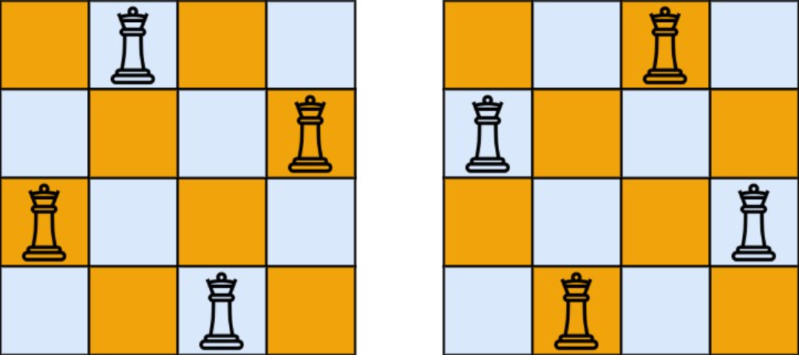

## 一、题目描述
`n`**皇后问题**研究的是如何将`n`个皇后放置在`n×n`的棋盘上，并且使皇后彼此之间不能相互攻击。

给你一个整数`n`，返回所有不同的`n`**皇后问题**的解决方案的数量。

**示例 1**

输入: n = 4
输出: 2
解释: 如上图所示，`4`皇后问题存在两个不同的解法。

**示例 2**
输入: n = 1
输出: 1

**提示**
- `1 <= n <= 9`

**相关主题**
- 回溯


## 二、题解
### 方法 1: 回溯
::: code-tabs
@tab Rust
```rust
pub fn total_n_queens(n: i32) -> i32 {
    const DFS: fn(i32, i32, &mut Vec<(i32, i32)>, &mut i32) = 
        |row, len, pos, total| {
            if row == len {
                *total += 1;
                return;
            }

            for col in 0..len {
                if pos.iter().any(|&(r, c)| {
                    // same column
                    if c == col {
                        return true;
                    }
                    let slope = (row - r) as f64 / (col - c) as f64;
                    // same diagonal
                    slope == 1.0 || slope == -1.0
                }) {
                    continue;
                }

                pos.push((row, col));
                DFS(row + 1, len, pos, total);
                pos.pop();
            }
        };
    let mut res = 0;

    DFS(0, n, &mut vec![], &mut res);

    res
}
```

@tab Java
```java
@FunctionalInterface
interface QuadrConsumer<A, B, C, D> {
    void accept(A a, B b, C c, D d);
}

QuadrConsumer<Integer, Integer, List<int[]>, int[]> dfs =
        (row, len, pos, total) -> {
            if (Objects.equals(row, len)) {
                total[0] += 1;
                return;
            }

            for (int col = 0; col < len; col++) {
                int finalCol = col;
                if (pos.stream().anyMatch(p -> {
                    // 同一列
                    if (p[1] == finalCol) {
                        return true;
                    }
                    double slope = (double) (row - p[0]) / (finalCol - p[1]);
                    // 同一斜线
                    return slope == 1 || slope == -1;
                })) {
                    continue;
                }

                pos.addLast(new int[]{row, col});
                this.dfs.accept(row + 1, len, pos, total);
                pos.removeLast();
            }
        };

public int totalNQueens(int n) {
    int[] res = new int[1];

    this.dfs.accept(0, n, new ArrayList<>(), res);

    return res[0];
}
```
:::