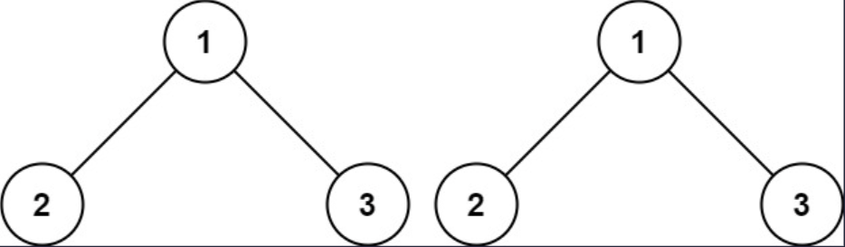
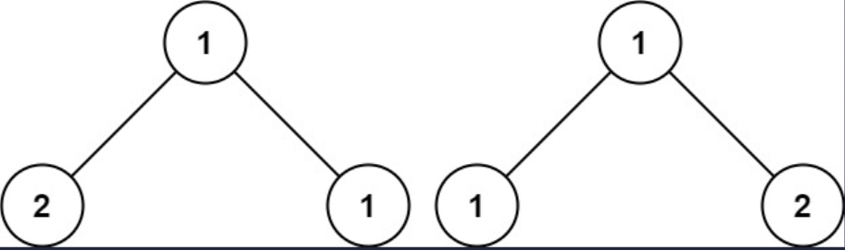

## 一、题目描述
给你两棵二叉树的根节点`p`和`q`，编写一个函数来检验这两棵树是否相同。

如果两个树在结构上相同，并且节点具有相同的值，则认为它们是相同的。

**示例 1**

输入: p = [1, 2, 3], q = [1, 2, 3]
输出: true

**示例 2**

输入: p = [1, 2], q = [1, null, 2]
输出: false

**示例 3**

输入: p = [1, 2, 1], q = [1, 1, 2]
输出: false

**提示**
- 两棵树上的节点数目都在范围`[0, 100]`内
- `-10⁴ <= Node.val <= 10⁴`

**相关主题**
- 树
- 深度优先搜索
- 广度优先搜索
- 二叉树


## 二、题解
::: code-tabs
@tab Rust节点定义
```rust
#[derive(Debug, PartialEq, Eq)]
pub struct TreeNode {
    pub val: i32,
    pub left: Option<Rc<RefCell<TreeNode>>>,
    pub right: Option<Rc<RefCell<TreeNode>>>,
}

impl TreeNode {
    #[inline]
    pub fn new(val: i32) -> Self {
        TreeNode {
            val,
            left: None,
            right: None,
        }
    }
}
```

@tab Java节点定义
```java
public class TreeNode {
    int val;
    TreeNode left;
    TreeNode right;

    TreeNode() {}
    TreeNode(int val) { this.val = val; }
    TreeNode(int val, TreeNode left, TreeNode right) {
        this.val = val;
        this.left = left;
        this.right = right;
    }
}
```
:::

### 方法 1: 深度优先搜索
::: code-tabs
@tab Rust
```rust
pub fn is_same_tree(p: Option<Rc<RefCell<TreeNode>>>, q: Option<Rc<RefCell<TreeNode>>>) -> bool {
    //Self::dfs_recur(p, q)
    Self::dfs_iter(p, q)
}

fn dfs_recur(p: Option<Rc<RefCell<TreeNode>>>, q: Option<Rc<RefCell<TreeNode>>>) -> bool {
    const COMPARE: fn(Option<Rc<RefCell<TreeNode>>>, Option<Rc<RefCell<TreeNode>>>) -> bool =
        |p, q| match (p, q) {
            (None, None) => true,
            (Some(p), Some(q)) => {
                if p.borrow().val != q.borrow().val {
                    return false;
                }

                COMPARE(p.borrow_mut().left.take(), q.borrow_mut().left.take())
                    && COMPARE(p.borrow_mut().right.take(), q.borrow_mut().right.take())
            }
            _ => false,
        };

    COMPARE(p, q)
}

fn dfs_iter(p: Option<Rc<RefCell<TreeNode>>>, q: Option<Rc<RefCell<TreeNode>>>) -> bool {
    let mut stack = vec![(p, q)];

    while let Some((p, q)) = stack.pop() {
        match (p, q) {
            (None, None) => {}
            (Some(p), Some(q)) => {
                if p.borrow().val != q.borrow().val {
                    return false;
                }

                stack.push((p.borrow_mut().right.take(), q.borrow_mut().right.take()));
                stack.push((p.borrow_mut().left.take(), q.borrow_mut().left.take()));
            }
            _ => return false,
        }
    }

    true
}
```

@tab Java
```java
public boolean isSameTree(TreeNode p, TreeNode q) {
    //return this.dfsRecur(p, q);
    return this.dfsIter(p, q);
}

BiFunction<TreeNode, TreeNode, Boolean> compare = (p, q) -> {
    if (p == null && q == null) {
        return true;
    } else if (p != null && q != null) {
        if (p.val != q.val) {
            return false;
        }

        return this.compare.apply(p.left, q.left)
                && this.compare.apply(p.right, q.right);
    } else {
        return false;
    }
};

boolean dfsRecur(TreeNode p, TreeNode q) {
    return this.compare.apply(p, q);
}

boolean dfsIter(TreeNode _p, TreeNode _q) {
    Deque<TreeNode[]> stack = new ArrayDeque<>() {{
        this.push(new TreeNode[]{_p, _q});
    }};

    while (!stack.isEmpty()) {
        TreeNode[] nodes = stack.pop();
        TreeNode p = nodes[0];
        TreeNode q = nodes[1];

        if (p != null && q != null) {
            if (p.val != q.val) {
                return false;
            }

            stack.push(new TreeNode[]{p.right, q.right});
            stack.push(new TreeNode[]{p.left, q.left});
        } else {
            if (!(p == null && q == null)) {
                return false;
            }
        }
    }

    return true;
}
```
:::

### 方法 2: 广度优先搜索
::: code-tabs
@tab Rust
```rust
pub fn is_same_tree(p: Option<Rc<RefCell<TreeNode>>>, q: Option<Rc<RefCell<TreeNode>>>) -> bool {
    Self::bfs_iter(p, q)
}

fn bfs_iter(p: Option<Rc<RefCell<TreeNode>>>, q: Option<Rc<RefCell<TreeNode>>>) -> bool {
    let mut queue = VecDeque::from([(p, q)]);

    while let Some((p, q)) = queue.pop_front() {
        match (p, q) {
            (None, None) => {}
            (Some(p), Some(q)) => {
                if p.borrow().val != q.borrow().val {
                    return false;
                }

                queue.push_back((p.borrow_mut().left.take(), q.borrow_mut().left.take()));
                queue.push_back((p.borrow_mut().right.take(), q.borrow_mut().right.take()));
            }
            _ => return false,
        }
    }

    true
}
```

@tab Java
```java
public boolean isSameTree(TreeNode p, TreeNode q) {
    return this.bfsIter(p, q);
}

boolean bfsIter(TreeNode _p, TreeNode _q) {
    Deque<TreeNode[]> queue = new ArrayDeque<>() {{
        this.addLast(new TreeNode[]{_p, _q});
    }};

    while (!queue.isEmpty()) {
        TreeNode[] nodes = queue.removeFirst();
        TreeNode p = nodes[0];
        TreeNode q = nodes[1];

        if (p != null && q != null) {
            if (p.val != q.val) {
                return false;
            }
            
            queue.addLast(new TreeNode[]{p.left, q.left});
            queue.addLast(new TreeNode[]{p.right, q.right});
        } else {
            if (!(p == null && q == null)) {
                return false;
            }
        }
    }

    return true;
}
```
:::