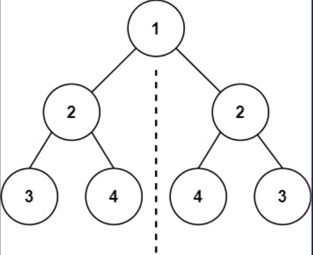
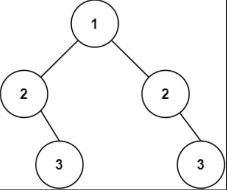

## 一、题目描述
给你一个二叉树的根节点`root`，检查它是否轴对称。

**示例 1**

输入: root = [1, 2, 2, 3, 4, 4, 3]
输出: true

**示例 2**

输入: root = [1, 2, 2, null, 3, null, 3]
输出: false

**提示**
- 树中节点数目在范围`[1, 1000]`内
- `-100 <= Node.val <= 100`

**进阶**
你可以运用递归和迭代两种方法解决这个问题吗？

**相关主题**
- 树
- 深度优先搜索
- 广度优先搜索
- 二叉树


## 二、题解
::: code-tabs
@tab Rust节点定义
```rust
#[derive(Debug, PartialEq, Eq)]
pub struct TreeNode {
    pub val: i32,
    pub left: Option<Rc<RefCell<TreeNode>>>,
    pub right: Option<Rc<RefCell<TreeNode>>>,
}

impl TreeNode {
    #[inline]
    pub fn new(val: i32) -> Self {
        TreeNode {
            val,
            left: None,
            right: None,
        }
    }
}
```

@tab Java节点定义
```java
public class TreeNode {
    int val;
    TreeNode left;
    TreeNode right;

    TreeNode() {}
    TreeNode(int val) { this.val = val; }
    TreeNode(int val, TreeNode left, TreeNode right) {
        this.val = val;
        this.left = left;
        this.right = right;
    }
}
```
:::

### 方法 1: 深度优先搜索
::: code-tabs
@tab Rust
```rust
///
/// 深度优先搜索 - 迭代
///
pub fn is_symmetric(root: Option<Rc<RefCell<TreeNode>>>) -> bool {
    if let Some(root) = root {
        let mut l_r_root = root.borrow_mut().left.take();
        let mut r_l_root = root.borrow_mut().right.take();
        let mut l_r_stack = vec![];
        let mut r_l_stack = vec![];

        while l_r_root.is_some()
            || !l_r_stack.is_empty()
            || r_l_root.is_some()
            || !r_l_stack.is_empty()
        {
            match (l_r_root, r_l_root) {
                (Some(l_r_node), Some(r_l_node)) => {
                    if l_r_node.borrow().val != r_l_node.borrow().val {
                        return false;
                    }
                    l_r_root = l_r_node.borrow_mut().left.take();
                    l_r_stack.push(l_r_node);
                    r_l_root = r_l_node.borrow_mut().right.take();
                    r_l_stack.push(r_l_node);
                }
                (None, None) => match (l_r_stack.pop(), r_l_stack.pop()) {
                    (Some(l_r_node), Some(r_l_node)) => {
                        l_r_root = l_r_node.borrow_mut().right.take();
                        r_l_root = r_l_node.borrow_mut().left.take();
                    }
                    (_, _) => return false,
                },
                (_, _) => return false,
            }
        }
    }

    true
}
```

@tab Java
```java
/**
 * 深度优先搜索 - 迭代
 */
public boolean isSymmetric(TreeNode root) {
    Deque<TreeNode> l_r_stack = new ArrayDeque<>();
    Deque<TreeNode> r_l_stack = new ArrayDeque<>();
    TreeNode l_r_root = root.left;
    TreeNode r_l_root = root.right;

    while (l_r_root != null || !l_r_stack.isEmpty() 
            || r_l_root != null || !r_l_stack.isEmpty()) 
    {
        if (l_r_root == null && r_l_root == null) {
            l_r_root = l_r_stack.pop().right;
            r_l_root = r_l_stack.pop().left;
        } else if (l_r_root == null || r_l_root == null) {
            return false;
        } else {
            if (l_r_root.val != r_l_root.val) {
                return false;
            }
            l_r_stack.push(l_r_root);
            l_r_root = l_r_root.left;
            r_l_stack.push(r_l_root);
            r_l_root = r_l_root.right;
        }
    }

    return true;
}
```
:::

### 方法 2: 广度优先搜索
::: code-tabs
@tab Rust
```rust
pub fn is_symmetric(root: Option<Rc<RefCell<TreeNode>>>) -> bool {
    //Self::bfs_recur(root)
    Self::bfs_iter(root)
}

///
/// 广度优先搜索 - 递归
///
fn bfs_recur(root: Option<Rc<RefCell<TreeNode>>>) -> bool {
    if let Some(root) = root {
        const HELPER: fn(Option<Rc<RefCell<TreeNode>>>, Option<Rc<RefCell<TreeNode>>>) -> bool =
            |left, right| match (left, right) {
                (Some(left), Some(right)) => {
                    left.borrow().val == right.borrow().val
                        && HELPER(left.borrow().left.clone(), right.borrow().right.clone())
                        && HELPER(left.borrow().right.clone(), right.borrow().left.clone())
                }
                (None, None) => true,
                (_, _) => false,
            };

        HELPER(root.borrow().left.clone(), root.borrow().right.clone())

    } else {

        true
    }
}

///
/// 广度优先搜索 - 迭代
///
fn bfs_iter(root: Option<Rc<RefCell<TreeNode>>>) -> bool {
    if let Some(root) = root {
        let mut queue = VecDeque::new();
        queue.push_back(root.borrow_mut().left.take());
        queue.push_back(root.borrow_mut().right.take());

        while !queue.is_empty() {
            match (queue.pop_front(), queue.pop_front()) {
                (Some(left), Some(right)) => match (left, right) {
                    (Some(left), Some(right)) => {
                        if left.borrow().val != right.borrow().val {
                            return false;
                        }
                        queue.push_back(left.borrow_mut().left.take());
                        queue.push_back(right.borrow_mut().right.take());
                        queue.push_back(left.borrow_mut().right.take());
                        queue.push_back(right.borrow_mut().left.take());
                    }
                    (None, None) => {}
                    (_, _) => return false,
                },
                (_, _) => return false,
            }
        }
    }

    true
}
```

@tab Java
```java
public boolean isSymmetric(TreeNode root) {
    //return this.bfsRecur(root);
    return this.bfsIter(root);
}

BiPredicate<TreeNode, TreeNode> helper = (left, right) -> {
    if (left == null && right == null) {
        return true;
    }
    if (left == null || right == null) {
        return false;
    }
    return left.val == right.val
            && this.helper.test(left.left, right.right)
            && this.helper.test(left.right, right.left);
};
/**
 * 广度优先搜索 - 递归
 */
boolean bfsRecur(TreeNode root) {
    return this.helper.test(root.left, root.right);
}

/**
 * 广度优先搜索 - 迭代
 */
boolean bfsIter(TreeNode root) {
    Deque<TreeNode> queue = new LinkedList<>() {{
        this.addLast(root.left);
        this.addLast(root.right);
    }};

    while (!queue.isEmpty()) {
        TreeNode left = queue.pollFirst();
        TreeNode right = queue.pollFirst();
        if (left == null && right == null) {
            continue;
        }
        if (left == null || right == null) {
            return false;
        }
        if (left.val != right.val) {
            return false;
        }
        queue.addLast(left.left);
        queue.addLast(right.right);
        queue.addLast(left.right);
        queue.addLast(right.left);
    }

    return true;
}
```
:::