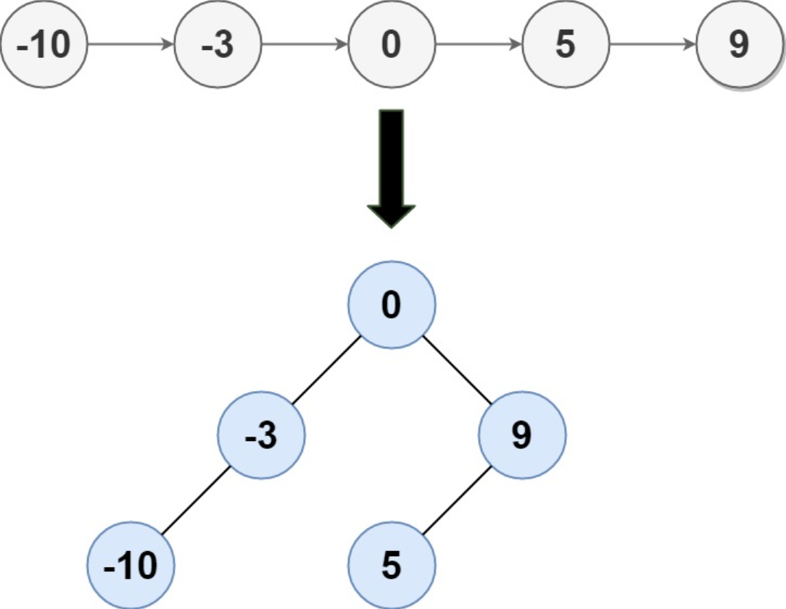

## 一、题目描述
给定一个单链表的头节点`head`，其中的元素**按升序排序**，将其转换为高度平衡的二叉搜索树。

本题中，一个高度平衡二叉树是指一个二叉树*每个节点*的左右两个子树的高度差不超过`1`。

**示例 1**

输入: head = [-10, -3, 0, 5, 9]
输出: [0, -3, 9, -10, null, 5]
解释: 一个可能的答案是[0，-3, 9，-10, null, 5]，它表示所示的高度平衡的二叉搜索树。

**示例 2**
输入: head = []
输出: []

**提示**
- `head`中的节点数在`[0, 2 * 10⁴]`范围内
- `-10⁵ <= Node.val <= 10⁵`

**相关主题**
- 树
- 二叉搜索树
- 链表
- 分治
- 二叉树


## 二、题解
::: code-tabs
@tab Rust节点定义
```rust
#[derive(Debug, PartialEq, Eq)]
pub struct TreeNode {
    pub val: i32,
    pub left: Option<Rc<RefCell<TreeNode>>>,
    pub right: Option<Rc<RefCell<TreeNode>>>,
}

impl TreeNode {
    #[inline]
    pub fn new(val: i32) -> Self {
        TreeNode {
            val,
            left: None,
            right: None,
        }
    }
}

#[derive(Debug, PartialEq, Eq)]
pub struct ListNode {
    pub val: i32,
    pub next: Option<Box<ListNode>>,
}

impl ListNode {
    #[inline]
    pub fn new(val: i32) -> Self {
        ListNode { 
            val, 
            next: None 
        }
    }
}
```

@tab Java节点定义
```java
public class TreeNode {
    int val;
    TreeNode left;
    TreeNode right;

    TreeNode() {}
    TreeNode(int val) { this.val = val; }
    TreeNode(int val, TreeNode left, TreeNode right) {
        this.val = val;
        this.left = left;
        this.right = right;
    }
}

public class ListNode {
    int val;
    ListNode next;

    public ListNode() {}
    public ListNode(int val) { this.val = val; }
    public ListNode(int val, ListNode next) { 
        this.val = val; 
        this.next = next; 
    }
}
```
:::

### 方法 1: 分治
::: code-tabs
@tab Rust
```rust
///
/// 时间复杂度: O(nlog(n))
/// 空间复杂度: O(log(n))
///
pub fn sorted_list_to_bst(head: Option<Box<ListNode>>) -> Option<Rc<RefCell<TreeNode>>> {
    const GET_MID: for<'a> fn(Option<&'a Box<ListNode>>, Option<&'a Box<ListNode>>) -> Option<&'a Box<ListNode>> = 
        |left, right| {
            let mut slow = left;
            let mut fast = left;

            while fast != right && fast.is_some_and(|fast| fast.next.as_ref() != right) {
                fast.map(|f| {
                    fast = f.next.as_ref();
                });
                fast.map(|f| {
                    fast = f.next.as_ref();
                });
                slow.map(|s| {
                    slow = s.next.as_ref();
                });
            }

            slow
        };

    const CONVERT: fn(Option<&Box<ListNode>>, Option<&Box<ListNode>>) -> Option<Rc<RefCell<TreeNode>>> = 
        |left, right| {
            if left == right {
                return None;
            }

            let mid = GET_MID(left, right);
            let mut root = if let Some(mid) = mid {
                Some(Rc::new(RefCell::new(TreeNode::new(mid.val))))
            } else {
                None
            };

            root.as_mut().map(|curr| {
                curr.borrow_mut().left = CONVERT(left, mid);
                curr.borrow_mut().right = CONVERT(mid.and_then(|mid| mid.next.as_ref()), right);
            });

            root
        };

    CONVERT(head.as_ref(), None)
}
```

@tab Java
```java
BiFunction<ListNode, ListNode, ListNode> getMid = (left, right) -> {
    ListNode slow = left;
    ListNode fast = left;

    while (fast != right && fast.next != right) {
        fast = fast.next.next;
        slow = slow.next;
    }

    return slow;
};

BiFunction<ListNode, ListNode, TreeNode> convert1 = (left, right) -> {
    if (left == right) {
        return null;
    }

    ListNode mid = this.getMid.apply(left, right);
    TreeNode root = new TreeNode(mid.val);

    root.left = this.convert1.apply(left, mid);
    root.right = this.convert1.apply(mid.next, right);

    return root;
};

/**
 * 时间复杂度：O(nlog(n))
 * 空间复杂度：O(log(n))
 */
public TreeNode sortedListToBST(ListNode head) {
    return this.convert1.apply(head, null);
}
```
:::

### 方法 2: 分治 + 中序遍历
::: code-tabs
@tab Rust
```rust
///
/// 时间复杂度: O(n)
/// 空间复杂度: O(log(n))
///
pub fn sorted_list_to_bst(head: Option<Box<ListNode>>) -> Option<Rc<RefCell<TreeNode>>> {
    let get_len = |mut curr: Option<&Box<ListNode>>| {
        let mut len = 0;

        while let Some(c) = curr {
            len += 1;
            curr = c.next.as_ref();
        }

        len
    };
    let len = get_len(head.as_ref());

    const CONVERT: fn(&mut Option<Box<ListNode>>, usize, usize) -> Option<Rc<RefCell<TreeNode>>> = 
        |head, left, right| {
            if left == right {
                return None;
            }

            let mid = (left + right) / 2;
            let root = Rc::new(RefCell::new(TreeNode::new(0)));

            root.borrow_mut().left = CONVERT(head, left, mid);
            root.borrow_mut().val = head.take().map_or(0, |mut h| {
                let val = h.val;
                *head = h.next.take();
                val
            });
            root.borrow_mut().right = CONVERT(head, mid + 1, right);

            Some(root)
        };

    CONVERT(&mut head, 0, len)
}
```

@tab Java
```java
@FunctionalInterface
interface TriFunction<A, B, C, D> {
    D apply(A a, B b, C c);
}

Function<ListNode, Integer> getSize = (head) -> {
    int size = 0;

    while (head != null){
        size++;
        head = head.next;
    }

    return size;
};

TriFunction<ListNode[], Integer, Integer, TreeNode> convert2 = (head, left, right) -> {
    if (Objects.equals(left, right)) {
        return null;
    }

    int mid = (left + right) / 2;
    TreeNode root = new TreeNode(0);

    root.left = this.convert2.apply(head, left, mid);
    root.val = head[0].val;
    head[0] = head[0].next;
    root.right = this.convert2.apply(head, mid + 1, right);

    return root;
};

/**
 * 时间复杂度：O(n)
 * 空间复杂度：O(log(n))
 */
public TreeNode sortedListToBST(ListNode head) {
    int size = this.getSize.apply(head);
    return this.convert2.apply(new ListNode[]{head}, 0, size);
}
```
:::