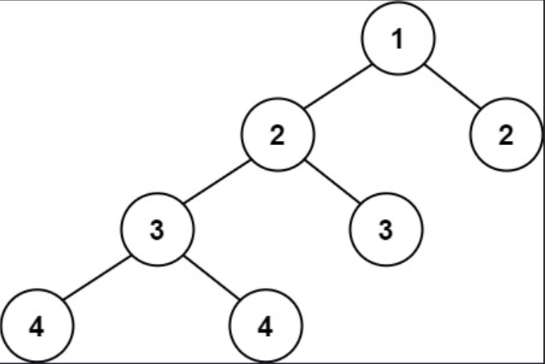

## 一、题目描述
给定一个二叉树，判断它是否是高度平衡的二叉树。

本题中，一棵高度平衡二叉树定义为：
> 一个二叉树*每个节点*的左右两个子树的高度差的绝对值不超过1。

**示例 1**

输入: root = [3, 9, 20, null, null, 15, 7]
输出: true

**示例 2**

输入: root = [1, 2, 2, 3, 3, null, null, 4, 4]
输出: false

**示例 3**
输入: root = []
输出: true

**提示**
- 树中的节点数在范围`[0, 5000]`内
- `-10⁴ <= Node.val <= 10⁴`

**相关主题**
- 树
- 深度优先搜索
- 二叉树


## 二、题解
::: code-tabs
@tab Rust节点定义
```rust
#[derive(Debug, PartialEq, Eq)]
pub struct TreeNode {
    pub val: i32,
    pub left: Option<Rc<RefCell<TreeNode>>>,
    pub right: Option<Rc<RefCell<TreeNode>>>,
}

impl TreeNode {
    #[inline]
    pub fn new(val: i32) -> Self {
        TreeNode {
            val,
            left: None,
            right: None,
        }
    }
}
```

@tab Java节点定义
```java
public class TreeNode {
    int val;
    TreeNode left;
    TreeNode right;

    TreeNode() {}
    TreeNode(int val) { this.val = val; }
    TreeNode(int val, TreeNode left, TreeNode right) {
        this.val = val;
        this.left = left;
        this.right = right;
    }
}
```
:::

### 方法 1: 自顶向下的递归
::: code-tabs
@tab Rust
```rust
///
/// Time Complexity: O(n^2)
/// Space Complexity: O(n)
///
pub fn is_balanced(root: Option<Rc<RefCell<TreeNode>>>) -> bool {
    const CALC_HEIGHT: fn(Option<Rc<RefCell<TreeNode>>>) -> i32 = |root| match root {
        None => 0,
        Some(curr) => {
            std::cmp::max(
                CALC_HEIGHT(curr.borrow().left.clone()),
                CALC_HEIGHT(curr.borrow().right.clone()),
            ) + 1
        }
    };

    const CHECK_BALANCE: fn(Option<Rc<RefCell<TreeNode>>>) -> bool = |root| match root {
        None => true,
        Some(curr) => {
            let left = curr.borrow_mut().left.take();
            let right = curr.borrow_mut().right.take();
            let l_height = CALC_HEIGHT(left.clone());
            let r_height = CALC_HEIGHT(right.clone());
            if (l_height - r_height).abs() > 1 {
                return false;
            }

            CHECK_BALANCE(left) && CHECK_BALANCE(right)
        }
    };

    CHECK_BALANCE(root)
}
```

@tab Java
```java
Function<TreeNode, Integer> calc_height = root -> {
    if (root == null) {
        return 0;
    }

    return Math.max(this.calc_height.apply(root.left), this.calc_height.apply(root.right)) + 1;
};

Predicate<TreeNode> check_balance = root -> {
    if (root == null) {
        return true;
    }

    int l_height = this.calc_height.apply(root.left);
    int r_height = this.calc_height.apply(root.right);
    if (Math.abs(l_height - r_height) > 1) {
        return false;
    }

    return this.check_balance.test(root.left) && this.check_balance.test(root.right);
};

/**
 * Time Complexity: O(n^2)
 * Space Complexity: O(n)
 */
public boolean isBalanced(TreeNode root) {
    return this.check_balance.test(root);
}
```
:::

### 方法 2: 自底向上的递归
::: code-tabs
@tab Rust
```rust
///
/// Time Complexity: O(n)
/// Space Complexity: O(n)
///
pub fn is_balanced(root: Option<Rc<RefCell<TreeNode>>>) -> bool {
    const RECUR_HELPER: fn(Option<Rc<RefCell<TreeNode>>>) -> (i32, bool) = |root| match root {
        None => (0, true),
        Some(curr) => {
            let (l_height, l_bal) = RECUR_HELPER(curr.borrow_mut().left.take());
            let (r_height, r_bal) = RECUR_HELPER(curr.borrow_mut().right.take());
            (
                std::cmp::max(l_height, r_height) + 1,
                l_bal && r_bal && (l_height - r_height).abs() <= 1,
            )
        }
    };

    RECUR_HELPER(root).1
}
```

@tab Java
```java
Function<TreeNode, Object[]> recur_helper = root -> {
    if (root == null) {
        return new Object[]{0, true};
    }

    Object[] l_res = this.recur_helper.apply(root.left);
    int l_height = (int) l_res[0];
    boolean l_bal = (boolean) l_res[1];
    Object[] r_res = this.recur_helper.apply(root.right);
    int r_height = (int) r_res[0];
    boolean r_bal = (boolean) r_res[1];

    return new Object[]{Math.max(l_height, r_height) + 1, l_bal && r_bal && Math.abs(l_height - r_height) <= 1};
};

/**
 * Time Complexity: O(n)
 * Space Complexity: O(n)
 */
public boolean isBalanced(TreeNode root) {
    return (boolean) this.recur_helper.apply(root)[1];
}
```
:::