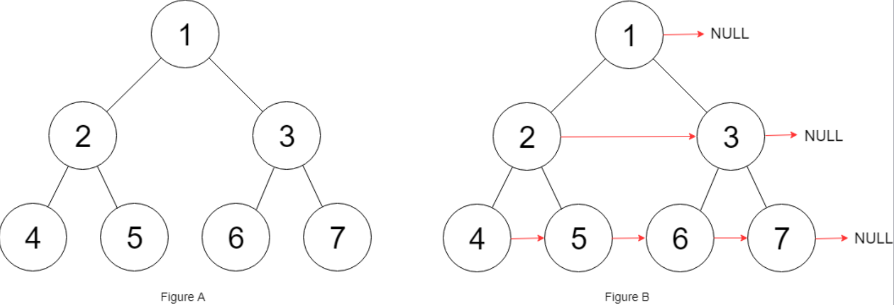

## 一、题目描述
给定一个 完美二叉树 ，其所有叶子节点都在同一层，每个父节点都有两个子节点。二叉树定义如下：
```c
struct Node {
    int val;
    Node *left;
    Node *right;
    Node *next;
}
```
填充它的每个`next`指针，让这个指针指向其下一个右侧节点。如果找不到下一个右侧节点，则将`next`指针设置为`NULL`。

初始状态下，所有`next`指针都被设置为`NULL`。

**示例 1**

输入: root = [1, 2, 3, 4, 5, 6, 7]
输出: [1, #, 2, 3, #, 4, 5, 6, 7, #]
解释: 给定二叉树如`图A`所示，你的函数应该填充它的每个`next`指针，以指向其下一个右侧节点，如`图B`所示。序列化的输出按层序遍历排列，同一层节点由`next`指针连接，'#'标志着每一层的结束。

**示例 2**
输入: root = []
输出: []

**提示**
- 树中节点的数量在`[0, 2¹² - 1]`范围内
- `-1000 <= node.val <= 1000`

**进阶**
- 你只能使用常量级额外空间。
- 使用递归解题也符合要求，本题中递归程序占用的栈空间不算做额外的空间复杂度。

**相关主题**
- 树
- 深度优先搜索
- 广度优先搜索
- 链表
- 二叉树


## 二、题解
::: code-tabs
@tab Rust节点定义(智能指针版)
```rust
#[derive(Debug, PartialEq, Eq)]
pub struct Node {
    pub val: i32,
    pub left: Option<Rc<RefCell<Node>>>,
    pub right: Option<Rc<RefCell<Node>>>,
    pub next: Option<Rc<RefCell<Node>>>,
}

impl Node {
    pub fn new(val: i32) -> Option<Rc<RefCell<Node>>> {
        Some(Rc::new(RefCell::new(Node {
            val,
            left: None,
            right: None,
            next: None,
        })))
    }
    pub fn new_with_children(
        val: i32,
        left: Option<Rc<RefCell<Node>>>,
        right: Option<Rc<RefCell<Node>>>,
    ) -> Option<Rc<RefCell<Node>>> {
        Some(Rc::new(RefCell::new(Node {
            val,
            left,
            right,
            next: None,
        })))
    }
}
```

@tab Rust节点定义(裸指针版)
```rust
#[derive(Debug, PartialEq, Eq)]
pub struct Node {
    pub val: i32,
    pub left: *mut Node,
    pub right: *mut Node,
    pub next: *mut Node,
}

impl Node {
    pub fn new(val: i32) -> *mut Node {
        Box::into_raw(Box::new(Node {
            val,
            left: null_mut(),
            right: null_mut(),
            next: null_mut(),
        }))
    }
    pub fn new_with_children(
        val: i32, 
        left: *mut Node, 
        right: *mut Node
    ) -> *mut Node {
        Box::into_raw(Box::new(Node {
            val,
            left,
            right,
            next: null_mut(),
        }))
    }
}
```

@tab Rust节点定义(NonNull版)
```rust
#[derive(Debug, PartialEq, Eq)]
pub struct Node {
    pub val: i32,
    pub left: Option<NonNull<Node>>,
    pub right: Option<NonNull<Node>>,
    pub next: Option<NonNull<Node>>,
}

impl Node {
    pub fn new(val: i32) -> Option<NonNull<Node>> {
        NonNull::new(Box::into_raw(Box::new(Node {
            val,
            left: None,
            right: None,
            next: None,
        })))
    }
    pub fn new_with_children(
        val: i32,
        left: Option<NonNull<Node>>,
        right: Option<NonNull<Node>>,
    ) -> Option<NonNull<Node>> {
        NonNull::new(Box::into_raw(Box::new(Node {
            val,
            left,
            right,
            next: None,
        })))
    }
}
```

@tab Java节点定义
```java
public class Node {
    public int val;
    public Node left;
    public Node right;
    public Node next;

    public Node() {}
    public Node(int _val) {
        val = _val;
    }
    public Node(int _val, Node _left, Node _right, Node _next) {
        val = _val;
        left = _left;
        right = _right;
        next = _next;
    }
}
```
:::

### 方法 1: 层序遍历
::: code-tabs
@tab Rust(智能指针版)
```rust
pub fn connect(root: Option<Rc<RefCell<Node>>>) -> Option<Rc<RefCell<Node>>> {
    //Self::bfs_iter_1(root)
    Self::bfs_iter_2(root)
}

fn bfs_iter_1(root: Option<Rc<RefCell<Node>>>) -> Option<Rc<RefCell<Node>>> {
    if let Some(root) = root.clone() {
        let mut queue = VecDeque::from([root]);

        while !queue.is_empty() {
            let level_len = queue.len();
            let mut prev: Option<Rc<RefCell<Node>>> = None;

            for i in 0..level_len {
                if let Some(curr) = queue.pop_front() {
                    if i > 0 {
                        prev.map(|prev| {
                            prev.borrow_mut().next = Some(curr.clone());
                        });
                    }
                    prev = Some(curr.clone());
                    if let Some(left) = curr.borrow().left.clone() {
                        queue.push_back(left);
                    }
                    if let Some(right) = curr.borrow().right.clone() {
                        queue.push_back(right);
                    }
                };
            }
        }
    }

    root
}

fn bfs_iter_2(root: Option<Rc<RefCell<Node>>>) -> Option<Rc<RefCell<Node>>> {
    if let Some(root) = root.clone() {
        let mut queue = VecDeque::from([(root.clone(), 0)]);
        let mut prev: (Option<Rc<RefCell<Node>>>, i32) = (None, -1);

        while let Some((curr, level)) = queue.pop_front() {
            if prev.1 == level {
                prev.0.map(|prev| {
                    prev.borrow_mut().next = Some(curr.clone());
                });
            };
            prev = (Some(curr.clone()), level);

            if let Some(left) = curr.borrow().left.clone() {
                queue.push_back((left, level + 1));
            }
            if let Some(right) = curr.borrow().right.clone() {
                queue.push_back((right, level + 1));
            }
        }
    }

    root
}
```

@tab Rust(裸指针版)
```rust
pub fn connect(root: *mut Node) -> *mut Node {
    //Self::bfs_iter_1(root)
    Self::bfs_iter_2(root)
}

fn bfs_iter_1(root: *mut Node) -> *mut Node {
    if !root.is_null() {
        let mut queue = VecDeque::from([root]);

        while !queue.is_empty() {
            let level_len = queue.len();
            let mut prev: *mut Node = null_mut();

            for i in 0..level_len {
                if let Some(curr) = queue.pop_front() {
                    unsafe {
                        if i > 0 {
                            (*prev).next = curr;
                        }
                        prev = curr;
                        if !(*curr).left.is_null() {
                            queue.push_back((*curr).left);
                        }
                        if !(*curr).right.is_null() {
                            queue.push_back((*curr).right);
                        }
                    }
                }
            }
        }
    }

    root
}

fn bfs_iter_2(root: *mut Node) -> *mut Node {
    if !root.is_null() {
        let mut queue = VecDeque::from([(root, 0)]);
        let mut prev: (*mut Node, i32) = (null_mut(), -1);

        while !queue.is_empty() {
            if let Some((curr, level)) = queue.pop_front() {
                unsafe {
                    if level == prev.1 {
                        (*prev.0).next = curr;
                    }
                    prev = (curr, level);

                    if !(*curr).left.is_null() {
                        queue.push_back(((*curr).left, level + 1));
                    }
                    if !(*curr).right.is_null() {
                        queue.push_back(((*curr).right, level + 1));
                    }
                }
            }
        }
    }

    root
}
```

@tab Rust(NonNull版)
```rust
pub fn connect(root: Option<NonNull<Node>>) -> Option<NonNull<Node>> {
    //Self::bfs_iter_1(root)
    Self::bfs_iter_2(root)
}

fn bfs_iter_1(root: Option<NonNull<Node>>) -> Option<NonNull<Node>> {
    if let Some(root) = root {
        let mut queue = VecDeque::from([root]);

        while !queue.is_empty() {
            let level_len = queue.len();
            let mut prev: NonNull<Node> = NonNull::dangling();

            for i in 0..level_len {
                if let Some(curr) = queue.pop_front() {
                    unsafe {
                        if i > 0 {
                            (*prev.as_ptr()).next = Some(curr);
                        }
                        prev = curr;
                        if let Some(left) = curr.as_ref().left {
                            queue.push_back(left);
                        }
                        if let Some(right) = curr.as_ref().right {
                            queue.push_back(right);
                        }
                    }
                }
            }
        }
    }

    root
}

fn bfs_iter_2(root: Option<NonNull<Node>>) -> Option<NonNull<Node>> {
    if let Some(root) = root {
        let mut queue = VecDeque::from([(root, 0)]);
        let mut prev: (NonNull<Node>, i32) = (NonNull::dangling(), -1);

        while let Some((curr, level)) = queue.pop_front() {
            unsafe {
                if level == prev.1 {
                    (*prev.0.as_ptr()).next = Some(curr);
                }
                prev = (curr, level);

                if let Some(left) = curr.as_ref().left {
                    queue.push_back((left, level + 1));
                }
                if let Some(right) = curr.as_ref().right {
                    queue.push_back((right, level + 1));
                }
            }
        }
    }

    root
}
```

@tab Java
```java
public Node connect(Node root) {
    //return this.bfsIter1(root);
    return this.bfsIter2(root);
}

Node bfsIter1(Node root) {
    if (root != null) {
        ArrayDeque<Node> queue = new ArrayDeque<>() {{
            this.addLast(root);
        }};

        while (!queue.isEmpty()) {
            int levelSize = queue.size();
            Node prev = null;

            for (int i = 0; i < levelSize; i++) {
                Node curr = queue.removeFirst();
                if (i > 0) {
                    prev.next = curr;
                }
                prev = curr;
                if (curr.left != null) {
                    queue.addLast(curr.left);
                }
                if (curr.right != null) {
                    queue.addLast(curr.right);
                }
            }
        }
    }

    return root;
}

Node bfsIter2(Node root) {
    if (root != null) {
        ArrayDeque<Object[]> queue = new ArrayDeque<>() {{
            this.addLast(new Object[]{root, 0});
        }};
        Node prev = null;
        int prevLevel = -1;

        while (!queue.isEmpty()) {
            Object[] objs = queue.removeFirst();
            Node curr = (Node) objs[0];
            int level = (int) objs[1];
            if (level == prevLevel) {
              prev.next = curr;
            }
            prev = curr;
            prevLevel = level;
            
            if (curr.left != null) {
                queue.addLast(new Object[]{curr.left, level + 1});
            }
            if (curr.right != null) {
                queue.addLast(new Object[]{curr.right, level + 1});
            }
        }
    }

    return root;
}
```
:::

### 方法 2: 使用已建立的next指针
::: code-tabs
@tab Rust(智能指针版)
```rust
pub fn connect(root: Option<Rc<RefCell<Node>>>) -> Option<Rc<RefCell<Node>>> {
    //Self::use_next_pointer_iter(root)
    Self::use_next_pointer_recur(root)
}
///
/// 迭代版
///
fn use_next_pointer_iter(root: Option<Rc<RefCell<Node>>>) -> Option<Rc<RefCell<Node>>> {
    let mut leftmost = root.clone();

    while let Some(level_first) = leftmost {
        let mut level = Some(level_first.clone());

        while let Some(curr) = level {
            match (curr.borrow().left.clone(), curr.borrow().right.clone()) {
                (Some(left), Some(right)) => {
                    left.borrow_mut().next = Some(right.clone());
                    if let Some(next) = curr.borrow().next.clone() {
                        right.borrow_mut().next = next.borrow().left.clone();
                    }
                }
                (_, _) => break,
            }
            level = curr.borrow().next.clone();
        }

        leftmost = level_first.borrow().left.clone();
    }

    root
}
///
/// 递归版(前序)
///
fn use_next_pointer_recur(root: Option<Rc<RefCell<Node>>>) -> Option<Rc<RefCell<Node>>> {
    const PRE_ORDER: fn(Option<Rc<RefCell<Node>>>) = |root| {
        if let Some(curr) = root {
            match (curr.borrow().left.clone(), curr.borrow().right.clone()) {
                (Some(left), Some(right)) => {
                    left.borrow_mut().next = Some(right.clone());
                    if let Some(next) = curr.borrow().next.clone() {
                        right.borrow_mut().next = next.borrow().left.clone();
                    }
                }
                (_, _) => return,
            }

            PRE_ORDER(curr.borrow().left.clone());
            PRE_ORDER(curr.borrow().right.clone());
        }
    };

    PRE_ORDER(root.clone());

    root
}
```

@tab Rust(裸指针版)
```rust
pub fn connect(root: *mut Node) -> *mut Node {
    //Self::use_next_pointer_iter(root)
    Self::use_next_pointer_recur(root)
}
///
/// 迭代版
///
fn use_next_pointer_iter(root: *mut Node) -> *mut Node {
    let mut leftmost = root;

    while !leftmost.is_null() {
        unsafe {
            let mut curr = leftmost;

            while !curr.is_null() {
                if !(*curr).left.is_null() {
                    (*(*curr).left).next = (*curr).right;
                    if !(*curr).next.is_null() {
                        (*(*curr).right).next = (*(*curr).next).left;
                    }
                }
                curr = (*curr).next;
            }

            leftmost = (*leftmost).left;
        }
    }

    root
}
///
/// 递归版(前序)
///
fn use_next_pointer_recur(root: *mut Node) -> *mut Node {
    const PRE_ORDER: fn(*mut Node) = |root| unsafe {
        if root.is_null() || (*root).left.is_null() {
            return;
        }
        (*(*root).left).next = (*root).right;
        if !(*root).next.is_null() {
            (*(*root).right).next = (*(*root).next).left;
        }

        PRE_ORDER((*root).left);
        PRE_ORDER((*root).right);
    };

    PRE_ORDER(root);

    root
}
```

@tab Rust(NonNull版)
```rust
pub fn connect(root: Option<NonNull<Node>>) -> Option<NonNull<Node>> {
    //Self::use_next_pointer_iter(root)
    Self::use_next_pointer_recur(root)
}
///
/// 迭代版
///
fn use_next_pointer_iter(root: Option<NonNull<Node>>) -> Option<NonNull<Node>> {
    let mut leftmost = root.clone();

    while let Some(level_first) = leftmost {
        unsafe {
            let mut level = Some(level_first);

            while let Some(curr) = level {
                match (curr.as_ref().left, curr.as_ref().right) {
                    (Some(left), Some(right)) => {
                        (*left.as_ptr()).next = Some(right);
                        if let Some(next) = curr.as_ref().next {
                            (*right.as_ptr()).next = next.as_ref().left;
                        }
                    }
                    (_, _) => break,
                }
                level = curr.as_ref().next;
            }

            leftmost = level_first.as_ref().left;
        }
    }

    root
}
///
/// 递归版(前序)
///
fn use_next_pointer_recur(root: Option<NonNull<Node>>) -> Option<NonNull<Node>> {
    const PRE_ORDER: fn(Option<NonNull<Node>>) = |root| unsafe {
        if let Some(curr) = root {
            match (curr.as_ref().left, curr.as_ref().right) {
                (Some(left), Some(right)) => {
                    (*left.as_ptr()).next = Some(right);
                    if let Some(next) = curr.as_ref().next {
                        (*right.as_ptr()).next = next.as_ref().left;
                    }
                }
                (_, _) => return,
            }

            PRE_ORDER(curr.as_ref().left);
            PRE_ORDER(curr.as_ref().right);
        }
    };

    PRE_ORDER(root);

    root
}
```

@tab Java
```java
public Node connect(Node root) {
    //return this.useNextPointerIter(root);
    return this.useNextPointerRecur(root);
}
/**
 * 迭代版
 */
Node useNextPointerIter(Node root) {
    Node leftmost = root;

    while (leftmost != null) {
        Node curr = leftmost;

        while (curr != null) {
            if (curr.left != null) {
                curr.left.next = curr.right;
                if (curr.next != null) {
                    curr.right.next = curr.next.left;
                }
            }
            
            curr = curr.next;
        }

        leftmost = leftmost.left;
    }

    return root;
}
/**
 * 递归版(前序)
 */
Node useNextPointerRecur(Node root) {
    this.preOrder.accept(root);
    return root;
}
Consumer<Node> preOrder = (root) -> {
    if (root == null || root.left == null) {
        return;
    }
    root.left.next = root.right;
    if (root.next != null) {
        root.right.next = root.next.left;
    }

    this.preOrder.accept(root.left);
    this.preOrder.accept(root.right);
};
```
:::