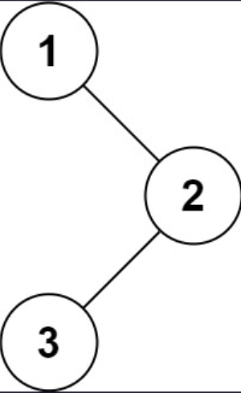

## 一、题目描述
给你一棵二叉树的根节点`root`，返回其节点值的**后序遍历**。

**示例 1**

输入: root = [1, null, 2, 3]
输出: [3, 2, 1]

**示例 2**
输入: root = []
输出: []

**示例 3**
输入: root = [1]
输出: [1]

**提示**
- 树中节点的数目在范围`[0, 100]`内
- `-100 <= Node.val <= 100`

**进阶**
递归算法很简单，你可以通过迭代算法完成吗？

**相关主题**
- 栈
- 树
- 深度优先搜索
- 二叉树


## 二、题解
::: code-tabs
@tab Rust Node Definition
```rust
#[derive(Debug, PartialEq, Eq)]
pub struct TreeNode {
    pub val: i32,
    pub left: Option<Rc<RefCell<TreeNode>>>,
    pub right: Option<Rc<RefCell<TreeNode>>>,
}

impl TreeNode {
    #[inline]
    pub fn new(val: i32) -> Self {
        TreeNode {
            val,
            left: None,
            right: None,
        }
    }
}
```

@tab Java Node Definition
```java
public class TreeNode {
    int val;
    TreeNode left;
    TreeNode right;

    TreeNode() {}
    TreeNode(int val) { this.val = val; }
    TreeNode(int val, TreeNode left, TreeNode right) {
        this.val = val;
        this.left = left;
        this.right = right;
    }
}
```
:::

### 方法 1: 递归
::: code-tabs
@tab Rust
```rust
pub fn postorder_traversal(root: Option<Rc<RefCell<TreeNode>>>) -> Vec<i32> {
    let mut res = vec![];
    const RECURSION_IMPL: fn(root: Option<Rc<RefCell<TreeNode>>>, res: &mut Vec<i32>) =
        |root, res| match root {
            None => {}
            Some(curr) => {
                RECURSION_IMPL(curr.borrow_mut().left.take(), res);
                RECURSION_IMPL(curr.borrow_mut().right.take(), res);
                res.push(curr.borrow().val);
            }
        };

    RECURSION_IMPL(root, &mut res);

    res
}
```

@tab Java
```java
BiConsumer<TreeNode, List<Integer>> recursionImpl = (root, res) -> {
    if (root == null) {
        return;
    }
    this.recursionImpl.accept(root.left, res);
    this.recursionImpl.accept(root.right, res);
    res.add(root.val);
};

public List<Integer> postorderTraversal(TreeNode root) {
    List<Integer> res = new ArrayList<>();
    this.recursionImpl.accept(root, res);
    return res;
}
```
:::

### 方法 2: 迭代
::: code-tabs
@tab Rust
```rust
pub fn postorder_traversal(root: Option<Rc<RefCell<TreeNode>>>) -> Vec<i32> {
    //Self::iteration_impl_1(root)
    //Self::iteration_impl_2(root)
    //Self::iteration_impl_3(root)
    Self::iteration_impl_4(root)
}

fn iteration_impl_1(root: Option<Rc<RefCell<TreeNode>>>) -> Vec<i32> {
    let mut res = vec![];

    if let Some(root) = root {
        let mut stack = vec![root];

        while let Some(curr) = stack.pop() {
            res.push(curr.borrow().val); // Root
            if let Some(left) = curr.borrow_mut().left.take() {
                stack.push(left); // Left
            }
            if let Some(right) = curr.borrow_mut().right.take() {
                stack.push(right); // Right
            }
        }
    }
    
    res.reverse(); // NRL -> LRN
    res
}

fn iteration_impl_2(mut root: Option<Rc<RefCell<TreeNode>>>) -> Vec<i32> {
    let mut res = vec![];
    let mut stack = vec![];
    let mut last_visited = None;

    while root.is_some() || !stack.is_empty() {
        while let Some(curr) = root {
            root = curr.borrow_mut().left.take();
            stack.push(curr);
        }

        if let Some(curr) = stack.pop() {
            let right = curr.borrow_mut().right.take();
            if right.is_some() && !right.eq(&last_visited) {
                root = right;
                stack.push(curr);
            } else {
                res.push(curr.borrow().val);
                last_visited = right;
            }
        }
    }

    res
}

fn iteration_impl_3(mut root: Option<Rc<RefCell<TreeNode>>>) -> Vec<i32> {
    let mut res = vec![];
    let mut stack = vec![];
    let mut last_visited = None;

    while root.is_some() || !stack.is_empty() {
        match root {
            Some(curr) => {
                root = curr.borrow_mut().left.take();
                stack.push(curr);
            }
            None => {
                if let Some(curr) = stack.pop() {
                    let right = curr.borrow_mut().right.take();
                    if right.is_some() && !right.eq(&last_visited) {
                        root = right;
                        stack.push(curr);
                    } else {
                        res.push(curr.borrow().val);
                        last_visited = right;
                    }
                }
            }
        }
    }

    res
}

fn iteration_impl_4(root: Option<Rc<RefCell<TreeNode>>>) -> Vec<i32> {
    let mut res = vec![];

    if let Some(root) = root {
        let mut stack = vec![Ok(root)];

        while let Some(curr) = stack.pop() {
            match curr {
                Ok(node) => {
                    stack.push(Err(node.borrow().val));
                    if let Some(right) = node.borrow_mut().right.take() {
                        stack.push(Ok(right));
                    }
                    if let Some(left) = node.borrow_mut().left.take() {
                        stack.push(Ok(left));
                    }
                }
                Err(val) => {
                    res.push(val);
                }
            }
        }
    }

    res
}

```

@tab Java
```java
public List<Integer> postorderTraversal(TreeNode root) {
    //return this.iterationImpl1(root);
    //return this.iterationImpl2(root);
    //return this.iterationImpl3(root);
    return this.iterationImpl4(root);
}

List<Integer> iterationImpl1(TreeNode root) {
    List<Integer> res = new ArrayList<>();

    if (root != null) {
        Deque<TreeNode> stack = new ArrayDeque<>() {{
            this.add(root);
        }};

        while (!stack.isEmpty()) {
            TreeNode curr = stack.pop();
            res.add(curr.val);
            if (curr.left != null) {
                stack.push(curr.left);
            }
            if (curr.right != null) {
                stack.push(curr.right);
            }
        }
    }

    Collections.reverse(res);
    return res;
}

List<Integer> iterationImpl2(TreeNode root) {
    List<Integer> res = new ArrayList<>();
    Deque<TreeNode> stack = new ArrayDeque<>();
    TreeNode lastVisited = null;

    while (root != null || !stack.isEmpty()) {
        while (root != null) {
            stack.push(root);
            root = root.left;
        }
        TreeNode curr = stack.pop();
        if (curr.right != null && !curr.right.equals(lastVisited)) {
            root = curr.right;
            stack.push(curr);
        } else {
            res.add(curr.val);
            lastVisited = curr;
        }
    }

    return res;
}

List<Integer> iterationImpl3(TreeNode root) {
    List<Integer> res = new ArrayList<>();
    Deque<TreeNode> stack = new ArrayDeque<>();
    TreeNode lastVisited = null;

    while (root != null || !stack.isEmpty()) {
        if (root != null) {
            stack.push(root);
            root = root.left;
        } else {
            TreeNode curr = stack.pop();
            if (curr.right != null && !curr.right.equals(lastVisited)) {
                root = curr.right;
                stack.push(curr);
            } else {
                res.add(curr.val);
                lastVisited = curr;
            }
        }
    }

    return res;
}

List<Integer> iterationImpl4(TreeNode root) {
    List<Integer> res = new ArrayList<>();

    if (root != null) {
        Deque<Object> stack = new ArrayDeque<>() {{
            this.add(root);
        }};

        while (!stack.isEmpty()) {
            Object curr = stack.pop();
            switch (curr) {
                case TreeNode node -> {
                    stack.push(node.val);
                    if (node.right != null) {
                        stack.push(node.right);
                    }
                    if (node.left != null) {
                        stack.push(node.left);
                    }
                }
                case Integer val -> res.add(val);
                default -> throw new IllegalStateException("Unexpected value: " + curr);
            }
        }
    }

    return res;
}

```
:::
