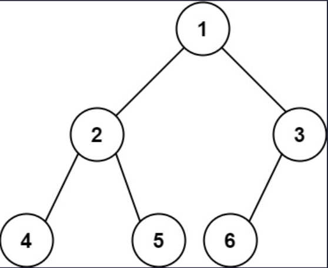
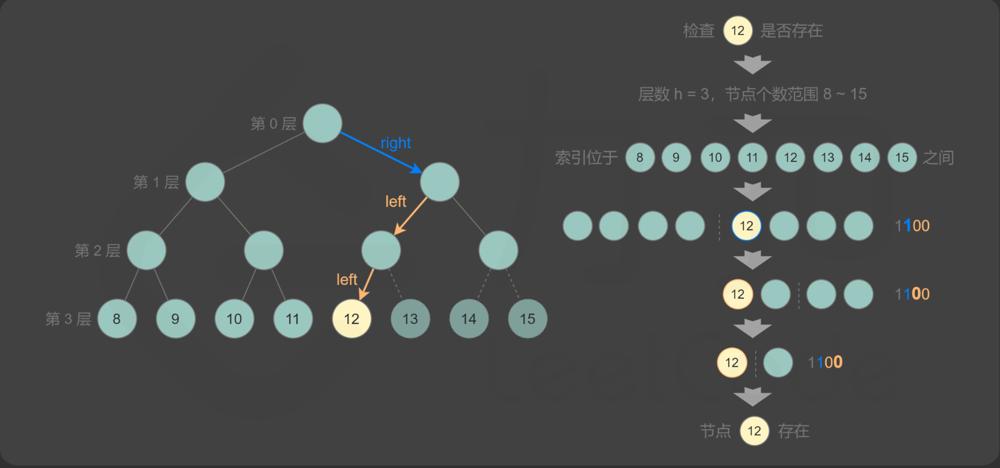

## 一、题目描述
给你一棵**完全二叉树**的根节点`root`，求出该树的节点个数。

[**完全二叉树**][Wikipedia]的定义如下：在完全二叉树中，除了最底层节点可能没填满外，其余每层节点数都达到最大值，并且最下面一层的节点都集中在该层最左边的若干位置。若最底层为第`h`层，则该层包含`1~ 2ʰ`个节点。

**示例 1**

输入: root = [1, 2, 3, 4, 5, 6]
输出: 6

**示例 2**
输入: root = []
输出: 0

**示例 3**
输入: root = [1]
输出: 1

**提示**
- 树中节点的数目范围是`[0, 5 * 10⁴]`
- `0 <= Node.val <= 5 * 10⁴`
- 题目数据保证输入的树是**完全二叉树**

**进阶**
遍历树来统计节点是一种时间复杂度为`O(n)`的简单解决方案。你可以设计一个更快的算法吗？

**相关主题**
- 位运算
- 树
- 二分查找
- 二叉树

[Wikipedia]: https://baike.baidu.com/item/%E5%AE%8C%E5%85%A8%E4%BA%8C%E5%8F%89%E6%A0%91/7773232?fr=aladdin

## 二、题解
::: code-tabs
@tab Rust节点定义
```rust
#[derive(Debug, PartialEq, Eq)]
pub struct TreeNode {
    pub val: i32,
    pub left: Option<Rc<RefCell<TreeNode>>>,
    pub right: Option<Rc<RefCell<TreeNode>>>,
}

impl TreeNode {
    #[inline]
    pub fn new(val: i32) -> Self {
        TreeNode {
            val,
            left: None,
            right: None,
        }
    }
}
```

@tab Java节点定义
```java
public class TreeNode {
    int val;
    TreeNode left;
    TreeNode right;

    TreeNode() {}
    TreeNode(int val) { this.val = val; }
    TreeNode(int val, TreeNode left, TreeNode right) {
        this.val = val;
        this.left = left;
        this.right = right;
    }
}
```
:::

### 方法 1: 暴力解法
::: code-tabs
@tab Rust
```rust
pub fn count_nodes(root: Option<Rc<RefCell<TreeNode>>>) -> i32 {
    //Self::dfs_recur(root)
    Self::bfs_iter(root)
}

///
/// Time Complexity: O(n)
/// Space Complexity: O(log(n))
///
fn dfs_recur(root: Option<Rc<RefCell<TreeNode>>>) -> i32 {
    const COUNT: fn(Option<Rc<RefCell<TreeNode>>>) -> i32 = |root| {
        if let Some(root) = root {
            COUNT(root.borrow().left.clone()) + COUNT(root.borrow().right.clone()) + 1
        } else {
            0
        }
    };

    COUNT(root)
}

///
/// Time Complexity: O(n)
/// Space Complexity: O(n)
///
fn bfs_iter(root: Option<Rc<RefCell<TreeNode>>>) -> i32 {
    let mut count = 0;

    if let Some(root) = root {
        let mut queue = VecDeque::from([root]);

        while let Some(curr) = queue.pop_front() {
            count += 1;

            if let Some(left) = curr.borrow_mut().left.take() {
                queue.push_back(left);
            }
            if let Some(right) = curr.borrow_mut().right.take() {
                queue.push_back(right)
            }
        }
    }

    count
}
```

@tab Java
```java
public int countNodes(TreeNode root) {
    //return this.dfsRecur(root);
    return this.bfsIter(root);
}

Function<TreeNode, Integer> count = root -> {
    if (root == null) {
        return 0;
    }
    return this.count.apply(root.left) + this.count.apply(root.right) + 1;
};
/**
 * Time Complexity: O(n)
 * Space Complexity: O(log(n))
 */
int dfsRecur(TreeNode root) {
    return this.count.apply(root);
}

/**
 * Time Complexity: O(n)
 * Space Complexity: O(n)
 */
int bfsIter(TreeNode root) {
    int count = 0;

    if (root != null) {
        Deque<TreeNode> queue = new ArrayDeque<>() {{
            this.addLast(root);
        }};

        while (!queue.isEmpty()) {
            TreeNode curr = queue.removeFirst();
            count++;

            if (curr.left != null) {
                queue.addLast(curr.left);
            }
            if (curr.right != null) {
                queue.addLast(curr.right);
            }
        }
    }

    return count;
}
```
:::

### 方法 2: 二叉搜索

::: code-tabs
@tab Rust
```rust
pub fn count_nodes(root: Option<Rc<RefCell<TreeNode>>>) -> i32 {
    Self::binary_search(root)
}

///
/// Time Complexity: O(log(n) * log(n))
/// Space Complexity: O(1)
///
fn binary_search(root: Option<Rc<RefCell<TreeNode>>>) -> i32 {
    if root.is_none() {
        return 0;
    }

    let calc_level: fn(root: Option<Rc<RefCell<TreeNode>>>) -> u32 = |mut root| {
        let mut level = 0_u32;
        while let Some(curr) = root {
            root = curr.borrow().left.clone();
            level += 1;
        }
        level
    };
    let level = calc_level(root.clone());

    let mut min_count = 2_i32.pow(level - 1);
    let mut max_count = 2_i32.pow(level);
    let exist: fn(Option<Rc<RefCell<TreeNode>>>, i32) -> bool = |mut root, expected_count| {
        for c in format!("{:b}", expected_count).chars().skip(1) {
            if let Some(curr) = root {
                if c == '1' {
                    root = curr.borrow().right.clone();
                } else {
                    root = curr.borrow().left.clone();
                }
                if root.is_none() {
                    return false;
                }
            }
        }
        true
    };

    while min_count < max_count {
        let mid = (min_count + max_count) / 2;
        if exist(root.clone(), mid) {
            min_count = mid + 1;
        } else {
            max_count = mid;
        }
    }

    min_count - 1
}
```

@tab Java
```java
public int countNodes(TreeNode root) {
    return this.binarySearch(root);
}

/**
 * Time Complexity: O(log(n) * log(n))
 * Space Complexity: O(1)
 */
int binarySearch(TreeNode root) {
    if (root == null) {
        return 0;
    }

    Integer level = this.calcLevel.apply(root);

    int minCount = (int) Math.pow(2, level - 1);
    int maxCount = (int) Math.pow(2, level);
    while (minCount < maxCount) {
        int mid = (minCount + maxCount) / 2;
        if (this.exist.test(root, mid)) {
            minCount = mid + 1;
        } else {
            maxCount = mid;
        }
    }
    
    return minCount - 1;
}

Function<TreeNode, Integer> calcLevel = root -> {
    int level = 0;
    TreeNode curr = root;
    while (curr != null) {
        level++;
        curr = curr.left;
    }
    return level;
};

BiPredicate<TreeNode, Integer> exist = (root, expectedCount) -> {
    String path = Integer.toBinaryString(expectedCount);
    TreeNode curr = root;
    for (int i = 1, size = path.length(); i < size; i++) {
        if (path.charAt(i) == '1') {
            curr = curr.right;
        } else {
            curr = curr.left;
        }
        if (curr == null) {
            return false;
        }
    }
    return true;
};
```
:::