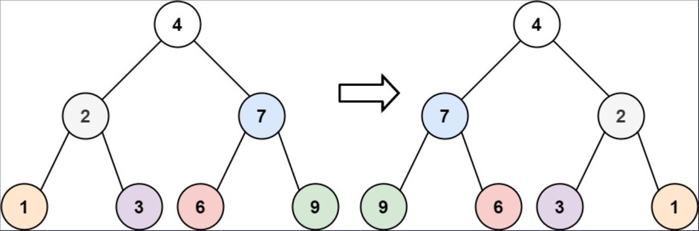
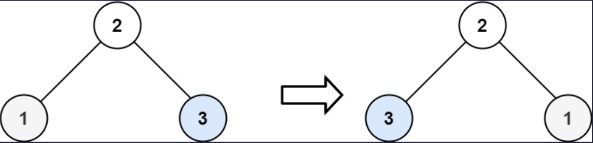

## 一、题目描述
给你一棵二叉树的根节点`root`，翻转这棵二叉树，并返回其根节点。

**示例 1**

输入: root = [4, 2, 7, 1, 3, 6, 9]
输出: [4, 7, 2, 9, 6, 3, 1]

**示例 2**

输入: root = [2, 1, 3]
输出: [2, 3, 1]

**示例 3**
输入: root = []
输出: []

**提示**
- 树中节点数目范围在`[0, 100]`内
- `-100 <= Node.val <= 100`

**相关主题**
- 树
- 深度优先搜索
- 广度优先搜索
- 二叉树


## 二、题解
::: code-tabs
@tab Rust节点定义
```rust
#[derive(Debug, PartialEq, Eq)]
pub struct TreeNode {
    pub val: i32,
    pub left: Option<Rc<RefCell<TreeNode>>>,
    pub right: Option<Rc<RefCell<TreeNode>>>,
}

impl TreeNode {
    #[inline]
    pub fn new(val: i32) -> Self {
        TreeNode {
            val,
            left: None,
            right: None,
        }
    }
}
```

@tab Java节点定义
```java
public class TreeNode {
    int val;
    TreeNode left;
    TreeNode right;

    TreeNode() {}
    TreeNode(int val) { this.val = val; }
    TreeNode(int val, TreeNode left, TreeNode right) {
        this.val = val;
        this.left = left;
        this.right = right;
    }
}
```
:::

### 方法 1: 深度优先搜索
::: code-tabs
@tab Rust
```rust
pub fn invert_tree(root: Option<Rc<RefCell<TreeNode>>>) -> Option<Rc<RefCell<TreeNode>>> {
    //Self::dfs_recur(root)
    Self::dfs_iter(root)
}

fn dfs_recur(root: Option<Rc<RefCell<TreeNode>>>) -> Option<Rc<RefCell<TreeNode>>> {
    const RECUR: fn(Option<Rc<RefCell<TreeNode>>>) = |root| {
        if let Some(curr) = root {
            let mut ref_mut = curr.borrow_mut();

            let left = ref_mut.left.take();
            let right = ref_mut.right.take();
            ref_mut.left = right;
            ref_mut.right = left;

            RECUR(ref_mut.left.clone());
            RECUR(ref_mut.right.clone());
        }
    };

    RECUR(root.clone());

    root
}

fn dfs_iter(root: Option<Rc<RefCell<TreeNode>>>) -> Option<Rc<RefCell<TreeNode>>> {
    if let Some(root) = root.clone() {
        let mut stack = vec![root];

        while let Some(curr) = stack.pop() {
            let mut ref_mut = curr.borrow_mut();

            let left = ref_mut.left.take();
            let right = ref_mut.right.take();
            ref_mut.left = right;
            ref_mut.right = left;

            if let Some(right) = ref_mut.right.clone() {
                stack.push(right);
            }
            if let Some(left) = ref_mut.left.clone() {
                stack.push(left);
            }
        }
    }

    root
}
```

@tab Java
```java
public TreeNode invertTree(TreeNode root) {
    //return dfsRecur(root);
    return dfsIter(root);
}

Consumer<TreeNode> recur = root -> {
    if (root == null) {
        return;
    }
    TreeNode left = root.left;
    root.left = root.right;
    root.right = left;
    this.recur.accept(root.left);
    this.recur.accept(root.right);
};
TreeNode dfsRecur(TreeNode root) {
    this.recur.accept(root);

    return root;
}

TreeNode dfsIter(TreeNode root) {
    if (root != null) {
        Deque<TreeNode> stack = new ArrayDeque<>() {{
            this.push(root);
        }};

        while (!stack.isEmpty()) {
            TreeNode curr = stack.pop();
            TreeNode left = curr.left;
            curr.left = curr.right;
            curr.right = left;

            if (curr.right != null) {
                stack.push(curr.right);
            }
            if (curr.left != null) {
                stack.push(curr.left);
            }
        }
    }

    return root;
}
```
:::

### 方法 2: 广度优先搜索
::: code-tabs
@tab Rust
```rust
pub fn invert_tree(root: Option<Rc<RefCell<TreeNode>>>) -> Option<Rc<RefCell<TreeNode>>> {
    Self::bfs_iter(root)
}

fn bfs_iter(root: Option<Rc<RefCell<TreeNode>>>) -> Option<Rc<RefCell<TreeNode>>> {
    if let Some(root) = root.clone() {
        let mut queue = VecDeque::from([root]);

        while let Some(curr) = queue.pop_front() {
            let mut ref_mut = curr.borrow_mut();

            let left = ref_mut.left.take();
            let right = ref_mut.right.take();
            ref_mut.left = right;
            ref_mut.right = left;

            if let Some(left) = ref_mut.left.clone() {
                queue.push_back(left);
            }
            if let Some(right) = ref_mut.right.clone() {
                queue.push_back(right);
            }
        }
    }

    root
}
```

@tab Java
```java
public TreeNode invertTree(TreeNode root) {
    return bfsIter(root);
}

TreeNode bfsIter(TreeNode root) {
    if (root != null) {
        Deque<TreeNode> queue = new ArrayDeque<>() {{
            this.addLast(root);
        }};

        while (!queue.isEmpty()) {
            TreeNode curr = queue.removeFirst();
            TreeNode left = curr.left;
            curr.left = curr.right;
            curr.right = left;
            
            if (curr.left != null) {
                queue.addLast(curr.left);
            }
            if (curr.right != null) {
                queue.addLast(curr.right);
            }
        }
    }

    return root;
}
```
:::