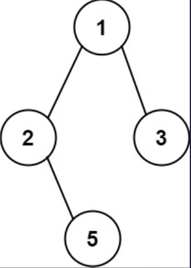

## 一、题目描述
给你一个二叉树的根节点`root`，按**任意顺序**返回所有从根节点到叶子节点的路径。

**叶子节点**是指没有子节点的节点。

**示例 1**

输入: root = [1, 2, 3, null, 5]
输出: ["1->2->5", "1->3"]

**示例 2**
输入: root = [1]
输出: ["1"]

**提示**
- 树中节点的数目在范围`[1, 100]`内
- `-100 <= Node.val <= 100`

**相关主题**
- 树
- 深度优先搜索
- 字符串
- 回溯
- 二叉树


## 二、题解
::: code-tabs
@tab Rust节点定义
```rust
#[derive(Debug, PartialEq, Eq)]
pub struct TreeNode {
    pub val: i32,
    pub left: Option<Rc<RefCell<TreeNode>>>,
    pub right: Option<Rc<RefCell<TreeNode>>>,
}

impl TreeNode {
    #[inline]
    pub fn new(val: i32) -> Self {
        TreeNode {
            val,
            left: None,
            right: None,
        }
    }
}
```

@tab Java节点定义
```java
public class TreeNode {
    int val;
    TreeNode left;
    TreeNode right;

    TreeNode() {}
    TreeNode(int val) { this.val = val; }
    TreeNode(int val, TreeNode left, TreeNode right) {
        this.val = val;
        this.left = left;
        this.right = right;
    }
}
```
:::

### 方法 1: 深度优先搜索
::: code-tabs
@tab Rust
```rust
pub fn binary_tree_paths(root: Option<Rc<RefCell<TreeNode>>>) -> Vec<String> {
    //Self::dfs_recur(root)
    Self::dfs_iter(root)
}

///
/// Time Complexity: O(n^2)
/// Space Complexity: O(n^2)
///
fn dfs_recur(root: Option<Rc<RefCell<TreeNode>>>) -> Vec<String> {
    let mut paths = vec![];
    const RECUR_HELPER: fn(Option<Rc<RefCell<TreeNode>>>, Vec<i32>, &mut Vec<Vec<i32>>) =
        |root, mut vals_vec, paths| {
            if let Some(curr) = root {
                vals_vec.push(curr.borrow().val);

                let left = curr.borrow_mut().left.take();
                let right = curr.borrow_mut().right.take();
                match (left, right) {
                    (None, None) => {
                        paths.push(vals_vec);
                    }
                    (left, right) => {
                        if left.is_some() {
                            RECUR_HELPER(left, vals_vec.clone(), paths);
                        }
                        if right.is_some() {
                            RECUR_HELPER(right, vals_vec, paths);
                        }
                    }
                }
            }
        };

    RECUR_HELPER(root, vec![], &mut paths);

    paths
    .into_iter()
    .map(|v| {
        v.into_iter()
            .map(|val| val.to_string())
            .collect::<Vec<_>>()
            .join("->")
    })
    .collect()
}

///
/// Time Complexity: O(n^2)
/// Space Complexity: O(n^2)
///
fn dfs_iter(root: Option<Rc<RefCell<TreeNode>>>) -> Vec<String> {
    let mut paths = vec![];

    if let Some(root) = root {
        let mut stack = vec![(root, vec![])];

        while let Some((curr, mut vals_vec)) = stack.pop() {
            vals_vec.push(curr.borrow().val);

            let left = curr.borrow_mut().left.take();
            let right = curr.borrow_mut().right.take();
            match (left, right) {
                (None, None) => {
                    paths.push(vals_vec);
                }
                (left, right) => {
                    if let Some(right) = right {
                        stack.push((right, vals_vec.clone()));
                    }
                    if let Some(left) = left {
                        stack.push((left, vals_vec));
                    }
                }
            }
        }
    }

    paths
    .into_iter()
    .map(|v| {
        v.into_iter()
            .map(|val| val.to_string())
            .collect::<Vec<_>>()
            .join("->")
    })
    .collect()
}
```

@tab Java
```java
public List<String> binaryTreePaths(TreeNode root) {
    //return this.dfsRecur(root);
    return this.dfsIter(root);
}

@FunctionalInterface
interface TriConsumer<A, B, C> {
    void accept(A a, B b, C c);
}

TriConsumer<TreeNode, List<Integer>, List<List<Integer>>> recur = (root, vals_list, paths) -> {
    if (root == null) {
        return;
    }
    vals_list.add(root.val);
    if (root.left == null && root.right == null) {
        paths.add(vals_list);
    } else {
        if (root.left != null) {
            this.recur.accept(root.left, new ArrayList<>(vals_list), paths);
        }
        if (root.right != null) {
            this.recur.accept(root.right, vals_list, paths);
        }
    }
};

/**
 * Time Complexity: O(n^2)
 * Space Complexity: O(n^2)
 */
List<String> dfsRecur(TreeNode root) {
    List<List<Integer>> paths = new ArrayList<>();

    this.recur.accept(root, new ArrayList<>(), paths);

    return paths.stream().map(v -> {
        List<String> s = v.stream().map(String::valueOf).collect(Collectors.toList());
        return String.join("->", s);
    }).collect(Collectors.toList());
}

/**
 * Time Complexity: O(n^2)
 * Space Complexity: O(n^2)
 */
List<String> dfsIter(TreeNode root) {
    List<List<Integer>> paths = new ArrayList<>();

    if (root != null) {
        Deque<Object[]> stack = new ArrayDeque<>() {{
            this.push(new Object[]{root, new ArrayList<Integer>()});
        }};

        while (!stack.isEmpty()) {
            Object[] objs = stack.pop();
            TreeNode curr = (TreeNode) objs[0];
            List<Integer> vals_list = (List<Integer>) objs[1];
            vals_list.add(curr.val);

            if (curr.left == null && curr.right == null) {
                paths.add(vals_list);
            } else {
                if (curr.right != null) {
                    stack.push(new Object[]{curr.right, new ArrayList<>(vals_list)});
                }
                if (curr.left != null) {
                    stack.push(new Object[]{curr.left, vals_list});
                }
            }
        }
    }
    
    return paths.stream().map(v -> {
        List<String> s = v.stream().map(String::valueOf).collect(Collectors.toList());
        return String.join("->", s);
    }).collect(Collectors.toList());
}
```
:::

### 方法 2: 广度优先搜索
::: code-tabs
@tab Rust
```rust
///
/// Time Complexity: O(n^2)
/// Space Complexity: O(n^2)
///
pub fn binary_tree_paths(root: Option<Rc<RefCell<TreeNode>>>) -> Vec<String> {
    let mut paths = vec![];

    if let Some(root) = root {
        let mut queue = VecDeque::from([(root, vec![])]);

        while let Some((curr, mut vals_vec)) = queue.pop_front() {
            vals_vec.push(curr.borrow().val);

            let left = curr.borrow_mut().left.take();
            let right = curr.borrow_mut().right.take();
            match (left, right) {
                (None, None) => {
                    paths.push(vals_vec);
                }
                (left, right) => {
                    if let Some(left) = left {
                        queue.push_back((left, vals_vec.clone()));
                    }
                    if let Some(right) = right {
                        queue.push_back((right, vals_vec));
                    }
                }
            }
        }
    }

    paths
    .into_iter()
    .map(|v| {
        v.into_iter()
            .map(|val| val.to_string())
            .collect::<Vec<_>>()
            .join("->")
    })
    .collect()
}
```

@tab Java
```java
/**
 * Time Complexity: O(n^2)
 * Space Complexity: O(n^2)
 */
public List<String> binaryTreePaths(TreeNode root) {
    List<List<Integer>> paths = new ArrayList<>();

    if (root != null) {
        Deque<Object[]> queue = new ArrayDeque<>() {{
            this.addLast(new Object[]{root, new ArrayList<Integer>()});
        }};

        while (!queue.isEmpty()) {
            Object[] objs = queue.removeFirst();
            TreeNode curr = (TreeNode) objs[0];
            List<Integer> vals_list = (List<Integer>) objs[1];
            vals_list.add(curr.val);

            if (curr.left == null && curr.right == null) {
                paths.add(vals_list);
            } else {
                if (curr.left != null) {
                    queue.addLast(new Object[]{curr.left, new ArrayList<>(vals_list)});
                }
                if (curr.right != null) {
                    queue.addLast(new Object[]{curr.right, vals_list});
                }
            }
        }
    }

    return paths.stream().map(v -> {
        List<String> s = v.stream().map(String::valueOf).collect(Collectors.toList());
        return String.join("->", s);
    }).collect(Collectors.toList());
}
```
:::