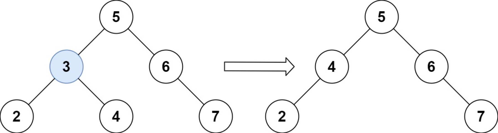

## 一、题目描述
给定一个二叉搜索树的根节点`root`和一个值`key`，删除二叉搜索树中的`key`对应的节点，并保证二叉搜索树的性质不变。返回二叉搜索树（有可能被更新）的根节点的引用。

一般来说，删除节点可分为两个步骤：
1. 首先找到需要删除的节点；
2. 如果找到了，删除它。

**示例 1**

输入: root = [5, 3, 6, 2, 4, null, 7], key = 3
输出: [5, 4, 6, 2, null, null, 7]
解释: 给定需要删除的节点值是`3`，所以我们首先找到`3`这个节点，然后删除它。

一个正确的答案是 [5, 4, 6, 2, null, null, 7], 如上图所示。

另一个正确答案是 [5, 2, 6, null, 4, null, 7]。


**示例 2**
输入: root = [5, 3, 6, 2, 4, null, 7], key = 0
输出: [5, 3, 6, 2, 4, null, 7]
解释: 二叉树不包含值为`0`的节点

**示例 3**
输入: root = [], key = 0
输出: []

**提示**
- 节点数的范围`[0, 10⁴]`.
- `-10⁵ <= Node.val <= 10⁵`
- 节点值**唯一**
- `root`是合法的二叉搜索树
- `-10⁵ <= key <= 10⁵`

**进阶**
要求算法时间复杂度为`O(h)`，`h`为树的高度。

**相关主题**
- 树
- 二叉搜索树
- 二叉树


## 二、题解
::: code-tabs
@tab Rust节点定义
```rust
#[derive(Debug, PartialEq, Eq)]
pub struct TreeNode {
    pub val: i32,
    pub left: Option<Rc<RefCell<TreeNode>>>,
    pub right: Option<Rc<RefCell<TreeNode>>>,
}

impl TreeNode {
    #[inline]
    pub fn new(val: i32) -> Self {
        TreeNode {
            val,
            left: None,
            right: None,
        }
    }
}
```

@tab Java节点定义
```java
public class TreeNode {
    int val;
    TreeNode left;
    TreeNode right;

    TreeNode() {}
    TreeNode(int val) { this.val = val; }
    TreeNode(int val, TreeNode left, TreeNode right) {
        this.val = val;
        this.left = left;
        this.right = right;
    }
}
```
:::

### 方法 1: 递归
::: code-tabs
@tab Rust
```rust
pub fn delete_node(mut root: Option<Rc<RefCell<TreeNode>>>, key: i32) -> Option<Rc<RefCell<TreeNode>>> {
    const DELETE: fn(&mut Option<Rc<RefCell<TreeNode>>>, i32, Option<Rc<RefCell<TreeNode>>>, bool) = 
        |root, key, mut parent, is_left| {
            if let Some(curr) = root {
                let curr_val = curr.borrow().val;

                if curr_val == key {
                    let right = curr.borrow_mut().right.take();
                    let left = curr.borrow_mut().left.take();

                    let child = if right.is_some() {
                        let mut leftmost = right.clone();

                        while let Some(ref curr) = leftmost {
                            let left = curr.borrow().left.clone();
                            if left.is_none() {
                                break;
                            } else {
                                leftmost = left;
                            }
                        }

                        if let Some(curr) = leftmost {
                            curr.borrow_mut().left = left;
                        }

                        right
                    } else {
                        left
                    };

                    if let Some(p) = parent {
                        if is_left {
                            p.borrow_mut().left = child;
                        } else {
                            p.borrow_mut().right = child;
                        }
                    } else {
                        *root = child;
                    }
                } else {
                    parent = Some(curr.clone());

                    if key < curr_val {
                        let mut left = curr.borrow().left.clone();
                        DELETE(&mut left, key, parent, true)
                    } else {
                        let mut right = curr.borrow().right.clone();
                        DELETE(&mut right, key, parent, false)
                    }
                }
            }
        };

    DELETE(&mut root, key, None, false);

    root
}
```

@tab Java
```java
@FunctionalInterface
interface QuadrConsumer<A, B, C, D> {
    void accept(A a, B b, C c, D d);
}

QuadrConsumer<TreeNode[], Integer, TreeNode, Boolean> delete = (roots, key, parent, isLeft) -> {
    TreeNode root = roots[0];
    if (root == null) {
        return;
    }

    if (root.val == key) {
        TreeNode child;
        if (root.right != null) {
            child = root.right;

            TreeNode leftmost = root.right;
            while (leftmost.left != null) {
                leftmost = leftmost.left;
            }

            leftmost.left = root.left;
        } else {
            child = root.left;
        }

        if (parent == null) {
            roots[0] = child;
        } else {
            if (isLeft) {
                parent.left = child;
            } else {
                parent.right = child;
            }
        }
    } else {
        if (key < root.val) {
            this.delete.accept(new TreeNode[]{root.left}, key, root, true);
        } else {
            this.delete.accept(new TreeNode[]{root.right}, key, root, false);
        }
    }
};

public TreeNode deleteNode(TreeNode _root, int key) {
    TreeNode[] root = {_root};

    this.delete.accept(root, key, null, false);

    return root[0];
}
```
:::

### 方法 2: 迭代
::: code-tabs
@tab Rust
```rust
pub fn delete_node(mut root: Option<Rc<RefCell<TreeNode>>>, key: i32) -> Option<Rc<RefCell<TreeNode>>> {
    let mut parent: Option<Rc<RefCell<TreeNode>>> = None;
    let mut is_left = false;
    let mut curr_node = root.clone();

    while let Some(curr) = curr_node {
        let curr_val = curr.borrow().val;

        if curr_val == key {
            let left = curr.borrow_mut().left.take();
            let right = curr.borrow_mut().right.take();

            let child = if right.is_some() {
                let mut leftmost = right.clone();

                while let Some(ref curr) = leftmost {
                    let left = curr.borrow().left.clone();
                    if left.is_none() {
                        break;
                    }
                    leftmost = left;
                }

                if let Some(curr) = leftmost {
                    curr.borrow_mut().left = left;
                }

                right
            } else {
                left
            };

            if let Some(p) = parent {
                if is_left {
                    p.borrow_mut().left = child;
                } else {
                    p.borrow_mut().right = child;
                }
            } else {
                root = child;
            }

            break;
        } else {
            parent = Some(curr.clone());

            if key < curr_val {
                is_left = true;
                curr_node = curr.borrow().left.clone();
            } else {
                is_left = false;
                curr_node = curr.borrow().right.clone();
            }
        }
    }

    root
}
```

@tab Java
```java
public TreeNode deleteNode(TreeNode root, int key) {
    TreeNode parent = null;
    boolean isLeft = false;
    TreeNode curr = root;

    while (curr != null) {
        if (curr.val == key) {
            TreeNode child;
            if (curr.right != null) {
                child = curr.right;

                TreeNode leftmost = curr.right;
                while (leftmost.left != null) {
                    leftmost = leftmost.left;
                }

                leftmost.left = curr.left;
            } else {
                child = curr.left;
            }

            if (parent == null) {
                root = child;
            } else {
                if (isLeft) {
                    parent.left = child;
                } else {
                    parent.right = child;
                }
            }

            break;
        } else {
            parent = curr;

            if (key < curr.val) {
                isLeft = true;
                curr = curr.left;
            } else {
                isLeft = false;
                curr = curr.right;
            }
        }
    }
    
    return root;
}
```
:::