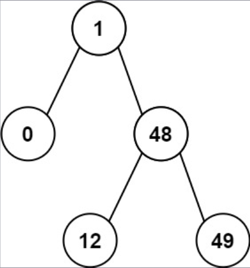

## 一、题目描述
给你一个二叉搜索树的根节点`root`，返回**树中任意两个不同节点值之间的最小差值**。

差值是一个正数，其数值等于两值之差的绝对值。

**示例 1**

输入: root = [4, 2, 6, 1, 3]
输出: 1

**示例 2**

输入: root = [1, 0, 48, null, null, 12, 49]
输出: 1

**提示**
- 树中节点的数目范围是`[2, 10⁴]`
- `0 <= Node.val <= 10⁵`

**注意**：本题与[783：二叉搜索树节点最小距离](https://leetcode-cn.com/problems/minimum-distance-between-bst-nodes/)相同

**相关主题**
- 树
- 深度优先搜索
- 广度优先搜索
- 二叉搜索树
- 二叉树


## 二、题解
::: code-tabs
@tab Rust节点定义
```rust
#[derive(Debug, PartialEq, Eq)]
pub struct TreeNode {
    pub val: i32,
    pub left: Option<Rc<RefCell<TreeNode>>>,
    pub right: Option<Rc<RefCell<TreeNode>>>,
}

impl TreeNode {
    #[inline]
    pub fn new(val: i32) -> Self {
        TreeNode {
            val,
            left: None,
            right: None,
        }
    }
}
```

@tab Java节点定义
```java
public class TreeNode {
    int val;
    TreeNode left;
    TreeNode right;

    TreeNode() {}
    TreeNode(int val) { this.val = val; }
    TreeNode(int val, TreeNode left, TreeNode right) {
        this.val = val;
        this.left = left;
        this.right = right;
    }
}
```
:::

### 方法 1: 中序遍历
::: code-tabs
@tab Rust
```rust
pub fn get_minimum_difference(root: Option<Rc<RefCell<TreeNode>>>) -> i32 {
    Self::in_order_recur(root)
    //Self::in_order_iter(root)
}

fn in_order_recur(root: Option<Rc<RefCell<TreeNode>>>) -> i32 {
    let mut min_abs_diff = i32::MAX;
    let mut prev_val = None;
    const IN_ORDER: fn(Option<Rc<RefCell<TreeNode>>>, &mut i32, &mut Option<i32>) =
        |root, min_abs_diff, prev_val| {
            if let Some(curr) = root {
                IN_ORDER(curr.borrow_mut().left.take(), min_abs_diff, prev_val);

                let curr_val = curr.borrow().val;
                prev_val.map(|prev_val| {
                    let diff = curr_val - prev_val;
                    if diff < *min_abs_diff {
                        *min_abs_diff = diff;
                    }
                });
                *prev_val = Some(curr_val);

                IN_ORDER(curr.borrow_mut().right.take(), min_abs_diff, prev_val);
            }
        };

    IN_ORDER(root, &mut min_abs_diff, &mut prev_val);

    min_abs_diff
}

fn in_order_iter(root: Option<Rc<RefCell<TreeNode>>>) -> i32 {
    let mut min_abs_diff = i32::MAX;
    let mut prev_val = None;

    if let Some(root) = root {
        let mut stack = vec![Ok(root)];

        while let Some(curr) = stack.pop() {
            match curr {
                Ok(node) => {
                    if let Some(right) = node.borrow_mut().right.take() {
                        stack.push(Ok(right));
                    }

                    stack.push(Err(node.borrow().val));

                    if let Some(left) = node.borrow_mut().left.take() {
                        stack.push(Ok(left));
                    }
                }
                Err(curr_val) => {
                    prev_val.map(|prev_val| {
                        let diff = curr_val - prev_val;
                        if diff < min_abs_diff {
                            min_abs_diff = diff;
                        }
                    });

                    prev_val = Some(curr_val);
                }
            }
        }
    }

    min_abs_diff
}
```

@tab Java
```java
public int getMinimumDifference(TreeNode root) {
    //return this.inorderRecur(root);
    return this.inorderIter(root);
}

BiConsumer<TreeNode, int[]> inorder = (root, vals) -> {
    if (root == null) {
        return;
    }

    this.inorder.accept(root.left, vals);

    int currVal = root.val;
    int diff = currVal - vals[1]; // vals[1]表示前一个值
    if (diff < vals[0]) { // vals[0]表示当前最小的差值
        vals[0] = diff;
    }
    vals[1] = currVal;

    this.inorder.accept(root.right, vals);
};

int inorderRecur(TreeNode root) {
    int[] vals = {Integer.MAX_VALUE, Integer.MIN_VALUE / 2};

    this.inorder.accept(root, vals);

    return vals[0];
}


int inorderIter(TreeNode root) {
    int minAbsDiff = Integer.MAX_VALUE;
    int prevVal = Integer.MIN_VALUE / 2;
    Deque<Object> stack = new ArrayDeque<>() {{
        this.push(root);
    }};

    while (!stack.isEmpty()) {
        Object obj = stack.pop();
        switch (obj) {
            case TreeNode node -> {
                if (node.right != null) {
                    stack.push(node.right);
                }

                stack.push(node.val);

                if (node.left != null) {
                    stack.push(node.left);
                }
            }
            case Integer currVal -> {
                int diff = currVal - prevVal;
                if (diff < minAbsDiff) {
                    minAbsDiff = diff;
                }
                prevVal = currVal;
            }
            default -> throw new IllegalStateException("Unexpected value: " + obj);
        }
    }

    return minAbsDiff;
}
```
:::
