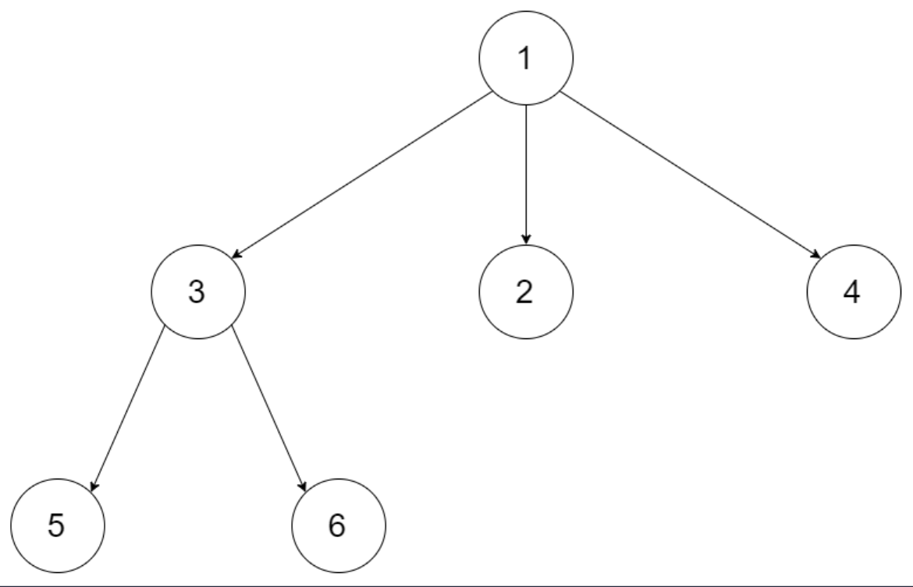
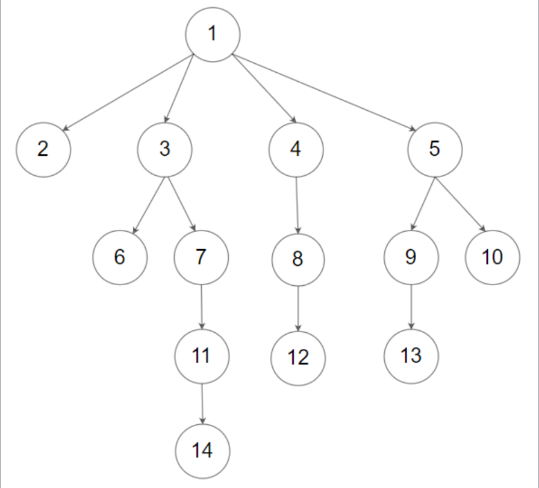

## 一、题目描述
给定一个`N`叉树，找到其最大深度。

最大深度是指从根节点到最远叶子节点的最长路径上的节点总数。

`N`叉树输入按层序遍历序列化表示，每组子节点由空值分隔（请参见示例）。

**示例 1**

输入: root = [1, null, 3, 2, 4, null, 5, 6]
输出: 3

**示例 2**

输入: root = [1, null, 2, 3, 4, 5, null, null, 6, 7, null, 8, null, 9, 10, null, null, 11, null, 12, null, 13, null, null, 14]
输出: 3

**提示**
- 树的深度不会超过`1000`。
- 树的节点数目位于`[0, 10⁴]`之间。

**相关主题**
- 树
- 深度优先搜索
- 广度优先搜索


## 二、题解
::: code-tabs
@tab Rust节点定义
```rust
#[derive(Debug, PartialEq, Eq)]
pub struct Node {
    pub val: i32,
    pub children: Option<Vec<Option<Rc<RefCell<Node>>>>>,
}

impl Node {
    ///
    /// Node with no children
    ///
    pub fn new(val: i32) -> Option<Rc<RefCell<Node>>> {
        Some(Rc::new(RefCell::new(Node {
            val,
            children: None,
        })))
    }
    ///
    /// Node with children
    ///
    pub fn new_with_children(val: i32, children: Vec<Option<Rc<RefCell<Node>>>>) -> Option<Rc<RefCell<Node>>> {
        Some(Rc::new(RefCell::new(Node {
            val,
            children: if children.is_empty() {
                None
            } else {
                Some(children)
            },
        })))
    }
}
```

@tab Java节点定义
```java
public class Node {
    int val;
    List<Node> children;

    public Node() {}

    public Node(int _val) {
        val = _val;
    }

    public Node(int _val, List<Node> _children) {
        val = _val;
        children = _children;
    }
}
```
:::

### 方法 1: 深度优先搜索
::: code-tabs
@tab Rust
```rust
pub fn max_depth(root: Option<Rc<RefCell<Node>>>) -> i32 {
    //Self::dfs_recur(root)
    Self::dfs_iter(root)
}

fn dfs_recur(root: Option<Rc<RefCell<Node>>>) -> i32 {
    const DFS: fn(Option<Rc<RefCell<Node>>>) -> i32 = |root| match root {
        None => 0,
        Some(node) => {
            let mut max_depth = 0;

            let children = node.borrow_mut().children.take();
            if let Some(nodes) = children {
                for node in nodes {
                    max_depth = std::cmp::max(max_depth, DFS(node));
                }
            }

            max_depth + 1
        }
    };

    DFS(root)
}

fn dfs_iter(root: Option<Rc<RefCell<Node>>>) -> i32 {
    let mut max_depth = 0;

    if let Some(root) = root {
        let mut stack = vec![(root, 1)];

        while let Some((curr, depth)) = stack.pop() {
            max_depth = std::cmp::max(max_depth, depth);

            let children = curr.borrow_mut().children.take();
            if let Some(nodes) = children {
                for node in nodes {
                    if let Some(node) = node {
                        stack.push((node, depth + 1));
                    }
                }
            }
        }
    }

    max_depth
}
```

@tab Java
```java
public int maxDepth(Node root) {
    //return this.dfsRecur(root);
    return this.dfsIter(root);
}

Function<Node, Integer> recur = (root) -> {
    if (root == null) {
        return 0;
    }

    int maxDepth = 0;
    for (Node n : root.children) {
        maxDepth = Math.max(maxDepth, this.recur.apply(n));
    }

    return maxDepth + 1;
};

int dfsRecur(Node root) {
    return this.recur.apply(root);
}


int dfsIter(Node root) {
    int maxDepth = 0;

    if (root != null) {
        Deque<Object[]> stack = new ArrayDeque<>() {{
            this.push(new Object[]{root, 1});
        }};

        while (!stack.isEmpty()) {
            Object[] objs = stack.pop();
            Node curr = (Node) objs[0];
            int depth = (int) objs[1];

            maxDepth = Math.max(maxDepth, depth);

            for (Node n : curr.children) {
                stack.push(new Object[]{n, depth + 1});
            }
        }
    }

    return maxDepth;
}
```
:::

### 方法 2: 广度优先搜索
::: code-tabs
@tab Rust
```rust
pub fn max_depth(root: Option<Rc<RefCell<Node>>>) -> i32 {
    //Self::bfs_iter_1(root)
    Self::bfs_iter_2(root)
}

fn bfs_iter_1(root: Option<Rc<RefCell<Node>>>) -> i32 {
    let mut max_depth = 0;

    if let Some(root) = root {
        let mut queue = VecDeque::from([(root, 1)]);

        while let Some((curr, depth)) = queue.pop_front() {
            max_depth = std::cmp::max(max_depth, depth);

            let children = curr.borrow_mut().children.take();
            if let Some(nodes) = children {
                for node in nodes {
                    if let Some(node) = node {
                        queue.push_back((node, depth + 1));
                    }
                }
            }
        }
    }

    max_depth
}

fn bfs_iter_2(root: Option<Rc<RefCell<Node>>>) -> i32 {
    let mut max_depth = 0;

    if let Some(root) = root {
        let mut queue = VecDeque::from([root]);

        while !queue.is_empty() {
            let len = queue.len();

            for _ in 0..len {
                if let Some(curr) = queue.pop_front() {
                    let children = curr.borrow_mut().children.take();

                    if let Some(nodes) = children {
                        for node in nodes {
                            if let Some(node) = node {
                                queue.push_back(node);
                            }
                        }
                    }
                }
            }

            max_depth += 1;
        }
    }

    max_depth
}
```

@tab Java
```java
public int maxDepth(Node root) {
    //return this.bfsIter1(root)
    return this.bfsIter2(root);
}

int bfsIter1(Node root) {
    int maxDepth = 0;

    if (root != null) {
        Deque<Object[]> queue = new ArrayDeque<>() {{
            this.addLast(new Object[]{root, 1});
        }};

        while (!queue.isEmpty()) {
            Object[] objs = queue.removeFirst();
            Node curr = (Node) objs[0];
            int depth = (int) objs[1];

            maxDepth = Math.max(maxDepth, depth);

            for (Node n : curr.children) {
                queue.addLast(new Object[]{n, depth + 1});
            }
        }
    }

    return maxDepth;
}

int bfsIter2(Node root) {
    int maxDepth = 0;

    if (root != null) {
        Deque<Node> queue = new ArrayDeque<>() {{
            this.addLast(root);
        }};

        while (!queue.isEmpty()) {
            int size = queue.size();

            for (int i = 0; i < size; i++) {
                Node curr = queue.removeFirst();
                
                for (Node n : curr.children) {
                    queue.addLast(n);
                }
            }

            maxDepth++;
        }
    }

    return maxDepth;
}
```
:::