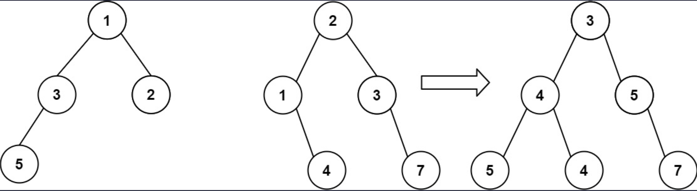

## 一、题目描述
给你两棵二叉树：`root1`和`root2`。

想象一下，当你将其中一棵覆盖到另一棵之上时，两棵树上的一些节点将会重叠（而另一些不会）。你需要将这两棵树合并成一棵新二叉树。合并的规则是：如果两个节点重叠，那么将这两个节点的值相加作为合并后节点的新值；否则，**不为**`null`的节点将直接作为新二叉树的节点。

返回合并后的二叉树。

**注意**：合并过程必须从两个树的根节点开始。

**示例 1**

输入: root1 = [1, 3, 2, 5], root2 = [2, 1, 3, null, 4, null, 7]
输出: [3, 4, 5, 5, 4, null, 7]

**示例 2**
输入: root1 = [1], root2 = [1, 2]
输出: [2, 2]

**提示**
- 两棵树中的节点数目在范围`[0, 2000]`内
- `-10⁴ <= Node.val <= 10⁴`

**相关主题**
- 树
- 深度优先搜索
- 广度优先搜索
- 二叉树


## 二、题解
::: code-tabs
@tab Rust节点定义
```rust
#[derive(Debug, PartialEq, Eq)]
pub struct TreeNode {
    pub val: i32,
    pub left: Option<Rc<RefCell<TreeNode>>>,
    pub right: Option<Rc<RefCell<TreeNode>>>,
}

impl TreeNode {
    #[inline]
    pub fn new(val: i32) -> Self {
        TreeNode {
            val,
            left: None,
            right: None,
        }
    }
}
```

@tab Java节点定义
```java
public class TreeNode {
    int val;
    TreeNode left;
    TreeNode right;

    TreeNode() {}
    TreeNode(int val) { this.val = val; }
    TreeNode(int val, TreeNode left, TreeNode right) {
        this.val = val;
        this.left = left;
        this.right = right;
    }
}
```
:::

### 方法 1: 深度优先搜索
::: code-tabs
@tab Rust
```rust
pub fn merge_trees(root1: Option<Rc<RefCell<TreeNode>>>, root2: Option<Rc<RefCell<TreeNode>>>) -> Option<Rc<RefCell<TreeNode>>> {
    //Self::dfs_recur_create_new(root1, root2)
    //Self::dfs_iter_create_new(root1, root2)
    //Self::dfs_recur_reuse(root1, root2)
    Self::dfs_iter_reuse(root1, root2)
}

///
/// 深度优先搜索，递归，创建一个新节点
///
fn dfs_recur_create_new(
    root1: Option<Rc<RefCell<TreeNode>>>,
    root2: Option<Rc<RefCell<TreeNode>>>,
) -> Option<Rc<RefCell<TreeNode>>> {
    const MERGE: fn(
        Option<Rc<RefCell<TreeNode>>>,
        Option<Rc<RefCell<TreeNode>>>,
    ) -> Option<Rc<RefCell<TreeNode>>> = |root1, root2| match (root1, root2) {
        (None, r2) => r2,
        (r1, None) => r1,
        (Some(r1), Some(r2)) => {
            let mut r1 = r1.borrow_mut();
            let mut r2 = r2.borrow_mut();
            let root = Rc::new(RefCell::new(TreeNode::new(r1.val + r2.val)));

            root.borrow_mut().left = MERGE(r1.left.take(), r2.left.take());
            root.borrow_mut().right = MERGE(r1.right.take(), r2.right.take());

            Some(root)
        }
    };

    MERGE(root1, root2)
}

///
/// 深度优先搜索，迭代，创建一个新节点
///
fn dfs_iter_create_new(
    root1: Option<Rc<RefCell<TreeNode>>>,
    root2: Option<Rc<RefCell<TreeNode>>>,
) -> Option<Rc<RefCell<TreeNode>>> {
    let mut root = None;
    let mut stack = vec![(None, root1, root2, false)];

    while let Some((parent, r1, r2, is_left)) = stack.pop() {
        let node = match (r1, r2) {
            (None, r2) => r2,
            (r1, None) => r1,
            (Some(r1), Some(r2)) => {
                let mut r1 = r1.borrow_mut();
                let mut r2 = r2.borrow_mut();
                let node = Some(Rc::new(RefCell::new(TreeNode::new(r1.val + r2.val))));

                if r1.right.is_some() || r2.right.is_some() {
                    stack.push((node.clone(), r1.right.take(), r2.right.take(), false));
                }
                if r1.left.is_some() || r2.left.is_some() {
                    stack.push((node.clone(), r1.left.take(), r2.left.take(), true));
                }

                node
            }
        };

        if let Some(p) = parent {
            if is_left {
                p.borrow_mut().left = node;
            } else {
                p.borrow_mut().right = node;
            }
        } else {
            root = node;
        }
    }

    root
}

///
/// 深度优先搜索，递归，重复使用root1
///
fn dfs_recur_reuse(
    root1: Option<Rc<RefCell<TreeNode>>>,
    root2: Option<Rc<RefCell<TreeNode>>>,
) -> Option<Rc<RefCell<TreeNode>>> {
    const MERGE: fn(
        Option<Rc<RefCell<TreeNode>>>,
        Option<Rc<RefCell<TreeNode>>>,
    ) -> Option<Rc<RefCell<TreeNode>>> = |root1, root2| match (root1, root2) {
        (None, r2) => r2,
        (r1, None) => r1,
        (Some(r1), Some(r2)) => {
            r1.borrow_mut().val += r2.borrow().val;
            let r1_l = r1.borrow_mut().left.take();
            let r2_l = r2.borrow_mut().left.take();
            let r1_r = r1.borrow_mut().right.take();
            let r2_r = r2.borrow_mut().right.take();

            r1.borrow_mut().left = MERGE(r1_l, r2_l);
            r1.borrow_mut().right = MERGE(r1_r, r2_r);

            Some(r1)
        }
    };

    MERGE(root1, root2)
}

///
/// 深度优先搜索，迭代，重复使用root1
///
fn dfs_iter_reuse(
    root1: Option<Rc<RefCell<TreeNode>>>,
    root2: Option<Rc<RefCell<TreeNode>>>,
) -> Option<Rc<RefCell<TreeNode>>> {
    // Ensure that r1 is not None
    if root1.is_none() {
        return root2;
    }
    let mut stack = vec![(root1.clone(), root2)];

    while let Some((root1, root2)) = stack.pop() {
        match (root1, root2) {
            (Some(r1), Some(r2)) => {
                let mut r1 = r1.borrow_mut();
                let mut r2 = r2.borrow_mut();

                r1.val += r2.val;
                if r1.left.is_none() {
                    r1.left = r2.left.take();
                } else {
                    stack.push((r1.left.clone(), r2.left.clone()));
                }
                if r1.right.is_none() {
                    r1.right = r2.right.take();
                } else {
                    stack.push((r1.right.clone(), r2.right.clone()));
                }
            }
            _ => {}
        }
    }

    root1
}
```

@tab Java
```java
public TreeNode mergeTrees(TreeNode root1, TreeNode root2) {
    //return this.dfsRecurCreateNew(root1, root2);
    //return this.dfsIterCreateNew(root1, root2);
    //return this.dfsRecurReuse(root1, root2);
    return this.dfsIterReuse(root1, root2);
}

BiFunction<TreeNode, TreeNode, TreeNode> merge1 = (root1, root2) -> {
    if (root1 == null) {
        return root2;
    }
    if (root2 == null) {
        return root1;
    }

    TreeNode root = new TreeNode(root1.val + root2.val);
    root.left = this.merge1.apply(root1.left, root2.left);
    root.right = this.merge1.apply(root1.right, root2.right);

    return root;
};
/**
 * 深度优先搜索，递归，创建一个新节点
 */
TreeNode dfsRecurCreateNew(TreeNode root1, TreeNode root2) {
    return this.merge1.apply(root1, root2);
}

@FunctionalInterface
interface TriFunction<A, B, C, D> {
    D apply(A a, B b, C c);
}
TriFunction<TreeNode, TreeNode, Deque<Object[]>, TreeNode> createNode = (r1, r2, container) -> {
    if (r1 == null) {
        return r2;
    }
    if (r2 == null) {
        return r1;
    }

    TreeNode node = new TreeNode(r1.val + r2.val);
    if (r1.left != null || r2.left != null) {
        container.addLast(new Object[]{node, r1.left, r2.left, true});
    }
    if (r1.right != null || r2.right != null) {
        container.addLast(new Object[]{node, r1.right, r2.right, false});
    }

    return node;
};
/**
 * 深度优先搜索，迭代，创建一个新节点
 */
TreeNode dfsIterCreateNew(TreeNode root1, TreeNode root2) {
    TreeNode root = null;
    Deque<Object[]> stack = new ArrayDeque<>() {{
        this.push(new Object[] {
            null, root1, root2, false
        });
    }};

    while (!stack.isEmpty()) {
        Object[] objs = stack.pop();
        TreeNode parent = (TreeNode) objs[0];
        TreeNode r1 = (TreeNode) objs[1];
        TreeNode r2 = (TreeNode) objs[2];
        boolean isLeft = (boolean) objs[3];

        TreeNode node = this.createNode.apply(r1, r2, stack);

        if (parent == null) {
            root = node;
        } else {
            if (isLeft) {
                parent.left = node;
            } else {
                parent.right = node;
            }
        }
    }

    return root;
}

BiFunction<TreeNode, TreeNode, TreeNode> merge2 = (root1, root2) -> {
    if (root1 == null) {
        return root2;
    }
    if (root2 == null) {
        return root1;
    }

    root1.val += root2.val;
    root1.left = this.merge2.apply(root1.left, root2.left);
    root1.right = this.merge2.apply(root1.right, root2.right);

    return root1;
};
/**
 * 深度优先搜索，递归，重复使用root1
 */
TreeNode dfsRecurReuse(TreeNode root1, TreeNode root2) {
    return this.merge2.apply(root1, root2);
}

/**
 * 深度优先搜索，迭代，重复使用root1
 */
TreeNode dfsIterReuse(TreeNode root1, TreeNode root2) {
    // 确保root1不为null
    if (root1 == null) {
        return root2;
    }
    Deque<TreeNode[]> stack = new ArrayDeque<>() {{
        this.push(new TreeNode[]{root1, root2});
    }};

    while (!stack.isEmpty()) {
        TreeNode[] nodes = stack.pop();
        TreeNode r1 = nodes[0];
        TreeNode r2 = nodes[1];
        if (r1 == null || r2 == null) {
            continue;
        }

        r1.val += r2.val;
        if (r1.left == null) {
            r1.left = r2.left;
        } else {
            stack.push(new TreeNode[]{r1.left, r2.left});
        }
        if (r1.right == null) {
            r1.right = r2.right;
        } else {
            stack.push(new TreeNode[]{r1.right, r2.right});
        }
    }

    return root1;
}
```
:::

### 方法 2: 广度优先搜索
::: code-tabs
@tab Rust
```rust
pub fn merge_trees(root1: Option<Rc<RefCell<TreeNode>>>, root2: Option<Rc<RefCell<TreeNode>>>) -> Option<Rc<RefCell<TreeNode>>> {
    //Self::bfs_iter_create_new(root1, root2)
    Self::bfs_iter_reuse(root1, root2)
}

///
/// 广度优先搜索，迭代，创建一个新节点
///
fn bfs_iter_create_new(
    root1: Option<Rc<RefCell<TreeNode>>>,
    root2: Option<Rc<RefCell<TreeNode>>>,
) -> Option<Rc<RefCell<TreeNode>>> {
    let mut root = None;
    let mut queue = VecDeque::from([(None, root1, root2, false)]);

    while let Some((parent, r1, r2, is_left)) = queue.pop_front() {
        let node = match (r1, r2) {
            (None, r2) => r2,
            (r1, None) => r1,
            (Some(r1), Some(r2)) => {
                let mut r1 = r1.borrow_mut();
                let mut r2 = r2.borrow_mut();
                let new = Some(Rc::new(RefCell::new(TreeNode::new(r1.val + r2.val))));

                if r1.left.is_some() || r2.left.is_some() {
                    queue.push_back((new.clone(), r1.left.take(), r2.left.take(), true));
                }
                if r1.right.is_some() || r2.right.is_some() {
                    queue.push_back((new.clone(), r1.right.take(), r2.right.take(), false));
                }

                new
            }
        };

        if let Some(p) = parent {
            if is_left {
                p.borrow_mut().left = node;
            } else {
                p.borrow_mut().right = node;
            }
        } else {
            root = node;
        }
    }

    root
}

///
/// 广度优先搜索，迭代，重复使用root1
///
fn bfs_iter_reuse(
    root1: Option<Rc<RefCell<TreeNode>>>,
    root2: Option<Rc<RefCell<TreeNode>>>,
) -> Option<Rc<RefCell<TreeNode>>> {
    // Ensure that r1 is not None
    if root1.is_none() {
        return root2;
    }
    let mut queue = VecDeque::from([(root1.clone(), root2)]);

    while let Some((r1, r2)) = queue.pop_front() {
        match (r1, r2) {
            (Some(r1), Some(r2)) => {
                let mut r1 = r1.borrow_mut();
                let mut r2 = r2.borrow_mut();

                r1.val += r2.val;
                if r1.left.is_none() {
                    r1.left = r2.left.take();
                } else {
                    queue.push_back((r1.left.clone(), r2.left.clone()));
                }
                if r1.right.is_none() {
                    r1.right = r2.right.take();
                } else {
                    queue.push_back((r1.right.clone(), r2.right.clone()));
                }
            }
            _ => {}
        }
    }

    root1
}
```

@tab Java
```java
public TreeNode mergeTrees(TreeNode root1, TreeNode root2) {
    //return this.bfsIterCreateNew(root1, root2);
    return this.bfsIterReuse(root1, root2);
}

/**
 * 广度优先搜索，迭代，创建一个新节点
 */
TreeNode bfsIterCreateNew(TreeNode root1, TreeNode root2) {
    TreeNode root = null;
    Deque<Object[]> queue = new ArrayDeque<>() {{
        this.addLast(new Object[]{null, root1, root2, false});
    }};

    while (!queue.isEmpty()) {
        Object[] objs = queue.removeFirst();
        TreeNode parent = (TreeNode) objs[0];
        TreeNode r1 = (TreeNode) objs[1];
        TreeNode r2 = (TreeNode) objs[2];
        boolean isLeft = (boolean) objs[3];

        TreeNode node = this.createNode.apply(r1, r2, queue);

        if (parent == null) {
            root = node;
        } else {
            if (isLeft) {
                parent.left = node;
            } else {
                parent.right = node;
            }
        }
    }

    return root;
}

/**
 * 广度优先搜索，迭代，重复使用root1
 */
TreeNode bfsIterReuse(TreeNode root1, TreeNode root2) {
    if (root1 == null) {
        return root2;
    }
    Deque<TreeNode[]> queue = new ArrayDeque<>() {{
        this.addLast(new TreeNode[]{root1, root2});
    }};

    while (!queue.isEmpty()) {
        TreeNode[] nodes = queue.removeFirst();
        TreeNode r1 = nodes[0];
        TreeNode r2 = nodes[1];

        if (r1 == null || r2 == null) {
            continue;
        }
        r1.val += r2.val;

        if (r1.left == null) {
            r1.left = r2.left;
        } else {
            queue.addLast(new TreeNode[]{r1.left, r2.left});
        }
        if (r1.right == null) {
            r1.right = r2.right;
        } else {
            queue.addLast(new TreeNode[]{r1.right, r2.right});
        }
    }

    return root1;
}
```
:::