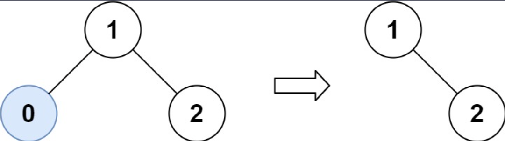
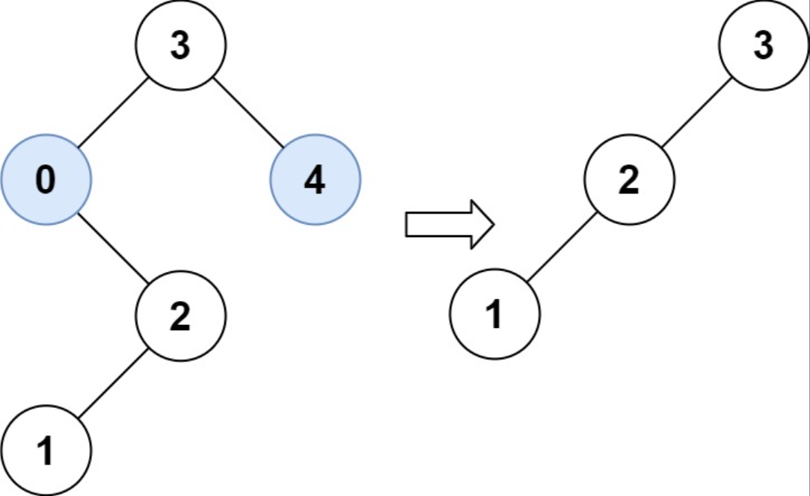

## 一、题目描述
给你二叉搜索树的根节点`root`，同时给定最小边界`low`和最大边界`high`。通过修剪二叉搜索树，使得所有节点的值在`[low, high]`中。修剪树**不应该**改变保留在树中的元素的相对结构 (即，如果没有被移除，原有的父代子代关系都应当保留)。可以证明，存在**唯一的答案**。

所以结果应当返回修剪好的二叉搜索树的新的根节点。注意，根节点可能会根据给定的边界发生改变。

**示例 1**

输入: root = [1, 0, 2], low = 1, high = 2
输出: [1, null, 2]

**示例 2**

输入: root = [3, 0, 4, null, 2, null, null, 1], low = 1, high = 3
输出: [3, 2, null, 1]

**提示**
- 树中节点数在范围`[1, 10⁴]`内
- `0 <= Node.val <= 10⁴`
- 树中每个节点的值都是**唯一**的
- 题目数据保证输入是一棵有效的二叉搜索树
- `0 <= low <= high <= 10⁴`

**相关主题**
- 树
- 深度优先搜索
- 二叉搜索树
- 二叉树


## 二、题解
::: code-tabs
@tab Rust节点定义
```rust
#[derive(Debug, PartialEq, Eq)]
pub struct TreeNode {
    pub val: i32,
    pub left: Option<Rc<RefCell<TreeNode>>>,
    pub right: Option<Rc<RefCell<TreeNode>>>,
}

impl TreeNode {
    #[inline]
    pub fn new(val: i32) -> Self {
        TreeNode {
            val,
            left: None,
            right: None,
        }
    }
}
```

@tab Java节点定义
```java
public class TreeNode {
    int val;
    TreeNode left;
    TreeNode right;

    TreeNode() {}
    TreeNode(int val) { this.val = val; }
    TreeNode(int val, TreeNode left, TreeNode right) {
        this.val = val;
        this.left = left;
        this.right = right;
    }
}
```
:::

### 方法 1: 递归
::: code-tabs
@tab Rust
```rust
pub fn trim_bst(root: Option<Rc<RefCell<TreeNode>>>, low: i32, high: i32) -> Option<Rc<RefCell<TreeNode>>> {
    const TRIM: fn(Option<Rc<RefCell<TreeNode>>>, i32, i32) -> Option<Rc<RefCell<TreeNode>>> =
        |root, low, high| match root {
            None => None,
            Some(curr) => {
                let curr_val = curr.borrow().val;

                if curr_val < low {
                    TRIM(curr.borrow_mut().right.take(), low, high)

                } else if curr_val > high {
                    TRIM(curr.borrow_mut().left.take(), low, high)

                } else {
                    let left = curr.borrow_mut().left.take();
                    let right = curr.borrow_mut().right.take();

                    curr.borrow_mut().left = TRIM(left, low, high);
                    curr.borrow_mut().right = TRIM(right, low, high);

                    Some(curr)
                }
            }
        };

    TRIM(root, low, high)
}
```

@tab Java
```java
@FunctionalInterface
interface TriFunction<A, B, C, D> {
    D apply(A a, B b, C c);
}

TriFunction<TreeNode, Integer, Integer, TreeNode> recur = (root, low, high) -> {
    if (root == null) {
        return null;
    }

    if (root.val < low) {
        return this.recur.apply(root.right, low, high);

    } else if (root.val > high) {
        return this.recur.apply(root.left, low, high);

    } else {
        root.left = this.recur.apply(root.left, low, high);
        root.right = this.recur.apply(root.right, low, high);

        return root;
    }
};

public TreeNode trimBST(TreeNode root, int low, int high) {
    return this.recur.apply(root, low, high);
}
```
:::

### 方法 2: 迭代
::: code-tabs
@tab Rust
```rust
pub fn trim_bst(mut root: Option<Rc<RefCell<TreeNode>>>, low: i32, high: i32) -> Option<Rc<RefCell<TreeNode>>> {
    while let Some(curr) = root {
        let curr_val = curr.borrow().val;

        if curr_val < low {
            root = curr.borrow_mut().right.take();
        } else if curr_val > high {
            root = curr.borrow_mut().left.take();
        } else {
            root = Some(curr);
            break;
        }
    }

    if root.is_none() {
        return None;
    }

    let mut left_node = root.clone();
    while let Some(ref curr) = left_node {
        let left = curr.borrow().left.clone();

        if let Some(left) = left {
            if left.borrow().val < low {
                curr.borrow_mut().left = left.borrow_mut().right.take();
            } else {
                left_node = Some(left);
            }
        } else {
            break;
        };
    }

    let mut right_node = root.clone();
    while let Some(ref curr) = right_node {
        let right = curr.borrow().right.clone();

        if let Some(right) = right {
            if right.borrow().val > high {
                curr.borrow_mut().right = right.borrow_mut().left.take();
            } else {
                right_node = Some(right);
            }
        } else {
            break;
        };
    }

    root
}
```

@tab Java
```java
public TreeNode trimBST(TreeNode root, int low, int high) {
    while (root != null && (root.val < low || root.val > high)) {
        if (root.val < low) {
            root = root.right;
        } else {
            root = root.left;
        }
    }

    if (root == null) {
        return null;
    }

    for (TreeNode curr = root; curr.left != null;) {
        TreeNode left = curr.left;

        if (left.val < low) {
            curr.left = left.right;
        } else {
            curr = left;
        }
    }

    for (TreeNode curr = root; curr.right != null;) {
        TreeNode right = curr.right;
        
        if (right.val > high) {
            curr.right = right.left;
        } else {
            curr = right;
        }
    }

    return root;
}
```
:::