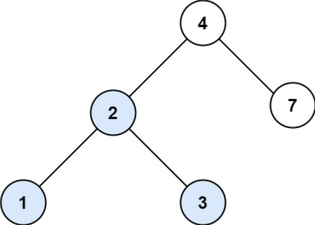
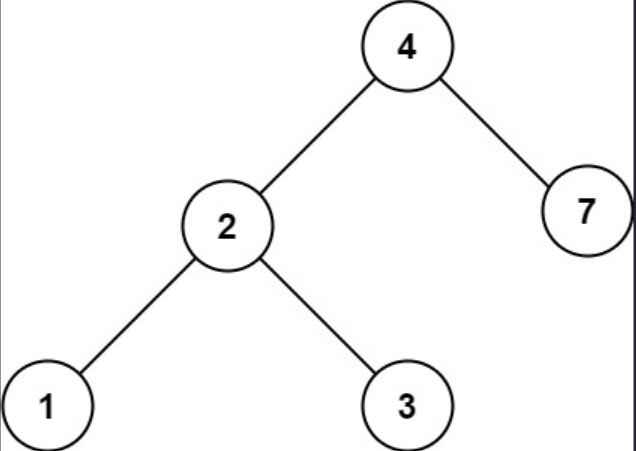

## 一、题目描述
给定二叉搜索树（BST）的根节点`root`和一个整数值`val`。

你需要在BST中找到节点值等于`val`的节点。返回以该节点为根的子树。如果节点不存在，则返回`null`。

**示例 1**

输入: root = [4, 2, 7, 1, 3], val = 2
输出: [2, 1, 3]

**示例 2**

输入: root = [4, 2, 7, 1, 3], val = 5
输出: []

**提示**
- 树中节点数在`[1, 5000]`范围内
- `1 <= Node.val <= 10⁷`
- `root`是二叉搜索树
- `1 <= val <= 10⁷`

**相关主题**
- 树
- 二叉搜索树
- 二叉树


## 二、题解
::: code-tabs
@tab Rust节点定义
```rust
#[derive(Debug, PartialEq, Eq)]
pub struct TreeNode {
    pub val: i32,
    pub left: Option<Rc<RefCell<TreeNode>>>,
    pub right: Option<Rc<RefCell<TreeNode>>>,
}

impl TreeNode {
    #[inline]
    pub fn new(val: i32) -> Self {
        TreeNode {
            val,
            left: None,
            right: None,
        }
    }
}
```

@tab Java节点定义
```java
public class TreeNode {
    int val;
    TreeNode left;
    TreeNode right;

    TreeNode() {}
    TreeNode(int val) { this.val = val; }
    TreeNode(int val, TreeNode left, TreeNode right) {
        this.val = val;
        this.left = left;
        this.right = right;
    }
}
```
:::

### 方法 1: 递归
::: code-tabs
@tab Rust
```rust
///
/// 时间复杂度: O(n)
/// 空间复杂度: O(n)
///
pub fn search_bst(root: Option<Rc<RefCell<TreeNode>>>, val: i32) -> Option<Rc<RefCell<TreeNode>>> {
    const SEARCH: fn(Option<Rc<RefCell<TreeNode>>>, i32) -> Option<Rc<RefCell<TreeNode>>> =
        |root, val| match root {
            None => None,
            Some(curr) => {
                let curr_val = curr.borrow().val;
                let left = curr.borrow().left.clone();
                let right = curr.borrow().right.clone();

                if val > curr_val {
                    SEARCH(right, val)
                } else if val < curr_val {
                    SEARCH(left, val)
                } else {
                    Some(curr)
                }
            }
        };

    SEARCH(root, val)
}
```

@tab Java
```java
BiFunction<TreeNode, Integer, TreeNode> search = (curr, val) -> {
    if (curr == null) {
        return null;
    }
    
    if (val > curr.val) {
        return this.search.apply(curr.right, val);
    } else if (val < curr.val) {
        return this.search.apply(curr.left, val);
    } else {
        return curr;
    }
};
/**
 * 时间复杂度：O(n)
 * 空间复杂度：O(n)
 */
public TreeNode searchBST(TreeNode root, int val) {
    return this.search.apply(root, val);
}
```
:::

### 方法 2: 迭代
::: code-tabs
@tab Rust
```rust
///
/// 时间复杂度: O(n)
/// 空间复杂度: O(1)
///
pub fn search_bst(mut root: Option<Rc<RefCell<TreeNode>>>, val: i32) -> Option<Rc<RefCell<TreeNode>>> {
    while let Some(curr) = root {
        let curr_val = curr.borrow().val;
        let left = curr.borrow().left.clone();
        let right = curr.borrow().right.clone();

        if val > curr_val {
            root = right;
        } else if val < curr_val {
            root = left;
        } else {
            return Some(curr);
        }
    }

    None
}
```

@tab Java
```java
/**
 * 时间复杂度：O(n)
 * 空间复杂度：O(1)
 */
public TreeNode searchBST(TreeNode root, int val) {
    while (root != null) {
        if (val > root.val) {
            root = root.right;
        } else if (val < root.val) {
            root = root.left;
        } else {
            return root;
        }
    }

    return null;
}
```
:::